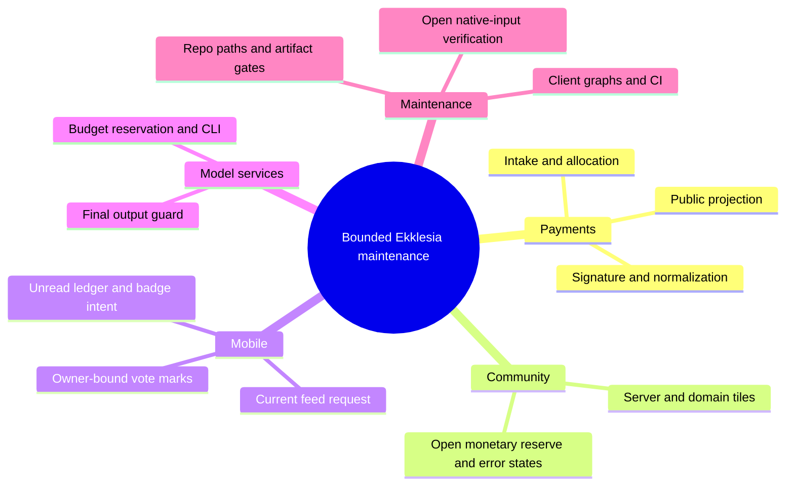

# Ekklesia: bounded night-work architecture map

Scope: source paths reviewed during 2026-10-09/10, baseline `03c4913f`;
integrated follow-ups through `ec640b33`. This is not a complete system audit,
production receipt or permission to use a quarantined path.
Unintegrated source/test candidates at the time of mapping: captured owner
`#502/122b31b8`, feed regressions `#509/a8d52025`, Community report
`#508/689b47f8` and native-input plan `#507/e36ce9e3`. "Built" refers to
existing code, including the stated candidate, not a production deployment.

## 1. Grundidee

- Citizens participate in informative, non-binding bill votes (`README.md`).
- Provider events feed private accounting and limited public funding aggregates
  (`apps/api/routers/payments.py`).
- Payment intake and funding links remain closed pending legal approval
  (`payments.py`, `docs/community.html`).
- Clients consume public bill/funding information while device-local vote marks
  store no choice (`apps/mobile/src/lib/vote-marks.ts`).
- Generated model answers and paid fallback calls have separate output and budget
  boundaries (`ollama_service.py`, `claude_service.py`).
- Artifact announcements follow published channel-specific downloads, not just
  version commits (`ANDROID_V63_RELEASE_GATE.md`, `app_version.py`).

## 2. Spur

Primary built funding path, with reviewed neighboring maintenance paths:

1. `payments::stripe_webhook -> stripe.Webhook.construct_event -> event.to_dict`:
   signed payload becomes the internal dictionary; signature checking stays first.
2. `stripe_webhook -> _payment_intake_enabled`: closed Checkout returns 503;
   refund/dispute handling has its own earlier path.
3. `stripe_webhook -> allocate_donation -> _append_payment_record`: amount and
   allocation become a private record.
4. `_append_payment_record -> _is_public_support_record/_projection_state`:
   only verified live support contributes to public aggregates.
5. `payment_status/public_finance_overview -> _load_public_support_projection`:
   identity-free sums and consistent public server-cost basis.
6. `community::fetchPaymentStatus -> updateServerTile/updateDomainTile`:
   server/domain values reach the DOM; monetary reserve is not consumed.
7. `client package.json -> package-lock.json -> ci.yml`: independent app graphs;
   CI Redis comes from the pinned official-image mirror, not a runner change.
8. `ANDROID_V63_RELEASE_GATE -> build-play.sh/build-direct.sh -> app_version`:
   published Direct/Alpha evidence precedes an update announcement.
9. `eka12/eka22/community tests -> tests/repo_paths.py`: required crypto inputs
   versus an explicitly optional missing docs file in the API image.
10. `ollama::answer_citizen_question -> output guard -> unwrap/cleanup -> final
    output guard -> deepl_translate`: cleaned English text is checked again.
11. `VoteScreen status/submit/correct -> vote-marks sync/record -> serialized
    read/write`: captured request owner must match the current storage owner.
12. `NotificationSettingsScreen hydration -> acknowledgement -> durable ledger
    -> badge reconciliation(clearTray)`: default/read/write-failure tests cover
    the existing runtime; OEM effects remain outside mocks.
13. `backfill::main -> mode/key checks -> offline plan or gated_call_claude ->
    reserve/usage/charge/release`: CLI output and conservative holds are explicit.
14. `BillsScreen::loadPage(reset)/requestSequence -> fetchBills -> error/retry`:
    reset errors clear old cards, obsolete responses do not erase newer data.
15. `app.json/prebuild -> generated Gradle graph/wrapper -> build helpers`:
    durable dependency-input verification is an open gap, not an implemented gate.

## 3. Module

| Modul | Aufgabe | Einstieg | Stand |
| --- | --- | --- | --- |
| Payments | Private events and public projections | stripe_webhook/payment_status | gebaut; intake remains closed |
| Community | Public funding display | fetchPaymentStatus | gebaut; reserve/error/locale gaps |
| Mobile vote marks | Owner-bound display evidence | syncVoteMark/recordVoteMark | gebaut; captured-owner follow-up under review |
| Mobile notifications | Durable unread state and badge intent | hydration/read/reconcile | gebaut; device/provider gate open |
| Mobile feed | Current request and error-state rendering | BillsScreen::loadPage | gebaut; direct regression follow-up |
| Model services | Guarded answers and paid-call budget | answer_citizen_question/gated_call_claude | gebaut |
| CI/test layout | Dependency and path checks | ci.yml/repo_paths | gebaut |
| Release checklist | Artifact ordering | ANDROID_V63_RELEASE_GATE | gebaut; release permission separate |
| Native dependency integrity | Verified generated build inputs | prebuild/build helpers | offen; no durable verification contract |

## 4. Verdrahtung

The signature edge authenticates the payload before normalization. The intake
edge controls Checkout recording. The allocation edge creates a private record;
the projection edge filters eligible support. Public endpoints transport only
aggregates; Community consumes server/domain but not monetary reserve. Manifest
and test-layout maintenance enter unchanged CI gates, not production. Release
documentation orders artifacts without executing a build or announcement.

## 5. Widerspruch und Lücken

Allocation documentation describes overflow reserve while implementation routes
overflow to server: accounting policy requires an explicit decision. Public
CX43 cost consistency is fixed in source, but the actual cost basis needs owner
confirmation. Missing monetary-reserve display and unmarked HTTP-error fallback
are source findings; local browser navigation ended with SIGXFSZ under fixed
limits, so no responsive PASS exists. Captured-owner storage, final translated
model text, OEM notification behaviour and native dependency provenance retain
their stated validation boundaries. No remote security scan was run.

## 6. Diagrammdateien

`docs/architecture/map.puml` contains the mindmap and built funding component
path; `docs/architecture/main-path.puml` sequences that same path. PlantUML is
not available in the current PATH; SVG rendering is **NOT RUN**.

## 7. Nächster Schritt

Community, projection-to-display hop: obtain a successful isolated 390/1280
fixture check before any HTML correction, then separately review wording/policy.
Keep allocation, provider configuration, intake, flags and production unchanged.
