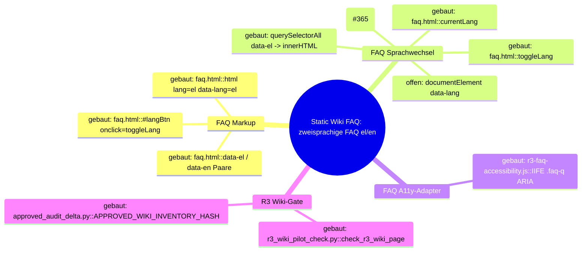

# Architecture Map — Pnyx Static Wiki / FAQ-Lokalisierung

Scope: T-472, Vorbereitung fuer [GH#365](https://github.com/NeaBouli/pnyx/issues/365).
Basis: `origin/main` `fd3b4dc5ebbc1cd80ee3db3f9945cbf27963a932`.
Kartiert ist genau ein Hop: der statische Sprachwechsel auf `docs/wiki/faq.html`.
Andere Wiki-Seiten, Web-App, API, Mobile und Dashboard sind nicht kartiert.

Diagramme: [`map.puml`](map.puml) (Mindmap + Komponenten),
[`main-path.puml`](main-path.puml) (Sequenz).

## 1. Grundidee

- Ekklesia.gr ist eine Plattform fuer digitale direkte Demokratie griechischer Buerger — `README.md` (Titel), `CLAUDE.md` (Produkt).
- Neben den Apps liefert das Repo eine statische Oberflaeche: `docs/` enthaelt Landing Page und Wiki (14 Seiten) — `README.md` (Baum, `docs/ -> Landing page + Wiki`), `wiki/Architecture.md` (Baum `docs/`).
- Das Wiki ist oeffentlich unter `https://ekklesia.gr/wiki/` erreichbar — `README.md` (Link-Zeile, Tabelle "Wiki").
- Die FAQ-Seite ist zweisprachig (el/en); Griechisch ist Default im Markup — `docs/wiki/faq.html` Z. 2 `<html lang="el" data-lang="el">`.
- Der Wechsel ist rein clientseitig: kein Server, kein Persistieren, kein Reload — `docs/wiki/faq.html` Z. 542–550.
- Grenze: Die R3-Migration darf Inline-Skripte und zweisprachige Paare der FAQ nicht veraendern; nur das lokale A11y-Skript ist als Delta erlaubt — `scripts/redesign/r3_wiki_pilot_check.py` Z. 366–380, `docs/planning/r3/R3_REPORT.md` Z. 42–43.

## 2. Spur (Hop-Liste)

Nutzerverb: "FAQ auf Englisch lesen" — Klick auf den Sprachknopf.

| # | Von | Nach | Datum ueber die Kante |
| --- | --- | --- | --- |
| H1 | `docs/wiki/faq.html::#langBtn` (Z. 188, `onclick="toggleLang()"`) | `docs/wiki/faq.html::toggleLang` (Z. 543) | Klick-Event, keine Argumente |
| H2 | `docs/wiki/faq.html::toggleLang` | `docs/wiki/faq.html::currentLang` (Z. 542, Modulvariable) | `"el"` ↔ `"en"` |
| H3 | `docs/wiki/faq.html::toggleLang` | `docs/wiki/faq.html::#langBtn.textContent` (Z. 545) | Label `"EN"` / `"ΕΛ"` |
| H4 | `docs/wiki/faq.html::toggleLang` | `document.querySelectorAll("[data-el]")` (Z. 546) | NodeList aller zweisprachigen Elemente (139 `data-el`, 139 `data-en`) |
| H5 | `querySelectorAll("[data-el]").forEach` | `el.innerHTML` (Z. 547–548) | `el.getAttribute("data-" + currentLang)` |
| L1 | `docs/wiki/faq.html::toggleLang` | `document.documentElement.lang` | **offen — keine Kante im Code**; bleibt `"el"` (Z. 2) |
| L2 | `docs/wiki/faq.html::toggleLang` | `document.documentElement.dataset.lang` | **offen — keine Kante im Code**; `data-lang` bleibt `"el"` (Z. 2) |

Nachbar (geoeffnet, nicht auf der Spur): `docs/assets/redesign-v2/r3-faq-accessibility.js`
wird per `<script defer>` geladen (`faq.html` Z. 950). Es setzt `role`, `tabindex`,
`aria-expanded`, `aria-controls` auf die 57 `.faq-q` (Z. 4–33) und liest oder
schreibt keine Sprache. Weil `.faq-q` selbst `[data-el]` traegt (z. B. `faq.html` Z. 203)
und H5 nur `innerHTML` ersetzt, bleiben diese ARIA-Attribute beim Wechsel erhalten.

## 3. Module

| Modul | Eine Aufgabe | Einstieg | Stand |
| --- | --- | --- | --- |
| FAQ Markup (`docs/wiki/faq.html`, statisches HTML) | Traegt Default-Sprache und zweisprachige Paare `data-el`/`data-en` | `faq.html::<html lang="el" data-lang="el">`, `#langBtn` | gebaut |
| FAQ Sprachwechsel (`docs/wiki/faq.html`, Inline-`<script>` Z. 541–555) | Schaltet sichtbare Kopie zwischen el/en um | `faq.html::toggleLang` | teilweise — Kopie und Knopflabel wechseln, Dokumentsprache (`lang`, `data-lang`) nicht (#365) |
| FAQ A11y-Adapter (`docs/assets/redesign-v2/r3-faq-accessibility.js`) | Tastatur- und ARIA-Semantik fuer FAQ-Akkordeon | IIFE, `.faq-q` forEach | gebaut (Nachbar, sprachneutral) |
| R3 Wiki-Gate (`scripts/redesign/r3_wiki_pilot_check.py` + `approved_audit_delta.py`) | Friert FAQ-Inline-Skripte und bilinguale Paare gegen R0-Baseline bzw. freigegebenen Inventar-Hash ein | `r3_wiki_pilot_check.py::check_r3_wiki_page`, `approved_audit_delta.py::APPROVED_WIKI_INVENTORY_HASH["docs/wiki/faq.html"]` | gebaut (Leitplanke, nicht Laufzeit) |

## 4. Verdrahtung

- `#langBtn` → `toggleLang`: das Inline-`onclick` ruft `toggleLang()` ohne Argumente.
- `toggleLang` → `currentLang`: die globale Variable wird zwischen `"el"` und `"en"` umgeschaltet; Startwert ist hart `"el"`, nicht aus `<html lang>` gelesen.
- `toggleLang` → `#langBtn.textContent`: der Knopf zeigt die jeweils andere Sprache (`"EN"` bzw. `"ΕΛ"`).
- `toggleLang` → `querySelectorAll("[data-el]")`: jedes Element mit Paar erhaelt `innerHTML = data-<currentLang>`; fehlt der Wert, bleibt das Element unveraendert.
- `faq.html` → `r3-faq-accessibility.js`: das deferte Skript ergaenzt ARIA auf `.faq-q`; es ist nicht mit `toggleLang` verdrahtet.
- `r3_wiki_pilot_check.py` → `faq.html`: das Gate vergleicht Inline-Skripte und bilinguale Paare mit der Baseline, ausser der Inventar-Hash matcht `APPROVED_WIKI_INVENTORY_HASH`.

## 5. Widerspruch und Luecken

- **Luecke L1 (#365, belegt):** `toggleLang` setzt `document.documentElement.lang` nicht. Nach Klick auf EN ist die Kopie englisch, `<html lang>` bleibt `"el"` (`faq.html` Z. 2, Z. 543–550). Screenreader und Silbentrennung behandeln englischen Text als Griechisch (WCAG 3.1.1).
- **Luecke L2 (beobachtet, nicht Teil von #365):** `data-lang` auf `<html>` bleibt ebenfalls `"el"`. Weder `faq.html` (einziges Vorkommen Z. 2) noch `docs/assets/` lesen `data-lang`; die Inkonsistenz hat heute keine belegte Laufzeitwirkung und bleibt ausserhalb des Folgefixes.
- **Widerspruch:** `docs/planning/r3/R3_REPORT.md` Z. 134–138 meldet fuer alle 14 Wiki-Seiten "no … language-toggle failure". Issue #365 ist live reproduziert. Beide Aussagen bleiben stehen; die R3-Browserpruefung hat laut Report nur die Kopie, nicht `document.documentElement.lang` belegt.
- **Leitplanke fuer den Fix:** Jede Aenderung am FAQ-Inline-Skript aendert den Inventar-Hash. `approved_audit_delta.py::APPROVED_WIKI_INVENTORY_HASH["docs/wiki/faq.html"]` muss im selben Diff nachgefuehrt werden, sonst schlaegt `r3_wiki_pilot_check.py --all` mit `scripts.inline changed` fehl.
- **Nicht kartiert:** Zustand nach Reload (kein Persistieren, daher Rueckfall auf `el` — konsistent mit `lang="el"`), JSON-LD `FAQPage` (bleibt griechisch), Sprachschalter anderer Wiki-Seiten.

## 6. Diagrammdateien

- `docs/architecture/MAP.md` (diese Datei, Mermaid-Mindmap unten)
- `docs/architecture/map.puml` (PlantUML-Mindmap + Komponentendiagramm)
- `docs/architecture/main-path.puml` (PlantUML-Sequenz der Spur)

## 7. Naechster Schritt (#365)

- **Modul:** FAQ Sprachwechsel.
- **Hop:** `faq.html::toggleLang → document.documentElement.lang` (L1).
- **Aenderung:** in `toggleLang` direkt nach dem Umschalten von `currentLang` `document.documentElement.lang = currentLang;` setzen. Kein `data-lang`-Umbau ohne eigenen belegten Bedarf, kein Wrapper, kein zweiter Listener im A11y-Adapter, kein Persistieren, kein neues Flag.
- **Dateien, die sich aendern duerfen:** `docs/wiki/faq.html` (nur Inline-`toggleLang`), `scripts/redesign/approved_audit_delta.py` (nur Hash-Eintrag `docs/wiki/faq.html` + Kommentarzeile), ein Regressionstest unter `scripts/redesign/` (Pattern `test_*.py` bzw. `*.browser.cjs`), der nach Toggle `document.documentElement.lang === "en"` und nach zweitem Toggle `"el"` belegt.
- **Unberuehrt:** `docs/assets/redesign-v2/r3-faq-accessibility.js`, alle `data-el`/`data-en`-Paare und FAQ-Inhalte, alle anderen `docs/wiki/*.html`, `scripts/redesign/r0_inventory.py`, `r3_wiki_pilot_check.py`, `apps/**`.
