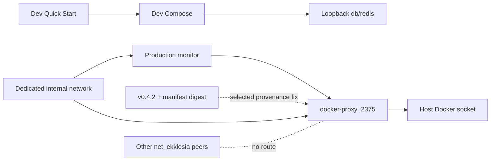

# Architecture Map — Container Trust Boundaries (EKA-18 + EKA-13)

Basis: `origin/main 4cc11930f4be82ba2d012def487fb34abca9da26` · Tasks: T-502/T-503 · Option 1 selected by Gio.

This map preserves the accepted EKA-18 local-development boundary and adds the independently reviewed EKA-13 production-container boundary from T-483. The two nodes are adjacent but have separate change contracts.

## 1. Grundidee

- The local Compose stack publishes PostgreSQL and Redis for host-side migrations/tools. EKA-18 is source-fixed on current main: those two datastore ports bind to IPv4 loopback; the API's intentional port 8000 stays externally bindable for device testing.
- The production Compose stack gives `monitor` controlled Docker access through `docker-proxy`. That proxy mounts the host Docker socket, exposes the Docker API on the shared application network and therefore sits on a host-root-equivalent trust boundary.
- EKA-13 is source-open: `docker-proxy` uses mutable `:latest`; `CONTAINERS=1` and `POST=1` expose a broader Docker API namespace than the monitor's intended restart call.
- Gio selected the full first repair boundary: isolate `monitor` and `docker-proxy` on a dedicated internal network, remove the proxy from `net_ekklesia`, pin v0.4.2 by manifest digest, set `POST=0`, and keep production Tier-2 restart disabled. This deliberately prefers containment over Docker-based automatic restart.

## 2. Hop-Liste

### Node A — EKA-18 Local Developer Stack (built)

| Hop | From → To | Current invariant |
| --- | --- | --- |
| A1 | `README.md::Quick Start` → `infra/docker/docker-compose.yml` | developer starts `db`, `redis`, `api` |
| A2 | Compose interpolation → db/api | public local credential fallbacks remain development-only |
| A3 | `services.db.ports` → host | `127.0.0.1:5432:5432`; no non-loopback listener |
| A4 | `services.redis.ports` → host | `127.0.0.1:6379:6379`; no non-loopback listener |
| A5 | API → db/redis | service DNS on the internal Compose network; unaffected by host binding |
| A6 | host settings/alembic → db/redis | localhost access remains valid |
| A7 | `services.api.ports` → host | port 8000 remains intentionally all-interface and is outside EKA-18 |
| A8 | `test_dev_compose_exposure.py` | pins A3/A4 and positive internal/host control paths |

### Node B — EKA-13 Production Container Trust Boundary (selected fix)

| Hop | From → To | Current invariant / gap |
| --- | --- | --- |
| B1 | `docker-compose.prod.yml::monitor.build` → `apps/monitor/Dockerfile` | `python:3.11-slim`, no digest and no explicit `USER`; monitor receives secrets but no host mount |
| B2 | monitor → `DOCKER_HOST=tcp://docker-proxy:2375` | `attempt_tier2` uses Docker SDK `containers.get/restart`; gated by `AUTO_RECOVERY_T2` and a client-side allowlist |
| B3 | `services.docker-proxy.image` → GHCR | `ghcr.io/tecnativa/docker-socket-proxy:latest`; mutable provenance, no release tag/digest |
| B4 | docker-proxy environment → Docker API policy | `CONTAINERS=1`, `POST=1`, no auth in Compose; policy is broader than restart-only |
| B5 | docker-proxy → host Docker daemon | `/var/run/docker.sock:/var/run/docker.sock:ro`; read-only mount does not make Docker API calls read-only |
| B6 | application network → docker-proxy | every compromised container on `net_ekklesia` can address port 2375 |
| B7 | `services.ollama.image` → Docker registry | separate mutable `ollama/ollama:latest`, profile-gated; not part of the first fix |
| B8 | dashboard/monitor Dockerfiles → runtime user | tag-pinned base images without digest; no explicit `USER`; separate hardening scope |
| B9 | `services.monitor.networks` → dedicated internal network | selected: monitor remains on `net_ekklesia` for DB/Redis/API and alone joins the proxy network |
| B10 | production Tier-2 setting → proxy method policy | selected: `AUTO_RECOVERY_T2=false` and `POST=0`; monitor escalates instead of restarting containers |

## 3. Module

| Module | One responsibility | Status |
| --- | --- | --- |
| Quick Start + dev Compose | reproducible local stack | built |
| Dev db/redis bindings | host tool access without LAN exposure | built by #393 |
| Dev compose regression | preserve loopback and service-DNS paths | built |
| Production monitor | health checks; Tier-2 restart source remains but production Compose fixes it disabled | selected security behavior |
| Production docker-proxy | filtered Docker API bridge | built, high-privilege boundary |
| docker-proxy provenance | v0.4.2 plus immutable manifest digest | selected fix |
| docker-proxy reachability | dedicated internal network shared only with monitor | selected fix |
| docker-proxy capability policy | `CONTAINERS=1`, `POST=0`; unavoidable broad container reads limited to monitor principal | selected bounded residual |
| Ollama provenance | immutable optional AI image | open, separate task |
| Dashboard/monitor non-root | explicit runtime users | open, separate task |

## 4. Verdrahtung

- `monitor.py::attempt_tier2` is the existing writer. It selects a service from `T2_ALLOWED_SERVICES` and invokes `restart()` through the Docker SDK; the selected production contract fixes `AUTO_RECOVERY_T2=false`, so alerts proceed to Tier 3 instead.
- The allowlist exists only in the client. The proxy itself is reachable without authentication from the shared production application network.
- Mounting the socket `:ro` controls the filesystem entry, not Docker API method semantics. With `POST=1`, allowed namespaces can mutate the host daemon.
- A released tag plus manifest-list digest makes the proxy bytes reproducible across supported platforms. `POST=0` removes Docker API writes; the private network removes every non-monitor application peer from the proxy trust boundary.
- Node A never reaches Node B: dev host-port bindings and production Docker-socket authority are different Compose files and trust boundaries.

## 5. Findings and limits

**EKA-18 current state:** source-closed. DB/Redis listen only on IPv4 loopback in the dev Compose file; host and container control paths are pinned by tests. Deployment/live listener state is not inferred.

**EKA-13 current source-to-sink:** mutable GHCR `:latest` → unaudited future proxy bytes → unauthenticated port 2375 on shared network → host Docker socket → container lifecycle/filesystem/log access permitted by the exposed namespace. Compromise of any network peer can cross this boundary.

**Validated upstream scope drift (security stop):** official Tecnativa `haproxy.cfg` at both `v0.4.2` and `v0.5.0` allows the full `^/containers` prefix whenever `CONTAINERS=1`. That includes Docker GET routes such as container archive/export/log/top; `POST=0` would not close those reads, while Pnyx additionally sets `POST=1`. Tecnativa's own `v0.4.2` README says the proxy network should contain only the proxy and its consumer. Pnyx instead attaches the proxy to shared `net_ekklesia`. A tag+digest pin fixes supply-chain mutability but does not fix this host-boundary exposure.

**Selected-fix invariant:** production Compose names official v0.4.2 plus exact manifest digest; `docker-proxy` belongs only to a new `internal: true` network; `monitor` is the only other member and retains `net_ekklesia` for normal dependencies; `POST=0`; production Tier-2 restart is fixed disabled. No other service gains Docker API reachability.

**Bounded residual:** `CONTAINERS=1` still exposes broad container reads to a compromised monitor because upstream cannot distinguish inspect from archive/export/log/top. Proxy auth, monitor/container root users, Ollama `:latest`, deployed image identity and actual runtime topology remain separate. v0.5.0 is excluded because of its open `/version` compatibility regression.

## 6. Next source boundary

Gio authorized Option 1 for T-503. The implementation boundary is:

1. `infra/docker/docker-compose.prod.yml`: pin `docker-proxy` to official v0.4.2 plus manifest digest, set `POST=0`, fix `AUTO_RECOVERY_T2=false`, attach the proxy only to a new dedicated `internal: true` network and attach only `monitor` as its peer.
2. One focused static/normalized-Compose regression test that proves image provenance, network membership, the absence of the proxy from `net_ekklesia`, read-only Docker API policy and disabled production restart.
3. Architecture/report updates only; no Dockerfile, application recovery logic, package, workflow, deployment or live-system change.

Local validation may render `docker compose config` with synthetic non-secret values and may run a disposable proxy/monitor-network smoke. Production topology evidence remains read-only and belongs in the rollout decision record, not in this source PR.

## 7. Diagram files

- `docs/architecture/map.puml` → `map.svg`, `map_001.svg`
- `docs/architecture/main-path.puml` → `main-path.svg`, `main-path_001.svg`

