# Architecture Map — Next Runtime Dependency Boundary (T-485)

Scope: `apps/web` + `apps/dashboard` Next.js runtimes against
GHSA-vcvr-r3jv-pc5j (`next` >=16.2.0 <16.3.6, patched 16.3.6; RCE needs Node.js
`next/og` `ImageResponse` rendering attacker-controlled SVG content/attributes/styles).
Base: `origin/main` 49e449a3bc9af1000e9d111fba9b9da2e27d673c. Read-only run: no
package, lock, source or config change. Existing maps (`EKKLESIA_V2_MINIMA.md`,
`FEDERATION.md`) stay untouched.

## 1. Grundidee

- Ekklesia.gr is a digital direct-democracy platform for Greek citizens (`apps/web/src/app/[locale]/layout.tsx::metadata.openGraph.description`).
- Citizens use the public web runtime (`apps/web`, port 3000) for bills, VAA, results (`apps/web/src/app/[locale]/**/page.tsx`).
- Operators use the auth-gated admin dashboard (`apps/dashboard`, port 3001) (`apps/dashboard/src/proxy.ts::proxy`, `apps/dashboard/package.json::scripts.start`).
- Both are standalone Next builds served by `node server.js` in Docker (`apps/{web,dashboard}/next.config.*::output`, `apps/{web,dashboard}/Dockerfile.prod::CMD`).
- Boundary of this map: the `next` package version as it flows from manifest to running route handlers, plus the advisory's `next/og` sink.

## 2. Spur (opened hops)

1. `apps/web/package.json::dependencies.next` = `16.3.4` (exact) → `apps/web/package-lock.json::packages["node_modules/next"]` = 16.3.4, `engines.node >=20.9.0`.
2. `apps/dashboard/package.json::dependencies.next` = `16.3.4` (exact) → `apps/dashboard/package-lock.json::packages["node_modules/next"]` = 16.3.4.
3. Lock `node_modules/next` → 8 platform `node_modules/@next/swc-*` entries, each 16.3.4 (both locks); `sharp` 0.35.4 via `overrides`.
4. Lock → `.github/workflows/ci.yml::test-clients` (`npm ci` → `image-codec.check.mjs` → lint → typecheck → [web: vitest] → `npm run build`).
5. Lock → `apps/web/Dockerfile.prod` (`npm ci` with repo `.npmrc`, docs/ copied into `public/`, `npm run build`) → runner `node server.js` (context `../../`, `infra/docker/docker-compose.prod.yml::web`).
6. Lock → `apps/dashboard/Dockerfile.prod` (`npm ci --ignore-scripts`, `npm run build`) → runner `node server.js` (context `../../apps/dashboard`, `docker-compose.prod.yml::dashboard`).
7. `server.js` → the web proxy matcher excludes `/api`, `_next`, `_vercel`, and dotted paths; matched page requests enter `apps/web/src/proxy.ts::proxy` (redirects/rewrites + next-intl) → `apps/web/src/app/[locale]/*/page.tsx` (9 pages, no route handlers).
8. `server.js` → the dashboard matcher excludes `_next/static`, `_next/image`, and `favicon.ico`; matched protected pages and non-auth APIs enter `apps/dashboard/src/proxy.ts::proxy` (session gate, then role check) → `(dashboard)/*/page.tsx` (23), `api/discourse/route.ts::GET` (JSON), and `api/proxy/[...path]/route.ts` (JSON, SUPER_ADMIN). `/api/auth/*` is matched but returns before the user and `canAccess` checks to reach `api/auth/[...nextauth]/route.ts::{GET,POST}`.
9. Side-hop `request-controlled value → next/og ImageResponse SVG` — **offen / nicht verdrahtet** (evidence below).

### Sink evidence (all `git grep` on 49e449a, excluding lockfiles)

| Pattern | Scope | Hits |
| --- | --- | --- |
| `next/og`, `ImageResponse`, `new ImageResponse`, `@vercel/og` | whole repo | 0 |
| `satori`, `resvg`, `generateImageMetadata` | apps/web, apps/dashboard | 0 |
| `export const runtime` (Node vs Edge) | apps/web, apps/dashboard | 0 → all routes default Node.js runtime |
| `opengraph-image.*`, `twitter-image.*`, `icon.*`, `apple-icon.*` files | apps/web, apps/dashboard | 0 (only `public/manifest.json`) |
| `route.ts` handlers | both | 3, all dashboard, none returns images |
| `node_modules/@vercel/og`, `satori`, `@resvg/*` in locks | both locks | 0 (next's og bundle only inside `next/dist/compiled`) |

Image neighbours: `openGraph` in web layout is static text, no `images`; `next/image` in
`NavHeader.tsx`/`sso-verify/page.tsx` uses the image optimizer, not `next/og`; inline
`<svg>` literals in NavHeader/sso-verify/login are static JSX.

## 3. Module

| Modul | Eine Aufgabe | Einstieg | Stand |
| --- | --- | --- | --- |
| web manifest+lock | pin `next` for public web | `apps/web/package.json::dependencies.next` | gebaut (16.3.4, affected) |
| dashboard manifest+lock | pin `next` for admin dashboard | `apps/dashboard/package.json::dependencies.next` | gebaut (16.3.4, affected) |
| CI client gate | install + verify + build both runtimes | `.github/workflows/ci.yml::test-clients` | gebaut |
| image-codec check | assert optimizer + sharp ⊂ next's sharp range | `apps/{web,dashboard}/image-codec.check.mjs` | gebaut |
| web Docker runtime | build standalone, serve on 3000 | `apps/web/Dockerfile.prod::CMD` | gebaut |
| dashboard Docker runtime | build standalone, serve on 3001 | `apps/dashboard/Dockerfile.prod::CMD` | gebaut |
| web request edge | locale/static redirects | `apps/web/src/proxy.ts::proxy` | gebaut |
| dashboard request edge | auth + RBAC gate | `apps/dashboard/src/proxy.ts::proxy` | gebaut |
| dashboard route handlers | auth, discourse JSON, API proxy JSON | `apps/dashboard/src/app/api/**/route.ts` | gebaut |
| OG image generation | `next/og` `ImageResponse` | — | offen (no symbol) |

## 4. Verdrahtung

- `package.json::next` → lock `node_modules/next`: exact pin, lock matches 16.3.4 in both apps.
- lock `next` → `@next/swc-*`: 8 platform binaries pinned to the same 16.3.4; must move together.
- lock → CI `npm ci` / `npm run build`: CI builds both runtimes from their own lock.
- lock → `Dockerfile.prod` `npm ci`: prod image installs the same lock; web keeps install scripts per `.npmrc`, dashboard passes `--ignore-scripts`.
- `Dockerfile.prod` → `node server.js`: standalone server, Node 22.13.0-alpine.
- `server.js` → web `proxy.ts`: only matcher-selected requests enter it; `/api`, `_next`, `_vercel`, and dotted paths bypass the proxy.
- `server.js` → dashboard `proxy.ts`: matcher-selected requests enter it, but `/api/auth/*` returns before the protected user and `canAccess` checks; protected pages and the other API paths continue through those checks.
- proxy or matcher bypass → pages/route handlers: no handler or page imports `next/og`.

## 5. Widerspruch und Lücken

- (a) Versionally affected: both runtimes resolve `next` 16.3.4 ∈ [16.2.0, 16.3.6).
- (b) Exploit path not evidenced: 0 `next/og`/`ImageResponse` call sites, no metadata image files, no SVG-rendering handler. The vulnerable code ships in `next/dist/compiled` but is unreachable without an importer.
- (c) Hygiene upgrade still justified: all routes run Node.js runtime by default, so any future `ImageResponse` with request data would hit the vulnerable sink directly.
- Attacker preconditions (all missing today): a Node-runtime route/metadata file importing `next/og`; request-controlled input reaching SVG content, attributes or styles in the JSX tree; reachability without auth (web) or with an operator session (dashboard).
- Gap: install-script parity differs (web `npm ci` + `.npmrc`, dashboard `npm ci --ignore-scripts`); not changed here.
- Gap: `image-codec.check.mjs` asserts `sharp` 0.35.4 satisfies `next.optionalDependencies.sharp`; 16.3.6 range not verified in this run (no install).
- Not checked: npm registry metadata for 16.3.6, live/runtime state, builds.

## 6. Diagramme

- `docs/architecture/map.puml` (mindmap + component)
- `docs/architecture/main-path.puml` (sequence of the built path)

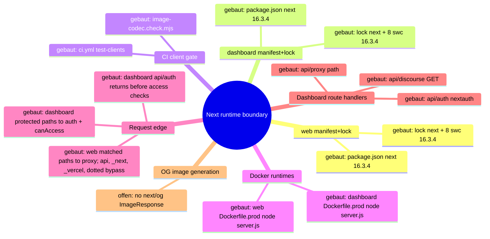

## 7. Nächster Schritt (single follow-fix node, T-486)

Modul: web + dashboard manifest+lock. Hop: `package.json::dependencies.next`
16.3.4 → 16.3.6 → lock `node_modules/next` + all 8 `@next/swc-*` to 16.3.6, in both apps.
Files: `apps/{web,dashboard}/package.json`, `apps/{web,dashboard}/package-lock.json` only.
Untouched: Dockerfiles, `next.config.*`, `proxy.ts`, all `src/**`, `.github/**`,
`@next/eslint-plugin-next` (#394), React, `overrides`.
Must stay green: CI `test-clients` Web + Dashboard (`image-codec.check.mjs`, lint,
typecheck, web vitest, `npm run build`), both `Dockerfile.prod` builds, and the
routes in hops 7–8 (web locale pages + proxy redirects; dashboard pages, `/login`,
`/api/auth/*`, `/api/discourse`, `/api/proxy/*`).

---

# Preserved Map Node — EKA-18 Local Developer Stack / Compose Exposure Boundary

Integrated from `origin/main` at T-486 refresh. The full evidence and acceptance
record remains in `.fleet/reports/T-481.md` and `.fleet/reports/T-482.md`.

## Module and hop

- Node: local developer stack / Compose exposure boundary.
- Hop H1: README Quick Start starts `infra/docker/docker-compose.yml`.
- Hop H2: host-side alembic, seeds, and uvicorn use the loopback defaults in
  `apps/api/config.py::Settings`.
- Hop H3: the API container uses the internal `db` and `redis` service names.
- Hop H4: only PostgreSQL and Redis host publications are narrowed to
  `127.0.0.1`; the API's port 8000 publication remains unchanged.

## Security invariant

Development datastores with repository-public or absent credentials are not
reachable through a non-loopback host interface, while host development tools
retain `localhost:5432` and `localhost:6379` access and containers retain their
service-DNS access. Production Compose, API auth, salt policy, and datastore
authentication are outside this node.

## Built state

- `infra/docker/docker-compose.yml` binds db and redis to IPv4 loopback.
- `apps/api/tests/test_dev_compose_exposure.py` pins loopback publication,
  published ports, internal service-DNS targets, and dependencies.
- README warns that the development credentials are public and the stack is not
  for shared or production hosts.

# Architecture Map — Sentry Capture Policy Boundary

Basis: `origin/main 4cc11930f4be82ba2d012def487fb34abca9da26` · Task: T-493 · Mapping only, no fix.
Node: API observability / Sentry event capture policy.

## 1. Grundidee

- Ekklesia.gr is a privacy-sensitive civic platform; the API handles request data and intermediate values that can include personal or security-relevant information.
- `apps/api/main.py::_sentry_init_options` is the single global policy boundary for Sentry error and transaction capture.
- FastAPI and Starlette integrations build Sentry events, `_before_send_filter` applies a second redaction layer, and the SDK transport sends the resulting envelope.
- This map opens only the event-construction policy hop. DSN, sampling, environment, provider configuration, deployment and stored Sentry events remain outside the boundary.

## 2. Spur (one trace, hops opened)

| # | From → To | Datum over the edge |
| --- | --- | --- |
| H1 | FastAPI/Starlette exception or transaction → Sentry integrations | exception, stack, request context and transaction metadata |
| H2 | `main.py::_sentry_init_options` → `sentry_sdk.init` | integrations, sampling, environment, PII and hook policy |
| H3 | Sentry SDK integration → event construction | stack frames; SDK default may attach frame-local variables |
| H4 | Sentry SDK integration → request extraction | request metadata; SDK default may attach a request body up to its configured size |
| H5 | constructed event → `main.py::_before_send_filter` | event/request/frame data; known sensitive keys and request fields are redacted recursively |
| H6 | `_before_send_filter` → Sentry transport | filtered event envelope sent to the configured DSN |

## 3. Module

| Modul | Eine Aufgabe | Einstieg | Stand |
| --- | --- | --- | --- |
| Sentry init policy | defines global capture controls | `apps/api/main.py::_sentry_init_options` | gebaut; frame-local and body policies are implicit SDK defaults |
| Web integrations | derive error/transaction/request events | `FastApiIntegration`, `StarletteIntegration` | gebaut (external SDK) |
| Event redaction | strips environment and redacts known sensitive values | `apps/api/main.py::_before_send_filter` | gebaut; defense layer, not a complete arbitrary-value denylist |
| SDK transport | serializes and sends envelopes | `sentry_sdk.init` / transport | gebaut (external SDK) |
| Policy regression tests | pin capture policy and transport result | `apps/api/tests/test_sentry_secret_scrubbing.py` | partial; filters and synthetic secrets covered, capture defaults not pinned |

## 4. Verdrahtung

- Application startup calls `_sentry_init_options(settings.sentry_dsn)` and passes the result to `sentry_sdk.init`.
- `FastApiIntegration` and `StarletteIntegration` collect exception, trace and request context before the application hook runs.
- `_before_send_filter` removes request environment, cookies and query strings; drops selected headers; and recursively redacts sensitive-key values in request data, extras and frame vars.
- Ordinary local-variable names and arbitrary body-field names are not guaranteed sensitive by that key-based filter.
- The filtered event proceeds to the SDK transport. Tests use an in-memory capture transport, so this boundary can be verified without network or Sentry access.

## 5. Widerspruch und Lücken

**Symptom:** global SDK defaults can collect arbitrary frame-local values and request bodies before `_before_send_filter` runs.

**Ursache:** `_sentry_init_options` deliberately sets `send_default_pii=False`, but does not explicitly set `include_local_variables` or `max_request_body_size`. The downstream redactor recognizes sensitive keys, not every value whose name appears harmless.

**Source → sink:** request/exception → FastAPI/Starlette integration → SDK event construction with implicit capture defaults → key-based `_before_send_filter` → transport.

**Sicherheitsinvariante:** Sentry events never contain frame-local variables or request bodies, independent of variable/key naming. Existing stack/exception metadata, URL and method metadata, sampling and redaction hooks remain available.

**Defense in depth:** `include_local_variables=False` prevents local values at event construction; `max_request_body_size="never"` prevents request-body collection. `_before_send_filter` remains in place for headers, query strings, cookies, extras and any event data supplied by other integrations.

**Lücken:**

- Current tests assert hook wiring and `send_default_pii=False`, but not the two capture-boundary settings.
- Existing transport tests use sensitive-looking names that the downstream redactor catches; they do not prove that arbitrary local/body values are excluded at source.
- No production/Sentry-event inspection is required or authorized for this change.

## 6. Diagrammdateien

- `docs/architecture/map.puml` (mindmap + component trace)
- `docs/architecture/main-path.puml` (event sequence)
- PlantUML rendering is optional for this mapping commit; source files are authoritative.

## 7. Nächster Schritt (engste Reparaturgrenze)

**Modul:** API observability / Sentry init policy. **Hop:** H2–H4.

1. Add `include_local_variables=False` and `max_request_body_size="never"` to `apps/api/main.py::_sentry_init_options`.
2. Extend `apps/api/tests/test_sentry_secret_scrubbing.py` with configuration invariants and SDK-transport checks showing arbitrary frame-local and request-body-only sentinel values are absent.
3. Preserve exception/stack and non-body request metadata where the SDK exposes it deterministically.
4. Leave `_before_send_filter`, DSN, integrations, sample rate, environment, deployment and provider settings unchanged.

Out of scope: production deployment, live Sentry inspection, data cleanup, legal/content wording and unrelated observability refactors.

# Architecture Map — EKA-08 Web Compass Privacy Storage

Basis: `main 4cc11930f4be82ba2d012def487fb34abca9da26` · Task: T-487 · Mapping only, no fix.
Node: Web Compass Privacy Storage. The EKA-18 node above stays unchanged.

## 1. Grundidee

- Liquid Compass: a personal political profile computed 100% client-side, AES-256-GCM encrypted with an HKDF key from the Ed25519 private key, never sent to the server (`CLAUDE.md` "Liquid Compass"; `apps/web/src/lib/compass/storage.ts` header).
- The same header states the contract gap: "Fallback auf unverschlüsselt wenn kein Key vorhanden" (`storage.ts` l.4).
- Audit: `docs/community-audits/EKA_PNYX_Full_Scope_Audit_2026-09-15.md::EKA-08` (Medium, privacy, Open; "certain for unverified users").
- Web product scope today: compass is app-only (`apps/web/src/app/[locale]/bills/[id]/page.tsx` l.11 "CompassCard removed — compass is mobile-app only"; `README.md` l.68 lists Compass under Mobile App).
- Boundary of this node: `CompassCard` → `useCompass` → `storage.ts` → browser `localStorage`. Mobile compass, API, key storage (EKA-07) and KDF are neighbours, not on this trace.

## 2. Spur (hops opened)

| # | From → To | Datum over the edge |
| --- | --- | --- |
| C1 | `apps/web/src/components/CompassCard.tsx::CompassCard` → `lib/compass/index.ts` → `useCompass.ts::useCompass` | hook call, no args |
| C2 | `useCompass.ts::getPrivateKey` → `apps/web/src/lib/crypto.ts::loadKeypair` | `privateKeyHex \| null` from `localStorage["ekklesia_private_key"]` (EKA-07, out of scope) |
| C3 | `useCompass.ts::useCompass` (init effect) → `storage.ts::loadProfile(privateKeyHex)` | key or `null` |
| C4 | `storage.ts::loadProfile` → `localStorage["ekklesia_compass_encrypted"]` | only if key present; decrypt error swallowed (`catch {}`) → falls through to C5 |
| C5 | `storage.ts::loadProfile` → `localStorage["ekklesia_compass_profile"]` | legacy/fallback **plaintext JSON**, read when C4 cannot return a usable encrypted profile (no key, missing ciphertext or decrypt failure) |
| C6 | `useCompass.ts::{setModel,seedFromVAA,recordBillVote}` → `useCompass.ts::persistProfile` | updated `CompassProfile` (VAA answers, bill votes, model) |
| C7 | `persistProfile` (300 ms debounce) → `storage.ts::saveProfile(p, getPrivateKey())` | promise not awaited, no error handler |
| C8a | `saveProfile` key present, crypto ok → `setItem(encrypted)` + `removeItem(plaintext)` | base64(iv‖ct) |
| C8b | `saveProfile` key `null` **or** HKDF/AES throws → `setItem("ekklesia_compass_profile", json)` | **silent plaintext write**, no signal to caller/UI |
| C9 | `useCompass.ts::reset` → `storage.ts::clearProfile` | removes both keys; pending `saveTimeout` is not cancelled |

Caller census at 4cc1193 (`grep useCompass|CompassCard|@/lib/compass` in `apps/web/src`): only `CompassCard.tsx` imports `useCompass`; **nothing mounts `CompassCard`** (removed from bill detail in `23a627f`, 2026-04-26). `/[locale]/vaa` and `/[locale]/compass`, which called `useCompass` (`seedFromVAA`, `clearProfile`), were deleted in `ef79845` (2026-04-26). Built from `99ae8ea` (2026-04-09).

## 3. Module

| Modul | Eine Aufgabe | Einstieg | Stand |
| --- | --- | --- | --- |
| Compass UI card | show model/points summary | `components/CompassCard.tsx::CompassCard` | quarantäne (built, not mounted anywhere; "compass is mobile-app only") |
| Compass hook | load/persist profile, derive result | `lib/compass/useCompass.ts::useCompass` | gebaut (no runtime caller) |
| Compass storage | encrypt/decrypt + persist profile | `lib/compass/storage.ts::{loadProfile,saveProfile,clearProfile}` | gebaut; plaintext fallback = Befund EKA-08 |
| Identity key access | provide private key hex | `lib/crypto.ts::loadKeypair` | gebaut; EKA-07 (gesperrt, separate) |
| Compass engine | pure profile math | `lib/compass/engine.ts` | gebaut (neighbour, not changed) |
| Browser persistence | `localStorage` keys `ekklesia_compass_profile` / `ekklesia_compass_encrypted` | Web Storage API | gebaut (external) |
| Storage regression test | pin "no plaintext at rest" | — | offen (only `useCompass.test.ts::deriveCompassResult` exists) |
| Device key for keyless users | audit fix proposal | — | aufgeschoben (new storage/KDF surface; out of scope, needs Sol/Kimi crypto review) |

## 4. Verdrahtung

- CompassCard → useCompass: hook call; card is dead UI in current web.
- useCompass → crypto.loadKeypair: key read synchronously from `localStorage` at every load/save.
- useCompass → storage.loadProfile: key or `null`; result becomes React state.
- loadProfile → encrypted key: decrypt only with key; any failure is swallowed.
- loadProfile → plaintext key: consulted only after the encrypted path is unavailable or fails; accepts legacy and newly written plaintext.
- mutators → persistProfile → saveProfile: fire-and-forget after 300 ms.
- saveProfile → encrypted key: happy path, also deletes the plaintext key (only migration path).
- saveProfile → plaintext key: taken when key missing or crypto throws; silent.
- reset → clearProfile: removes both keys, but a queued save can re-create one.

## 5. Widerspruch und Lücken

**Source:** user political data (VAA answers, bill votes, model) via `seedFromVAA` / `recordBillVote` / `setModel` (C6).
**Sink:** `storage.ts::saveProfile` l.117 `localStorage.setItem(STORAGE_KEY, json)` (C8b); read-back sink `loadProfile` l.86–93 (C5).
**Preconditions:** (a) user without keypair (unverified) — deterministic plaintext; (b) keyed user whose HKDF/AES throws (malformed/odd-length key hex, WebCrypto unavailable e.g. non-secure context) — plaintext despite key; (c) reader = any script on origin (XSS, extension), shared-device user, or disk/profile forensics. With a key present, encryption does not stop XSS either (key in same storage, EKA-07) — that part is EKA-07, not this node.
**Security invariant:** a compass profile is never written to browser storage in plaintext; existing plaintext is migrated to ciphertext or removed, never re-created; failure to encrypt is visible to the caller, not silently downgraded.
**Legacy profiles:** web users of `/vaa`, `/compass`, bill card between 2026-04-09 and 2026-04-26 without a key hold plaintext `ekklesia_compass_profile`. Only migration path is C8a (keyed save). Current web never mounts the hook ⇒ those entries are neither migrated nor cleared.
**Error semantics:** all failures silent — decrypt error → empty/plaintext profile; encrypt error → plaintext; `setItem` quota error → unhandled rejection (C7 not awaited).
**Legitimate behaviour to keep:** keyed encrypt/decrypt round-trip; `clearProfile` removes both keys; loading a keyed profile; migrating a legacy plaintext profile on first keyed save.

**Widerspruch / Lücken:**
- `CLAUDE.md` lists `/[locale]/vaa` and `/[locale]/compass` web routes and "Compass-Daten … AES-256-GCM"; code: routes deleted (`ef79845`) and storage has plaintext fallback.
- Audit rates likelihood "certain for unverified users"; at 4cc1193 no web route mounts the flow ⇒ new writes are unreachable, but the sink is exported via `lib/compass/index.ts` and residual legacy plaintext is not handled.
- C9 race: `reset` does not cancel `saveTimeout` ⇒ a pending save can rewrite a cleared profile (neighbour hop, separate).
- C4→C5: decrypt failure with a present key falls back to an attacker-writable plaintext key (integrity, low).
- No storage test; `vitest.config.mts` defaults to node; jsdom precedent: `app/[locale]/sso-verify/page.test.tsx` (`// @vitest-environment jsdom`).

## 6. Diagrammdateien

- `docs/architecture/map.puml` (EKA-08 mindmap + component diagram appended after EKA-18 diagrams)
- `docs/architecture/main-path.puml` (EKA-08 sequence appended)
- PlantUML not installed ⇒ sources written, not rendered.

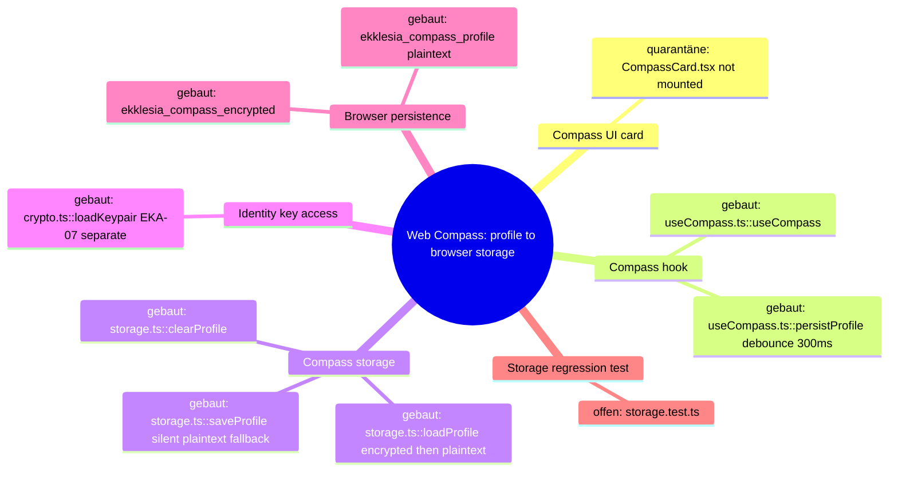

## 7. Nächster Schritt (engste Reparaturgrenze)

**Modul:** Compass storage. **Hop:** C8b (+ C5 legacy read) in `storage.ts::{saveProfile,loadProfile}`.

**Fix contract (later, separately approved):**
1. `apps/web/src/lib/compass/storage.ts` only: `saveProfile` never calls `setItem(STORAGE_KEY, …)`; without key or on crypto error it persists nothing and reports failure (return value or rejection, decided by Sol); `loadProfile` may still read legacy plaintext in memory so C8a can migrate it; no new key, KDF, storage abstraction, retry or flag.
2. New `apps/web/src/lib/compass/storage.test.ts` (`// @vitest-environment jsdom`, synthetic hex key): negative — keyless save and forced crypto failure leave no `ekklesia_compass_profile`; positive — keyed round-trip; legacy plaintext + keyed save ⇒ ciphertext present, plaintext removed; `clearProfile` removes both.
3. Open decision for Sol/Gio (not narrowest, not decided here): purge keyless legacy plaintext vs keep for migration; delete dead web compass (`CompassCard`, `useCompass`) instead; C9 reset race.

**Unberührt bleiben:** `lib/crypto.ts` (EKA-07), HKDF salt/info and `deriveAesKey` (KDF), `engine.ts`, `types.ts`, `dimension-map.ts`, `useCompass.ts`, `CompassCard.tsx`, `index.ts`, mobile, API, packages/locks, configs.

## 8. Ist-Nachführung T-488

- C8b ist geschlossen: `saveProfile` entfernt den Legacy-Key, schreibt ausschließlich `ekklesia_compass_encrypted` und lehnt ohne Key sowie bei Crypto-/Storage-Fehlern mit `CompassStorageError` ab; es gibt keinen Plaintext-`setItem` mehr.
- C5 ist ein einmaliger Legacy-Take: vorhandener Klartext wird vor weiterer Verarbeitung persistent entfernt. Ohne Ciphertext wird er mit Key sofort verschlüsselt migriert oder ohne Key nur in-memory zurückgegeben; korrupter Klartext wird verworfen. Vorhandener, aber nicht authentisierbarer Ciphertext fällt nie auf Legacy zurück.
- `storage.test.ts` belegt 11/11 Fälle einschließlich Keyless/Crypto/Storage fail-closed, AES-GCM-Roundtrip, Ciphertext-Priorität, Authfehler, Legacy-Migration/-Purge und `clearProfile`. C9, EKA-07 und KDF bleiben unverändert offen bzw. getrennt.
# Architecture Map — Container Trust Boundaries (EKA-18 + EKA-13)

Basis: `origin/main 4cc11930f4be82ba2d012def487fb34abca9da26` · Tasks: T-502/T-503 · Option 1 selected by Gio.

This map preserves the accepted EKA-18 local-development boundary and adds the independently reviewed EKA-13 production-container boundary from T-483. The two nodes are adjacent but have separate change contracts.

## 1. Grundidee

- The local Compose stack publishes PostgreSQL and Redis for host-side migrations/tools. EKA-18 is source-fixed on current main: those two datastore ports bind to IPv4 loopback; the API's intentional port 8000 stays externally bindable for device testing.
- The production Compose stack gives `monitor` controlled Docker access through `docker-proxy`. That proxy mounts the host Docker socket, exposes the Docker API on the shared application network and therefore sits on a host-root-equivalent trust boundary.
- EKA-13 is source-open: `docker-proxy` uses mutable `:latest`; `CONTAINERS=1` and `POST=1` expose a broader Docker API namespace than the monitor's intended restart call.
- Gio selected the full first repair boundary: isolate `monitor` and `docker-proxy` on a dedicated internal network, remove the proxy from `net_ekklesia`, pin v0.4.2 by manifest digest, set `POST=0`, and keep production Tier-2 restart disabled. This deliberately prefers containment over Docker-based automatic restart.

## 2. Hop-Liste

### Node A — EKA-18 Local Developer Stack (built)

| Hop | From → To | Current invariant |
| --- | --- | --- |
| A1 | `README.md::Quick Start` → `infra/docker/docker-compose.yml` | developer starts `db`, `redis`, `api` |
| A2 | Compose interpolation → db/api | public local credential fallbacks remain development-only |
| A3 | `services.db.ports` → host | `127.0.0.1:5432:5432`; no non-loopback listener |
| A4 | `services.redis.ports` → host | `127.0.0.1:6379:6379`; no non-loopback listener |
| A5 | API → db/redis | service DNS on the internal Compose network; unaffected by host binding |
| A6 | host settings/alembic → db/redis | localhost access remains valid |
| A7 | `services.api.ports` → host | port 8000 remains intentionally all-interface and is outside EKA-18 |
| A8 | `test_dev_compose_exposure.py` | pins A3/A4 and positive internal/host control paths |

### Node B — EKA-13 Production Container Trust Boundary (selected fix)

| Hop | From → To | Current invariant / gap |
| --- | --- | --- |
| B1 | `docker-compose.prod.yml::monitor.build` → `apps/monitor/Dockerfile` | `python:3.11-slim`, no digest and no explicit `USER`; monitor receives secrets but no host mount |
| B2 | monitor → `DOCKER_HOST=tcp://docker-proxy:2375` | `attempt_tier2` uses Docker SDK `containers.get/restart`; gated by `AUTO_RECOVERY_T2` and a client-side allowlist |
| B3 | `services.docker-proxy.image` → GHCR | `ghcr.io/tecnativa/docker-socket-proxy:latest`; mutable provenance, no release tag/digest |
| B4 | docker-proxy environment → Docker API policy | `CONTAINERS=1`, `POST=1`, no auth in Compose; policy is broader than restart-only |
| B5 | docker-proxy → host Docker daemon | `/var/run/docker.sock:/var/run/docker.sock:ro`; read-only mount does not make Docker API calls read-only |
| B6 | application network → docker-proxy | every compromised container on `net_ekklesia` can address port 2375 |
| B7 | `services.ollama.image` → Docker registry | separate mutable `ollama/ollama:latest`, profile-gated; not part of the first fix |
| B8 | dashboard/monitor Dockerfiles → runtime user | tag-pinned base images without digest; no explicit `USER`; separate hardening scope |
| B9 | `services.monitor.networks` → dedicated internal network | selected: monitor remains on `net_ekklesia` for DB/Redis/API and alone joins the proxy network |
| B10 | production Tier-2 setting → proxy method policy | selected: `AUTO_RECOVERY_T2=false` and `POST=0`; monitor escalates instead of restarting containers |

## 3. Module

| Module | One responsibility | Status |
| --- | --- | --- |
| Quick Start + dev Compose | reproducible local stack | built |
| Dev db/redis bindings | host tool access without LAN exposure | built by #393 |
| Dev compose regression | preserve loopback and service-DNS paths | built |
| Production monitor | health checks; Tier-2 restart source remains but production Compose fixes it disabled | selected security behavior |
| Production docker-proxy | filtered Docker API bridge | built, high-privilege boundary |
| docker-proxy provenance | v0.4.2 plus immutable manifest digest | selected fix |
| docker-proxy reachability | dedicated internal network shared only with monitor | selected fix |
| docker-proxy capability policy | `CONTAINERS=0`, `POST=0`; no Docker API namespace enabled while Tier 2 is disabled | selected least-privilege boundary |
| Ollama provenance | immutable optional AI image | open, separate task |
| Dashboard/monitor non-root | explicit runtime users | open, separate task |

## 4. Verdrahtung

- `monitor.py::attempt_tier2` is the existing writer. It selects a service from `T2_ALLOWED_SERVICES` and invokes `restart()` through the Docker SDK; the selected production contract fixes `AUTO_RECOVERY_T2=false`, so alerts proceed to Tier 3 instead.
- The allowlist exists only in the client. The proxy itself is reachable without authentication from the shared production application network.
- Mounting the socket `:ro` controls the filesystem entry, not Docker API method semantics. With `POST=1`, allowed namespaces can mutate the host daemon.
- A released tag plus manifest-list digest makes the proxy bytes reproducible across supported platforms. `POST=0` removes Docker API writes; the private network removes every non-monitor application peer from the proxy trust boundary.
- Node A never reaches Node B: dev host-port bindings and production Docker-socket authority are different Compose files and trust boundaries.

## 5. Findings and limits

**EKA-18 current state:** source-closed. DB/Redis listen only on IPv4 loopback in the dev Compose file; host and container control paths are pinned by tests. Deployment/live listener state is not inferred.

**EKA-13 pre-fix source-to-sink:** mutable GHCR `:latest` → unaudited future proxy bytes → unauthenticated port 2375 on shared network → host Docker socket → container lifecycle/filesystem/log access permitted by the exposed namespace. Compromise of any network peer can cross this boundary.

**Validated upstream scope drift (security stop):** official Tecnativa `haproxy.cfg` at both `v0.4.2` and `v0.5.0` allows the full `^/containers` prefix whenever `CONTAINERS=1`. That includes Docker GET routes such as container archive/export/log/top; `POST=0` would not close those reads, while Pnyx additionally sets `POST=1`. Tecnativa's own `v0.4.2` README says the proxy network should contain only the proxy and its consumer. Pnyx instead attaches the proxy to shared `net_ekklesia`. A tag+digest pin fixes supply-chain mutability but does not fix this host-boundary exposure.

**Selected-fix invariant:** production Compose names official v0.4.2 plus exact manifest digest; `docker-proxy` belongs only to a new `internal: true` network; `monitor` is the only other member and retains `net_ekklesia` for normal dependencies; `CONTAINERS=0`; upstream defaults `EVENTS=1`, `PING=1`, and `VERSION=1` are explicitly disabled; `POST=0`; production Tier-2 restart is fixed disabled. No other service gains Docker API reachability.

**Selected capability result:** because production Tier 2 is fixed disabled, the monitor currently needs no Docker API namespace. `CONTAINERS=0`, explicit `EVENTS=0`/`PING=0`/`VERSION=0`, and `POST=0` deny container inspect/archive/export/log/top, the upstream default GET surfaces and all Docker writes. Proxy auth, monitor/container root users, Ollama `:latest`, deployed image identity and actual runtime topology remain separate. v0.5.0 is excluded because of its open `/version` compatibility regression.

## 6. Next source boundary

Gio authorized Option 1 for T-503. The implementation boundary is:

1. `infra/docker/docker-compose.prod.yml`: pin `docker-proxy` to official v0.4.2 plus manifest digest, set `CONTAINERS=0`, `EVENTS=0`, `PING=0`, `VERSION=0`, and `POST=0`, fix `AUTO_RECOVERY_T2=false`, attach the proxy only to a new dedicated `internal: true` network and attach only `monitor` as its peer.
2. One focused static/normalized-Compose regression test that proves image provenance, network membership, the absence of the proxy from `net_ekklesia`, disabled Docker API namespaces and disabled production restart.
3. Architecture/report updates only; no Dockerfile, application recovery logic, package, workflow, deployment or live-system change.

Local validation may render `docker compose config` with synthetic non-secret values and may run a disposable proxy/monitor-network smoke. Production topology evidence remains read-only and belongs in the rollout decision record, not in this source PR.

## 7. Diagram files

- `docs/architecture/map.puml` → `map.svg`, `map_001.svg`
- `docs/architecture/main-path.puml` → `main-path.svg`, `main-path_001.svg`

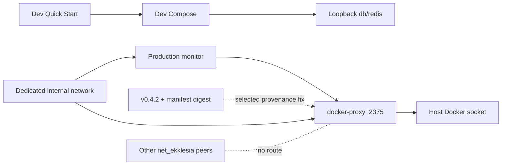
# Architecture Map — EKA-22 Cross-Implementation Crypto Contract (KAT path)

Basis: `origin/main 4cc11930f4be82ba2d012def487fb34abca9da26` · Task: T-489 · Mapping only, no test or product code.
Node: Cross-Implementation Crypto Contract. Hop: shared deterministic fixture → workspace test adapter → existing API/Web/Mobile crypto symbols → expected bytes/hex/errors.
The EKA-18 map above stays unchanged; this section adds a second node.

## 1. Grundidee

- Citizens sign votes and personal reads client-side with Ed25519; the server only verifies signatures and never holds the private key (`CLAUDE.md` Sicherheitsprinzipien; `apps/api/keypair.py::verify_signature`).
- Three client/server stacks encode the same logical messages: API (Python/PyNaCl), Web (`apps/web/src/lib/crypto.ts`, `@noble/curves`), Mobile (`apps/mobile/src/lib/crypto-native.ts`, `@noble/*`); a Tier-1 library `packages/crypto/src` mirrors the mapped identity/vote/linkage/ephemeral HMAC chain.
- EKA-22 (Low, open): no cross-implementation known-answer vectors exist; every suite asserts only its own side (`docs/community-audits/EKA_PNYX_Crypto_Deep_Audit_2026-09-15.md` §EKA-22).
- EKA-21 (Medium, open, Gio-gated): the phone→root KDF deliberately diverges in three places (same audit §EKA-21; plan row E in `docs/planning/EKA_REMEDIATION_AND_REDESIGN_PLAN_2026-09-19.md:120`).
- Boundary of this node: deterministic pure functions (canonical encoders, HMAC derivations from a fixed root, Ed25519 sign/verify, validators). Storage, network, KDF choice and all product files are outside.

## 2. Spur (hops opened)

| # | From → To | Datum over the edge |
| --- | --- | --- |
| K1 | `apps/web/src/app/[locale]/bills/[id]/page.tsx:98` → `apps/web/src/lib/crypto.ts::signVote` (l.98) → `buildVoteMessage` (l.79–85) | UTF-8 `"{bill_id}:{VOTE.toUpperCase()}:{nullifier_hash}"`, Ed25519 sig hex(128) |
| K2 | `apps/mobile/src/screens/VoteScreen.tsx:363–367` → `crypto-native.ts::signVote` (l.362–371) / `verifyVote` (l.504–513) | same string **without** `toUpperCase()`; screen passes `"YES"/"NO"/…` keys (l.33) |
| K3 | `apps/api/routers/voting.py:658–660` → `keypair.py::verify_signature` | server rebuilds `f"{bill_id}:{vote.upper()}:{nullifier_hash}"`; also l.911 (correction). Import at l.44–46 inserts `packages/crypto` on `sys.path`, so `packages/crypto/keypair.py` shadows `apps/api/keypair.py` (docstring `apps/api/keypair.py:18`) |
| K4 | `packages/crypto/keypair.py::verify_signature` (l.50–74) / `apps/api/keypair.py::verify_signature` (l.15–36) | wrong type / non-hex / wrong length / bad sig ⇒ `False`; other exceptions ⇒ `SignatureVerificationError` |
| K5 | `apps/api/routers/voting.py:482–493` → `apps/api/crypto/nullifier.py::validate_vote` (l.131–197) → `build_signed_payload` (l.88–110) | Tier-1 canonical bytes: `bill_id_utf8 ‖ choice_utf8 ‖ pk_eph(32) ‖ vote_nullifier(32) ‖ linkage_tag(32) ‖ u64be(ts)`; error codes `VERSION_MISMATCH`, `INVALID_BILL_ID`, `INVALID_CHOICE`, `INVALID_HEX`, `INVALID_SIGNATURE_FORMAT`, `TIMESTAMP_EXPIRED`, `DUPLICATE_VOTE`, `INVALID_SIGNATURE`; `now_ms` injectable (l.135) |
| K6 | `crypto-native.ts::signVoteEphemeral` (l.557–586) → `buildSignedPayload` (l.538–552) | same layout as K5 (raw concat, u64be); `timestamp_ms = Date.now()` (l.571) |
| K7 | `packages/crypto/src/nullifier.ts::buildVotePayload` (l.307) → `buildSignedPayload` (l.272–295) | **different** layout: `0x01 ‖ u16be(len) ‖ bill_id ‖ choice_byte{YES:1,NO:2,ABSTAIN:3} ‖ pk_eph ‖ vote_nullifier ‖ linkage_tag ‖ u64be(ts)` |
| K8 | `crypto-native.ts::deriveIdentityCommitment/deriveVoteNullifier/deriveEphemeralKeypair/deriveLinkageTag` (l.118–149) ≡ `packages/crypto/src/nullifier.ts` l.176/218/252/237 with `types.ts::DOMAIN` (l.31–39) | `HMAC-SHA256(root, DOMAIN.X [+ ":" + bill_id])`; linkage = `HMAC(HMAC(root, LINKAGE_TAG), bill_id)`; ephemeral sk = seed. Polis derivation is excluded because `packages/crypto/src/polis.ts` adds a separate `POLIS_TICKET_KEY` hop. |
| K9 | `apps/api/crypto/nullifier.py::issue_receipt` (l.202–225) → `packages/crypto/src/nullifier.ts::verifyReceipt` (l.347–370) | `bill_id_utf8 ‖ vote_nullifier(32) ‖ u64be(ts)`; server ts = `time.time()` (not injectable) |
| K10 | `apps/api/routers/municipal.py:255–257`, `apps/api/routers/zk.py:760–761`, `crypto-native.ts::signZkOptInPayload` (l.496) | scope strings `"municipal:{ada}:{VOTE}:{nullifier}"`, `"zk_opt_in:{bill_id}:{commitment}:{nullifier}"` |
| K11 | `apps/api/services/zk_group_registry.py::validate_vote_scope_id` (l.19–28) | `^(bill\|municipal\|regional):[A-Za-z0-9._-]{1,110}$` after `strip()`, else `ValueError` |
| K12 | `apps/api/services/evaluation_integrity.py::build_evaluation_v2_payload` (l.35–48), `build_evaluation_read_payload` (l.58–69), `citizen_action_integrity.py::build_vote_status_read_payload` (l.29–39) ↔ `crypto-native.ts::buildEvaluationV2Payload` (l.388–408), `buildEvaluationReadPayload` (l.430–439), `buildVoteStatusReadPayload` (l.451–460) | `"<prefix>:" + JSON([..])`; Python `json.dumps(ensure_ascii=False, separators=(",",":"))` vs JS `JSON.stringify`; both sort score pairs and reject duplicate `question_id` |
| K13 | Root KDFs: `packages/crypto/nullifier.py::generate_nullifier_hash` (l.37–51), `generate_nullifier_hash_v2` (l.54–82) + `normalize_phone_number` (l.22–34); `packages/crypto/src/nullifier.ts::deriveNullifierRoot` (l.130–139) + `normalizePhone` (l.58–64); `crypto-native.ts::deriveNullifierRoot` (l.104–112) + `normalizePhone` (l.90–96); Web: private test-only `legacyV1NullifierTestOnly` in `crypto.test.ts` / `crypto-kat.test.ts` (product export `crypto.ts::computeNullifier` removed by EKA-24) | inventory only, see §5 |
| K14 | Existing tests: `apps/api/tests/test_nullifier.py` (K5 validators), `packages/crypto/tests/test_crypto.py` (K4, v1 hash), `packages/crypto/src/crypto.test.ts` (`TEST_ROOT = 0xab×32`, l.51), `apps/web/src/lib/crypto-compat.test.ts` (RFC 8032 vector 1, web-only), `apps/mobile/src/lib/crypto-native-{evaluation,vote-status,zk}.test.ts` (`vi.mock("expo-secure-store")`) | each asserts one side; none reads a shared file |

Not opened (not on map): `packages/crypto/hlr.py`, `apps/api/crypto/polis.py`, `packages/crypto/src/polis.ts`, mobile POLIS screens, ZK/Semaphore proof code, compass AES/HKDF.

## 3. Module

| Modul | Eine Aufgabe | Einstieg | Stand |
| --- | --- | --- | --- |
| API signature verifier | verify Ed25519 over UTF-8/bytes, malformed ⇒ False | `packages/crypto/keypair.py::verify_signature` (runtime) + `apps/api/keypair.py::verify_signature` (mirror) | gebaut (two copies) |
| API legacy vote payload | rebuild `"{bill}:{VOTE}:{nullifier}"` | `apps/api/routers/voting.py:658` (inline f-string) | gebaut; no importable builder |
| API Tier-1 validator | canonical bytes + validation codes | `apps/api/crypto/nullifier.py::build_signed_payload`, `validate_vote` | gebaut |
| API receipt signer | server-signed receipt | `apps/api/crypto/nullifier.py::issue_receipt` | gebaut; ts not injectable |
| API scope validator | bill/municipal/regional scope id grammar | `services/zk_group_registry.py::validate_vote_scope_id` | gebaut |
| API JSON integrity payloads | evaluation v2/read, vote-status read | `services/evaluation_integrity.py`, `services/citizen_action_integrity.py` | gebaut |
| Python root KDF (server) | v1 SHA-256 / v2 Argon2id identity nullifier | `packages/crypto/nullifier.py` | gebaut; EKA-21 divergence |
| Web legacy signer | build/sign/verify legacy vote message | `apps/web/src/lib/crypto.ts::buildVoteMessage/signVote/verifyVote/signPayload` | gebaut |
| Web v1 nullifier helper | `SHA-256(phone:salt)` | `apps/web/src/lib/crypto-kat.test.ts::legacyV1NullifierTestOnly` (test-only; product export removed by EKA-24) | gebaut (test-only) |
| Tier-1 TS library | Argon2id root, HMAC chain, length-prefixed payload, receipt verify | `packages/crypto/src/nullifier.ts` | teilweise — no import from `apps/web` or `apps/mobile` found (grep); payload layout incompatible with K5 |
| Mobile crypto | PBKDF2 root, HMAC chain, legacy + Tier-1 + JSON payload signers | `apps/mobile/src/lib/crypto-native.ts` | gebaut |
| Shared KAT fixture | one secret-free vector file read by all suites | — | offen |
| Workspace KAT adapters | API/Web/Mobile tests reading the fixture | — | offen |

## 4. Verdrahtung

- Fixture → API adapter: pytest loads JSON, calls K4/K5/K11/K12 symbols; `validate_vote(now_ms=fixture.now_ms)` makes the timestamp path deterministic.
- Fixture → Web adapter: vitest loads the same JSON, calls `buildVoteMessage`, `signVote`, `verifyVote`, `signPayload`, and for the v1 nullifier the private test helper `legacyV1NullifierTestOnly` (EKA-24).
- Fixture → Mobile adapter: vitest with `vi.mock("expo-secure-store")` (pattern of existing mobile tests) calls K2/K6/K8/K10/K12 builders and derivations from a fixed root.
- Fixture → Tier-1 lib adapter (optional): vitest in `packages/crypto` calls K7/K8/K9; K7 is expected to diverge.
- Web signVote → API verifier: legacy string equality after uppercase (K1 ↔ K3).
- Mobile signVote → API verifier: equality only when caller passes uppercase (K2 ↔ K3).
- Mobile buildSignedPayload → API validate_vote: identical Tier-1 bytes (K6 ↔ K5).
- Tier-1 lib buildSignedPayload → API validate_vote: bytes differ (K7 ≠ K5).
- API issue_receipt → Tier-1 lib verifyReceipt: same layout (K9).
- Mobile JSON builders → API JSON builders: same prefix and compact JSON (K12).

## 5. Widerspruch und Lücken — classified for the fixture

**A. Gemeinsam identische Outputs (strict byte/hex equality across implementations)**
1. Ed25519 deterministic signatures (RFC 8032): same 32-byte test seed + same message ⇒ same pk/sig hex in PyNaCl (`sign_payload`) and noble (web `signPayload`, mobile `ed25519.sign`). Use RFC 8032 public test vectors only.
2. Legacy vote message for uppercase choice: web `buildVoteMessage` = mobile `signVote` message = API `voting.py:658` string (K1/K2/K3).
3. Scope-prefixed strings: `municipal:{ada}:{VOTE}:{nullifier}` (API K10; no mobile builder in `crypto-native.ts`), `zk_opt_in:{bill}:{commitment}:{nullifier}` (API K10 ↔ mobile K10).
4. Tier-1 canonical bytes API `build_signed_payload` ↔ mobile `buildSignedPayload` (K5/K6), including u64 big-endian timestamp.
5. HMAC chain from a fixed test root: mobile K8 ≡ Tier-1 lib K8 for `identity_commitment`, `vote_nullifier(bill)`, `ephemeral pk(bill)` and `linkage_tag(bill)`. Polis keys are not cross-implementation-identical on this hop and remain implementation-specific. Python has **no production symbol** for this chain (`apps/api/crypto/nullifier.py:9` "Does NOT contain key derivation"); a Python stdlib `hmac` oracle in the test is a re-implementation, not an API binding.
6. JSON integrity payloads K12 (evaluation v2 with unsorted input, evaluation read incl. `null` ada, vote-status read), including a non-ASCII (Greek) `bill_id`/`ada` case to pin `ensure_ascii=False` ≡ `JSON.stringify`.
7. v1 nullifier `SHA-256("{phone}:{salt}")`: Python `generate_nullifier_hash` ≡ web test-only `legacyV1NullifierTestOnly` (EKA-24) **with a synthetic phone and a test-only salt** (Python reads `SERVER_SALT` at import, l.13 ⇒ adapter must monkeypatch the module attribute; never a real salt).
8. Receipt bytes layout K9 (API ↔ Tier-1 lib); API side only by signing a fixture-fixed ts in the test, because `issue_receipt` uses `time.time()`.
9. Bill/scope domain separation: `vote_nullifier(bill A) ≠ vote_nullifier(bill B)`, `linkage_tag` and `ephemeral pk` likewise, and `DOMAIN.*` strings pairwise distinct (types.ts l.31–39 vs crypto-native l.38–44 — mobile lacks `POLIS_NULLIFIER`/`POLIS_TICKET_KEY`, not used by it).

**B. Nur gemeinsam validierbar (same accept/reject verdict, not same bytes/error type)**
1. Tampered message / wrong key ⇒ reject everywhere: API `False`, web `false`, mobile `verifyVote` `false`.
2. Malformed hex / wrong length: API `False` (K4) and `INVALID_HEX` / `INVALID_SIGNATURE_FORMAT` (K5); web `verifyVote` catches ⇒ `false`; mobile `verifyVote` has **no try/catch** (l.504–513) ⇒ noble throws. Web/mobile `hexToBytes` silently map non-hex to `0` and truncate odd length (web l.32–38, mobile l.65–71) ⇒ only the verdict "not accepted" is shared; the adapter must accept `false | throw` for mobile.
3. Uppercase hex: API `_is_hex` accepts uppercase (`test_nullifier.py:106–108`); TS `bytesToHex` always emits lowercase ⇒ fixture stores lowercase only.
4. Lowercase choice: web uppercases, API uppercases, mobile signs raw ⇒ `"yes"` yields a mobile signature the API rejects. Record as expected-reject case, do not fix.
5. Duplicate `question_id`: Python `ValueError`, mobile `Error` ⇒ both throw. Score range −5…5 is checked by mobile only (l.398); Python builder not range-checking — server-side range check not opened.
6. Scope id grammar K11: only API validates; clients have no validator ⇒ API-only negative vectors (`"state:1"`, empty id, 111 chars, whitespace-padded accepted after strip).
7. `TIMESTAMP_EXPIRED` / `DUPLICATE_VOTE` / `VERSION_MISMATCH` / `INVALID_CHOICE`: API-only error codes; clients have no equivalent.

**C. Bekannte KDF-Divergenz — inventory only, must not be equalised without EKA-21 (Gio-gated)**

| Impl | Symbol | KDF + params | Salt | Normalisation |
| --- | --- | --- | --- | --- |
| Server v1 | `packages/crypto/nullifier.py::generate_nullifier_hash` | SHA-256, 1 pass | `":" + SERVER_SALT` (secret) | none (raw input) |
| Server v2 | `…::generate_nullifier_hash_v2` | Argon2id t=2, m=65536 KiB, p=1, 32 B, output `"v2:"+hex` | `SHA-256("ekklesia:identity-nullifier:v2" ‖ SERVER_SALT)` | strip `[\s().-]`; `00…`→`+…`; `30`+12→`+`; `69`+10→`+30`; otherwise passthrough (never throws) |
| Web Tier-1 lib | `packages/crypto/src/nullifier.ts::deriveNullifierRoot` | Argon2id (hash-wasm) t=3, m=65536, p=1, 32 B | `REGISTRATION_SALT` (public, types.ts l.26) | strip all non-digits; `30`+12 / `0030…` / 10 digits `6…` → `+30…`; else **throw** |
| Mobile | `crypto-native.ts::deriveNullifierRoot` | PBKDF2-SHA256 c=100000, 32 B | `REGISTRATION_SALT` | same as Tier-1 lib (message text differs) |
| Web legacy (test-only since EKA-24) | `apps/web/src/lib/crypto-kat.test.ts::legacyV1NullifierTestOnly` | SHA-256 | `":" + serverSalt` argument | none |

Contradictions: `ARGON2_PARAMS` is declared in `crypto-native.ts:31–36` but unused; `nullifier.ts:56` docstring accepts `06912…`-style 11-digit input but the code throws on it; `packages/crypto/src` is not wired into any app although `CLAUDE.md` describes web Tier-1; Tier-1 payload layouts K5/K6 vs K7 disagree while both files claim to "match exactly" (`nullifier.py:99`, `crypto-native.ts:536`).
Gaps: no importable Python builder for the legacy vote string (inline in routers); Python lacks the HMAC chain; `issue_receipt` and `signVoteEphemeral` read wall-clock time (adapter must use their pure sub-builders or fake timers).

## 6. Diagrammdateien

- `docs/architecture/map.puml` — EKA-22 mindmap + component diagram appended after the EKA-18 diagrams.
- `docs/architecture/main-path.puml` — EKA-22 sequence appended.
- No `plantuml` on `PATH`; `java -jar ~/.local/share/plantuml/plantuml.jar -checkonly` passed and `-tsvg` rendered all 6 diagrams to a temp dir (SVGs not committed).

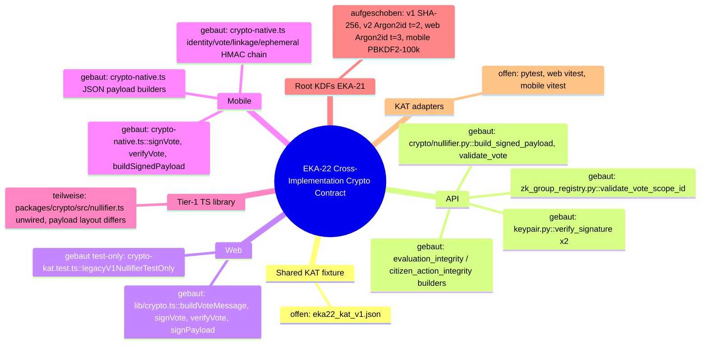

## 7. Nächster Schritt — one test-only node

**Knoten:** Shared KAT fixture + workspace KAT adapters (module rows `offen`). **Hop:** fixture → adapter → existing symbols → expected bytes/hex/errors. No production file changes; a failing strict vector is reported, not fixed.

**Fixture schema** `packages/crypto/tests/vectors/eka22_kat_v1.json` (generated once by the Python adapter's `--regen` helper or by hand, then committed; never auto-regenerated in CI):
```json
{
  "schema": "ekklesia-kat", "version": 1, "source_commit": "<sha>",
  "keys": [{"id": "rfc8032-1", "seed_hex": "<RFC 8032 test 1 secret>", "pk_hex": "<…>"}],
  "roots": [{"id": "test-root-ab", "root_hex": "ab…ab"}],
  "cases": [
    {"id": "legacy-vote-yes", "class": "identical", "kind": "legacy_vote_message",
     "input": {"bill_id": "TEST-BILL-1", "vote": "YES", "nullifier_hash": "<64 lowercase hex, synthetic>"},
     "expect": {"message_utf8_hex": "…", "sig_hex": "…", "key": "rfc8032-1"}, "impls": ["api","web","mobile"]},
    {"id": "tier1-payload", "class": "identical", "kind": "tier1_signed_payload", "impls": ["api","mobile"],
     "expect_divergent": {"tier1_lib": "EKA-22 layout mismatch K7"}},
    {"id": "hmac-chain-bill-A", "class": "identical", "kind": "hmac_chain", "root": "test-root-ab", "impls": ["mobile","tier1_lib"]},
    {"id": "bad-hex-sig", "class": "validatable", "kind": "verify", "expect": {"accepted": false},
     "impl_error": {"api": "False", "api_tier1": "INVALID_SIGNATURE_FORMAT", "web": "false", "mobile": "false|throw"}},
    {"id": "scope-bad-prefix", "class": "validatable", "kind": "scope_id", "impls": ["api"], "expect": {"error": "ValueError"}}
  ],
  "kdf_inventory": {
    "class": "implementation_specific", "gate": "EKA-21",
    "entries": [{"impl": "mobile-pbkdf2-c100000", "input": "<SYNTHETIC_PHONE>", "normalized": "…", "root_hex": "…"}]
  }
}
```
Rules: `class ∈ {identical, validatable, implementation_specific}`; `kdf_inventory` entries are compared **only within their own `impl`** (regression pins), never across; no cross-impl equality key may exist for KDF roots; server-v2 entries use a fixture-only placeholder salt; only RFC 8032 public test keys, synthetic bill ids, synthetic all-lowercase hex nullifiers and a clearly synthetic phone placeholder — no real numbers, keys or `SERVER_SALT`. Argon2id vectors are slow (64 MiB); mark them `slow: true`.

**Reading the same file:**
- Python: `json.loads(Path(__file__).parents[N] / "packages/crypto/tests/vectors/eka22_kat_v1.json")`, `pytest.mark.parametrize` over `cases` filtered by `"api" in impls`.
- Web / Mobile / Tier-1 lib (vitest): `JSON.parse(readFileSync(new URL("<relative path>", import.meta.url)))` via `node:fs`, `it.each` filtered by impl; mobile keeps `vi.mock("expo-secure-store")`.

**Minimal test files (Folgebrief):**
- `packages/crypto/tests/vectors/eka22_kat_v1.json`
- `apps/api/tests/test_eka22_kat_vectors.py` (both `verify_signature` copies, `build_signed_payload`, `validate_vote` codes with injected `now_ms`, `validate_vote_scope_id`, K12 builders, v1 hash with monkeypatched salt)
- `apps/web/src/lib/crypto-kat.test.ts`
- `apps/mobile/src/lib/crypto-native-kat.test.ts`
- optional `packages/crypto/src/crypto-kat.test.ts` (Tier-1 lib; K7 as documented divergence)

**Unberührt bleiben:** every production file listed in §2/§3 (`keypair.py` ×2, `packages/crypto/nullifier.py`, `apps/api/crypto/nullifier.py`, routers, services, `apps/web/src/lib/crypto.ts`, `apps/mobile/src/lib/crypto-native.ts`, `packages/crypto/src/*.ts` non-test), `package.json`/lockfiles, vitest/pytest configs, CI workflows, DB, env/secrets. If a vitest config blocks reading outside its root, that is a stop-and-report, not a config change.

---

# Architecture Map — EKA-24 Test-only Legacy Nullifier Helper Boundary

Basis: queued EKA-22 Draft `#397@399b42502854833d2975950f6b9f6b991cd0ff23`, itself based on proven `main 4cc11930f4be82ba2d012def487fb34abca9da26` · Task: T-509 · Mapping only, no product fix.
**Nachher-Zustand:** #397 is merged as `2f69954a`; this PR (T-510) removes `crypto.ts::computeNullifier` and both Web suites use a private test-only helper. §1–§5 and §7 record the mapped state before the fix; §3, §4, §6 and the diagrams show the state after it; see §8.
Node: Web Crypto / legacy v1 nullifier helper boundary.

The EKA-18 and EKA-22 maps above stay unchanged. EKA-24 is appended as a third node.

## 1. Grundidee

- Ekklesia.gr is an independent direct-democracy platform where Greek citizens inspect and cast informational votes on parliamentary and municipal matters (`README.md::What is Ekklesia?`).
- The Web client signs vote and relevance payloads locally with Ed25519 helpers from `apps/web/src/lib/crypto.ts`; production callers import signing and locally stored identity material, not phone-number nullifier derivation (`apps/web/src/app/[locale]/bills/[id]/page.tsx`, `components/RelevanceButtons.tsx`, `app/[locale]/sso-verify/page.tsx`, `lib/compass/useCompass.ts`).
- Before the fix, `crypto.ts::computeNullifier(phoneNumber, serverSalt)` exposed the legacy v1 formula `SHA-256(phone + ":" + serverSalt)` from the product module.
- Proven main has one test-only caller in `crypto.test.ts`; exact queued #397 adds a second in `crypto-kat.test.ts` for EKA-22's v1-nullifier known-answer vector. No production caller supplies or receives a server salt.
- EKA-24 records this as an informational future-misuse risk: client code must not acquire `SERVER_SALT` or derive the server-owned v1 nullifier (`docs/community-audits/EKA_PNYX_Crypto_Deep_Audit_2026-09-15.md::EKA-24`).
- Boundary: the single exported helper and both test-only callers. Key storage (EKA-07), KDF harmonisation (EKA-21), the EKA-22 fixture and non-Web adapters, API identity behavior and all production call sites remain unchanged.

## 2. Spur before the fix (built test traces opened on #397@399b4250)

There is no user/runtime path to this symbol. Both built paths on the selected queue base are test-only:

| # | From → To | Datum over the edge |
| --- | --- | --- |
| N1 | `apps/web/package.json::test` → Vitest → `apps/web/src/lib/crypto.test.ts` | `vitest run` discovers the legacy Web crypto unit suite |
| N2 | `crypto.test.ts` import list → `crypto.ts::computeNullifier` | synthetic phone/salt cases checking shape, determinism and input sensitivity |
| N3 | `packages/crypto/tests/vectors/eka22_kat_v1.json` → `crypto-kat.test.ts` → `crypto.ts::computeNullifier` | exact EKA-22 `v1_nullifier` fixture case with synthetic input and expected digest |
| N4 | `computeNullifier` → `TextEncoder` → `crypto.subtle.digest("SHA-256", ...)` | UTF-8 bytes of `${phoneNumber}:${serverSalt}` become a 32-byte digest |
| N5 | digest → `crypto.ts::bytesToHex` → assertions | lowercase 64-character hex compared by both suites |

Opened production neighbours: `bills/[id]/page.tsx`, `RelevanceButtons.tsx`, `sso-verify/page.tsx` and `useCompass.ts` import other `crypto.ts` symbols only. None imports or calls `computeNullifier`.

## 3. Module

| Modul | Eine Aufgabe | Einstieg | Stand |
| --- | --- | --- | --- |
| Web Crypto product module | Ed25519 conversion, signing and Beta local identity storage | `apps/web/src/lib/crypto.ts` | gebaut; `computeNullifier` removed by EKA-24 (was quarantäne: only tests called it and it accepted server-owned material) |
| Legacy Web Crypto tests | exercise product crypto helpers | `apps/web/src/lib/crypto.test.ts` | gebaut; private `legacyV1NullifierTestOnly` helper |
| EKA-22 Web KAT | validates shared known-answer fixture against Web symbols | `apps/web/src/lib/crypto-kat.test.ts` | gebaut; private `legacyV1NullifierTestOnly` helper for the exact shared vector |
| Web production callers | sign votes/relevance/SSO and read local identity material | paths listed above | gebaut; no nullifier-derivation edge |
| Server nullifier derivation | owns the v1 salt-backed identity formula | API identity/crypto modules | aufgeschoben; direct neighbour, not opened for modification |

## 4. Verdrahtung

- `npm test` → Vitest → both crypto suites.
- `crypto.test.ts` → private `legacyV1NullifierTestOnly`: synthetic legacy regression cases (before the fix: `computeNullifier`).
- EKA-22 fixture → `crypto-kat.test.ts` → private `legacyV1NullifierTestOnly`: exact shared v1-nullifier vector.
- test-only helpers → Web Crypto SHA-256 → `bytesToHex`: synthetic `phone:salt` bytes become lowercase hex.
- Production callers → other `crypto.ts` exports: voting, relevance, SSO and compass flows have no nullifier edge; `crypto.ts` no longer exports the symbol.
- There is no repository edge from configuration or an API response to `serverSalt` in the Web client.

## 5. Widerspruch und Lücken

**Symptom:** server-owned v1 nullifier derivation is presented as a public export of the browser product module even though only tests call it.

**Ursache:** N2 and N3 cross the test/product boundary: both suites keep their legacy formula helper in `crypto.ts` instead of test-only code.

**Security invariant:** no browser production path accepts, retrieves, embeds or derives with `SERVER_SALT`; server-owned nullifier/KDF behavior stays outside the client product API.

**Widerspruch:** the audit says the helper is “exported in the web bundle.” The selected source proves an exported symbol and zero production imports; it does not prove the optimized Next build retains the unused export. EKA-24 is API-surface/future-misuse hardening, not evidence of a live salt leak or callable UI path.

**Lücken / Grenzen:**

- The legacy suite's “matches Python format” case pins no digest; #397's EKA-22 Web KAT supplies the exact known-answer assertion and must remain green.
- `generateKeypair` is also not imported by current production files, but it does not accept server-owned material and is outside EKA-24.
- EKA-07 plaintext key storage and EKA-21 KDF design are explicitly Gio-gated and remain untouched.

## 6. Diagrammdateien

- `docs/architecture/map.puml` (EKA-24 mindmap + component diagram appended after EKA-22)
- `docs/architecture/main-path.puml` (two test-only built traces appended)
- Rendered with `/Users/gio/.local/bin/plantuml -Playout=smetana -tsvg`; `smetana` is required because Graphviz `dot` is absent.

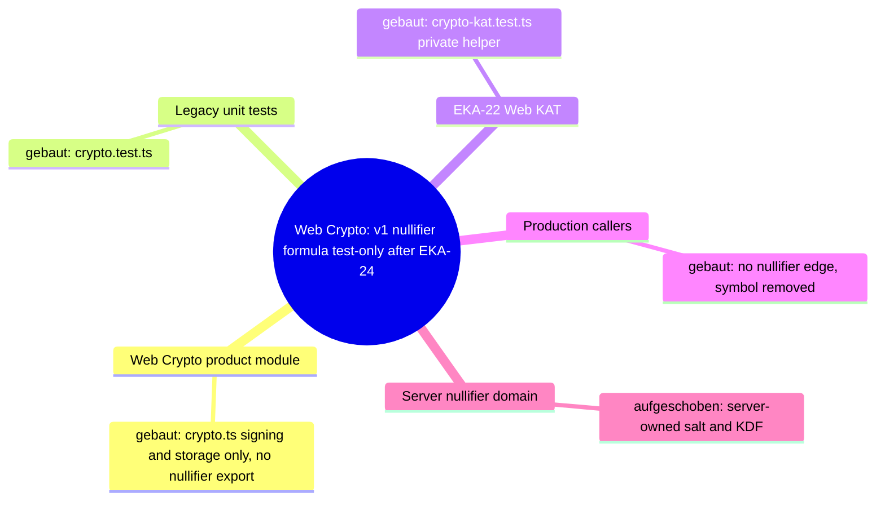

## 7. Nächster Schritt (engste Reparaturgrenze)

**Modul:** Web Crypto product module + both Web crypto tests. **Hops:** N2 and N3.

**Fix contract:**
1. Stay based on exact Draft #397 head `399b42502854833d2975950f6b9f6b991cd0ff23`; do not publish or mutate #397 itself.
2. `apps/web/src/lib/crypto.ts`: remove only exported `computeNullifier` and its comment; retain every signing/storage symbol unchanged.
3. `apps/web/src/lib/crypto.test.ts`: remove the product import and retain its five cases through private test-only derivation.
4. `apps/web/src/lib/crypto-kat.test.ts`: remove the product import and retain the exact shared v1-nullifier KAT through private test-only derivation. Do not change the fixture or other EKA-22 adapters.
5. Verify both Web crypto suites together, typecheck, production build, production-source search and built-output absence.

**Unberührt bleiben:** every other Web file, EKA-22 fixture/API/Mobile/packages adapters, API nullifier/identity code, KDF parameters, key storage, configs, dependencies, lockfiles, workflows, data, secrets, production and deployment.

## 8. Nachher-Zustand (EKA-24 implemented, T-510)

| Hop | After the fix |
| --- | --- |
| N2 | `crypto.test.ts` → private `legacyV1NullifierTestOnly` (no product import) |
| N3 | `eka22_kat_v1.json` → `crypto-kat.test.ts` → private `legacyV1NullifierTestOnly`; fixture case `v1-nullifier-sha256-synthetic` notes Web as test reference |
| N4/N5 | unchanged formula: UTF-8 `${phone}:${salt}` → `crypto.subtle.digest("SHA-256")` → `bytesToHex` |
| Product | `apps/web/src/lib/crypto.ts` has no nullifier export; vote, relevance, SSO and compass callers are unchanged |

Security invariant holds: no browser production path accepts, retrieves, embeds or derives with `SERVER_SALT`. The server-side v1 formula and KDF harmonisation stay with EKA-21 (Gio-gated).
# Architecture Map — EKA-57 Knowledge-Base Refresh Lifecycle

Basis: `origin/main 4cc11930f4be82ba2d012def487fb34abca9da26` · Task: T-495 · Mapping only, no fix.
Node: API RAG knowledge lifecycle / canonical seed to deployed retrieval.

## 1. Grundidee

- The landing assistant answers from hardcoded canonical responses, the `knowledge_base` table and public bill data. This node covers only the lifecycle of the database-backed knowledge rows.
- Repository truth is currently split between a destructive SQL seed and a Python upsert seed. Neither is wired into CI or the manual deployment workflow.
- Runtime retrieval reads at most 20 rows, scores them, and gives at most five matching rows to the prompt. Duplicate or stale rows therefore change which facts are reachable.
- Legal, privacy and operator wording inside seed rows is content governance, not part of this technical lifecycle repair.

## 2. Spur (one trace, hops opened)

| # | From → To | Datum over the edge |
| --- | --- | --- |
| H1 | `scripts/seed_knowledge_base.sql` → `knowledge_base` | 17 manually maintained rows; unconditional DELETE + INSERT |
| H2 | `apps/api/scripts/seed_knowledge_base.py::ENTRIES/seed` → `knowledge_base` | 14 different rows; per-row natural-key upsert, no stale/duplicate deletion |
| H3 | Alembic `j301a2b3c4d5` → `knowledge_base` | schema only; no seed data or uniqueness constraint |
| H4 | `.github/workflows/deploy.yml` → API container | manual deployment rebuilds containers and health-checks; never runs a KB sync/check |
| H5 | `.github/workflows/ci.yml` → API tests | runs pytest, but no DB/seed drift invariant is present |
| H6 | private ignored training capture → `test_agent_training_regression.py` | test points into ignored `docs/agent-bridge`; missing file marks the whole module skipped |
| H7 | `knowledge_base` → `routers/agent.py::_build_context` | priority-ordered first 20 rows, then scored top five (or three priority fallbacks) enter prompt context |

## 3. Module

| Modul | Eine Aufgabe | Einstieg | Stand |
| --- | --- | --- | --- |
| SQL seed | legacy manual full replacement | `scripts/seed_knowledge_base.sql` | gebaut; divergent second authority |
| Python seed catalog | repository knowledge catalog | `apps/api/scripts/seed_knowledge_base.py::ENTRIES` | gebaut; selected authority by EKA-57 recommendation |
| Python synchronizer | writes catalog rows | `apps/api/scripts/seed_knowledge_base.py::seed` | partial; upserts only, permits stale/duplicate rows |
| Schema | persists RAG knowledge | Alembic `j301a2b3c4d5`, `models.KnowledgeBase` | gebaut |
| Deployment | manual production rollout | `.github/workflows/deploy.yml` | gebaut; no KB lifecycle step |
| CI | validates API changes | `.github/workflows/ci.yml` | gebaut; no exact-sync/drift contract |
| Training questions | stable assistant regression inputs | `test_agent_training_regression.py` | partial; private historical capture required, therefore skipped in CI |
| Runtime retrieval | selects KB rows for the prompt | `routers/agent.py::_build_context` | gebaut; row cap makes drift observable |

## 4. Verdrahtung

- The SQL and Python seeds are independent entry points into the same table; neither records provenance or a catalog version.
- The Python seed matches on `(category, title_en)` with `LIMIT 1`, updates one match and inserts missing rows. It cannot remove a legacy SQL-only row or a second duplicate.
- The deploy workflow is manually dispatched, pulls `main`, rebuilds changed services and checks health. It performs no KB sync or post-sync drift check.
- CI runs the API suite. The training test resolves a file under ignored `docs/agent-bridge`, so a clean checkout skips all four checks.
- Runtime loads only the first 20 priority-ordered rows before scoring. Drift above that boundary is silently invisible; duplicate topics compete for five context positions.

## 5. Widerspruch und Lücken

**Symptom:** repository state cannot determine deployed KB state. Running both seeds can leave about 27 rows; historical live evidence recorded eight; the Python catalog contains 14.

**Root causes:** two authorities (H1/H2), non-exact upsert semantics (H2), no lifecycle wiring (H4), and a skipped clean-checkout regression dataset (H6).

**Source → sink:** manual seed choice → mutable `knowledge_base` rows → capped retrieval H7 → assistant context and answer.

**Technical invariant:** one version-controlled catalog defines the complete managed table; sync is transactional, exact and idempotent; a check mode exits non-zero on missing, stale, duplicate or changed rows; sync and check are operator commands, not deploy steps (Gio decision 2026-10-02, see below); CI proves catalog uniqueness, sync/check behavior and always loads the question fixture.

**Gio decision 2026-10-02:** merge without automatic sync. The first exact sync deletes every live row outside the 14 `ENTRIES`, so the deploy workflow does not run `sync` or `check`; both run only on Gio's explicit instruction with a rollback point. A test guards that `deploy.yml` never calls the synchronizer.

**Legitimate control path:** a manually authorized deploy remains the only production trigger. The PR must not execute a deployment or touch a live database. With explicit instruction and a rollback point, an operator runs `sync`; a failed sync rolls back and exits non-zero. After a successful sync, the operator runs the exact drift `check`.

**Content boundary:**

- Keep current Python `ENTRIES` text byte-for-byte unless a purely technical serialization change is required.
- Do not choose between “Vendetta Labs” and “V-Labs Development” or rewrite legal/privacy/security/donation claims.
- Do not publish historical captured answers, timestamps, endpoints or source responses from the private agent-bridge dataset. A tracked regression fixture may contain only test IDs, language, category and questions.
- Record wording conflicts as a Gio decision template outside the product diff.

## 6. Diagrammdateien

- `docs/architecture/map.puml` (mindmap + component trace)
- `docs/architecture/main-path.puml` (seed-to-answer sequence)
- PlantUML is not installed on the mapping host; source files are authoritative.

## 7. Nächster Schritt (engste Reparaturgrenze)

**Module:** Python seed catalog/synchronizer, deploy guard (no KB wiring, Gio decision 2026-10-02), CI regression inputs. **Hops:** H1/H2/H4/H5/H6; runtime H7 is observed but unchanged.

1. Retire the executable SQL seed so `apps/api/scripts/seed_knowledge_base.py::ENTRIES` is the sole catalog without editing its wording.
2. Give the Python command explicit transactional `sync` and read-only `check` modes. Preserve IDs for matching natural keys where practical; remove stale and duplicate rows so DB equals the catalog; make reruns idempotent and fail closed.
3. ~~Wire the manual deployment workflow to run sync and then check.~~ Superseded by the Gio decision of 2026-10-02: no deploy wiring; `sync`/`check` stay manual operator commands.
4. Add focused tests for unique catalog keys, exact reconciliation, duplicate/stale cleanup, rollback/error exit, idempotence, check-mode drift detection and a guard that the deploy never runs the synchronizer.
5. Replace the ignored historical-response dependency with a tracked, sanitized question-only fixture; make the training regression tests mandatory in clean CI checkouts.
6. Produce a non-product Gio template listing content conflicts; do not resolve them in code.

Out of scope: editing seed wording, runtime retrieval/scoring/prompt behavior, schema/content migrations, live DB inspection or mutation, deployment, scheduler jobs, LLM calls and EKA-58…64.
# Architecture Map — Pnyx Static Wiki / FAQ-Lokalisierung

Scope: T-472, Vorbereitung fuer [GH#365](https://github.com/NeaBouli/pnyx/issues/365).
Basis: `origin/main` `fd3b4dc5ebbc1cd80ee3db3f9945cbf27963a932`.
Kartiert ist genau ein Hop: der statische Sprachwechsel auf `docs/wiki/faq.html`.
Andere Wiki-Seiten, Web-App, API, Mobile und Dashboard sind nicht kartiert.

Diagramme: [`map.puml`](map.puml) (Mindmap + Komponenten),
[`main-path.puml`](main-path.puml) (Sequenz).

## 1. Grundidee

- Ekklesia.gr ist eine Plattform fuer digitale direkte Demokratie griechischer Buerger — `README.md` (Titel), `CLAUDE.md` (Produkt).
- Neben den Apps liefert das Repo eine statische Oberflaeche: `docs/` enthaelt Landing Page und Wiki (14 Seiten) — `README.md` (Baum, `docs/ -> Landing page + Wiki`), `wiki/Architecture.md` (Baum `docs/`).
- Das Wiki ist oeffentlich unter `https://ekklesia.gr/wiki/` erreichbar — `README.md` (Link-Zeile, Tabelle "Wiki").
- Die FAQ-Seite ist zweisprachig (el/en); Griechisch ist Default im Markup — `docs/wiki/faq.html` Z. 2 `<html lang="el" data-lang="el">`.
- Der Wechsel ist rein clientseitig: kein Server, kein Persistieren, kein Reload — `docs/wiki/faq.html` Z. 542–550.
- Grenze: Die R3-Migration darf Inline-Skripte und zweisprachige Paare der FAQ nicht veraendern; nur das lokale A11y-Skript ist als Delta erlaubt — `scripts/redesign/r3_wiki_pilot_check.py` Z. 366–380, `docs/planning/r3/R3_REPORT.md` Z. 42–43.

## 2. Spur (Hop-Liste)

Nutzerverb: "FAQ auf Englisch lesen" — Klick auf den Sprachknopf.

| # | Von | Nach | Datum ueber die Kante |
| --- | --- | --- | --- |
| H1 | `docs/wiki/faq.html::#langBtn` (Z. 188, `onclick="toggleLang()"`) | `docs/wiki/faq.html::toggleLang` (Z. 543) | Klick-Event, keine Argumente |
| H2 | `docs/wiki/faq.html::toggleLang` | `docs/wiki/faq.html::currentLang` (Z. 542, Modulvariable) | `"el"` ↔ `"en"` |
| H3 | `docs/wiki/faq.html::toggleLang` | `docs/wiki/faq.html::#langBtn.textContent` (Z. 545) | Label `"EN"` / `"ΕΛ"` |
| H4 | `docs/wiki/faq.html::toggleLang` | `document.querySelectorAll("[data-el]")` (Z. 546) | NodeList aller zweisprachigen Elemente (139 `data-el`, 139 `data-en`) |
| H5 | `querySelectorAll("[data-el]").forEach` | `el.innerHTML` (Z. 547–548) | `el.getAttribute("data-" + currentLang)` |
| L1 | `docs/wiki/faq.html::toggleLang` | `document.documentElement.lang` | **gebaut durch T-473**; folgt `currentLang` als `"el"` ↔ `"en"` |
| L2 | `docs/wiki/faq.html::toggleLang` | `document.documentElement.dataset.lang` | **offen — keine Kante im Code**; `data-lang` bleibt `"el"` (Z. 2) |

Nachbar (geoeffnet, nicht auf der Spur): `docs/assets/redesign-v2/r3-faq-accessibility.js`
wird per `<script defer>` geladen (`faq.html` Z. 950). Es setzt `role`, `tabindex`,
`aria-expanded`, `aria-controls` auf die 57 `.faq-q` (Z. 4–33) und liest oder
schreibt keine Sprache. Weil `.faq-q` selbst `[data-el]` traegt (z. B. `faq.html` Z. 203)
und H5 nur `innerHTML` ersetzt, bleiben diese ARIA-Attribute beim Wechsel erhalten.

## 3. Module

| Modul | Eine Aufgabe | Einstieg | Stand |
| --- | --- | --- | --- |
| FAQ Markup (`docs/wiki/faq.html`, statisches HTML) | Traegt Default-Sprache und zweisprachige Paare `data-el`/`data-en` | `faq.html::<html lang="el" data-lang="el">`, `#langBtn` | gebaut |
| FAQ Sprachwechsel (`docs/wiki/faq.html`, Inline-`<script>` Z. 541–555) | Schaltet sichtbare Kopie und Dokumentsprache zwischen el/en um | `faq.html::toggleLang` | gebaut — Kopie, Knopflabel und `html[lang]` wechseln; `data-lang` bleibt ohne belegte Laufzeitwirkung statisch |
| FAQ A11y-Adapter (`docs/assets/redesign-v2/r3-faq-accessibility.js`) | Tastatur- und ARIA-Semantik fuer FAQ-Akkordeon | IIFE, `.faq-q` forEach | gebaut (Nachbar, sprachneutral) |
| R3 Wiki-Gate (`scripts/redesign/r3_wiki_pilot_check.py` + `approved_audit_delta.py`) | Friert FAQ-Inline-Skripte und bilinguale Paare gegen R0-Baseline bzw. freigegebenen Inventar-Hash ein | `r3_wiki_pilot_check.py::check_r3_wiki_page`, `approved_audit_delta.py::APPROVED_WIKI_INVENTORY_HASH["docs/wiki/faq.html"]` | gebaut (Leitplanke, nicht Laufzeit) |

## 4. Verdrahtung

- `#langBtn` → `toggleLang`: das Inline-`onclick` ruft `toggleLang()` ohne Argumente.
- `toggleLang` → `currentLang`: die globale Variable wird zwischen `"el"` und `"en"` umgeschaltet; Startwert ist hart `"el"`, nicht aus `<html lang>` gelesen.
- `toggleLang` → `#langBtn.textContent`: der Knopf zeigt die jeweils andere Sprache (`"EN"` bzw. `"ΕΛ"`).
- `toggleLang` → `querySelectorAll("[data-el]")`: jedes Element mit Paar erhaelt `innerHTML = data-<currentLang>`; fehlt der Wert, bleibt das Element unveraendert.
- `faq.html` → `r3-faq-accessibility.js`: das deferte Skript ergaenzt ARIA auf `.faq-q`; es ist nicht mit `toggleLang` verdrahtet.
- `r3_wiki_pilot_check.py` → `faq.html`: das Gate vergleicht Inline-Skripte und bilinguale Paare mit der Baseline, ausser der Inventar-Hash matcht `APPROVED_WIKI_INVENTORY_HASH`.

## 5. Widerspruch und Luecken

- **L1 (#365, durch T-473 geschlossen):** `toggleLang` setzt `document.documentElement.lang = currentLang`; EN und EL synchronisieren sichtbare Kopie und Dokumentsprache.
- **Luecke L2 (beobachtet, nicht Teil von #365):** `data-lang` auf `<html>` bleibt ebenfalls `"el"`. Weder `faq.html` (einziges Vorkommen Z. 2) noch `docs/assets/` lesen `data-lang`; die Inkonsistenz hat heute keine belegte Laufzeitwirkung und bleibt ausserhalb des Folgefixes.
- **Widerspruch:** `docs/planning/r3/R3_REPORT.md` Z. 134–138 meldet fuer alle 14 Wiki-Seiten "no … language-toggle failure". Issue #365 ist live reproduziert. Beide Aussagen bleiben stehen; die R3-Browserpruefung hat laut Report nur die Kopie, nicht `document.documentElement.lang` belegt.
- **Leitplanke fuer den Fix:** Jede Aenderung am FAQ-Inline-Skript aendert den Inventar-Hash. `approved_audit_delta.py::APPROVED_WIKI_INVENTORY_HASH["docs/wiki/faq.html"]` muss im selben Diff nachgefuehrt werden, sonst schlaegt `r3_wiki_pilot_check.py --all` mit `scripts.inline changed` fehl.
- **Nicht kartiert:** Zustand nach Reload (kein Persistieren, daher Rueckfall auf `el` — konsistent mit `lang="el"`), JSON-LD `FAQPage` (bleibt griechisch), Sprachschalter anderer Wiki-Seiten.

## 6. Diagrammdateien

- `docs/architecture/MAP.md` (diese Datei, Mermaid-Mindmap unten)
- `docs/architecture/map.puml` (PlantUML-Mindmap + Komponentendiagramm)
- `docs/architecture/main-path.puml` (PlantUML-Sequenz der Spur)

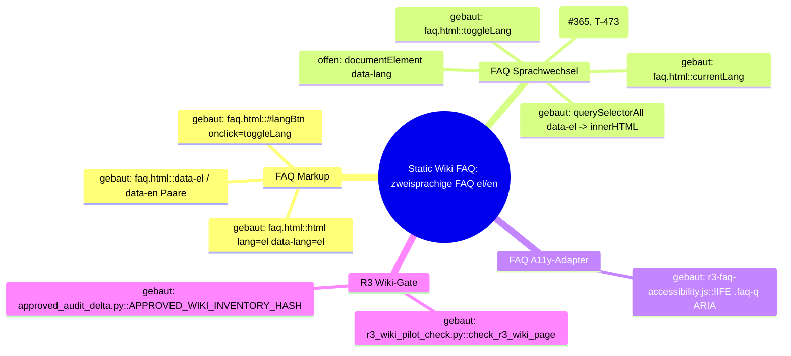

## 7. Gebauter Schritt (#365, T-473)

- **Modul:** FAQ Sprachwechsel.
- **Hop:** `faq.html::toggleLang → document.documentElement.lang` (L1).
- **Aenderung:** `toggleLang` setzt direkt nach dem Umschalten von `currentLang` `document.documentElement.lang = currentLang;`. Kein `data-lang`-Umbau, Wrapper, zweiter Listener, Persistieren oder neues Flag.
- **Dateien, die sich aendern duerfen:** `docs/wiki/faq.html` (nur Inline-`toggleLang`), `scripts/redesign/approved_audit_delta.py` (nur Hash-Eintrag `docs/wiki/faq.html` + Kommentarzeile), ein Regressionstest unter `scripts/redesign/` (Pattern `test_*.py` bzw. `*.browser.cjs`), der nach Toggle `document.documentElement.lang === "en"` und nach zweitem Toggle `"el"` belegt.
- **Unberuehrt:** `docs/assets/redesign-v2/r3-faq-accessibility.js`, alle `data-el`/`data-en`-Paare und FAQ-Inhalte, alle anderen `docs/wiki/*.html`, `scripts/redesign/r0_inventory.py`, `r3_wiki_pilot_check.py`, `apps/**`.

---

# Architecture Map — Pnyx Static Wiki / Responsive FAQ Navigation (T-474)

Scope: T-474, reine Kartierung, kein Fix.
Basis: `agent/claude/T-473` `c4329f694c2b5752299daf85108f2d90e4f9dea3` (enthaelt `origin/main` `2bfda8e`).
Kartiert ist genau ein Nutzerweg: **FAQ-Sprachknopf auf schmalem Viewport finden und bedienen.**
Hop: `docs/wiki/faq.html::nav.pnx2-header/.nav-links/#langBtn → docs/assets/redesign-v2/r3-wiki.css::@media (max-width: 920px) .pnx2-header .nav-links → initialer 390px-Viewport`.
Der Sprachwechsel selbst (`toggleLang`) ist oben (T-472) kartiert und hier nur Endpunkt.

Diagramme: [`map.puml`](map.puml) (`faq-nav-mindmap`, `faq-nav-components`),
[`main-path.puml`](main-path.puml) (`faq-nav-main-path`).

## T-474 / 1. Grundidee

- Das statische Wiki unter `docs/wiki/` ist zweisprachig; der einzige Sprachschalter jeder Seite ist `#langBtn` im Kopf — `docs/wiki/faq.html` Z. 188.
- Die R3-Migration legt eine gemeinsame Wiki-Shell ueber das unveraenderte Legacy-Markup, ohne Inhalt oder Verhalten zu aendern — `docs/assets/redesign-v2/r3-wiki.css` Z. 1–7, `docs/planning/r3/R3_REPORT.md` Z. 89–96.
- Die Shell verspricht, dass der Kopf auf schmalen Breiten nicht abschneidet — `docs/assets/redesign-v2/foundation.css` Z. 366–367 (Kommentar "stack header nav under the brand on narrow widths instead of clipping").
- Ergebnis fuer den Nutzer: auf jedem Viewport den Sprachknopf sehen und antippen.
- Grenze: statisches HTML/CSS, kein Build, kein Server-Zustand; Aenderung an Wiki-HTML ist durch `scripts/redesign/r3_wiki_pilot_check.py` eingefroren.

## T-474 / 2. Spur (Hop-Liste)

Nutzerverb: "auf dem Handy (390px) die FAQ auf Englisch umschalten" — Sprachknopf finden, dann tippen.

| # | Von | Nach | Datum ueber die Kante |
| --- | --- | --- | --- |
| N1 | `faq.html::<nav class="pnx2-header">` (Z. 169) | `faq.html::.nav-logo` (Z. 170), `faq.html::div.nav-links` (Z. 171) | zwei Flex-Kinder des Kopfs |
| N2 | `faq.html::div.nav-links` (Z. 171–189) | 17 Kinder: 4 Links, 1 Trenner-`span` (Z. 176), 11 Links, `#langBtn` (Z. 188) | DOM-Reihenfolge; `#langBtn` ist Kind-Index 16 von 17 (letztes) |
| N3 | `faq.html::<style>` (Z. 38–161) | `nav`, `.nav-links`, `.lang-btn` Basisregeln (Z. 65–73, 79, 89–96, 160) | `.nav-links { flex-wrap: wrap }` (Spezifitaet 0,1,0), inline `@media (max-width: 640px)` nur Schriftgroesse/Padding der Links |
| N4 | `faq.html` Z. 163–165 | `tokens.css` → `foundation.css` → `r3-wiki.css` | spaeter geladen = gewinnt bei gleicher Spezifitaet; `r3-wiki.css` ist die letzte Quelle |
| N5 | `foundation.css::.pnx2-header` (Z. 91–100) | `nav.pnx2-header` | `display: flex`; die 640px-Regeln (Z. 368–394) zielen auf `.pnx2-header-inner`/`.pnx2-nav`, die das Wiki-Markup nicht hat |
| N6 | `r3-wiki.css::@media (max-width: 920px) nav.pnx2-header` (Z. 238–242) | `nav.pnx2-header` | `display: block; padding-inline: 0` → `.nav-links` bekommt eine eigene volle Zeile unter dem Logo |
| N7 | `r3-wiki.css::@media (max-width: 920px) .pnx2-header .nav-links` (Z. 248–256) | `div.nav-links` | `width: 100%; flex-wrap: nowrap; justify-content: flex-start; overflow-x: auto` (Spezifitaet 0,2,0 schlaegt inline 0,1,0) → horizontaler Scrollcontainer |
| N8 | `r3-wiki.css::@media (max-width: 920px) .pnx2-header .nav-links > *` (Z. 258–260) | alle 17 Kinder inkl. `#langBtn` | `flex: 0 0 auto` → keine Schrumpfung; `.lang-btn` zusaetzlich 44px Zielgroesse (Z. 49–61) |
| N9 | `div.nav-links` (Scrollcontainer, `scrollLeft = 0`) | initialer 390px-Viewport | `clientWidth 390`, `scrollWidth 1520`; sichtbar sind 5 von 17 Kindern; `#langBtn` liegt bei x=1460–1504 |
| N10 | `#langBtn` | `faq.html::toggleLang` (Z. 542–550, T-472/T-473) | erst nach horizontalem Scroll oder Fokus erreichbar |

Messbeleg (lokal ausgeliefertes `docs/`, Chromium headless via Playwright, alle Fremd-Requests abgebrochen, kein Live-System):

| Seite / Viewport / Variante | `.nav-links` overflow-x / wrap | client / scrollWidth | `#langBtn` x–right | im Scroller sichtbar | `elementFromPoint` Mitte | Doc-Overflow |
| --- | --- | --- | --- | --- | --- | --- |
| faq 390x844, gebaut | auto / nowrap | 390 / 1520 | 1460–1504 | nein (5/17 Kinder) | `null` | 0 |
| faq 390x844, `r3-wiki.css` deaktiviert | visible / wrap | 342 / 342 | 202–245 | ja (17/17) | `langBtn` | 0 |
| faq 1440x900, gebaut | visible / wrap | 1392 / 1392 | 1373–1416 | ja | `langBtn` | 0 |
| index 390x844, gebaut | auto / nowrap | 390 / 1520 | 1460–1504 | nein | `null` | 0 |
| security 390x844, gebaut | auto / nowrap | 390 / 1520 | 1460–1504 | nein | `null` | 0 |

Zusatz: `#langBtn.focus()` bei 390px setzt `.nav-links.scrollLeft` auf 1130 und bringt den Knopf nach x=330 — Tastatur erreicht ihn, Touch ohne Wischgeste nicht.

## T-474 / 3. Module

| Modul | Eine Aufgabe | Einstieg | Stand |
| --- | --- | --- | --- |
| FAQ Kopf-Markup (`docs/wiki/faq.html`, `<nav>`) | Stellt Logo, 16 Nav-Eintraege und `#langBtn` in fester DOM-Reihenfolge bereit | `faq.html::nav.pnx2-header > .nav-links > #langBtn` | gebaut |
| FAQ Legacy-Kopf-CSS (`docs/wiki/faq.html`, Inline-`<style>`) | Basislayout: wrap-faehiger Flex-Kopf | `faq.html::.nav-links { flex-wrap: wrap }` | gebaut — auf ≤920px durch R3-Shell ueberschrieben |
| R3 Foundation (`docs/assets/redesign-v2/foundation.css`) | Sticky-Kopf, Tokens fuer Zielgroesse/Abstaende | `foundation.css::.pnx2-header` | gebaut (Nachbar; schmale Regeln treffen Wiki-Markup nicht) |
| R3 Wiki-Shell CSS (`docs/assets/redesign-v2/r3-wiki.css`) | Gemeinsame responsive Kopfregeln fuer alle R3-Wiki-Seiten | `r3-wiki.css::@media (max-width: 920px) .pnx2-header .nav-links` | gebaut — erzeugt den Scrollcontainer, in dem `#langBtn` initial ausserhalb liegt |
| FAQ Sprachwechsel (`faq.html::toggleLang`) | Endpunkt der Spur, schaltet el/en | `faq.html::toggleLang` | gebaut (T-473, Z. 545 setzt `documentElement.lang`) |
| R3 Wiki-Gate (`scripts/redesign/r3_wiki_pilot_check.py`) | Friert Wiki-HTML und Media-Query-Menge ein | `r3_wiki_pilot_check.py::check_pilot_preservation` (Z. 240–247 erwartet `@media (max-width: 920px)`) | gebaut (Leitplanke; prueft keine Sichtbarkeit von `#langBtn`) |
| Wiki-Browser-Gate (`scripts/redesign/t420_wiki_facts.browser.cjs`) | Browserpruefung Wiki bei 1440/390px | `t420_wiki_facts.browser.cjs` (Z. 30 Viewports) | gebaut (prueft Doc-Overflow und Nav-Duplikate, nicht Sichtbarkeit des Sprachknopfs) |
| Sichtbarkeitspruefung Sprachknopf auf schmalem Viewport | Belegt `#langBtn` im initialen Viewport | — | offen — kein Symbol in `scripts/redesign/` |

## T-474 / 4. Verdrahtung

- `nav.pnx2-header` → `.nav-links`: `.nav-links` ist zweites Kind des Kopfs; bei ≤920px wird der Kopf `display: block`, also bekommt `.nav-links` die volle Zeilenbreite unter dem Logo.
- `.nav-links` → `#langBtn`: `#langBtn` ist letztes (17.) Kind; die Hauptachse laeuft links→rechts, also liegt es am Ende der Reihe.
- Inline-`<style>` → `r3-wiki.css`: beide setzen `.nav-links`; `r3-wiki.css` wird spaeter geladen und hat hoehere Spezifitaet (0,2,0 gegen 0,1,0), daher gilt `flex-wrap: nowrap` statt `wrap`.
- `r3-wiki.css` 920px-Block → `.nav-links`: `overflow-x: auto` macht `.nav-links` zum Scrollcontainer; `flex: 0 0 auto` der Kinder verhindert Schrumpfen, daher waechst `scrollWidth` auf 1520px.
- Scrollcontainer → Viewport: `scrollLeft` startet bei 0 und `justify-content: flex-start`, also zeigt der initiale Viewport nur die ersten fuenf Kinder; der Ueberhang bleibt im Container, Doc-Overflow bleibt 0.
- `#langBtn` → `toggleLang`: das `onclick` feuert erst, wenn der Knopf nach Scroll oder Fokus unter dem Finger liegt.
- `r3_wiki_pilot_check.py` / `t420_wiki_facts.browser.cjs` → Wiki-Seiten: beide pruefen Struktur bzw. Doc-Overflow; keiner prueft, ob `#langBtn` bei 390px initial sichtbar ist.

## T-474 / 5. Widerspruch und Luecken

- **Ursache ist shared, nicht FAQ-lokal (belegt):** Mit deaktiviertem `r3-wiki.css` wrapt `.nav-links` und `#langBtn` liegt bei x=202 sichtbar. `index.html` und `security.html` zeigen bei 390px dieselben Werte (1460–1504, `scrollWidth 1520`). 14 von 15 Seiten, die `r3-wiki.css` laden, haben dieselbe 17-Kind-Nav mit `#langBtn` als letztem Kind; `zk-voting.html` hat 5 Kinder und keinen `#langBtn`. Die Wirkung trifft also alle 14 zweisprachigen R3-Wiki-Seiten.
- **Widerspruch Shell-Versprechen:** `foundation.css` Z. 366–367 sagt "stack header nav … instead of clipping"; `r3-wiki.css` Z. 248–256 macht fuer das Wiki genau einen horizontal abgeschnittenen Scroller. Beide Zeilen bleiben stehen.
- **Widerspruch Landing-Policy:** `scripts/redesign/test_t384_responsive_nav.py` Z. 141–157 verbietet `overflow-x: auto` auf `.nav-links` als alleinigen Zugang ("use hamburger menu instead") — aber nur fuer `r5-landing-fidelity.css`. `r3-wiki.css` nutzt genau dieses Muster. Die Landing-Regel gilt nicht fuer das Wiki; ein Hamburger ist fuer T-474 ausdruecklich ausgeschlossen.
- **Widerspruch Abnahme:** `docs/planning/r3/R3_REPORT.md` Z. 135–138 meldet bei 360x800 keinen Language-Toggle-Fehler; Playwright-`click()` scrollt Ziele automatisch in Sicht und verdeckt damit die initiale Unsichtbarkeit.
- **Luecke G1:** Kein Gate prueft `#langBtn` im initialen schmalen Viewport (Modul "Sichtbarkeitspruefung", `offen`).
- **Luecke der T-472-Karte:** Abschnitt T-472 fuehrt L1 (`documentElement.lang`) noch als `offen`; seit T-473 ist die Kante gebaut (`faq.html` Z. 545). Nicht Teil von T-474, hier nur vermerkt.
- **Nicht kartiert:** WebKit/iOS-Scrollleistenanzeige, andere Breakpoints zwischen 391 und 920px, Sticky-Verhalten des Kopfs beim Seitenscroll.

## T-474 / 6. Diagrammdateien

- `docs/architecture/MAP.md` (dieser Abschnitt, Mermaid-Mindmap unten)
- `docs/architecture/map.puml` (`faq-nav-mindmap`, `faq-nav-components`)
- `docs/architecture/main-path.puml` (`faq-nav-main-path`)

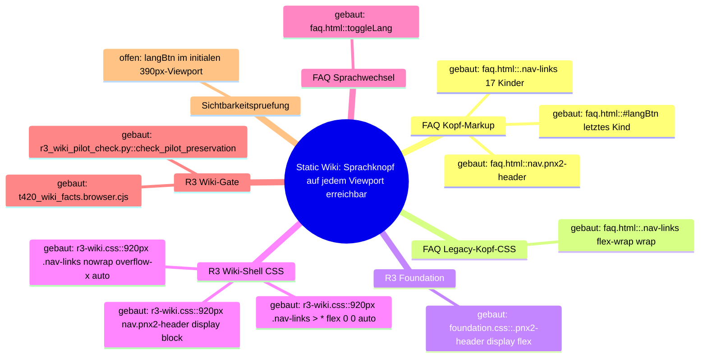

## T-474 / 7. Naechster Schritt (Fixknoten)

- **Modul:** R3 Wiki-Shell CSS.
- **Hop:** `r3-wiki.css::@media (max-width: 920px) .pnx2-header .nav-links > * → .lang-btn` im Scrollcontainer (N8/N9).
- **Aenderung (Vorschlag, Entscheidung bei Sol):** eine Regel im bestehenden 920px-Block, die `.pnx2-header .lang-btn` an die Inline-End-Kante des Scrollers heftet (`position: sticky; right: 0` mit Hintergrund), sodass der Knopf bei `scrollLeft = 0` sichtbar ist, ohne DOM-Reihenfolge, Fokusreihenfolge oder Markup zu aendern. Kein Hamburger, kein zweiter Knopf, kein Wrapper, kein JS, kein `order`-Umstellen, kein Aufheben des Scrollers fuer alle Links.
- **Wirkung:** shared — die Regel wirkt identisch auf alle 14 zweisprachigen R3-Wiki-Seiten; das ist gewollt, weil die Ursache dort liegt. Kein weiterer Umbau der Wiki-Seiten.
- **Dateien, die sich aendern duerfen:** `docs/assets/redesign-v2/r3-wiki.css` (nur der `@media (max-width: 920px)`-Block Z. 237–261), ein Regressionstest unter `scripts/redesign/` (`test_*.py` fuer die CSS-Regel und/oder `*.browser.cjs`, der bei 390x844 ohne Klick/Scroll `#langBtn` innerhalb von `.nav-links`-Rect und `elementFromPoint === #langBtn` belegt, bei 1440x900 unveraendert).
- **Unberuehrt:** `docs/wiki/*.html` (inkl. `faq.html` Markup, Inline-CSS, `toggleLang`), `docs/assets/redesign-v2/foundation.css`, `tokens.css`, `r3-faq-accessibility.js`, `r5-landing-fidelity.css`, `scripts/redesign/r3_wiki_pilot_check.py`, `approved_audit_delta.py`, `r0_inventory.py`, `test_t384_responsive_nav.py`, `apps/**`.
- **Machbarkeitsbeleg (nur im Browser injiziert, keine Datei geaendert):** `@media (max-width:920px){.pnx2-header .lang-btn{position:sticky;right:0}}` per `addStyleTag` → Chromium und WebKit bei 390x844: `#langBtn` x=331–374, `elementFromPoint` = `langBtn`, Doc-Overflow 0; bei 1440x900 unveraendert x=1373–1416. Hintergrund/Abdeckung der letzten Links und Scrollbar-Darstellung sind im Fix-Lauf per Screenshot zu pruefen.
# Architecture Map — EKA-59/EKA-60 Assistant Truth Boundaries

Basis: `agent/claude/T-496 3727266436d2706cf30272a3ab3414635bc633e1` · Task: T-497 · Mapping only, no fix.
Node: API assistant deterministic truth boundary / citizen question to platform-state answer.

## 1. Grundidee

- Ekklesia lets citizens ask the landing assistant about the platform and receive bilingual answers from deterministic rules or a RAG/model fallback (`apps/api/routers/agent.py::ask_agent`).
- Security- and privacy-sensitive facts already use `_canonical_response` before any database lookup or model call, so these answers can be kept independent of mutable KB state (`apps/api/routers/agent.py::_canonical_response`).
- Mobile private keys are stored through Expo SecureStore, which maps to Android Keystore and iOS Keychain (`apps/mobile/src/lib/crypto-native.ts::secureSet/storeKeypair`).
- Web Beta private keys are instead stored as hexadecimal text in browser `localStorage` (`apps/web/src/lib/crypto.ts::storeKeypair`).
- Public Stripe/PayPal intake and links are paused, while the backend acceptance boundary remains separately gated (`docs/community.html`, `apps/api/routers/payments.py::_payment_intake_enabled`).
- Legal recipient, donation classification and public wording remain Gio/accountant decisions; this node may state only the observable technical availability and storage behavior.

## 2. Spur (one user path, opened hops)

| # | From → To | Datum over the edge |
| --- | --- | --- |
| H1 | `POST /api/v1/agent/ask` → `routers/agent.py::ask_agent` | question plus canonical `el`/`en` language |
| H2 | `ask_agent` → `_canonical_response` | question text; deterministic response wins before RAG/model calls |
| H3 | `_canonical_response(private-key question)` → response | current generic “stored only on your device” claim |
| H4 | `apps/web/src/lib/crypto.ts::storeKeypair` → browser `localStorage` | private/public key hex and nullifier hash in Web Beta |
| H5 | `apps/mobile/src/lib/crypto-native.ts::storeKeypair` → Expo SecureStore | mobile private key through Android Keystore/iOS Keychain adapter |
| H6 | `_canonical_response(payment/support question)` → no match → `_build_context`/model | no deterministic paused-state response; model can infer processor guidance |
| H7 | `docs/community.html` + `payments.py::_payment_intake_enabled` → technical availability state | public processor links absent; intake fails closed unless the explicit gate is enabled |

## 3. Module

| Modul | Eine Aufgabe | Einstieg | Stand |
| --- | --- | --- | --- |
| Assistant router | orders safety, canonical truth and generative fallback | `apps/api/routers/agent.py::ask_agent` | gebaut |
| Canonical truth boundary | returns facts that must not drift through a model | `apps/api/routers/agent.py::_canonical_response` | teilweise; private-key answer lacks platform split and payment pause has no branch |
| Web key storage | persists Web Beta voting credentials | `apps/web/src/lib/crypto.ts::storeKeypair` | gebaut; browser `localStorage`, not Keychain/Keystore |
| Mobile key storage | persists mobile voting credentials | `apps/mobile/src/lib/crypto-native.ts::storeKeypair` | gebaut; Expo SecureStore adapter |
| Payment availability | keeps public links/intake disabled pending gates | `docs/community.html`; `apps/api/routers/payments.py::_payment_intake_enabled` | gebaut; paused/fail-closed |
| Canonical regression tests | proves sensitive answers bypass models and stay bilingual | `apps/api/tests/test_agent_training_regression.py` | teilweise; key test is generic, payment pause prompts absent |
| KB catalog | supplies mutable RAG facts after canonical handling | `apps/api/scripts/seed_knowledge_base.py::ENTRIES` | gebaut on T-496; private-key wording is generic, no payment-pause row |

## 4. Verdrahtung

- `ask_agent` runs the safety filter and `_canonical_response` before `_build_context`, Ollama or Claude, so a matched technical-state answer cannot be replaced by generated processor or storage claims.
- The current private-key branch and KB row collapse two implementations into “only on your device”: true at the server boundary, incomplete for Web versus Mobile storage security.
- Web code writes key material to origin-scoped `localStorage`; Mobile code calls Expo SecureStore. Neither path sends the private key to the API in this trace.
- Payment/support questions currently miss the canonical boundary and can reach model generation with fallback KB rows that do not encode the paused state.
- The public community page exposes no Stripe donation URL and marks intake paused; backend capture is separately fail-closed behind `PAYMENTS_INTAKE_GATE` and readiness values.

## 5. Widerspruch und Lücken

**EKA-59 symptom:** the bot answers one generic device-storage story although Web Beta uses browser `localStorage` and Mobile uses SecureStore. References to Keychain/Keystore in generic keywords can overstate the Web path.

**EKA-59 cause:** H3 does not select or disclose the H4/H5 platform split. The same generic wording is duplicated in `ENTRIES`, so the RAG fallback can repeat it.

**EKA-60 symptom:** support/payment questions can reach a model that may direct citizens to Stripe or PayPal even though public links and intake are paused.

**EKA-60 cause:** H6 has no deterministic operational-state branch sourced from H7.

**Content/legal boundary:** the technical answer may say that public processor links/intake are currently unavailable and no payment should be attempted through the assistant. It must not choose the recipient, legal form, tax treatment, donation-versus-consideration classification, refund promise or activation date. Those remain a separate Gio decision template.

**Deployment dependency:** T-496 is the required base if `ENTRIES` is changed. Its first production sync remains data/deploy-gated because exact sync deletes live rows outside the 14-row catalog. This task must not sync or inspect a live database.

## 6. Diagrammdateien

- `docs/architecture/map.puml` — mindmap plus component trace.
- `docs/architecture/main-path.puml` — question-to-answer sequence.
- PlantUML rendering is optional; source files are authoritative.

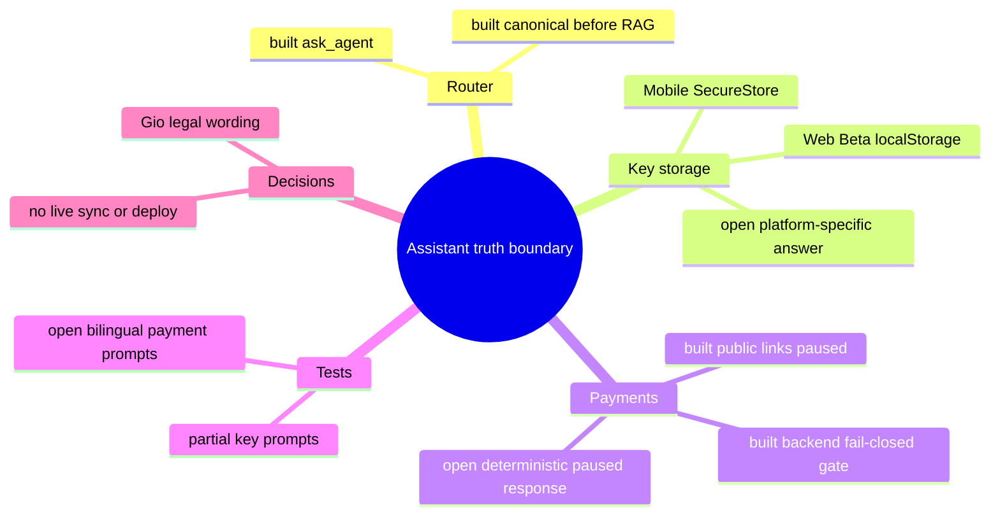

## 7. Nächster Schritt

**One module:** Assistant canonical truth boundary. **One hop:** H2/H3/H6 from `_canonical_response` to a deterministic bilingual answer, grounded by H4/H5/H7.

The implementation may touch only `apps/api/routers/agent.py`, the canonical KB rows in `apps/api/scripts/seed_knowledge_base.py`, and focused assistant/KB tests or the sanitized question fixture. It must prove Web `localStorage` versus Mobile SecureStore, and force payment/support prompts to an unavailable/paused answer before any database or model call.

Unchanged: Web/mobile storage implementation, payment router and gates, public community page, deployment workflow, database schema/live rows, secrets, Stripe/PayPal configuration, legal/content pages, and all activation/deploy behavior.

## 8. Nachher-Zustand (T-498, Codex review #400)

- H6 is built: `_canonical_response` → `_is_payment_intent` → `_payments_paused_response` answers before any KB or model call. Intent counts only when aimed at the platform (donate/pay/contribute to ekklesia, the platform or project; payment links; named processors or IBAN; natural first-person questions such as "Can I donate?"; Greek first-person forms, including clitic order "να σας στηρίξω" and the Latin name `ekklesia(.gr)`). Matching runs on NFC, casefolded, accent-stripped text.
- Bill topics that share vocabulary (sponsors, social-security contributions, pensions, public funding, organ or blood donation, donations to the Church) reach the normal path; they are pinned as no-match regressions.
- Model output guard: Ollama and Claude answers that contain a payment URL or processor domain, a labelled IBAN (`IBAN`/`ΙΒΑΝ`) or an unlabelled IBAN are replaced by the deterministic paused answer.
- Private key: the server creates the key pair once during verification and hands the private key over a single time; it does not store it and cannot recover it later (canonical answer and KB rows).
- **Known limit (accepted, fail-safe):** "εκκλησία" also means "church". A first-person question about supporting or donating to the Church can receive the paused notice instead of a model answer; it never yields a payment instruction.
# Architecture Map — Mobile Bottom-Tab Label Layout (GH-298)

Scope: T-477, Vorbereitung fuer [GH#298](https://github.com/NeaBouli/pnyx/issues/298).
Basis: `origin/main` `2bfda8e40dbd66c1486936f3594d7b232eb7606d` (Branch `agent/claude/T-477`).
Kartiert ist genau ein Hop-Strang: Tab-Route → Label/Icon → React-Navigation-BottomTabBar →
Safe Area → Textmessung → Touch-Target, auf Android bei `fontScale` 1.0 / 1.3 / 1.8.
Andere Mobile-Screens, Stack-Navigation, Identity, Voting, Web und API sind nicht kartiert.

Hinweis zur Dateibasis: Auf `2bfda8e` existierten die drei Artefakte noch nicht; sie liegen
bisher nur auf den unmerged Branches `agent/claude/T-472`/`T-474` (FAQ-Karte). Diese Datei
wurde auf der Basis neu angelegt; beim Zusammenfuehren ist sie additiv neben die FAQ-Karte
zu stellen, nicht zu ersetzen.

Bibliotheksquellen gelesen aus den Registry-Tarballs der im Lockfile gepinnten Versionen
(`apps/mobile/package-lock.json`): `@react-navigation/bottom-tabs@7.18.17`,
`@react-navigation/elements@2.9.39`, `react-native-safe-area-context@5.6.2`.
Keine Installation im Repo, kein Lockfile-Diff.

Diagramme: [`map.puml`](map.puml) (Mindmap + Komponenten),
[`main-path.puml`](main-path.puml) (Sequenz).

## 1. Grundidee

- Ekklesia.gr ist eine Plattform fuer digitale direkte Demokratie; die Android-App ist ein Client davon — `CLAUDE.md` (Produkt, Stack `apps/mobile`).
- Die Hauptnavigation der App sind fuenf Bottom-Tabs: Home, Bills, Trending, MP, Tickets — `apps/mobile/src/navigation/index.tsx::TabParams` Z. 48–54, `TabNavigator` Z. 83–87.
- Jeder Tab zeigt ein Emoji-Icon und ein eigenes griechisch/englisches Kurzlabel — `index.tsx::TAB_ICONS` Z. 59–61, `screenOptions.tabBarLabel` Z. 73–77.
- Layout, Hoehe, Safe-Area-Padding und Touch-Flaeche der Leiste besitzt React Navigation (`BottomTabBar`, `BottomTabItem`), nicht die App — `bottom-tabs/src/views/BottomTabBar.tsx::getTabBarHeight`, `BottomTabItem.tsx::styles`.
- Barrierefreiheit: Systemschrift muss skalieren duerfen; Abschalten ist nicht akzeptiert — GH#298 "Acceptance", Punkt 1.
- Grenze: Kein Eingriff in Routen, Identity, Voting, Auth oder Dependencies — GH#298 "Acceptance", letzter Punkt; Brief T-477 `constraints`.

## 2. Spur (Hop-Liste)

Nutzerverb: "einen Haupt-Tab bei Android-Systemschrift 180 % erkennen und antippen".

| # | Von | Nach | Datum ueber die Kante |
| --- | --- | --- | --- |
| H1 | `apps/mobile/App.tsx::App` (Z. 29–37) | `react-native-safe-area-context::SafeAreaProvider` (aeussere) → `SafeAreaView edges={["top"]}` → innere `SafeAreaProvider` | Fensterframe; nur Top-Inset wird aussen verbraucht, innerer Provider misst Insets relativ zum bereits sicheren Rahmen (Kommentar Z. 32, Test `src/lib/app-safe-area.test.ts`) |
| H2 | `App.tsx` | `src/navigation/index.tsx::Navigation` → `Stack.Screen name="Tabs"` (Z. 128) → `TabNavigator` | keine Props |
| H3 | `index.tsx::TabNavigator` `screenOptions({ route })` (Z. 66–81) | `bottom-tabs::BottomTabView` (descriptors) | je Route: `tabBarStyle {backgroundColor, borderTopColor}` (kein `height`), `tabBarActive/InactiveTintColor`, `tabBarLabel` = Funktion, `tabBarIcon` = Funktion; **nicht gesetzt**: `tabBarAllowFontScaling`, `tabBarItemStyle`, `tabBarLabelStyle`, `tabBarIconStyle`, `tabBarLabelPosition`, `tabBarVariant` (→ Default `'uikit'`) |
| H4 | `BottomTabView.tsx::renderTabBar` (Z. 231–246) | `SafeAreaInsetsContext.Consumer` → `BottomTabBar` | `insets {top,right,bottom,left}` aus dem **inneren** Provider aus H1 |
| H5 | `BottomTabBar.tsx::getTabBarHeight` (Z. 122–151) | Animated.View-Stil (Z. 376–381) | `height = 49 (TABBAR_HEIGHT_UIKIT) + insets.bottom`; `paddingBottom = insets.bottom`; `paddingHorizontal = max(insets.left, insets.right)`. Eine numerische `tabBarStyle.height` ersetzt den Wert **ohne** Inset-Addition (Z. 136–141), das `paddingBottom` bleibt. `fontScale` geht nicht ein |
| H6 | `BottomTabBar.tsx::shouldUseHorizontalLabels` (Z. 51–89) / `isCompact` (Z. 91–120) | `BottomTabItem horizontal/compact` | Android, Breite < 768: `horizontal = width > height` (Landscape/Multi-Window → Label neben Icon); `compact` nur iOS → auf Android immer `false` |
| H7 | `BottomTabBar.tsx` `styles.bottomContent {flexDirection:'row'}` + `styles.bottomItem {flex:1}` (Z. 509–523) | `BottomTabItem` | Fuenf gleich breite Spalten: `(frameWidth − 2·max(insets.left,right)) / 5` |
| H8 | `BottomTabItem.tsx` `button({... style: [styles.tab, tabVerticalUiKit]})` (Z. 346–383) | `@react-navigation/elements::PlatformPressable` | Touch-Target = gesamte Spalte × Barhoehe (49 dp ohne Inset); `padding: 5`, `justifyContent:'flex-start'`, `flexDirection:'column'`; `role:'tab'`, `aria-selected: focused`, `accessibilityLargeContentTitle` (nur iOS wirksam) |
| H9 | `BottomTabItem.tsx::renderIcon` (Z. 289–312) | `TabBarIcon.tsx` (Z. 44–110) | Wrapper fest `31 × 28` (`ICON_SIZE_WIDE × ICON_SIZE_TALL`), Icon zweimal absolut uebereinander (aktiv/inaktiv per Opacity); `renderIcon({focused, size: 25, color})` |
| H10 | `TabBarIcon` `renderIcon(...)` | `index.tsx::tabBarIcon` (Z. 78–80) | App ignoriert `size`, `color`, `focused`; rendert `<Text style={{fontSize: 18}}>`-Emoji, `allowFontScaling` Default `true` → Glyphe waechst mit `fontScale`, Wrapper nicht |
| H11 | `BottomTabItem.tsx::renderLabel` (Z. 242–287) | `index.tsx::tabBarLabel` (Z. 73–77) | Weil `label` eine Funktion ist, laeuft der Zweig `typeof label !== 'string'` (Z. 252–259): `{focused, color, position, children}`. `allowFontScaling`, `styles.labelBeneath`, `labelStyle` der Bibliothek werden **nicht** angewandt. App ignoriert `position` und `focused` |
| H12 | `index.tsx::tabBarLabel` | `react-native::Text` → Yoga/Android `TextView`-Messung | `fontSize: 10`, `fontWeight: "700"`, kein `numberOfLines`, kein `maxFontSizeMultiplier`, kein `adjustsFontSizeToFit`; Texte "εκκλησία", "Ψ/φορία", "Trending", "Κόμματα", "POLIS"; `color` = `tabBarActiveTintColor` / `tabBarInactiveTintColor` |
| H13 | Android `Configuration.fontScale` | Yoga-Messung von H10/H12 | effektive Schriftgroesse: Label 10 → 13 → 18 sp; Emoji 18 → 23.4 → 32.4 sp (bei 1.0/1.3/1.8). Die Barhoehe aus H5 bleibt 49 dp |
| H14 | `apps/mobile/app.json` `expo.orientation: "portrait"`, `android.edgeToEdgeEnabled: false` | Android-Fenster (CNG-Prebuild, `android/` nicht versioniert ausser `app/build.gradle`) | Portrait-Sperre, Fenster endet laut Config ueber der Systemnavigationsleiste → `insets.bottom` ist erwartbar 0; tatsaechlicher Wert unter Expo SDK 54 / RN 0.81 **nicht am Geraet belegt** |

## 3. Module

| Modul | Eine Aufgabe | Einstieg | Stand |
| --- | --- | --- | --- |
| App-Shell Safe Area | Top-Inset verbrauchen, Navigation einen relativen Rahmen geben | `apps/mobile/App.tsx::App` | `gebaut` |
| Tab-Navigation (App) | Fuenf Routen, Farben, Label- und Icon-Renderer deklarieren | `apps/mobile/src/navigation/index.tsx::TabNavigator` | `gebaut` |
| Tab-Label-Renderer (App) | Kurzlabel je Route als `Text` rendern | `index.tsx::screenOptions.tabBarLabel` | `teilweise` — rendert, reagiert aber weder auf `fontScale` noch auf `position` noch auf verfuegbare Breite (GH#298) |
| Tab-Icon-Renderer (App) | Emoji je Route als `Text` rendern | `index.tsx::screenOptions.tabBarIcon`, `TAB_ICONS` | `teilweise` — ignoriert `size`/`color`/`focused`; Glyphe skaliert ueber den festen 28-dp-Wrapper hinaus |
| Theme | Tab-Farben liefern | `apps/mobile/src/theme.ts::colors.tabBarActive/tabBarInactive/tabBarBg` | `gebaut` |
| BottomTabBar (React Navigation, Vendor) | Barhoehe, Inset-Padding, Spaltenaufteilung, Label-Position | `@react-navigation/bottom-tabs/src/views/BottomTabBar.tsx::BottomTabBar`, `getTabBarHeight` | `gebaut` (Vendor, nicht aendern) |
| BottomTabItem / TabBarIcon (Vendor) | Pressable je Tab, Icon-Wrapper, Label-Slot | `BottomTabItem.tsx::BottomTabItem`, `TabBarIcon.tsx::TabBarIcon` | `gebaut` (Vendor, nicht aendern) |
| SafeAreaProviderCompat (Vendor) | Insets/Frame fuer BottomTabView bereitstellen | `@react-navigation/elements/src/SafeAreaProviderCompat.tsx` | `gebaut` (Vendor; bei vorhandenem Provider nur `View`-Durchreiche, Z. 37–53) |
| Native Font-Scaling | `fontScale` auf `Text` anwenden | `react-native::Text` (`allowFontScaling` Default `true`) | `gebaut` (Plattform) |
| Tab-Layout-Tests | Tab-Optionen gegen Regression pruefen | — | `offen` — kein Test unter `apps/mobile/src/**` referenziert `navigation/index.tsx` |
| Landscape-Layout | Querformat der Tab-Leiste | `app.json::expo.orientation` | `aufgeschoben` — App ist auf `portrait` gesperrt; nur Multi-Window/Freeform kann `width > height` erzeugen |

## 4. Verdrahtung

- `App` → `SafeAreaView(edges top)` → innerer `SafeAreaProvider`: der Bottom-Inset wird nicht aussen verbraucht, sondern von der Tab-Leiste selbst ueber `insets.bottom` getragen.
- `Navigation` → `TabNavigator`: der Stack mountet die Tab-Leiste als Screen `Tabs`.
- `TabNavigator.screenOptions` → `BottomTabView`: die App liefert nur Farben und zwei Render-Funktionen, keine Masse.
- `BottomTabView.renderTabBar` → `BottomTabBar`: Insets aus dem inneren Provider fliessen als Prop.
- `getTabBarHeight` → `BottomTabBar`-Stil: feste 49 dp plus Bottom-Inset, unabhaengig von der Schriftgroesse.
- `shouldUseHorizontalLabels` → `BottomTabItem.horizontal`: auf Android nur bei `width > height` oder Tablet-Breite.
- `bottomItem {flex:1}` → `BottomTabItem`: fuenf gleiche Spalten, keine inhaltsabhaengige Breite.
- `BottomTabItem.button` → `PlatformPressable`: das Touch-Target ist die Spalte, nicht der Text.
- `renderIcon` → `TabBarIcon` → `tabBarIcon`: fester 31×28-Wrapper, App-Emoji misst frei.
- `renderLabel` → `tabBarLabel`: Funktionszweig umgeht Bibliotheksstil und `tabBarAllowFontScaling`.
- `tabBarLabel` → `Text`: Messung durch Yoga mit `fontScale`, ohne Zeilen- oder Groessenobergrenze.

## 5. Widerspruch und Luecken

### Symptom (GH#298, Samsung S10 / Android 12, fontScale 1.8)

- Labels werden unten vertikal abgeschnitten.
- Einige Labels ueberschreiten die Spaltenbreite.
- Bei 1.0 passt alles.

### Ursache (je Hop)

1. **Vertikal — H5 × H9/H10 × H12/H13.** Das vertikale Budget pro Item ist fest:
   49 dp − 2·5 dp Padding = 39 dp. Der Icon-Wrapper belegt davon 28 dp, fuer das Label bleiben
   ~11 dp. Die Label-Zeile braucht bei 1.0 (10 sp) etwa 12–14 dp inkl. Android-`includeFontPadding`.
   Das passt also knapp, weil der untere Padding-Streifen und die fehlende Clip-Grenze
   (`overflow` Default sichtbar) auffangen. Bei 1.3 sind es ~15–18 dp, bei 1.8 ~21–25 dp pro Zeile.
   Die Leiste liegt am unteren Fensterrand; was unter `height` hinausragt, liegt ausserhalb des
   Fensters bzw. unter der Systemleiste und wird dort abgeschnitten. Die dp-Zahlen sind aus den
   Stilkonstanten abgeleitet, nicht gemessen. Die exakte Zeilenhoehe liefert erst die
   Emulator-Messung (T-477 hat keine Geraete-/Emulatorlaeufe).
2. **Emoji — H10 × H9.** Das Emoji waechst von 18 auf 32.4 sp. Der Wrapper bleibt bei 28 dp und
   ist absolut zentriert. Die Glyphe laeuft oben und unten ueber den Wrapper und ueberlagert den
   Label-Bereich. Das verschaerft (1) und liegt nicht an einem Bibliotheksdefekt: Die App ignoriert
   den von der Bibliothek gelieferten `size` (25).
3. **Horizontal / Mehrzeiligkeit — H7 × H12.** Spaltenbreite ist `frameWidth/5`. Bei 360 dp
   (S10-Klasse) sind das 72 dp minus 10 dp Padding = 62 dp Inhalt. Bei 320 dp bleiben 54 dp.
   Bei 18 sp bold braucht "εκκλησία" bzw. "Trending" grob 75–90 dp (Schaetzung, nicht gemessen).
   Ohne `numberOfLines` bricht Android um oder zerschneidet ein einzelnes Wort. Jede zusaetzliche
   Zeile vergroessert (1). Horizontal und vertikal sind **eine** Kopplung, nicht zwei Bugs.
4. **Kein Bibliotheksfehler als Ursache.** React Navigation verhaelt sich wie dokumentiert: fixe
   UIKit-Hoehe, `flex:1`-Spalten. Die App hat Funktion-Label und Funktion-Icon gewaehlt und damit
   die Bibliotheks-Label-Stile (H11) verlassen, ohne selbst Mass-Grenzen zu setzen. Die Ursache sitzt
   in `index.tsx::screenOptions` (Hops H10–H12), nicht im Vendor-Code und nicht in `App.tsx`.

### Besitzgrenze

- **App (`src/navigation/index.tsx::TabNavigator.screenOptions`)** besitzt: Label-/Icon-Inhalt,
  deren `Text`-Props (`numberOfLines`, `maxFontSizeMultiplier`, `adjustsFontSizeToFit`,
  `allowFontScaling`), Nutzung von `size`/`color`/`position`/`focused`, sowie die offiziellen
  Optionen `tabBarStyle`, `tabBarItemStyle`, `tabBarLabelStyle`, `tabBarIconStyle`,
  `tabBarLabelPosition`.
- **React Navigation (Vendor)** besitzt: `getTabBarHeight`, Inset-Padding, Spaltenaufteilung,
  Pressable/Touch-Target, `role`/`aria-selected`. Nicht patchen, nicht forken, kein `tabBar`-Custom-Renderer.
- **Safe Area (`App.tsx` + innerer Provider)** besitzt: Top-Inset aussen, Bottom-Inset an die
  Tab-Leiste. Ein Fix darf keinen eigenen Bottom-Inset addieren, solange er `height` nicht selbst setzt.
- **Plattform** besitzt: `fontScale`, Emoji-Font-Metrik, Gesture-/Three-Button-Navigation.

### Bewertung der Pflichtaspekte

| Aspekt | Befund | Folgerung fuer einen Fix |
| --- | --- | --- |
| Font-Scaling statt Abschaltung | Label skaliert heute unbegrenzt; `allowFontScaling={false}` auf dem Label waere Abschaltung und verletzt GH#298 | Label muss skalieren. Zulaessig zur Diskussion: Obergrenze per `maxFontSizeMultiplier` (Label waechst bis zur Grenze mit). Die Grenze ist eine A11y-Entscheidung fuer Sol/Gio, nicht fuer den Worker. |
| Vertikale Bar-/Item-Hoehe | 49 dp fix, `fontScale`-blind (H5) | Entweder das Label-Budget in 39 dp halten (Label-Grenze + kleineres Icon) oder `tabBarStyle.height` setzen. Letzteres muss `insets.bottom` selbst einrechnen (H5, Z. 136–141 addieren keinen Inset). Das dupliziert Bibliothekslogik und ist nur mit Messbeleg zulaessig. |
| Horizontale Fuenf-Spalten-Breite | 62 dp @360, 54 dp @320 (H7) | Die Breite ist nicht verhandelbar ohne Routen-/Designaenderung. Das Label muss in die Spalte passen: einzeilig und kuerzer/kleiner. Keine sechste/scrollende Leiste. |
| Ein-/Mehrzeiligkeit | kein `numberOfLines` → Umbruch → mehr Hoehe | Einzeilig (`numberOfLines={1}`) koppelt Horizontal von Vertikal ab. Ob abgeschnitten (`…`) oder per `adjustsFontSizeToFit` verkleinert wird, ist am Geraet mit Screenshots zu entscheiden. |
| Emoji-Metrik | 18 sp skaliert auf 32.4 sp im 28-dp-Wrapper (H9/H10) | Das Icon ist Grafik, kein Lesetext. `size` der Bibliothek verwenden und Icon-Skalierung begrenzen/abschalten ist vertretbar und keine Label-Abschaltung. Die Emoji-Hoehe variiert je Font (Samsung vs. Noto), deshalb Geraetebeleg. |
| Gesture-/Three-Button-Inset | `edgeToEdgeEnabled:false`, innerer Provider → `insets.bottom` erwartbar 0; Leiste endet ueber der Systemleiste | Ein Fix darf `insets.bottom` nicht doppelt addieren und den Inner-Provider in `App.tsx` nicht aendern. Beide Navigationsmodi am Emulator pruefen, weil RN 0.81/SDK 54 Edge-to-Edge-Verhalten nicht lokal belegt ist. |
| Active-State | Icon ist aktiv/inaktiv identisch (ignoriert `color`/`focused`, H10); Aktivzustand ist **nur** die Label-Farbe (#2563eb vs #94a3b8) plus `aria-selected` | Das Label darf nie ausgeblendet (`tabBarShowLabel:false`) oder unsichtbar abgeschnitten werden, sonst verschwindet die sichtbare Aktivanzeige. |
| Touch-Target | Spalte × 49 dp = 72×49 dp @360, 64×49 dp @320 → ≥ 48 dp | Bleibt durch Vendor erhalten, solange `height` nicht unter 48 dp faellt und kein `tabBarButton` ersetzt wird. |
| Landscape | App ist `portrait` gesperrt (H14); Android-Split-Screen/Freeform kann trotzdem `width > height` liefern → `horizontal` Label-Zweig (H6), `position: 'beside-icon'` wird von der App ignoriert | Landscape-Abnahme = Multi-Window/Freeform am Emulator, nicht Rotation. |

### Widerspruch

- GH#298 fordert "narrow portrait plus landscape layouts". `apps/mobile/app.json` setzt
  `"orientation": "portrait"`. Echtes Querformat existiert nur ueber Android-Multi-Window/Freeform.
  Beide Aussagen bleiben stehen; die Abnahme muss sagen, welcher Fall geprueft wurde.
- Kommentar in `BottomTabItem.tsx` Z. 184–187: Font-Scaling im Tab-Label wird bewusst nur auf
  iOS ≥ 13 abgeschaltet (Large Content Viewer). Android hat diesen Ersatz nicht. Deshalb ist
  "wie die Bibliothek abschalten" auf Android keine zulaessige Vorlage.

### Luecken

- Keine gemessenen Zeilenhoehen/Breiten bei 1.0/1.3/1.8. Alle dp-Zahlen oben sind aus
  Stilkonstanten abgeleitet. Die Messung verlangt Emulator/Geraet, das ist ausserhalb T-477.
- Tatsaechliches `insets.bottom` unter Expo SDK 54 bei Gesture- vs. Three-Button-Navigation ist nicht belegt.
- Kein Test deckt `navigation/index.tsx` ab.
- Historische Kandidaten (`tab-layout.ts` + Tests in `pnyx-close-release-gates-20260906`) wurden erst
  nach dieser Karte gesichtet und sind **nicht** uebernommen; Bewertung siehe `.fleet/reports/T-477.md`.

## 6. Diagrammdateien

- `docs/architecture/map.puml` — Mindmap `gh298-tab-label-mindmap` + Komponenten `gh298-tab-label-components`
- `docs/architecture/main-path.puml` — Sequenz `gh298-tab-label-main-path`

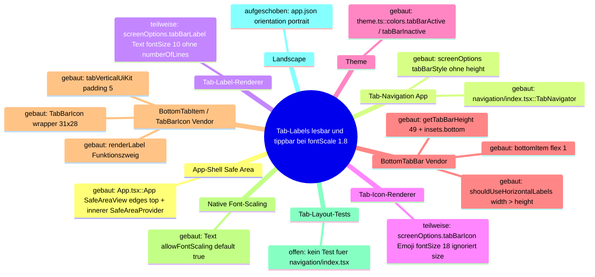

Rendern (kein `plantuml` im `PATH`, lokales JAR):

```bash
java -jar ~/.local/share/plantuml/plantuml.jar -tsvg -o /tmp/t477-svg docs/architecture/map.puml docs/architecture/main-path.puml
```

## 7. Naechster Schritt

**Modul:** Tab-Navigation (App), Knoten "Tab-Label-/Icon-Renderer".
**Hop:** H10–H12 — `index.tsx::TabNavigator.screenOptions.tabBarLabel/tabBarIcon` → `react-native::Text`-Messung.
Der Fix wird in der App-Konfiguration getragen, nicht in React Navigation.

Ein spaeterer enger Fix darf aendern:

- `apps/mobile/src/navigation/index.tsx` — nur `TabNavigator.screenOptions` (Z. 66–81) und
  `TAB_ICONS` (Z. 59–61). Erlaubte Mittel sind die bestehenden Optionen und Props:
  - `Text`-Props am Label: `numberOfLines`, `maxFontSizeMultiplier`, ggf. `adjustsFontSizeToFit`/`minimumFontScale`
  - Icon: den gelieferten `size` verwenden, Icon-Skalierung begrenzen
  - bei Messbeleg `tabBarStyle.height`/`tabBarItemStyle` inklusive `insets.bottom`
  - Nutzung von `position` fuer den Multi-Window-Zweig
  Routen, Titel, Stack, Linking und `Navigation` bleiben unveraendert.

Fokussierte Tests duerfen anlegen/aendern:

- genau eine neue Testdatei `apps/mobile/src/navigation/tab-bar-options.test.ts`, nach dem Muster
  von `src/lib/app-safe-area.test.ts` (transpilieren, `react-native`/Navigator stubben, gerenderte
  Optionen pruefen). Zu pruefen:
  - Label bleibt skalierbar (`allowFontScaling !== false`)
  - Label einzeilig
  - Icon nutzt `size`
  - fuenf Routen und Aktivfarbe unveraendert
  - kein `tabBarShowLabel:false`
  Yoga-Messung ist in Vitest nicht moeglich; der Test beweist die Konfiguration, nicht das Nicht-Clipping.

Unberuehrt bleiben:

- `apps/mobile/App.tsx` und `src/lib/app-safe-area.test.ts`
- `src/theme.ts`
- alle `src/screens/**`
- `app.json`/`app.config.js` (keine Orientierungs- oder Edge-to-Edge-Aenderung)
- `package.json`/`package-lock.json`
- `node_modules/@react-navigation/**`: kein `patch-package`, kein eigener `tabBar`-Renderer
- Identity/Voting/Auth

Keine neue Layout-Abstraktion: Ein `tab-layout.ts`-Modul haette genau einen Verbraucher
(`TabNavigator`) und ist nach Karte nicht zulaessig, solange kein zweiter echter Verbraucher existiert.

Abnahme (vor jedem Release, nicht in T-477):

- `npm test` und `npm run typecheck` in `apps/mobile`, plus der neue Fokustest.
- Android-Emulator oder Geraet, jeweils `adb shell settings put system font_scale` 1.0 / 1.3 / 1.8
  (Originalwert danach wiederherstellen):
  - Portrait 360 dp und 320 dp breit (schmal)
  - Split-Screen/Freeform mit `width > height` als Landscape-Ersatz
  - Gesture- **und** Three-Button-Navigation
- Pro Kombination Screenshot. Pruefen: alle fuenf Labels vollstaendig lesbar oder bewusst mit
  `…` gekuerzt, kein Ueberlappen mit Systemleiste/Emoji, Aktivtab farblich erkennbar,
  jede Spalte ≥ 48 dp hoch und antippbar (Tap wechselt Tab).
- Native Build (`expo run:android` / EAS preview) vor Screenshot-Abnahme; keine Store-Aktion.
# Architecture Map — EKA-64 MOD-WEB Static Crawler Anchor Delivery

Basis: `main 4cc11930f4be82ba2d012def487fb34abca9da26` · Task: T-504 · Mapping only, no fix.
Node: MOD-WEB static crawler anchor delivery; hop `/ai.txt|/llms-full.txt` → proxy matcher exclusion for dotted paths → Next static-file lookup / standalone public bundle → HTTP status and content type.
The EKA-18 map above stays unchanged; EKA-64 is appended as separate diagrams in the same files.

## 1. Grundidee

- `ekklesia.gr` is served by the Next.js standalone container `ekklesia-web` behind Traefik (`infra/docker/docker-compose.prod.yml::services.web`, Host rule only, no path rewriting).
- The static GitHub-Pages content under `docs/` is copied into `public/` at image build, including the AI anchor `llms.txt` (`apps/web/Dockerfile.prod`, `COPY docs/robots.txt docs/sitemap.xml docs/llms.txt ./public/`).
- The proxy (`apps/web/src/proxy.ts`) only handles non-dotted paths; `config.matcher` excludes every path containing a dot.
- The audit (`docs/community-audits/EKA_PNYX_AI_Readiness_Audit_2026-09-15.md` l.140–153, EKA-64) observed `/ai.txt` and `/llms-full.txt` answering `307 → landing` and attributed it to the proxy. Historical live evidence only.

## 2. Spur (one trace, hops opened)

| # | From → To | Datum over the edge |
| --- | --- | --- |
| A1 | crawler → Next server | `GET /ai.txt`, `/llms-full.txt` (missing) and `/llms.txt` (existing) |
| A2 | `apps/web/next.config.mjs::nextConfig.redirects` | only source `/download/ekklesia-latest.apk` ⇒ no match; `headers()` adds policy headers only |
| A3 | `apps/web/src/proxy.ts::config.matcher` `/((?!api\|_next\|_vercel\|.*\\..*).*)` | dotted path ⇒ `proxy()` and `intlMiddleware` are **not** invoked |
| A4 | Next static-file lookup in `/app/public` (runner `COPY --from=builder /app/public ./public`) | `/llms.txt` hit ⇒ `200`, `text/plain; charset=UTF-8` |
| A5 | static miss → App Router `src/app/[locale]/page.tsx` | single dotted segment matches dynamic `[locale]` with `locale="ai.txt"`; build lists `ƒ /[locale]` (dynamic, no `generateStaticParams`, no `dynamicParams=false`); `[locale]/layout.tsx::LocaleLayout` does not validate the locale |
| A6 | `[locale]/page.tsx::HomePage` → response | T-504 base: `redirect("https://ekklesia.gr")` ⇒ `307`. **T-505:** `hasLocale(routing.locales, locale)` fails ⇒ `notFound()` ⇒ `404`; `el`/`en` keep `redirect("https://ekklesia.gr")` ⇒ `307` |

Local build evidence (2026-09-28, no production request): Dockerfile.prod-equivalent staging in `/tmp` (apps/web + the same `docs/` COPY list into `public/`), `npm ci --ignore-scripts`, `next build` (Next 16.3.4, Turbopack, exit 0), standalone packaging as in the runner stage, `node server.js` on `127.0.0.1:3504`, `curl --max-redirs 0`:

| Path | Status | Location | Content-Type |
| --- | --- | --- | --- |
| `/llms.txt` | 200 | — | `text/plain; charset=UTF-8` (5470 B) |
| `/robots.txt` | 200 | — | `text/plain; charset=UTF-8` |
| `/ai.txt` | 307 | `https://ekklesia.gr` | `text/html; charset=utf-8` |
| `/llms-full.txt` | 307 | `https://ekklesia.gr` | `text/html; charset=utf-8` |
| `/xyz.txt` | 307 | `https://ekklesia.gr` | `text/html; charset=utf-8` |
| `/el` | 307 | `https://ekklesia.gr` | `text/html; charset=utf-8` (intended) |
| `/definitely-missing` | 307 | `/el/definitely-missing` | (proxy/next-intl locale prefix, different hop) |
| `/x/ai.txt`, `/el/ai.txt`, `/.well-known/llms.txt` | 404 | — | `text/html; charset=utf-8` |

The absolute `location: https://ekklesia.gr` without a locale prefix identifies A6 as the source; a proxy/next-intl redirect would have produced `/el/…` (see `/definitely-missing`).

## 3. Module

| Modul | Eine Aufgabe | Einstieg | Stand |
| --- | --- | --- | --- |
| Next config | build-time redirects/headers | `apps/web/next.config.mjs::nextConfig` | gebaut (not on the failure path) |
| Proxy | locale/static redirects for non-dotted paths | `apps/web/src/proxy.ts::proxy`, `config.matcher` | gebaut (skipped for dotted paths — audit attribution wrong) |
| Public bundle | ship `docs/` static files incl. `llms.txt` | `apps/web/Dockerfile.prod` COPY list | gebaut; `ai.txt`/`llms-full.txt` offen (do not exist in `docs/`) |
| Locale page | `/el`, `/en` → landing | `apps/web/src/app/[locale]/page.tsx::HomePage` | gebaut; T-505 invalid-locale `notFound()` guard (EKA-64 fixed at A5→A6) |
| Locale layout | i18n shell | `apps/web/src/app/[locale]/layout.tsx::LocaleLayout` | gebaut; no `hasLocale`/`notFound()` guard |
| Regression test | pin routing behaviour | `apps/web/src/proxy.test.ts`, `apps/web/src/app/[locale]/page.test.ts` | gebaut (T-350 redirects; T-505 invalid locale ⇒ `notFound`, `el`/`en` ⇒ redirect) |
| Traefik edge | Host routing, HTTP→HTTPS | `infra/docker/docker-compose.prod.yml` labels, `infra/hetzner/traefik/traefik.yml` | gebaut (no path logic; neighbour) |

## 4. Verdrahtung

- A1→A2: request passes `next.config.mjs` redirects without a match.
- A2→A3: proxy matcher excludes the dotted path, so `proxy()` never runs.
- A3→A4: static lookup serves `public/llms.txt` with 200 text/plain.
- A3→A5: static miss for `ai.txt`/`llms-full.txt` falls through to the dynamic `[locale]` route.
- A5→A6: `HomePage` rejects locales outside `routing.locales` with `notFound()` (404, T-505); only `el`/`en` reach `redirect("https://ekklesia.gr")` (307).

## 5. Widerspruch und Lücken

- **Widerspruch:** audit says "the Next proxy rewrites unknown paths". Source + local build show the proxy is skipped (A3); the 307 comes from `[locale]/page.tsx::HomePage` (A6).
- Symptom reproduced at base `4cc1193`; **T-505 closes it in source** at A5→A6 (local standalone build: `/ai.txt`, `/llms-full.txt`, `/xyz.txt` ⇒ 404; `/llms.txt`, `/robots.txt` ⇒ 200 text/plain; `/el`, `/en` ⇒ 307 `https://ekklesia.gr`; `/` ⇒ 200). Not deployed; live unverified.
- At base `4cc1193`, scope was wider than the two anchors: every single-segment dotted miss (`/xyz.txt`, `/foo.json`, …) got the same 307. T-505 makes this whole page-level class return 404.
- No `not-found.tsx` at app root or `[locale]`; a 404 would use Next's default page (status is the signal).
- Brief mentions EKA-13 map nodes; none exist in `docs/architecture/` at base `4cc1193`. Nothing to preserve beyond EKA-18.
- Not verified: production Traefik/CDN layers and live behaviour (no production requests by brief).

## 6. Diagrammdateien

- `docs/architecture/map.puml` — diagrams 3 (EKA-64 mindmap) and 4 (EKA-64 components)
- `docs/architecture/main-path.puml` — diagram 2 (EKA-64 sequence: `/llms.txt` hit vs `/ai.txt` miss vs two-segment 404)
- Rendered 2026-09-28 with `java -jar ~/.local/share/plantuml/plantuml.jar -tsvg -o /tmp/t504-render …` (exit 0, 6 SVGs, no syntax errors; SVGs not committed).

```mermaid
mindmap
  root((MOD-WEB: crawler anchor request to HTTP status))
    Next config
      gebaut: next.config.mjs::redirects only legacy APK
    Proxy
      gebaut: proxy.ts::config.matcher excludes dotted paths
    Public bundle
      gebaut: Dockerfile.prod COPY llms.txt robots.txt sitemap.xml
      offen: ai.txt llms-full.txt
    Locale page
      gebaut: [locale]/page.tsx::HomePage redirect ekklesia.gr
      gebaut: [locale]/page.tsx::HomePage hasLocale notFound guard (T-505)
    Regression test
      gebaut: proxy.test.ts
      gebaut: [locale]/page.test.ts invalid locale 404 (T-505)
```

## 7. Nächster Schritt (engste Reparaturgrenze)

**Modul:** Locale page. **Hop:** A5→A6 (`apps/web/src/app/[locale]/page.tsx::HomePage`). **Status: implemented in T-505** (page guard + colocated `page.test.ts`; layout-wide guard not chosen).

**Implemented repair contract (T-505):**
1. In `HomePage`, read `params.locale`; if it is not in `routing.locales` (`hasLocale` from `next-intl`), call `notFound()`; otherwise keep `redirect("https://ekklesia.gr")` unchanged.
   The broader alternative—moving the guard to `[locale]/layout.tsx::LocaleLayout` so it also covers `/<dotted>/bills`—remains a separate decision and was not selected.
2. Focused vitest next to the page: `locale="ai.txt"`/`"llms-full.txt"` ⇒ `notFound` called, `redirect` not called; `el`/`en` ⇒ redirect to `https://ekklesia.gr` unchanged.
3. Standalone probe as in §2: `/ai.txt`, `/llms-full.txt` ⇒ 404; `/llms.txt`, `/robots.txt` ⇒ 200 text/plain; `/el`, `/en` ⇒ 307 unchanged; `/` ⇒ 200.

**Unberührt bleiben:** `apps/web/src/proxy.ts`, `apps/web/next.config.mjs`, `apps/web/Dockerfile.prod`, `docs/llms.txt`, `docs/robots.txt`, `docs/sitemap.xml`, public assets, Traefik, packages/lockfiles, workflows. Creating real `ai.txt`/`llms-full.txt` is a separate content decision (out of scope).
# Architecture Map — EKA-29 Metro 0.83.8 / image-size Exit

Basis: `origin/main 4cc11930f4be82ba2d012def487fb34abca9da26` · Task: T-506 · mapped before implementation, updated after proof.
Node: Mobile/Representative Build Toolchain / Expo-to-Metro asset-dimension hop.

## 1. Grundidee

- Ekklesia provides citizen and representative mobile clients built with Expo SDK 54 (`apps/mobile/package.json`, `apps/representative/package.json`).
- Expo's build toolchain reaches Metro through `@expo/metro`; the installed Expo 54 line pins `@expo/metro@54.2.0` and `metro@0.83.3` (`package-lock.json`).
- Metro reads image dimensions while bundling assets; 0.83.3 delegates that parsing to `image-size@^1.0.2` (`package-lock.json`).
- Before this change (pre-migration), both apps redirected that dependency to the audited local `image-size@1.2.2-pnyx.0` backport and ran its focused regression test. After T-506 both apps install the Metro 0.83.8 family through overrides, `image-size` is no longer in either graph, and the backport redirect is removed (`package.json`, `vendor/image-size/metro-image-parser-regression.test.mjs`).
- Four open Dependabot alerts remain because the package identity/version is still within the affected ranges (alerts 95–98).
- Metro 0.83.8 is an official 0.83.x security backport that vendors bounded image parsing and removes the `image-size` dependency (`react/metro` commit `809c36d897ef`).
- Boundary: dependency manifests/locks and existing build/security checks only; no application, native configuration, API, release, deployment or production change.

## 2. Spur

| # | From → To | Datum over the edge |
| --- | --- | --- |
| H1 | `apps/{mobile,representative}/package.json::dependencies.expo` → `package-lock.json::expo` | Expo range `~54.0.37` resolves 54.0.37 |
| H2 | `package-lock.json::@expo/metro@54.2.0` → `package-lock.json::metro` | exact Metro version `0.83.3` |
| H3 | `package-lock.json::metro@0.83.3` → root `image-size` override | `image-size@^1.0.2` is redirected to local `1.2.2-pnyx.0` |
| H4 | `package.json::test` → `vendor/image-size/security-regression.test.mjs` | focused malformed-image corpus runs against installed `image-size` |
| H5 | official `metro@0.83.8` → `metro/src/lib/imageSize` | Metro-owned parser replaces H3 and removes the external dependency |
| H6 | Expo bundle/build commands → installed Metro family | the app build consumes one coherent Metro patch line |

## 3. Module

| Modul | Eine Aufgabe | Einstieg | Stand |
| --- | --- | --- | --- |
| Mobile manifest/lock | pin the citizen app build graph | `apps/mobile/package.json` | gebaut; coherent Metro 0.83.8 family |
| Representative manifest/lock | pin the representative app build graph | `apps/representative/package.json` | gebaut; coherent Metro 0.83.8 family |
| Expo Metro adapter | select Metro for Expo SDK 54 | `node_modules/@expo/metro` lock entry | gebaut; exact 0.83.3 declaration overridden with tested 0.83.8 family |
| Metro asset parser | derive bundled image dimensions | `metro/src/Assets.js` | gebaut; internal bounded parser on 0.83.8 |
| Local image-size backport | former bounded parser | `vendor/image-size` | quarantäne; retained in repo but absent from both installed graphs |
| Security regression | reject malformed image loops | `vendor/image-size/metro-image-parser-regression.test.mjs` | gebaut; 26 parser/absence/validity checks |

## 4. Verdrahtung

- Expo 54 → `@expo/metro@54.2.0`: the application dependency graph installs Expo's Metro adapter.
- `@expo/metro` → Metro 0.83.3: the adapter uses an exact dependency, so a lock refresh alone cannot advance it.
- Metro 0.83.3 → local image-size backport: npm override preserves Metro's API while replacing the vulnerable registry artifact.
- Metro 0.83.8 → internal image parser: official patch removes `image-size`; all Metro family packages must stay on the same patch version.
- App scripts → security/build checks: tests, typecheck, the Expo dependency check and an Android production export (`expo export --platform android`, Hermes bundle) validate the replacement graph. No Gradle release build or signed AAB was run (`.fleet/reports/T-506.md`).

## 5. Widerspruch und Lücken

- Official Metro 0.83.8 is semver-compatible within 0.83.x, but Expo 54 has not republished `@expo/metro` with the new exact pin; compatibility must be established by coherent overrides plus both app build/bundle suites.
- Overriding only `metro` is invalid because Metro packages exact-pin each other. The patch must move the full installed Metro family together or stop.
- Removing the local backport is safe only if `npm ls image-size` proves no remaining consumer in either workspace.
- The existing regression script targets the external package API. If that package disappears, equivalent coverage must exercise Metro's parser; silently deleting coverage is forbidden.
- TypeScript 7 remains blocked: latest `typescript-eslint@8.70.1` officially peers only with TypeScript `<6.1.0`.
- `PYSEC-2026-1325` remains blocked: all `ecdsa` versions are affected and upstream states no planned fix; `arweave-python-client@1.0.19` still requires `python-jose`, whose default dependency still requires `ecdsa`.

## 6. Diagrammdateien

- `docs/architecture/map.puml`
- `docs/architecture/main-path.puml`
- Rendered: `docs/architecture/map.svg`, `docs/architecture/map_001.svg`, `docs/architecture/main-path.svg`

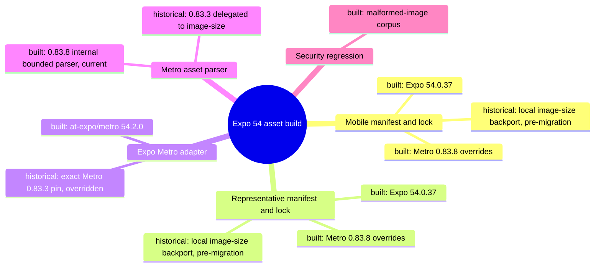

## 7. Nächster Schritt

**Modul:** Mobile/Representative Build Toolchain. **Hop:** H2–H6.

**Ergebnis:** Both manifests and locks now force one coherent Metro 0.83.8 family; `image-size` is absent from both installed graphs. The 26-case Metro parser regression, both workspace suites/typechecks, Expo dependency checks, Android production exports, npm audits/signatures and the independent Security Diff Scan all passed.

**Offen:** Expo 54 still declares exact Metro 0.83.3, three unused `@expo/metro` shims point at files removed in 0.83.8, and a signed Gradle/AAB, iOS bundle, HMR and device runtime were not exercised. These are explicit compatibility limits, not hidden gates.

**Nächster Knoten:** retire stale backport documentation only after merge closes alerts 95–98. Application source, native configuration, vendor implementation, API, CI, deploy and production remain untouched.
# Architecture Map — EKA-63 MOD-22 Canonical Citizen Answers

Basis: `origin/main 4cc11930f4be82ba2d012def487fb34abca9da26` · Task: T-507 · Mapping only, no product fix.
Node: MOD-22 Hybrid Agent / deterministic canonical-answer boundary.

The accepted EKA-18 map above stays unchanged. EKA-63 is appended as separate diagrams in the same files.

## 1. Grundidee

- Ekklesia.gr lets Greek citizens inspect and vote on real parliamentary and municipal matters and includes an Ollama-powered citizen assistant (`README.md::What is Ekklesia?`, `README.md::Features`).
- `POST /api/v1/agent/ask` answers citizen questions through a safety filter, deterministic canonical answers, then lower-trust RAG/model generation (`apps/api/routers/agent.py::ask_agent`).
- Canonical answers exist for facts that must not drift: the helper returns a bilingual answer, a `knowledge_base` topic and the standard disclaimer without querying the database or either model (`agent.py::_canonical_response`).
- EKA-63 records four missing canonical topics: data deletion, ZK/Semaphore, representative verification and result visibility (`docs/community-audits/EKA_PNYX_AI_Readiness_Audit_2026-09-15.md::EKA-63`).
- System boundary of this node: request classification and deterministic response construction inside `routers/agent.py`, plus focused tests. It does not change the underlying identity, ZK, representative or result-visibility behavior.

## 2. Spur (one trace, hops opened)

| # | From → To | Datum over the edge |
| --- | --- | --- |
| A1 | `apps/api/main.py::app.include_router(agent.router)` → `apps/api/routers/agent.py::ask_agent` | `POST /api/v1/agent/ask` with validated `AskRequest(question, lang)` |
| A2 | `ask_agent` → `_safety_response` | raw citizen question plus canonical `el`/`en`; unsafe requests short-circuit |
| A3 | `ask_agent` → `_canonical_response` | safe question plus language |
| A4 | `_canonical_response` → topic match branches | lower-cased/normalized question; existing exact/substring matchers cover eight topics but none of the four EKA-63 topics |
| A5 | matched branch → nested `resp` → `_with_disclaimer` | bilingual fixed answer, stable topic id, `model=knowledge-base`, empty external-model dependency |
| A6 | no match → `_build_context` → `answer_citizen_question` / `_claude_answer` | the same four questions currently fall through to database-backed RAG and probabilistic model output |
| A7 | deterministic response → HTTP caller | JSON `{question, answer, model, sources, lang}` |

Opened fact neighbours that constrain A5 content but are not changed by this node:

| Topic | Repository truth opened for the answer contract |
| --- | --- |
| Data deletion/revocation | `apps/api/routers/identity.py::revoke_identity` marks the matching identity `REVOKED`; no mobile/web caller for `/identity/revoke` exists at this base. `docs/wiki/delete-account.html` describes uninstall/reverification and contains broader wording that is not a runtime guarantee. |
| ZK/Semaphore | `apps/api/routers/zk.py` gates Semaphore by explicit flags/scope allowlists and public Parliament scope/status; `README.md::Features` and `docs/wiki/zk-voting.html` describe the guarded rollout and group-size-five Arweave publication. |
| Representative verification | `apps/api/routers/representative.py::verify_representative` requires an unused, unexpired admin invite plus ADA verification via Diavgeia, then issues a 24-hour token; demo handling is a separate test path. |
| Results lifecycle | `apps/api/routers/voting.py::get_results` is the Web/Mobile results contract: default-hidden `ACTIVE` returns zeroed counts with `results_hidden=True`; `WINDOW_24H`, `PARLIAMENT_VOTED` and `OPEN_END` are visible before aggregation. `apps/api/services/bill_visibility.py::is_public_bill` separately excludes non-public bills. |

## 3. Module

| Modul | Eine Aufgabe | Einstieg | Stand |
| --- | --- | --- | --- |
| API composition | registers the agent route | `apps/api/main.py::app.include_router(agent.router)` | gebaut |
| MOD-22 Hybrid Agent | validates and routes citizen questions | `apps/api/routers/agent.py::ask_agent` | gebaut |
| Safety short-circuit | rejects manipulation requests | `agent.py::_safety_response` | gebaut |
| Canonical answer classifier | returns deterministic bilingual facts | `agent.py::_canonical_response` | teilweise: eight topics built; four EKA-63 topics open |
| RAG/model fallback | handles questions without a canonical branch | `agent.py::_build_context`, `answer_citizen_question`, `_claude_answer` | gebaut; wrong boundary for EKA-63 facts |
| Canonical regression tests | pin classification, facts, source topic and model bypass | `apps/api/tests/test_agent_guardrails.py` | teilweise: existing topics covered; EKA-63 matrix open |
| Identity/ZK/Representative/Visibility domains | authoritative behavior referenced by answer text | symbols listed above | gebaut; direct fact neighbours, unchanged |

## 4. Verdrahtung

- FastAPI composition → agent router: `main.py` exposes the router at `/api/v1/agent`.
- `/ask` → safety filter: harmful instructions stop before any knowledge or model path.
- `/ask` → canonical classifier: known safety/privacy/platform questions return a deterministic `knowledge-base` response.
- Canonical miss → RAG/models: a `None` return triggers DB context retrieval and Ollama/Claude, so missing EKA-63 matchers are the causal hop.
- Canonical hit → caller: the fixed bilingual answer and stable source topic return before DB/model calls.
- Domain source → answer contract: response wording must stay no stronger than the opened runtime symbol; documentation alone cannot upgrade a runtime fact.

## 5. Widerspruch und Lücken

**Symptom:** all four EKA-63 questions can be improvised by a model even though they concern security, identity or publication boundaries that must not drift.

**Ursache:** A4 has no matcher/response branches for those topics. A6 is therefore reached even when a deterministic repository fact exists.

**Source → sink:** citizen question → `ask_agent` → `_canonical_response` returns `None` → lower-trust KB/bill context and model generation → citizen-visible answer.

**Security invariant:** canonical security/platform facts bypass database retrieval and both model providers; answers cite a stable topic, keep the standard disclaimer and make no stronger claim than current source proves.

**Widersprüche / offene Grenzen:**

- Data deletion is not equivalent to identity revocation: `revoke_identity` changes key status but does not implement a general deletion transaction. No client caller exists. The canonical answer must state current mechanics and must not make GDPR/legal-compliance claims.
- ZK is guarded, not universally enabled: answer text must preserve explicit scope/status gates and must not expose operational allowlist/config values.
- Representative verification is ADA plus an admin-issued invite; ADA alone is insufficient. Demo identifiers must not be taught as a citizen path.
- Results visibility wording must follow `bill_visibility.py`; it must not invent result counts, live state or EKA-65/minimum-k behavior.
- Existing keyword matching uses broad substring tests. New matchers need positive EL/EN cases and nearby negative controls so generic words such as `results`, `delete` or `representative` do not swallow ordinary bill questions.

## 6. Diagrammdateien

- `docs/architecture/map.puml` — appended EKA-63 mindmap and component diagram
- `docs/architecture/main-path.puml` — appended EKA-63 sequence diagram

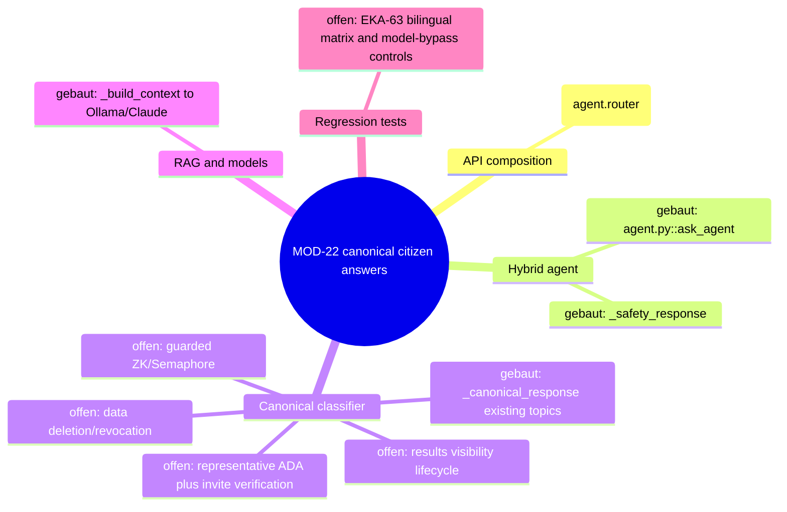

## 7. Nächster Schritt (engste Reparaturgrenze)

**Modul:** MOD-22 Hybrid Agent. **Hop:** A4→A5 (`_canonical_response` topic classification and deterministic response).

**Späterer Implementierungsvertrag:** change only `apps/api/routers/agent.py` and one focused test file (prefer `apps/api/tests/test_agent_guardrails.py`, or one new `test_agent_eka63_canonicals.py` if isolation is clearer). Add four narrowly matched bilingual canonical topics, grounded in the opened source symbols. Tests must prove EL/EN response facts, stable topic/model/lang/disclaimer shape, nearby negative questions still fall through, and `ask_agent` returns each canonical without DB, Ollama or Claude calls. Run focused agent/security tests, then the affected API suite and `git diff --check`.

**Unberührt bleiben:** identity/revoke behavior, ZK flags/allowlists/verifier, representative invites/tokens/Diavgeia integration, result visibility/aggregation, public docs, KB seed data, prompt builder, model providers, dependencies, configuration, workflows, production and all other EKA findings (especially EKA-21/KDF and EKA-65).
# Architecture Map — EKA-53 Public DeepL Usage Route Boundary

Basis: proven `main` / rollback `4cc11930f4be82ba2d012def487fb34abca9da26` · Task: T-511 · Mapping only, no route change.
Node: Public API / DeepL usage route ownership.

The EKA-18 map above stays unchanged. EKA-53 is appended as a separate node.

## 1. Grundidee

- Ekklesia.gr exposes operational transparency data to citizens on the public community page (`README.md::What is Ekklesia?`, `docs/community.html::fetchDeeplUsage`).
- The community page displays the configured DeepL account's aggregate character count and limit; it does not expose the provider credential (`docs/community.html::fetchDeeplUsage`, `apps/api/routers/admin.py::deepl_usage`).
- The API handler is deliberately anonymous but is registered below the `/api/v1/admin` prefix, while sibling public status contracts live below `/api/v1/public` (`apps/api/routers/admin.py::router/deepl_usage`, `apps/api/routers/public_api.py::router`).
- The dashboard has six additional direct or proxied consumers of the same anonymous contract, and two maintained documents name the current URL.
- EKA-53 is a namespace/ownership defect, not evidence of credential disclosure: future reviewers cannot distinguish this public exception from a missing admin guard (`docs/community-audits/EKA_PNYX_Content_Coherence_Audit_2026-09-15.md::EKA-53`).
- Boundary: move the one read-only contract to the public router and migrate its First-Party consumers. Translation calls, provider configuration, admin authorization generally, dashboard session policy, production and deployment remain outside this node.

## 2. Spur (one built trace, hops opened)

| # | From → To | Datum over the edge |
| --- | --- | --- |
| D1 | `docs/community.html::fetchDeeplUsage` → `GET /api/v1/admin/deepl/usage` | anonymous browser request every page load / 60 seconds |
| D2 | `apps/api/main.py::app.include_router(admin.router)` → `apps/api/routers/admin.py::router` | mounts prefix `/api/v1/admin` |
| D3 | `admin.py::router` → `admin.py::deepl_usage` | route match `/deepl/usage`; uniquely has no `Depends(verify_admin)` |
| D4 | `admin.py::deepl_usage` → DeepL `GET /v2/usage` | server-side configured credential in `Authorization`; never returned |
| D5 | DeepL response → `deepl_usage` → community DOM | `available`, `character_count`, `character_limit`; provider errors collapse to zero/unavailable |

Opened direct neighbours that must migrate with D1: `apps/dashboard/src/lib/api.ts::fetchDeepLUsage`, dashboard overview, AI, system and settings pages (six call sites total), plus `docs/INTEGRATION-ANSWERS.md` and `docs/ekklesia_project_handover.md`. `docs/planning/r0/*` and the audit are historical inventories/evidence, not runtime consumers.

## 3. Module

| Modul | Eine Aufgabe | Einstieg | Stand |
| --- | --- | --- | --- |
| Community transparency client | renders aggregate DeepL usage publicly | `docs/community.html::fetchDeeplUsage` | gebaut; points at wrong namespace |
| Dashboard usage consumers | render the same aggregate on authenticated dashboard views | six call sites under `apps/dashboard/src` | gebaut; points at wrong namespace |
| Admin API router | owns privileged MOD-15 operations | `apps/api/routers/admin.py::router` | gebaut; public `deepl_usage` is quarantäne in this module |
| Public API router | owns anonymous public/status contracts | `apps/api/routers/public_api.py::router` | gebaut; DeepL usage contract is offen here |
| DeepL usage provider | returns account aggregate counts to the server | `GET https://api-free.deepl.com/v2/usage` | gebaut (external, read-only) |
| Route contract tests | pin public path, response shape and removal of anonymous admin path | — | offen |
| Maintained endpoint docs | describe First-Party API contracts | `docs/INTEGRATION-ANSWERS.md`, `docs/ekklesia_project_handover.md` | gebaut; stale path |

## 4. Verdrahtung

- Community page → admin-prefixed route: an anonymous browser fetch requests aggregate usage.
- `main.py` → admin router: FastAPI mounts the handler below `/api/v1/admin` solely because of its containing module.
- Admin router → `deepl_usage`: unlike neighbouring admin handlers, this endpoint intentionally omits `verify_admin`.
- `deepl_usage` → DeepL: the server supplies its configured credential and reads aggregate account usage; clients never receive the credential or provider body beyond the three-field projection.
- Handler → clients: success and fail-closed/unavailable responses share the established `{available, character_count, character_limit}` shape.
- Dashboard proxy → API: some authenticated dashboard clients forward the same path through a generic server-side proxy; changing only the final path segment from `admin/...` to `public/...` preserves dashboard session policy.

## 5. Widerspruch und Lücken

**Symptom:** `/api/v1/admin/deepl/usage` is anonymously callable even though every adjacent operation in the Admin router is privileged, so automated and human reviews repeatedly read it as a missing authorization check.

**Ursache:** D2/D3 bind a public transparency contract to the Admin router. The path is inherited from module placement rather than from its intended audience.

**Sicherheitsinvariante:** the public response contains only `available`, `character_count` and `character_limit`; the provider credential stays server-side, provider failures reveal no body or exception, and no write endpoint is introduced.

**Compatibility invariant:** every First-Party consumer switches atomically to `/api/v1/public/deepl/usage`; the anonymous `/api/v1/admin/deepl/usage` route must no longer exist. Keeping a public compatibility alias under `/admin` would preserve the exact ambiguity EKA-53 records and would not close the finding.

**Lücken / Grenzen:**

- No focused route test currently proves response projection, missing-key behavior, provider-error behavior, or absence of the old admin URL.
- The generic dashboard proxy attaches its admin Bearer header to all forwarded paths. It may continue to proxy the public path for authenticated dashboard pages; redesigning proxy authorization is a separate node.
- `services/ollama_service.py::deepl_available/deepl_translate` are separate runtime consumers of the provider and do not call this route; moving or refactoring them would add an unrelated hop.
- Historical R0 inventories and audit evidence must keep the observed old URL. They are not product documentation to rewrite.
- No live call is required for implementation tests: use a synthetic configured key and mocked `httpx` transport only.

## 6. Diagrammdateien

- `docs/architecture/map.puml` (EKA-53 mindmap + component diagram appended)
- `docs/architecture/main-path.puml` (EKA-53 built request trace appended)
- Rendered SVGs: `docs/architecture/map_002.svg`, `docs/architecture/map_003.svg`, `docs/architecture/main-path_001.svg` (the command also regenerated the preceding EKA-18 SVGs from the same multi-diagram sources).
- Rendered with `/Users/gio/.local/bin/plantuml -Playout=smetana -tsvg`.

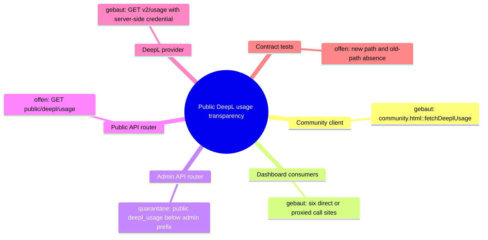

## 7. Nächster Schritt (engste Reparaturgrenze)

**Modul:** Public API / DeepL usage route ownership. **Hops:** D1–D5.

**Fix contract (separate worker run):**

1. Move the established handler from `apps/api/routers/admin.py` to `apps/api/routers/public_api.py` as `GET /api/v1/public/deepl/usage`; preserve response shape, timeout, read-only provider call and fail-closed error behavior. Do not create a wrapper or public alias under `/admin`.
2. Update exactly the First-Party runtime consumers found on the trace: `docs/community.html`, `apps/dashboard/src/lib/api.ts`, dashboard overview/AI/system/settings pages. Proxy-based callers may use `/api/proxy/public/deepl/usage`; direct callers use `/api/v1/public/deepl/usage`.
3. Update the two maintained endpoint references. Leave audit/R0/generated historical evidence unchanged.
4. Add focused API tests with a synthetic key and mocked provider covering: configured success projection, missing key, provider failure, new public route without admin auth, and old admin route returning 404. Add a static First-Party search assertion or equivalent focused regression so no runtime caller retains the old path.
5. Run the focused API test, affected API regression slice, dashboard typecheck/build, and a static docs/client search. No real provider request, credential, production, deploy or live check.

**Unberührt bleiben:** translation/service logic, other Admin/Public routes, dashboard proxy access policy, dependencies/lockfiles, env/config values, audit and R0 evidence, databases, secrets, provider state, production and deployment.
