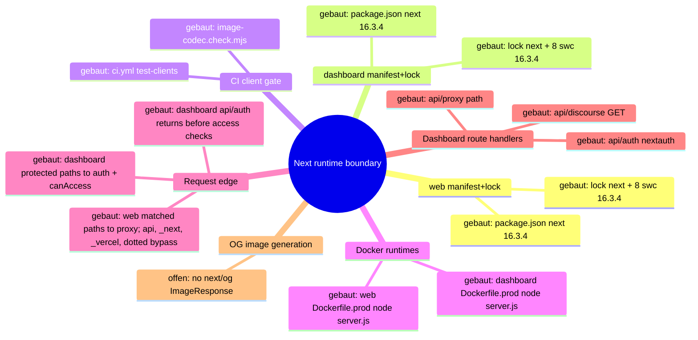
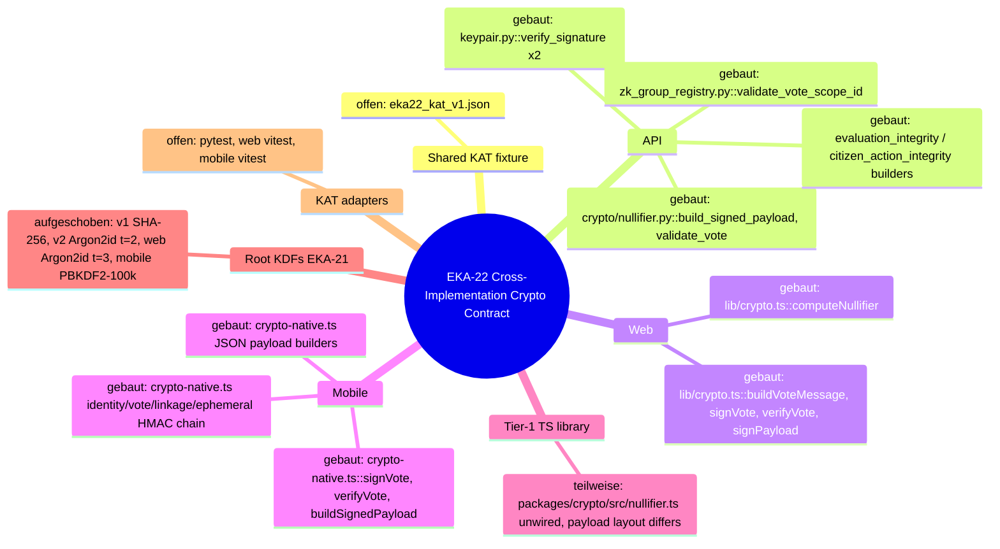

# Architecture Map — Next Runtime Dependency Boundary (T-485)

Scope: `apps/web` + `apps/dashboard` Next.js runtimes against
GHSA-vcvr-r3jv-pc5j (`next` >=16.2.0 <16.3.6, patched 16.3.6; RCE needs Node.js
`next/og` `ImageResponse` rendering attacker-controlled SVG content/attributes/styles).
Base: `origin/main` 49e449a3bc9af1000e9d111fba9b9da2e27d673c. Read-only run: no
package, lock, source or config change. Existing maps (`EKKLESIA_V2_MINIMA.md`,
`FEDERATION.md`) stay untouched.

## 1. Grundidee

- Ekklesia.gr is a digital direct-democracy platform for Greek citizens (`apps/web/src/app/[locale]/layout.tsx::metadata.openGraph.description`).
- Citizens use the public web runtime (`apps/web`, port 3000) for bills, VAA, results (`apps/web/src/app/[locale]/**/page.tsx`).
- Operators use the auth-gated admin dashboard (`apps/dashboard`, port 3001) (`apps/dashboard/src/proxy.ts::proxy`, `apps/dashboard/package.json::scripts.start`).
- Both are standalone Next builds served by `node server.js` in Docker (`apps/{web,dashboard}/next.config.*::output`, `apps/{web,dashboard}/Dockerfile.prod::CMD`).
- Boundary of this map: the `next` package version as it flows from manifest to running route handlers, plus the advisory's `next/og` sink.

## 2. Spur (opened hops)

1. `apps/web/package.json::dependencies.next` = `16.3.4` (exact) → `apps/web/package-lock.json::packages["node_modules/next"]` = 16.3.4, `engines.node >=20.9.0`.
2. `apps/dashboard/package.json::dependencies.next` = `16.3.4` (exact) → `apps/dashboard/package-lock.json::packages["node_modules/next"]` = 16.3.4.
3. Lock `node_modules/next` → 8 platform `node_modules/@next/swc-*` entries, each 16.3.4 (both locks); `sharp` 0.35.4 via `overrides`.
4. Lock → `.github/workflows/ci.yml::test-clients` (`npm ci` → `image-codec.check.mjs` → lint → typecheck → [web: vitest] → `npm run build`).
5. Lock → `apps/web/Dockerfile.prod` (`npm ci` with repo `.npmrc`, docs/ copied into `public/`, `npm run build`) → runner `node server.js` (context `../../`, `infra/docker/docker-compose.prod.yml::web`).
6. Lock → `apps/dashboard/Dockerfile.prod` (`npm ci --ignore-scripts`, `npm run build`) → runner `node server.js` (context `../../apps/dashboard`, `docker-compose.prod.yml::dashboard`).
7. `server.js` → the web proxy matcher excludes `/api`, `_next`, `_vercel`, and dotted paths; matched page requests enter `apps/web/src/proxy.ts::proxy` (redirects/rewrites + next-intl) → `apps/web/src/app/[locale]/*/page.tsx` (9 pages, no route handlers).
8. `server.js` → the dashboard matcher excludes `_next/static`, `_next/image`, and `favicon.ico`; matched protected pages and non-auth APIs enter `apps/dashboard/src/proxy.ts::proxy` (session gate, then role check) → `(dashboard)/*/page.tsx` (23), `api/discourse/route.ts::GET` (JSON), and `api/proxy/[...path]/route.ts` (JSON, SUPER_ADMIN). `/api/auth/*` is matched but returns before the user and `canAccess` checks to reach `api/auth/[...nextauth]/route.ts::{GET,POST}`.
9. Side-hop `request-controlled value → next/og ImageResponse SVG` — **offen / nicht verdrahtet** (evidence below).

### Sink evidence (all `git grep` on 49e449a, excluding lockfiles)

| Pattern | Scope | Hits |
| --- | --- | --- |
| `next/og`, `ImageResponse`, `new ImageResponse`, `@vercel/og` | whole repo | 0 |
| `satori`, `resvg`, `generateImageMetadata` | apps/web, apps/dashboard | 0 |
| `export const runtime` (Node vs Edge) | apps/web, apps/dashboard | 0 → all routes default Node.js runtime |
| `opengraph-image.*`, `twitter-image.*`, `icon.*`, `apple-icon.*` files | apps/web, apps/dashboard | 0 (only `public/manifest.json`) |
| `route.ts` handlers | both | 3, all dashboard, none returns images |
| `node_modules/@vercel/og`, `satori`, `@resvg/*` in locks | both locks | 0 (next's og bundle only inside `next/dist/compiled`) |

Image neighbours: `openGraph` in web layout is static text, no `images`; `next/image` in
`NavHeader.tsx`/`sso-verify/page.tsx` uses the image optimizer, not `next/og`; inline
`<svg>` literals in NavHeader/sso-verify/login are static JSX.

## 3. Module

| Modul | Eine Aufgabe | Einstieg | Stand |
| --- | --- | --- | --- |
| web manifest+lock | pin `next` for public web | `apps/web/package.json::dependencies.next` | gebaut (16.3.4, affected) |
| dashboard manifest+lock | pin `next` for admin dashboard | `apps/dashboard/package.json::dependencies.next` | gebaut (16.3.4, affected) |
| CI client gate | install + verify + build both runtimes | `.github/workflows/ci.yml::test-clients` | gebaut |
| image-codec check | assert optimizer + sharp ⊂ next's sharp range | `apps/{web,dashboard}/image-codec.check.mjs` | gebaut |
| web Docker runtime | build standalone, serve on 3000 | `apps/web/Dockerfile.prod::CMD` | gebaut |
| dashboard Docker runtime | build standalone, serve on 3001 | `apps/dashboard/Dockerfile.prod::CMD` | gebaut |
| web request edge | locale/static redirects | `apps/web/src/proxy.ts::proxy` | gebaut |
| dashboard request edge | auth + RBAC gate | `apps/dashboard/src/proxy.ts::proxy` | gebaut |
| dashboard route handlers | auth, discourse JSON, API proxy JSON | `apps/dashboard/src/app/api/**/route.ts` | gebaut |
| OG image generation | `next/og` `ImageResponse` | — | offen (no symbol) |

## 4. Verdrahtung

- `package.json::next` → lock `node_modules/next`: exact pin, lock matches 16.3.4 in both apps.
- lock `next` → `@next/swc-*`: 8 platform binaries pinned to the same 16.3.4; must move together.
- lock → CI `npm ci` / `npm run build`: CI builds both runtimes from their own lock.
- lock → `Dockerfile.prod` `npm ci`: prod image installs the same lock; web keeps install scripts per `.npmrc`, dashboard passes `--ignore-scripts`.
- `Dockerfile.prod` → `node server.js`: standalone server, Node 22.13.0-alpine.
- `server.js` → web `proxy.ts`: only matcher-selected requests enter it; `/api`, `_next`, `_vercel`, and dotted paths bypass the proxy.
- `server.js` → dashboard `proxy.ts`: matcher-selected requests enter it, but `/api/auth/*` returns before the protected user and `canAccess` checks; protected pages and the other API paths continue through those checks.
- proxy or matcher bypass → pages/route handlers: no handler or page imports `next/og`.

## 5. Widerspruch und Lücken

- (a) Versionally affected: both runtimes resolve `next` 16.3.4 ∈ [16.2.0, 16.3.6).
- (b) Exploit path not evidenced: 0 `next/og`/`ImageResponse` call sites, no metadata image files, no SVG-rendering handler. The vulnerable code ships in `next/dist/compiled` but is unreachable without an importer.
- (c) Hygiene upgrade still justified: all routes run Node.js runtime by default, so any future `ImageResponse` with request data would hit the vulnerable sink directly.
- Attacker preconditions (all missing today): a Node-runtime route/metadata file importing `next/og`; request-controlled input reaching SVG content, attributes or styles in the JSX tree; reachability without auth (web) or with an operator session (dashboard).
- Gap: install-script parity differs (web `npm ci` + `.npmrc`, dashboard `npm ci --ignore-scripts`); not changed here.
- Gap: `image-codec.check.mjs` asserts `sharp` 0.35.4 satisfies `next.optionalDependencies.sharp`; 16.3.6 range not verified in this run (no install).
- Not checked: npm registry metadata for 16.3.6, live/runtime state, builds.

## 6. Diagramme

- `docs/architecture/map.puml` (mindmap + component)
- `docs/architecture/main-path.puml` (sequence of the built path)



## 7. Nächster Schritt (single follow-fix node, T-486)

Modul: web + dashboard manifest+lock. Hop: `package.json::dependencies.next`
16.3.4 → 16.3.6 → lock `node_modules/next` + all 8 `@next/swc-*` to 16.3.6, in both apps.
Files: `apps/{web,dashboard}/package.json`, `apps/{web,dashboard}/package-lock.json` only.
Untouched: Dockerfiles, `next.config.*`, `proxy.ts`, all `src/**`, `.github/**`,
`@next/eslint-plugin-next` (#394), React, `overrides`.
Must stay green: CI `test-clients` Web + Dashboard (`image-codec.check.mjs`, lint,
typecheck, web vitest, `npm run build`), both `Dockerfile.prod` builds, and the
routes in hops 7–8 (web locale pages + proxy redirects; dashboard pages, `/login`,
`/api/auth/*`, `/api/discourse`, `/api/proxy/*`).

---

# Preserved Map Node — EKA-18 Local Developer Stack / Compose Exposure Boundary

Integrated from `origin/main` at T-486 refresh. The full evidence and acceptance
record remains in `.fleet/reports/T-481.md` and `.fleet/reports/T-482.md`.

## Module and hop

- Node: local developer stack / Compose exposure boundary.
- Hop H1: README Quick Start starts `infra/docker/docker-compose.yml`.
- Hop H2: host-side alembic, seeds, and uvicorn use the loopback defaults in
  `apps/api/config.py::Settings`.
- Hop H3: the API container uses the internal `db` and `redis` service names.
- Hop H4: only PostgreSQL and Redis host publications are narrowed to
  `127.0.0.1`; the API's port 8000 publication remains unchanged.

## Security invariant

Development datastores with repository-public or absent credentials are not
reachable through a non-loopback host interface, while host development tools
retain `localhost:5432` and `localhost:6379` access and containers retain their
service-DNS access. Production Compose, API auth, salt policy, and datastore
authentication are outside this node.

## Built state

- `infra/docker/docker-compose.yml` binds db and redis to IPv4 loopback.
- `apps/api/tests/test_dev_compose_exposure.py` pins loopback publication,
  published ports, internal service-DNS targets, and dependencies.
- README warns that the development credentials are public and the stack is not
  for shared or production hosts.

# Architecture Map — EKA-22 Cross-Implementation Crypto Contract (KAT path)

Basis: `origin/main 4cc11930f4be82ba2d012def487fb34abca9da26` · Task: T-489 · Mapping only, no test or product code.
Node: Cross-Implementation Crypto Contract. Hop: shared deterministic fixture → workspace test adapter → existing API/Web/Mobile crypto symbols → expected bytes/hex/errors.
The EKA-18 map above stays unchanged; this section adds a second node.

## 1. Grundidee

- Citizens sign votes and personal reads client-side with Ed25519; the server only verifies signatures and never holds the private key (`CLAUDE.md` Sicherheitsprinzipien; `apps/api/keypair.py::verify_signature`).
- Three client/server stacks encode the same logical messages: API (Python/PyNaCl), Web (`apps/web/src/lib/crypto.ts`, `@noble/curves`), Mobile (`apps/mobile/src/lib/crypto-native.ts`, `@noble/*`); a Tier-1 library `packages/crypto/src` mirrors the mapped identity/vote/linkage/ephemeral HMAC chain.
- EKA-22 (Low, open): no cross-implementation known-answer vectors exist; every suite asserts only its own side (`docs/community-audits/EKA_PNYX_Crypto_Deep_Audit_2026-09-15.md` §EKA-22).
- EKA-21 (Medium, open, Gio-gated): the phone→root KDF deliberately diverges in three places (same audit §EKA-21; plan row E in `docs/planning/EKA_REMEDIATION_AND_REDESIGN_PLAN_2026-09-19.md:120`).
- Boundary of this node: deterministic pure functions (canonical encoders, HMAC derivations from a fixed root, Ed25519 sign/verify, validators). Storage, network, KDF choice and all product files are outside.

## 2. Spur (hops opened)

| # | From → To | Datum over the edge |
| --- | --- | --- |
| K1 | `apps/web/src/app/[locale]/bills/[id]/page.tsx:98` → `apps/web/src/lib/crypto.ts::signVote` (l.98) → `buildVoteMessage` (l.79–85) | UTF-8 `"{bill_id}:{VOTE.toUpperCase()}:{nullifier_hash}"`, Ed25519 sig hex(128) |
| K2 | `apps/mobile/src/screens/VoteScreen.tsx:363–367` → `crypto-native.ts::signVote` (l.362–371) / `verifyVote` (l.504–513) | same string **without** `toUpperCase()`; screen passes `"YES"/"NO"/…` keys (l.33) |
| K3 | `apps/api/routers/voting.py:658–660` → `keypair.py::verify_signature` | server rebuilds `f"{bill_id}:{vote.upper()}:{nullifier_hash}"`; also l.911 (correction). Import at l.44–46 inserts `packages/crypto` on `sys.path`, so `packages/crypto/keypair.py` shadows `apps/api/keypair.py` (docstring `apps/api/keypair.py:18`) |
| K4 | `packages/crypto/keypair.py::verify_signature` (l.50–74) / `apps/api/keypair.py::verify_signature` (l.15–36) | wrong type / non-hex / wrong length / bad sig ⇒ `False`; other exceptions ⇒ `SignatureVerificationError` |
| K5 | `apps/api/routers/voting.py:482–493` → `apps/api/crypto/nullifier.py::validate_vote` (l.131–197) → `build_signed_payload` (l.88–110) | Tier-1 canonical bytes: `bill_id_utf8 ‖ choice_utf8 ‖ pk_eph(32) ‖ vote_nullifier(32) ‖ linkage_tag(32) ‖ u64be(ts)`; error codes `VERSION_MISMATCH`, `INVALID_BILL_ID`, `INVALID_CHOICE`, `INVALID_HEX`, `INVALID_SIGNATURE_FORMAT`, `TIMESTAMP_EXPIRED`, `DUPLICATE_VOTE`, `INVALID_SIGNATURE`; `now_ms` injectable (l.135) |
| K6 | `crypto-native.ts::signVoteEphemeral` (l.557–586) → `buildSignedPayload` (l.538–552) | same layout as K5 (raw concat, u64be); `timestamp_ms = Date.now()` (l.571) |
| K7 | `packages/crypto/src/nullifier.ts::buildVotePayload` (l.307) → `buildSignedPayload` (l.272–295) | **different** layout: `0x01 ‖ u16be(len) ‖ bill_id ‖ choice_byte{YES:1,NO:2,ABSTAIN:3} ‖ pk_eph ‖ vote_nullifier ‖ linkage_tag ‖ u64be(ts)` |
| K8 | `crypto-native.ts::deriveIdentityCommitment/deriveVoteNullifier/deriveEphemeralKeypair/deriveLinkageTag` (l.118–149) ≡ `packages/crypto/src/nullifier.ts` l.176/218/252/237 with `types.ts::DOMAIN` (l.31–39) | `HMAC-SHA256(root, DOMAIN.X [+ ":" + bill_id])`; linkage = `HMAC(HMAC(root, LINKAGE_TAG), bill_id)`; ephemeral sk = seed. Polis derivation is excluded because `packages/crypto/src/polis.ts` adds a separate `POLIS_TICKET_KEY` hop. |
| K9 | `apps/api/crypto/nullifier.py::issue_receipt` (l.202–225) → `packages/crypto/src/nullifier.ts::verifyReceipt` (l.347–370) | `bill_id_utf8 ‖ vote_nullifier(32) ‖ u64be(ts)`; server ts = `time.time()` (not injectable) |
| K10 | `apps/api/routers/municipal.py:255–257`, `apps/api/routers/zk.py:760–761`, `crypto-native.ts::signZkOptInPayload` (l.496) | scope strings `"municipal:{ada}:{VOTE}:{nullifier}"`, `"zk_opt_in:{bill_id}:{commitment}:{nullifier}"` |
| K11 | `apps/api/services/zk_group_registry.py::validate_vote_scope_id` (l.19–28) | `^(bill|municipal|regional):[A-Za-z0-9._-]{1,110}$` after `strip()`, else `ValueError` |
| K12 | `apps/api/services/evaluation_integrity.py::build_evaluation_v2_payload` (l.35–48), `build_evaluation_read_payload` (l.58–69), `citizen_action_integrity.py::build_vote_status_read_payload` (l.29–39) ↔ `crypto-native.ts::buildEvaluationV2Payload` (l.388–408), `buildEvaluationReadPayload` (l.430–439), `buildVoteStatusReadPayload` (l.451–460) | `"<prefix>:" + JSON([..])`; Python `json.dumps(ensure_ascii=False, separators=(",",":"))` vs JS `JSON.stringify`; both sort score pairs and reject duplicate `question_id` |
| K13 | Root KDFs: `packages/crypto/nullifier.py::generate_nullifier_hash` (l.37–51), `generate_nullifier_hash_v2` (l.54–82) + `normalize_phone_number` (l.22–34); `packages/crypto/src/nullifier.ts::deriveNullifierRoot` (l.130–139) + `normalizePhone` (l.58–64); `crypto-native.ts::deriveNullifierRoot` (l.104–112) + `normalizePhone` (l.90–96); `apps/web/src/lib/crypto.ts::computeNullifier` (l.62–70) | inventory only, see §5 |
| K14 | Existing tests: `apps/api/tests/test_nullifier.py` (K5 validators), `packages/crypto/tests/test_crypto.py` (K4, v1 hash), `packages/crypto/src/crypto.test.ts` (`TEST_ROOT = 0xab×32`, l.51), `apps/web/src/lib/crypto-compat.test.ts` (RFC 8032 vector 1, web-only), `apps/mobile/src/lib/crypto-native-{evaluation,vote-status,zk}.test.ts` (`vi.mock("expo-secure-store")`) | each asserts one side; none reads a shared file |

Not opened (not on map): `packages/crypto/hlr.py`, `apps/api/crypto/polis.py`, `packages/crypto/src/polis.ts`, mobile POLIS screens, ZK/Semaphore proof code, compass AES/HKDF.

## 3. Module

| Modul | Eine Aufgabe | Einstieg | Stand |
| --- | --- | --- | --- |
| API signature verifier | verify Ed25519 over UTF-8/bytes, malformed ⇒ False | `packages/crypto/keypair.py::verify_signature` (runtime) + `apps/api/keypair.py::verify_signature` (mirror) | gebaut (two copies) |
| API legacy vote payload | rebuild `"{bill}:{VOTE}:{nullifier}"` | `apps/api/routers/voting.py:658` (inline f-string) | gebaut; no importable builder |
| API Tier-1 validator | canonical bytes + validation codes | `apps/api/crypto/nullifier.py::build_signed_payload`, `validate_vote` | gebaut |
| API receipt signer | server-signed receipt | `apps/api/crypto/nullifier.py::issue_receipt` | gebaut; ts not injectable |
| API scope validator | bill/municipal/regional scope id grammar | `services/zk_group_registry.py::validate_vote_scope_id` | gebaut |
| API JSON integrity payloads | evaluation v2/read, vote-status read | `services/evaluation_integrity.py`, `services/citizen_action_integrity.py` | gebaut |
| Python root KDF (server) | v1 SHA-256 / v2 Argon2id identity nullifier | `packages/crypto/nullifier.py` | gebaut; EKA-21 divergence |
| Web legacy signer | build/sign/verify legacy vote message | `apps/web/src/lib/crypto.ts::buildVoteMessage/signVote/verifyVote/signPayload` | gebaut |
| Web v1 nullifier helper | `SHA-256(phone:salt)` | `apps/web/src/lib/crypto.ts::computeNullifier` | gebaut; no caller opened |
| Tier-1 TS library | Argon2id root, HMAC chain, length-prefixed payload, receipt verify | `packages/crypto/src/nullifier.ts` | teilweise — no import from `apps/web` or `apps/mobile` found (grep); payload layout incompatible with K5 |
| Mobile crypto | PBKDF2 root, HMAC chain, legacy + Tier-1 + JSON payload signers | `apps/mobile/src/lib/crypto-native.ts` | gebaut |
| Shared KAT fixture | one secret-free vector file read by all suites | — | offen |
| Workspace KAT adapters | API/Web/Mobile tests reading the fixture | — | offen |

## 4. Verdrahtung

- Fixture → API adapter: pytest loads JSON, calls K4/K5/K11/K12 symbols; `validate_vote(now_ms=fixture.now_ms)` makes the timestamp path deterministic.
- Fixture → Web adapter: vitest loads the same JSON, calls `buildVoteMessage`, `signVote`, `verifyVote`, `signPayload`, `computeNullifier`.
- Fixture → Mobile adapter: vitest with `vi.mock("expo-secure-store")` (pattern of existing mobile tests) calls K2/K6/K8/K10/K12 builders and derivations from a fixed root.
- Fixture → Tier-1 lib adapter (optional): vitest in `packages/crypto` calls K7/K8/K9; K7 is expected to diverge.
- Web signVote → API verifier: legacy string equality after uppercase (K1 ↔ K3).
- Mobile signVote → API verifier: equality only when caller passes uppercase (K2 ↔ K3).
- Mobile buildSignedPayload → API validate_vote: identical Tier-1 bytes (K6 ↔ K5).
- Tier-1 lib buildSignedPayload → API validate_vote: bytes differ (K7 ≠ K5).
- API issue_receipt → Tier-1 lib verifyReceipt: same layout (K9).
- Mobile JSON builders → API JSON builders: same prefix and compact JSON (K12).

## 5. Widerspruch und Lücken — classified for the fixture

**A. Gemeinsam identische Outputs (strict byte/hex equality across implementations)**
1. Ed25519 deterministic signatures (RFC 8032): same 32-byte test seed + same message ⇒ same pk/sig hex in PyNaCl (`sign_payload`) and noble (web `signPayload`, mobile `ed25519.sign`). Use RFC 8032 public test vectors only.
2. Legacy vote message for uppercase choice: web `buildVoteMessage` = mobile `signVote` message = API `voting.py:658` string (K1/K2/K3).
3. Scope-prefixed strings: `municipal:{ada}:{VOTE}:{nullifier}` (API K10; no mobile builder in `crypto-native.ts`), `zk_opt_in:{bill}:{commitment}:{nullifier}` (API K10 ↔ mobile K10).
4. Tier-1 canonical bytes API `build_signed_payload` ↔ mobile `buildSignedPayload` (K5/K6), including u64 big-endian timestamp.
5. HMAC chain from a fixed test root: mobile K8 ≡ Tier-1 lib K8 for `identity_commitment`, `vote_nullifier(bill)`, `ephemeral pk(bill)` and `linkage_tag(bill)`. Polis keys are not cross-implementation-identical on this hop and remain implementation-specific. Python has **no production symbol** for this chain (`apps/api/crypto/nullifier.py:9` "Does NOT contain key derivation"); a Python stdlib `hmac` oracle in the test is a re-implementation, not an API binding.
6. JSON integrity payloads K12 (evaluation v2 with unsorted input, evaluation read incl. `null` ada, vote-status read), including a non-ASCII (Greek) `bill_id`/`ada` case to pin `ensure_ascii=False` ≡ `JSON.stringify`.
7. v1 nullifier `SHA-256("{phone}:{salt}")`: Python `generate_nullifier_hash` ≡ web `computeNullifier` **with a synthetic phone and a test-only salt** (Python reads `SERVER_SALT` at import, l.13 ⇒ adapter must monkeypatch the module attribute; never a real salt).
8. Receipt bytes layout K9 (API ↔ Tier-1 lib); API side only by signing a fixture-fixed ts in the test, because `issue_receipt` uses `time.time()`.
9. Bill/scope domain separation: `vote_nullifier(bill A) ≠ vote_nullifier(bill B)`, `linkage_tag` and `ephemeral pk` likewise, and `DOMAIN.*` strings pairwise distinct (types.ts l.31–39 vs crypto-native l.38–44 — mobile lacks `POLIS_NULLIFIER`/`POLIS_TICKET_KEY`, not used by it).

**B. Nur gemeinsam validierbar (same accept/reject verdict, not same bytes/error type)**
1. Tampered message / wrong key ⇒ reject everywhere: API `False`, web `false`, mobile `verifyVote` `false`.
2. Malformed hex / wrong length: API `False` (K4) and `INVALID_HEX` / `INVALID_SIGNATURE_FORMAT` (K5); web `verifyVote` catches ⇒ `false`; mobile `verifyVote` has **no try/catch** (l.504–513) ⇒ noble throws. Web/mobile `hexToBytes` silently map non-hex to `0` and truncate odd length (web l.32–38, mobile l.65–71) ⇒ only the verdict "not accepted" is shared; the adapter must accept `false | throw` for mobile.
3. Uppercase hex: API `_is_hex` accepts uppercase (`test_nullifier.py:106–108`); TS `bytesToHex` always emits lowercase ⇒ fixture stores lowercase only.
4. Lowercase choice: web uppercases, API uppercases, mobile signs raw ⇒ `"yes"` yields a mobile signature the API rejects. Record as expected-reject case, do not fix.
5. Duplicate `question_id`: Python `ValueError`, mobile `Error` ⇒ both throw. Score range −5…5 is checked by mobile only (l.398); Python builder not range-checking — server-side range check not opened.
6. Scope id grammar K11: only API validates; clients have no validator ⇒ API-only negative vectors (`"state:1"`, empty id, 111 chars, whitespace-padded accepted after strip).
7. `TIMESTAMP_EXPIRED` / `DUPLICATE_VOTE` / `VERSION_MISMATCH` / `INVALID_CHOICE`: API-only error codes; clients have no equivalent.

**C. Bekannte KDF-Divergenz — inventory only, must not be equalised without EKA-21 (Gio-gated)**

| Impl | Symbol | KDF + params | Salt | Normalisation |
| --- | --- | --- | --- | --- |
| Server v1 | `packages/crypto/nullifier.py::generate_nullifier_hash` | SHA-256, 1 pass | `":" + SERVER_SALT` (secret) | none (raw input) |
| Server v2 | `…::generate_nullifier_hash_v2` | Argon2id t=2, m=65536 KiB, p=1, 32 B, output `"v2:"+hex` | `SHA-256("ekklesia:identity-nullifier:v2" ‖ SERVER_SALT)` | strip `[\s().-]`; `00…`→`+…`; `30`+12→`+`; `69`+10→`+30`; otherwise passthrough (never throws) |
| Web Tier-1 lib | `packages/crypto/src/nullifier.ts::deriveNullifierRoot` | Argon2id (hash-wasm) t=3, m=65536, p=1, 32 B | `REGISTRATION_SALT` (public, types.ts l.26) | strip all non-digits; `30`+12 / `0030…` / 10 digits `6…` → `+30…`; else **throw** |
| Mobile | `crypto-native.ts::deriveNullifierRoot` | PBKDF2-SHA256 c=100000, 32 B | `REGISTRATION_SALT` | same as Tier-1 lib (message text differs) |
| Web legacy | `apps/web/src/lib/crypto.ts::computeNullifier` | SHA-256 | `":" + serverSalt` argument | none |

Contradictions: `ARGON2_PARAMS` is declared in `crypto-native.ts:31–36` but unused; `nullifier.ts:56` docstring accepts `06912…`-style 11-digit input but the code throws on it; `packages/crypto/src` is not wired into any app although `CLAUDE.md` describes web Tier-1; Tier-1 payload layouts K5/K6 vs K7 disagree while both files claim to "match exactly" (`nullifier.py:99`, `crypto-native.ts:536`).
Gaps: no importable Python builder for the legacy vote string (inline in routers); Python lacks the HMAC chain; `issue_receipt` and `signVoteEphemeral` read wall-clock time (adapter must use their pure sub-builders or fake timers).

## 6. Diagrammdateien

- `docs/architecture/map.puml` — EKA-22 mindmap + component diagram appended after the EKA-18 diagrams.
- `docs/architecture/main-path.puml` — EKA-22 sequence appended.
- No `plantuml` on `PATH`; `java -jar ~/.local/share/plantuml/plantuml.jar -checkonly` passed and `-tsvg` rendered all 6 diagrams to a temp dir (SVGs not committed).



## 7. Nächster Schritt — one test-only node

**Knoten:** Shared KAT fixture + workspace KAT adapters (module rows `offen`). **Hop:** fixture → adapter → existing symbols → expected bytes/hex/errors. No production file changes; a failing strict vector is reported, not fixed.

**Fixture schema** `packages/crypto/tests/vectors/eka22_kat_v1.json` (generated once by the Python adapter's `--regen` helper or by hand, then committed; never auto-regenerated in CI):
```json
{
  "schema": "ekklesia-kat", "version": 1, "source_commit": "<sha>",
  "keys": [{"id": "rfc8032-1", "seed_hex": "<RFC 8032 test 1 secret>", "pk_hex": "<…>"}],
  "roots": [{"id": "test-root-ab", "root_hex": "ab…ab"}],
  "cases": [
    {"id": "legacy-vote-yes", "class": "identical", "kind": "legacy_vote_message",
     "input": {"bill_id": "TEST-BILL-1", "vote": "YES", "nullifier_hash": "<64 lowercase hex, synthetic>"},
     "expect": {"message_utf8_hex": "…", "sig_hex": "…", "key": "rfc8032-1"}, "impls": ["api","web","mobile"]},
    {"id": "tier1-payload", "class": "identical", "kind": "tier1_signed_payload", "impls": ["api","mobile"],
     "expect_divergent": {"tier1_lib": "EKA-22 layout mismatch K7"}},
    {"id": "hmac-chain-bill-A", "class": "identical", "kind": "hmac_chain", "root": "test-root-ab", "impls": ["mobile","tier1_lib"]},
    {"id": "bad-hex-sig", "class": "validatable", "kind": "verify", "expect": {"accepted": false},
     "impl_error": {"api": "False", "api_tier1": "INVALID_SIGNATURE_FORMAT", "web": "false", "mobile": "false|throw"}},
    {"id": "scope-bad-prefix", "class": "validatable", "kind": "scope_id", "impls": ["api"], "expect": {"error": "ValueError"}}
  ],
  "kdf_inventory": {
    "class": "implementation_specific", "gate": "EKA-21",
    "entries": [{"impl": "mobile-pbkdf2-c100000", "input": "<SYNTHETIC_PHONE>", "normalized": "…", "root_hex": "…"}]
  }
}
```
Rules: `class ∈ {identical, validatable, implementation_specific}`; `kdf_inventory` entries are compared **only within their own `impl`** (regression pins), never across; no cross-impl equality key may exist for KDF roots; server-v2 entries use a fixture-only placeholder salt; only RFC 8032 public test keys, synthetic bill ids, synthetic all-lowercase hex nullifiers and a clearly synthetic phone placeholder — no real numbers, keys or `SERVER_SALT`. Argon2id vectors are slow (64 MiB); mark them `slow: true`.

**Reading the same file:**
- Python: `json.loads(Path(__file__).parents[N] / "packages/crypto/tests/vectors/eka22_kat_v1.json")`, `pytest.mark.parametrize` over `cases` filtered by `"api" in impls`.
- Web / Mobile / Tier-1 lib (vitest): `JSON.parse(readFileSync(new URL("<relative path>", import.meta.url)))` via `node:fs`, `it.each` filtered by impl; mobile keeps `vi.mock("expo-secure-store")`.

**Minimal test files (Folgebrief):**
- `packages/crypto/tests/vectors/eka22_kat_v1.json`
- `apps/api/tests/test_eka22_kat_vectors.py` (both `verify_signature` copies, `build_signed_payload`, `validate_vote` codes with injected `now_ms`, `validate_vote_scope_id`, K12 builders, v1 hash with monkeypatched salt)
- `apps/web/src/lib/crypto-kat.test.ts`
- `apps/mobile/src/lib/crypto-native-kat.test.ts`
- optional `packages/crypto/src/crypto-kat.test.ts` (Tier-1 lib; K7 as documented divergence)

**Unberührt bleiben:** every production file listed in §2/§3 (`keypair.py` ×2, `packages/crypto/nullifier.py`, `apps/api/crypto/nullifier.py`, routers, services, `apps/web/src/lib/crypto.ts`, `apps/mobile/src/lib/crypto-native.ts`, `packages/crypto/src/*.ts` non-test), `package.json`/lockfiles, vitest/pytest configs, CI workflows, DB, env/secrets. If a vitest config blocks reading outside its root, that is a stop-and-report, not a config change.
