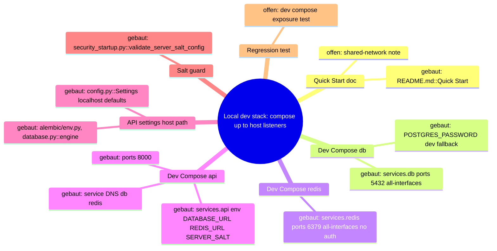
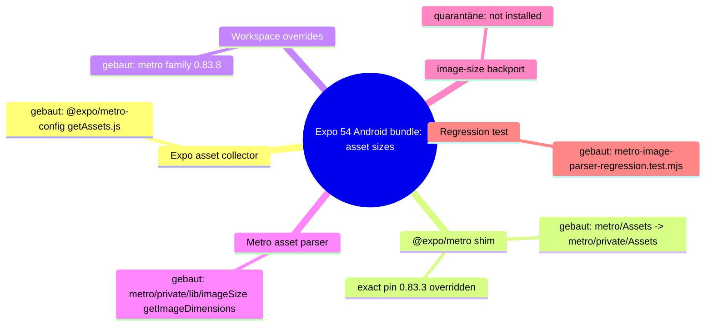

# Architecture Map — EKA-18 Local Developer Stack / Compose Exposure Boundary

Basis: `origin/main 2bfda8e40dbd66c1486936f3594d7b232eb7606d` · Task: T-481 · Mapping only, no fix.
Node: Local Developer Stack / Compose Exposure Boundary.

## 1. Grundidee

- Ekklesia.gr is a digital direct-democracy platform where Greek citizens vote on real parliamentary bills and municipal decisions (`README.md` "What is Ekklesia?").
- A developer brings the platform up locally by starting the datastores via Compose, then running migrations/seeds and the API/web on the host (`README.md::Quick Start` steps 2–5).
- The Compose stack `infra/docker/docker-compose.yml` defines `db` (PostgreSQL), `redis` and `api` on one default Docker network.
- Host-side tools (alembic, seeds, host uvicorn) reach the datastores through the published host ports using `apps/api/config.py::Settings` defaults (`localhost` DB/Redis).
- System boundary of this node: the host network listeners created by Compose `ports:` plus the credentials interpolated into `environment:`. Production compose (`infra/docker/docker-compose.prod.yml`) is a separate neighbour and not on this trace.
- Audit record: `docs/community-audits/EKA_PNYX_Full_Scope_Audit_2026-09-15.md::EKA-18` (Info, "accepted risk if developers do not run it on shared networks; note in README").

## 2. Spur (one trace, hops opened)

| # | From → To | Datum over the edge |
| --- | --- | --- |
| H1 | `README.md::Quick Start` step 2 → `infra/docker/docker-compose.yml` | `cd infra/docker && docker compose up -d` (project dir = `infra/docker`, no `.env` present there) |
| H2 | `docker-compose.yml::services.db.environment` → Compose interpolation | `POSTGRES_PASSWORD: ${DB_PASSWORD:-<dev literal>}`; unset shell var ⇒ public dev literal |
| H3 | `docker-compose.yml::services.db.ports` → host listener | short syntax `"5432:5432"`, no `host_ip` ⇒ bind on all host interfaces |
| H4 | `docker-compose.yml::services.redis.ports` → host listener | `"6379:6379"`, no `host_ip`; no `command`/`requirepass` ⇒ unauthenticated Redis on all interfaces |
| H5 | `docker-compose.yml::services.api.environment` → API container | `DATABASE_URL=…${DB_PASSWORD:-<dev literal>}@db/ekklesia`, `REDIS_URL=redis://redis:6379`, `SERVER_SALT=${SERVER_SALT:-<dev literal>}`, `ENV=development` |
| H6 | API container → `db`/`redis` via service DNS | internal Docker network `default`; does **not** use host ports |
| H7 | `docker-compose.yml::services.api.ports` → host listener | `"8000:8000"`, all interfaces; uvicorn `--host 0.0.0.0 --reload` |
| H8 | `README.md::Quick Start` steps 3–4 → `apps/api/config.py::Settings` | host `alembic upgrade head`, seeds, `uvicorn main:app` read `database_url` (`…@localhost/ekklesia`, same dev literal) and `redis_url` (`redis://localhost:6379`) |
| H9 | `apps/api/alembic/env.py` (l.25–27) / `apps/api/database.py::engine` → host port 5432 | `settings.database_url` ⇒ requires DB published at least on host loopback |
| H10 | `apps/api/security_startup.py::validate_server_salt_config` | `ENV=development` ⇒ weak `SERVER_SALT` only warns (non-production), fail-closed only in production |

Static reproducer result (run 2026-09-28, `DB_PASSWORD`/`SERVER_SALT` unset, no containers started):
`docker compose -f infra/docker/docker-compose.yml config --format json` ⇒
`db  ports=[host_ip=<absent>, 5432→5432]`, `redis ports=[host_ip=<absent>, 6379→6379]`, `api ports=[host_ip=<absent>, 8000→8000]`, all on network `default`; `POSTGRES_PASSWORD`, `DATABASE_URL`, `SERVER_SALT` resolve to dev-fallback literals; `REDIS_URL` carries no credentials.

## 3. Module

| Modul | Eine Aufgabe | Einstieg | Stand |
| --- | --- | --- | --- |
| Quick Start doc | tells developers how to start the local stack | `README.md::Quick Start` | gebaut (no shared-network warning — EKA-18 audit asked for one) |
| Dev Compose: db | local PostgreSQL with dev credential | `infra/docker/docker-compose.yml::services.db` | gebaut; exposure = Befund |
| Dev Compose: redis | local Redis cache/limits | `infra/docker/docker-compose.yml::services.redis` | gebaut; exposure = Befund |
| Dev Compose: api | containerised API with reload | `infra/docker/docker-compose.yml::services.api` | gebaut |
| Compose interpolation | resolves `${VAR:-default}` from shell/`.env` | Compose engine (`docker compose config`) | gebaut (external tool) |
| API settings | host-side default connection strings | `apps/api/config.py::Settings` | gebaut |
| DB access (host path) | migrations and ORM engine | `apps/api/alembic/env.py`, `apps/api/database.py::engine` | gebaut |
| Salt startup guard | fail closed on weak salt in production | `apps/api/security_startup.py::validate_server_salt_config` | gebaut (dev = warn only, by design) |
| Compose exposure regression test | pin loopback-only datastore binding | — | offen |
| Production compose | prod stack | `infra/docker/docker-compose.prod.yml` | aufgeschoben (neighbour, out of scope; not on trace) |

## 4. Verdrahtung

- README Quick Start → dev compose: `docker compose up -d` from `infra/docker` starts `db`, `redis`, `api`.
- Compose interpolation → db/api: unset `DB_PASSWORD` yields the public dev literal for both `POSTGRES_PASSWORD` and `DATABASE_URL`, so they stay consistent.
- db.ports → host: `5432` published on every host interface (no `host_ip`).
- redis.ports → host: `6379` published on every host interface, no auth.
- api → db/redis: service DNS `db` / `redis` on network `default`; independent of `ports:`.
- api.ports → host: `8000` on every interface (API surface, has its own auth/rate limits).
- Host tools → db/redis: `config.py::Settings` defaults hit `localhost:5432` / `localhost:6379`; this is the legitimate reason the datastore ports are published at all.
- Compose `ENV=development` → salt guard: weak salt only logs a warning.

## 5. Widerspruch und Lücken

**Symptom:** any host on the same LAN/Wi-Fi/VPN (or the internet, on a cloud VM without a filtering firewall) can reach `<dev-host>:5432` and `<dev-host>:6379`.

**Ursache (separated):**
1. **Host publishing on all interfaces** — H3/H4: `ports` short syntax without `host_ip`. This is the root cause of reachability; the other two only determine impact.
2. **Weak DB fallback** — H2: `${DB_PASSWORD:-<dev literal>}`; the literal is public in the repo, so reachability ⇒ full DB login.
3. **Unauthenticated Redis** — H4: no `requirepass`; reachability ⇒ read/write of rate-limit and application state used by `rate_limit.py`, `routers/{identity,newsletter,notify,payments,public_api,contact}.py` and `main.py`.

**Source → Sink:** `README.md::Quick Start` → `docker-compose.yml::services.{db,redis}.ports` (no `host_ip`) → Docker port publisher on `0.0.0.0`/`::` → network client authenticates with the repo-public literal (DB) or no auth (Redis) → read/write of local dev data.

**Angreifervoraussetzung:** network-adjacent to the developer host (same L2/L3 segment, shared Wi-Fi, VPN, or public IP on a cloud dev VM), developer followed Quick Start without exporting `DB_PASSWORD`. No local code execution needed. Impact limited to dev data (seeded bills, local test identities); real production data is only at risk if a developer imports prod dumps locally. On Linux, Docker-published ports bypass UFW-style host rules — firewall itself is out of scope.

**Sicherheitsinvariante:** dev datastores whose credentials are repo-public or absent are never reachable from a non-loopback host interface; the API container keeps reaching them over the internal Compose network, and host tools keep reaching them over loopback.

**Legitimer lokaler Kontrollpfad (must keep working):**
- H8/H9: host alembic, seeds and host uvicorn via `localhost:5432` / `localhost:6379` (`config.py::Settings` defaults).
- H6: `api` container → `db`/`redis` by service DNS — unaffected by `ports:` changes.
- Host GUI/CLI clients (psql, redis-cli) on the developer machine via loopback.

**Nicht automatisch betroffen:**
- API port 8000 (H7): public-by-purpose HTTP surface with its own auth; LAN access may be used for device testing. Not part of EKA-18; leave as is (could be a separate hardening note).
- Internal service-DNS flows (H6): no host listener involved.
- `SERVER_SALT` dev fallback (H5/H10): only affects nullifier derivation of local dev identities; guarded fail-closed in production by `security_startup.py`. Not part of the exposure fix.

**Lücken / Widerspruch:**
- Audit EKA-18 says "note in README"; `README.md::Quick Start` contains no such note.
- No regression test pins the dev compose port binding (module `offen`).
- `apps/api/config.py::Settings.database_url` duplicates the same dev literal as the compose fallback. Changing the compose fallback to a required var (`${DB_PASSWORD:?}`) would break H8/H9 unless `config.py`/`.env` also change ⇒ that opens a second hop and is **not** the narrowest fix.
- Redis `requirepass` would break every host-side `redis://localhost:6379` default (`config.py`, `main.py`, several routers) ⇒ multi-file change, not narrowest; Redis-auth for production is out of scope anyway.
- IPv6: `127.0.0.1:` binds IPv4 loopback only; host tools resolving `localhost` to `::1` first fall back to IPv4 (asyncpg/redis-py try all addresses). Verify on the fix PR.

## 6. Diagrammdateien

- `docs/architecture/map.puml` (mindmap + component diagram)
- `docs/architecture/main-path.puml` (sequence of the trace)
- PlantUML not installed on the mapping host ⇒ sources written, not rendered.



## 7. Nächster Schritt (engste Reparaturgrenze)

**Modul:** Dev Compose (db, redis). **Hop:** H3 + H4 (`services.{db,redis}.ports`).

**Fix contract (for a later, separately approved run):**
1. `infra/docker/docker-compose.yml`: `db.ports` → `"127.0.0.1:5432:5432"`, `redis.ports` → `"127.0.0.1:6379:6379"`. Nothing else in the file (keep fallbacks, keep `api` 8000, keep `version`).
2. New focused test `apps/api/tests/test_dev_compose_exposure.py` (static YAML parse; PyYAML comes transitively via `uvicorn[standard]` — use `pytest.importorskip("yaml")`):
   - negative: every `ports` entry of `db` and `redis` has host IP `127.0.0.1` (short or long syntax `host_ip`); fail on missing host IP, `0.0.0.0`, `::`.
   - positive control (host tools): `db` publishes target 5432 and `redis` target 6379 on loopback (published port still present ⇒ `config.py` localhost defaults still work).
   - positive control (internal network): `api.environment.DATABASE_URL` host is `db`, `REDIS_URL` host is `redis`, and `api.depends_on` contains both.
   - out-of-scope guard: `api` ports are not asserted.
3. `README.md::Quick Start`: one note — datastores bind to loopback only; dev credentials are public, never run this compose on shared/prod hosts; set `DB_PASSWORD` for anything non-local.

**Vorher-Reproducer (static, no containers):**
```bash
cd infra/docker && env -u DB_PASSWORD docker compose -f docker-compose.yml config --format json \
 | python3 -c 'import json,sys; s=json.load(sys.stdin)["services"]; [print(n,[(p.get("host_ip","<all>"),p["published"],p["target"]) for p in s[n].get("ports",[])]) for n in ("db","redis","api")]'
# before fix: db/redis/api show host_ip <all>
# after fix:  db/redis show 127.0.0.1; api unchanged; api env still targets db / redis
```

**Unberührt bleiben:** `infra/docker/docker-compose.prod.yml`, `infra/docker/app.yml`, `infra/hetzner/*`, mirror compose, `apps/api/config.py`, `apps/api/main.py`, routers, `security_startup.py`, `.env*`, workflows, packages/lockfiles. Neighbour files enter scope only if a hop above proves they define H3/H4 — none do.

---

# Architecture Map — T-506 Mobile/Representative Build Toolchain (Metro asset parser)

Basis: `agent/codex/T-506-base 4cc11930` · Task: T-506 · Node: Mobile/Representative Build Toolchain, hops T506-H1…H6.

## 1. Grundidee

- Mobile (`apps/mobile`) and Representative (`apps/representative`) are Expo SDK 54 apps (`package.json::dependencies.expo ~54.0.37`) bundled by Metro for Android releases.
- Metro reads the width/height of every bundled image asset at build time; that parser consumes untrusted-by-construction bytes from `node_modules` and app `assets/`.
- Until 0.83.3 Metro delegated this to `image-size@^1.0.2`; the repo pinned a reviewed local backport (`vendor/image-size/PATCHES.md`) against GHSA-5p2g-fcmc-qvqq / GHSA-w3rx-r6r6-pgpr.
- Metro 0.83.8 (react/metro `809c36d897ef`, "vendor image dimension parsing") replaces `image-size` with `metro/src/lib/imageSize.js` and drops the dependency.
- Boundary: npm dependency graph of the two workspaces and the Metro asset-size hop. No app source, native config, CI or API.

## 2. Spur

| # | From → To | Datum over the edge |
| --- | --- | --- |
| T506-H1 | `npx expo export --platform android` → `@expo/metro-config/build/transform-worker/getAssets.js` | asset module path |
| T506-H2 | `@expo/metro-config` → `@expo/metro@54.2.0` (shim package: `module.exports = require("metro/private/…")`) | `@expo/metro` pins **exactly** `metro*@0.83.3`; no 54.x release pins 0.83.8 |
| T506-H3 | workspace `package.json::overrides` → installed Metro family | `metro` (`"."`) + 13 `metro-*` packages forced to `0.83.8`; `ob1` follows transitively |
| T506-H4 | `metro/private/Assets::getAssetData` → `getAssetSize(type, content, filePath)` → `metro/private/lib/imageSize::getImageDimensions` | raw asset bytes; only `png jpg jpeg bmp gif webp psd svg tiff ktx` are decoded, others (`heic jxl icns`) return `null` |
| T506-H5 | `npm test` → `vendor/image-size/metro-image-parser-regression.test.mjs` | advisory payloads + offset-abuse payloads against the installed parser, 1 s worker timeout |
| T506-H6 | build gates → `expo install --check`, `tsc --noEmit`, `expo export --platform android`, `npm audit` | release-equivalent bundle |

## 3. Module

| Modul | Eine Aufgabe | Einstieg | Stand |
| --- | --- | --- | --- |
| Expo asset collector | collect asset metadata during bundling | `@expo/metro-config/build/transform-worker/getAssets.js` | gebaut |
| `@expo/metro` shim | re-export Metro private modules at a stable path | `@expo/metro/metro/Assets.js` | gebaut; 3 shims (`metro/node-haste/Package`, `metro-resolver/utils/toPosixPath`, `metro-file-map/lib/dependencyExtractor`) point to files absent in 0.83.8 — no installed consumer (see §5) |
| Workspace overrides | force a coherent Metro family | `apps/{mobile,representative}/package.json::overrides` | gebaut |
| Metro asset parser | image dimensions, fail closed | `metro/private/lib/imageSize::getImageDimensions` | gebaut (0.83.8) |
| image-size backport | former parser | `vendor/image-size/image-size-1.2.2-pnyx.0.tgz` | quarantäne — no longer installed in either workspace; files kept, retirement docs follow-up |
| Parser regression test | pin malformed-input behaviour | `vendor/image-size/metro-image-parser-regression.test.mjs` | gebaut |

## 4. Verdrahtung

- `expo export` → `getAssets.js` calls `@expo/metro/metro/Assets::getAssetData` per asset.
- `@expo/metro` shim → `metro/private/Assets`; resolves to whatever `metro` npm installed at root.
- Overrides → every `metro*` lock entry is `0.83.8`; `@react-native/community-cli-plugin` (`^0.83.1`) and `react-native` (`metro-runtime`, `metro-source-map` `^0.83.1`) dedupe onto the same copies.
- `Assets::getAssetSize` → `lib/imageSize::getImageDimensions`: typed parser, then all fallback parsers, each wrapped in `try/catch`; no result or non-positive/non-finite size ⇒ `Invalid <type> image asset: <path>`.
- Regression test → runs from each workspace against its installed Metro.

## 5. Widerspruch und Lücken

- `@expo/metro@54.2.0` declares exact `0.83.3`; the override contradicts that declaration. Compatibility evidence: all 37 `@expo/metro/*` subpaths referenced by installed code resolve and load on 0.83.8; the 3 dangling shims have no importer.
- HEIF/JXL/ICNS are no longer parsed at all by Metro (not in `isAssetTypeAnImage`); advisory payloads under any image type fail closed.
- `SECURITY.md`, `vendor/image-size/PATCHES.md`, `docs/TODO.md` still describe the backport as active — docs follow-up, not in this diff.
- A future `expo` 54 patch may bump `@expo/metro`; the overrides must then be re-checked, not blindly kept.

## 6. Diagrammdateien

- This section only (Mermaid below); `map.puml` / `main-path.puml` stay on the EKA-18 node.



## 7. Nächster Schritt

- Modul: image-size backport docs. Hop: none on the build path. Files: `SECURITY.md`, `vendor/image-size/PATCHES.md`, `docs/TODO.md` (separate task, after merge closes Dependabot #78–#81).
- Unberührt: app source, `android/`, `app.config.js`, `eas.json`, CI workflows, `vendor/image-size/dist`, `vendor/image-size/security-regression.test.mjs`.
