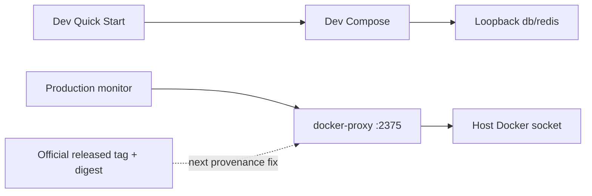

# Architecture Map — Container Trust Boundaries (EKA-18 + EKA-13)

Basis: `origin/main 4cc11930f4be82ba2d012def487fb34abca9da26` · Task: T-502 · Mapping only.

This map preserves the accepted EKA-18 local-development boundary and adds the independently reviewed EKA-13 production-container boundary from T-483. The two nodes are adjacent but have separate change contracts.

## 1. Grundidee

- The local Compose stack publishes PostgreSQL and Redis for host-side migrations/tools. EKA-18 is source-fixed on current main: those two datastore ports bind to IPv4 loopback; the API's intentional port 8000 stays externally bindable for device testing.
- The production Compose stack gives `monitor` controlled Docker access through `docker-proxy`. That proxy mounts the host Docker socket, exposes the Docker API on the shared application network and therefore sits on a host-root-equivalent trust boundary.
- EKA-13 is still source-open: `docker-proxy` uses mutable `:latest`; `CONTAINERS=1` and `POST=1` expose a broader Docker API namespace than the monitor's intended restart call. This task maps only the first narrow repair: immutable image provenance.

## 2. Hop-Liste

### Node A — EKA-18 Local Developer Stack (built)

| Hop | From → To | Current invariant |
| --- | --- | --- |
| A1 | `README.md::Quick Start` → `infra/docker/docker-compose.yml` | developer starts `db`, `redis`, `api` |
| A2 | Compose interpolation → db/api | public local credential fallbacks remain development-only |
| A3 | `services.db.ports` → host | `127.0.0.1:5432:5432`; no non-loopback listener |
| A4 | `services.redis.ports` → host | `127.0.0.1:6379:6379`; no non-loopback listener |
| A5 | API → db/redis | service DNS on the internal Compose network; unaffected by host binding |
| A6 | host settings/alembic → db/redis | localhost access remains valid |
| A7 | `services.api.ports` → host | port 8000 remains intentionally all-interface and is outside EKA-18 |
| A8 | `test_dev_compose_exposure.py` | pins A3/A4 and positive internal/host control paths |

### Node B — EKA-13 Production Container Trust Boundary (open)

| Hop | From → To | Current invariant / gap |
| --- | --- | --- |
| B1 | `docker-compose.prod.yml::monitor.build` → `apps/monitor/Dockerfile` | `python:3.11-slim`, no digest and no explicit `USER`; monitor receives secrets but no host mount |
| B2 | monitor → `DOCKER_HOST=tcp://docker-proxy:2375` | `attempt_tier2` uses Docker SDK `containers.get/restart`; gated by `AUTO_RECOVERY_T2` and a client-side allowlist |
| B3 | `services.docker-proxy.image` → GHCR | `ghcr.io/tecnativa/docker-socket-proxy:latest`; mutable provenance, no release tag/digest |
| B4 | docker-proxy environment → Docker API policy | `CONTAINERS=1`, `POST=1`, no auth in Compose; policy is broader than restart-only |
| B5 | docker-proxy → host Docker daemon | `/var/run/docker.sock:/var/run/docker.sock:ro`; read-only mount does not make Docker API calls read-only |
| B6 | application network → docker-proxy | every compromised container on `net_ekklesia` can address port 2375 |
| B7 | `services.ollama.image` → Docker registry | separate mutable `ollama/ollama:latest`, profile-gated; not part of the first fix |
| B8 | dashboard/monitor Dockerfiles → runtime user | tag-pinned base images without digest; no explicit `USER`; separate hardening scope |

## 3. Module

| Module | One responsibility | Status |
| --- | --- | --- |
| Quick Start + dev Compose | reproducible local stack | built |
| Dev db/redis bindings | host tool access without LAN exposure | built by #393 |
| Dev compose regression | preserve loopback and service-DNS paths | built |
| Production monitor | health checks and optional Tier-2 restart | built |
| Production docker-proxy | filtered Docker API bridge | built, high-privilege boundary |
| docker-proxy provenance | immutable released tag + manifest digest | open, next narrow fix |
| docker-proxy capability policy | restrict exposed endpoints/network principals | open, separate security design |
| Ollama provenance | immutable optional AI image | open, separate task |
| Dashboard/monitor non-root | explicit runtime users | open, separate task |

## 4. Verdrahtung

- `monitor.py::attempt_tier2` is the intended writer. It selects a service from `T2_ALLOWED_SERVICES` and invokes `restart()` through the Docker SDK.
- The allowlist exists only in the client. The proxy itself is reachable without authentication from the shared production application network.
- Mounting the socket `:ro` controls the filesystem entry, not Docker API method semantics. With `POST=1`, allowed namespaces can mutate the host daemon.
- A released tag plus manifest-list digest makes the proxy bytes reproducible across supported platforms. It does not reduce API capabilities; that remains explicitly open.
- Node A never reaches Node B: dev host-port bindings and production Docker-socket authority are different Compose files and trust boundaries.

## 5. Findings and limits

**EKA-18 current state:** source-closed. DB/Redis listen only on IPv4 loopback in the dev Compose file; host and container control paths are pinned by tests. Deployment/live listener state is not inferred.

**EKA-13 current source-to-sink:** mutable GHCR `:latest` → unaudited future proxy bytes → unauthenticated port 2375 on shared network → host Docker socket → container lifecycle/filesystem/log access permitted by the exposed namespace. Compromise of any network peer can cross this boundary.

**First-fix invariant:** production Compose names one official released docker-proxy tag and its exact registry manifest digest; no mutable tag remains in that field; all environment, mounts, networks, dependency wiring and monitor behavior stay byte-for-byte unchanged.

**Not solved by the first fix:** broad `CONTAINERS` namespace, `POST=1`, shared network reachability, lack of proxy auth, monitor/container root users, Ollama `:latest`, deployed image identity and actual Tier-2 runtime behavior.

## 6. Next source boundary

Allowed later product diff:

1. `infra/docker/docker-compose.prod.yml`: one `services.docker-proxy.image` line only, from `:latest` to an official released tag plus manifest digest.
2. One focused static/Compose regression test that rejects `latest`, missing digest, wrong repository or changes to the existing proxy capability/mount/network contract.
3. Architecture/report updates only.

Selection requirements before implementation: official Tecnativa release/tag, official GHCR manifest-list digest, registry metadata inspection without production access, and local compatibility proof for the Docker SDK `/version`, list/get and restart path. Image pull/run is permitted only in the later JEV-gated test task; no production host or deploy.

## 7. Diagram files

- `docs/architecture/map.puml` → `map.svg`, `map_001.svg`
- `docs/architecture/main-path.puml` → `main-path.svg`, `main-path_001.svg`

