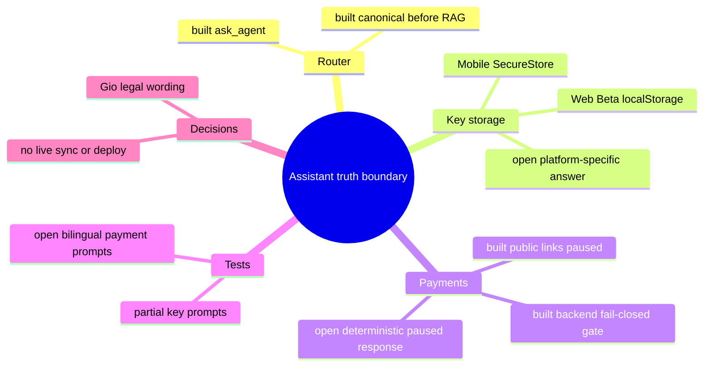

# Architecture Map — EKA-59/EKA-60 Assistant Truth Boundaries

Basis: `agent/claude/T-496 3727266436d2706cf30272a3ab3414635bc633e1` · Task: T-497 · Mapping only, no fix.
Node: API assistant deterministic truth boundary / citizen question to platform-state answer.

## 1. Grundidee

- Ekklesia lets citizens ask the landing assistant about the platform and receive bilingual answers from deterministic rules or a RAG/model fallback (`apps/api/routers/agent.py::ask_agent`).
- Security- and privacy-sensitive facts already use `_canonical_response` before any database lookup or model call, so these answers can be kept independent of mutable KB state (`apps/api/routers/agent.py::_canonical_response`).
- Mobile private keys are stored through Expo SecureStore, which maps to Android Keystore and iOS Keychain (`apps/mobile/src/lib/crypto-native.ts::secureSet/storeKeypair`).
- Web Beta private keys are instead stored as hexadecimal text in browser `localStorage` (`apps/web/src/lib/crypto.ts::storeKeypair`).
- Public Stripe/PayPal intake and links are paused, while the backend acceptance boundary remains separately gated (`docs/community.html`, `apps/api/routers/payments.py::_payment_intake_enabled`).
- Legal recipient, donation classification and public wording remain Gio/accountant decisions; this node may state only the observable technical availability and storage behavior.

## 2. Spur (one user path, opened hops)

| # | From → To | Datum over the edge |
| --- | --- | --- |
| H1 | `POST /api/v1/agent/ask` → `routers/agent.py::ask_agent` | question plus canonical `el`/`en` language |
| H2 | `ask_agent` → `_canonical_response` | question text; deterministic response wins before RAG/model calls |
| H3 | `_canonical_response(private-key question)` → response | current generic “stored only on your device” claim |
| H4 | `apps/web/src/lib/crypto.ts::storeKeypair` → browser `localStorage` | private/public key hex and nullifier hash in Web Beta |
| H5 | `apps/mobile/src/lib/crypto-native.ts::storeKeypair` → Expo SecureStore | mobile private key through Android Keystore/iOS Keychain adapter |
| H6 | `_canonical_response(payment/support question)` → no match → `_build_context`/model | no deterministic paused-state response; model can infer processor guidance |
| H7 | `docs/community.html` + `payments.py::_payment_intake_enabled` → technical availability state | public processor links absent; intake fails closed unless the explicit gate is enabled |

## 3. Module

| Modul | Eine Aufgabe | Einstieg | Stand |
| --- | --- | --- | --- |
| Assistant router | orders safety, canonical truth and generative fallback | `apps/api/routers/agent.py::ask_agent` | gebaut |
| Canonical truth boundary | returns facts that must not drift through a model | `apps/api/routers/agent.py::_canonical_response` | teilweise; private-key answer lacks platform split and payment pause has no branch |
| Web key storage | persists Web Beta voting credentials | `apps/web/src/lib/crypto.ts::storeKeypair` | gebaut; browser `localStorage`, not Keychain/Keystore |
| Mobile key storage | persists mobile voting credentials | `apps/mobile/src/lib/crypto-native.ts::storeKeypair` | gebaut; Expo SecureStore adapter |
| Payment availability | keeps public links/intake disabled pending gates | `docs/community.html`; `apps/api/routers/payments.py::_payment_intake_enabled` | gebaut; paused/fail-closed |
| Canonical regression tests | proves sensitive answers bypass models and stay bilingual | `apps/api/tests/test_agent_training_regression.py` | teilweise; key test is generic, payment pause prompts absent |
| KB catalog | supplies mutable RAG facts after canonical handling | `apps/api/scripts/seed_knowledge_base.py::ENTRIES` | gebaut on T-496; private-key wording is generic, no payment-pause row |

## 4. Verdrahtung

- `ask_agent` runs the safety filter and `_canonical_response` before `_build_context`, Ollama or Claude, so a matched technical-state answer cannot be replaced by generated processor or storage claims.
- The current private-key branch and KB row collapse two implementations into “only on your device”: true at the server boundary, incomplete for Web versus Mobile storage security.
- Web code writes key material to origin-scoped `localStorage`; Mobile code calls Expo SecureStore. Neither path sends the private key to the API in this trace.
- Payment/support questions currently miss the canonical boundary and can reach model generation with fallback KB rows that do not encode the paused state.
- The public community page exposes no Stripe donation URL and marks intake paused; backend capture is separately fail-closed behind `PAYMENTS_INTAKE_GATE` and readiness values.

## 5. Widerspruch und Lücken

**EKA-59 symptom:** the bot answers one generic device-storage story although Web Beta uses browser `localStorage` and Mobile uses SecureStore. References to Keychain/Keystore in generic keywords can overstate the Web path.

**EKA-59 cause:** H3 does not select or disclose the H4/H5 platform split. The same generic wording is duplicated in `ENTRIES`, so the RAG fallback can repeat it.

**EKA-60 symptom:** support/payment questions can reach a model that may direct citizens to Stripe or PayPal even though public links and intake are paused.

**EKA-60 cause:** H6 has no deterministic operational-state branch sourced from H7.

**Content/legal boundary:** the technical answer may say that public processor links/intake are currently unavailable and no payment should be attempted through the assistant. It must not choose the recipient, legal form, tax treatment, donation-versus-consideration classification, refund promise or activation date. Those remain a separate Gio decision template.

**Deployment dependency:** T-496 is the required base if `ENTRIES` is changed. Its first production sync remains data/deploy-gated because exact sync deletes live rows outside the 14-row catalog. This task must not sync or inspect a live database.

## 6. Diagrammdateien

- `docs/architecture/map.puml` — mindmap plus component trace.
- `docs/architecture/main-path.puml` — question-to-answer sequence.
- PlantUML rendering is optional; source files are authoritative.

## 7. Nächster Schritt

**One module:** Assistant canonical truth boundary. **One hop:** H2/H3/H6 from `_canonical_response` to a deterministic bilingual answer, grounded by H4/H5/H7.

The implementation may touch only `apps/api/routers/agent.py`, the canonical KB rows in `apps/api/scripts/seed_knowledge_base.py`, and focused assistant/KB tests or the sanitized question fixture. It must prove Web `localStorage` versus Mobile SecureStore, and force payment/support prompts to an unavailable/paused answer before any database or model call.

Unchanged: Web/mobile storage implementation, payment router and gates, public community page, deployment workflow, database schema/live rows, secrets, Stripe/PayPal configuration, legal/content pages, and all activation/deploy behavior.
