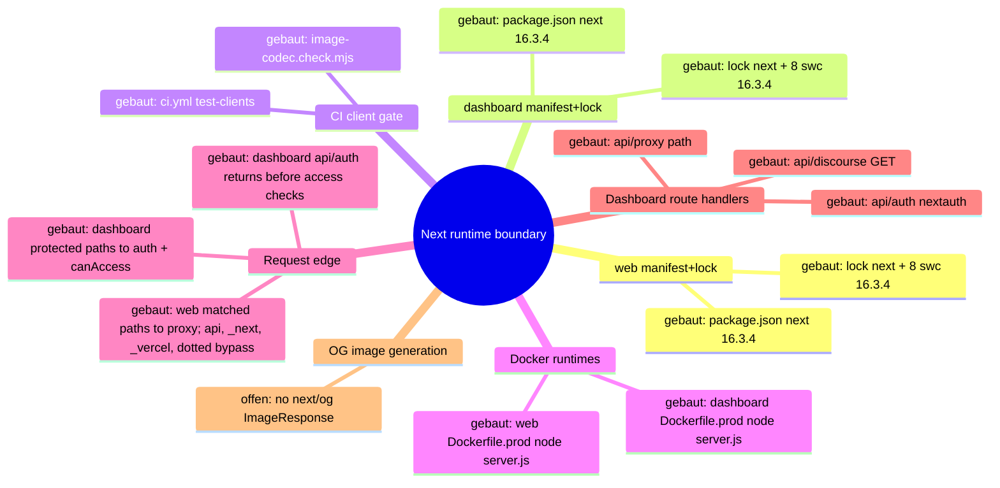
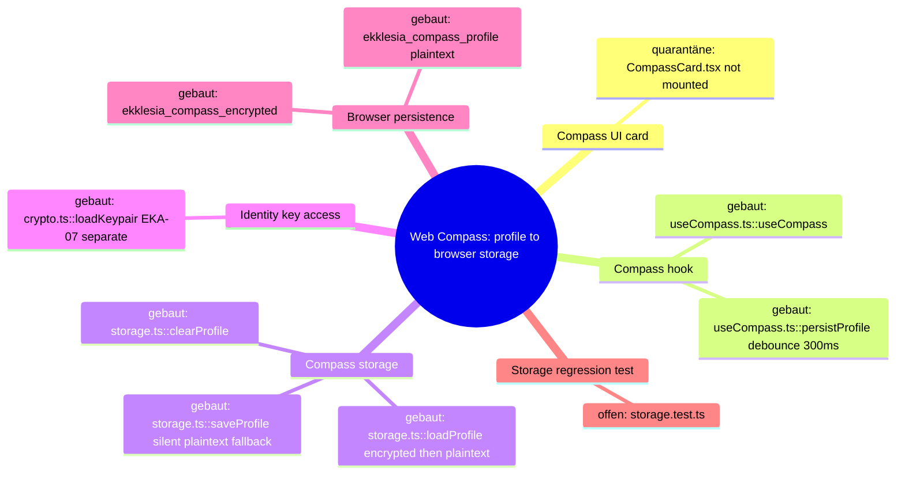
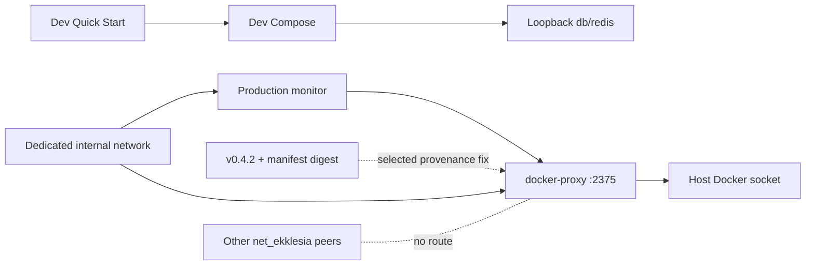
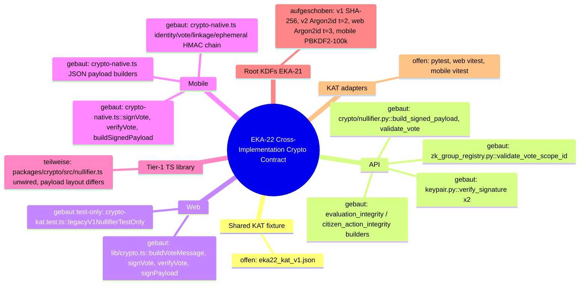
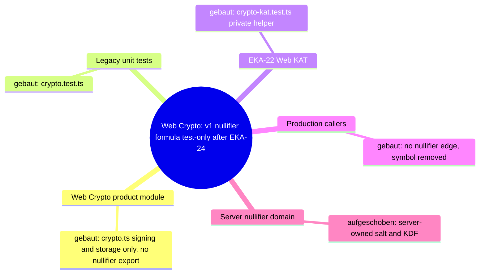
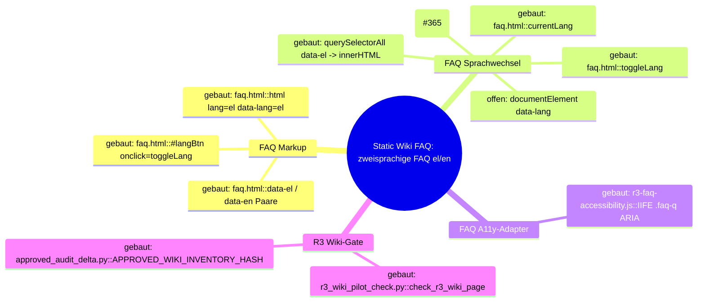

# Architecture Map — Next Runtime Dependency Boundary (T-485)

Scope: `apps/web` + `apps/dashboard` Next.js runtimes against
GHSA-vcvr-r3jv-pc5j (`next` >=16.2.0 <16.3.6, patched 16.3.6; RCE needs Node.js
`next/og` `ImageResponse` rendering attacker-controlled SVG content/attributes/styles).
Base: `origin/main` 49e449a3bc9af1000e9d111fba9b9da2e27d673c. Read-only run: no
package, lock, source or config change. Existing maps (`EKKLESIA_V2_MINIMA.md`,
`FEDERATION.md`) stay untouched.

## 1. Grundidee

- Ekklesia.gr is a digital direct-democracy platform for Greek citizens (`apps/web/src/app/[locale]/layout.tsx::metadata.openGraph.description`).
- Citizens use the public web runtime (`apps/web`, port 3000) for bills, VAA, results (`apps/web/src/app/[locale]/**/page.tsx`).
- Operators use the auth-gated admin dashboard (`apps/dashboard`, port 3001) (`apps/dashboard/src/proxy.ts::proxy`, `apps/dashboard/package.json::scripts.start`).
- Both are standalone Next builds served by `node server.js` in Docker (`apps/{web,dashboard}/next.config.*::output`, `apps/{web,dashboard}/Dockerfile.prod::CMD`).
- Boundary of this map: the `next` package version as it flows from manifest to running route handlers, plus the advisory's `next/og` sink.

## 2. Spur (opened hops)

1. `apps/web/package.json::dependencies.next` = `16.3.4` (exact) → `apps/web/package-lock.json::packages["node_modules/next"]` = 16.3.4, `engines.node >=20.9.0`.
2. `apps/dashboard/package.json::dependencies.next` = `16.3.4` (exact) → `apps/dashboard/package-lock.json::packages["node_modules/next"]` = 16.3.4.
3. Lock `node_modules/next` → 8 platform `node_modules/@next/swc-*` entries, each 16.3.4 (both locks); `sharp` 0.35.4 via `overrides`.
4. Lock → `.github/workflows/ci.yml::test-clients` (`npm ci` → `image-codec.check.mjs` → lint → typecheck → [web: vitest] → `npm run build`).
5. Lock → `apps/web/Dockerfile.prod` (`npm ci` with repo `.npmrc`, docs/ copied into `public/`, `npm run build`) → runner `node server.js` (context `../../`, `infra/docker/docker-compose.prod.yml::web`).
6. Lock → `apps/dashboard/Dockerfile.prod` (`npm ci --ignore-scripts`, `npm run build`) → runner `node server.js` (context `../../apps/dashboard`, `docker-compose.prod.yml::dashboard`).
7. `server.js` → the web proxy matcher excludes `/api`, `_next`, `_vercel`, and dotted paths; matched page requests enter `apps/web/src/proxy.ts::proxy` (redirects/rewrites + next-intl) → `apps/web/src/app/[locale]/*/page.tsx` (9 pages, no route handlers).
8. `server.js` → the dashboard matcher excludes `_next/static`, `_next/image`, and `favicon.ico`; matched protected pages and non-auth APIs enter `apps/dashboard/src/proxy.ts::proxy` (session gate, then role check) → `(dashboard)/*/page.tsx` (23), `api/discourse/route.ts::GET` (JSON), and `api/proxy/[...path]/route.ts` (JSON, SUPER_ADMIN). `/api/auth/*` is matched but returns before the user and `canAccess` checks to reach `api/auth/[...nextauth]/route.ts::{GET,POST}`.
9. Side-hop `request-controlled value → next/og ImageResponse SVG` — **offen / nicht verdrahtet** (evidence below).

### Sink evidence (all `git grep` on 49e449a, excluding lockfiles)

| Pattern | Scope | Hits |
| --- | --- | --- |
| `next/og`, `ImageResponse`, `new ImageResponse`, `@vercel/og` | whole repo | 0 |
| `satori`, `resvg`, `generateImageMetadata` | apps/web, apps/dashboard | 0 |
| `export const runtime` (Node vs Edge) | apps/web, apps/dashboard | 0 → all routes default Node.js runtime |
| `opengraph-image.*`, `twitter-image.*`, `icon.*`, `apple-icon.*` files | apps/web, apps/dashboard | 0 (only `public/manifest.json`) |
| `route.ts` handlers | both | 3, all dashboard, none returns images |
| `node_modules/@vercel/og`, `satori`, `@resvg/*` in locks | both locks | 0 (next's og bundle only inside `next/dist/compiled`) |

Image neighbours: `openGraph` in web layout is static text, no `images`; `next/image` in
`NavHeader.tsx`/`sso-verify/page.tsx` uses the image optimizer, not `next/og`; inline
`<svg>` literals in NavHeader/sso-verify/login are static JSX.

## 3. Module

| Modul | Eine Aufgabe | Einstieg | Stand |
| --- | --- | --- | --- |
| web manifest+lock | pin `next` for public web | `apps/web/package.json::dependencies.next` | gebaut (16.3.4, affected) |
| dashboard manifest+lock | pin `next` for admin dashboard | `apps/dashboard/package.json::dependencies.next` | gebaut (16.3.4, affected) |
| CI client gate | install + verify + build both runtimes | `.github/workflows/ci.yml::test-clients` | gebaut |
| image-codec check | assert optimizer + sharp ⊂ next's sharp range | `apps/{web,dashboard}/image-codec.check.mjs` | gebaut |
| web Docker runtime | build standalone, serve on 3000 | `apps/web/Dockerfile.prod::CMD` | gebaut |
| dashboard Docker runtime | build standalone, serve on 3001 | `apps/dashboard/Dockerfile.prod::CMD` | gebaut |
| web request edge | locale/static redirects | `apps/web/src/proxy.ts::proxy` | gebaut |
| dashboard request edge | auth + RBAC gate | `apps/dashboard/src/proxy.ts::proxy` | gebaut |
| dashboard route handlers | auth, discourse JSON, API proxy JSON | `apps/dashboard/src/app/api/**/route.ts` | gebaut |
| OG image generation | `next/og` `ImageResponse` | — | offen (no symbol) |

## 4. Verdrahtung

- `package.json::next` → lock `node_modules/next`: exact pin, lock matches 16.3.4 in both apps.
- lock `next` → `@next/swc-*`: 8 platform binaries pinned to the same 16.3.4; must move together.
- lock → CI `npm ci` / `npm run build`: CI builds both runtimes from their own lock.
- lock → `Dockerfile.prod` `npm ci`: prod image installs the same lock; web keeps install scripts per `.npmrc`, dashboard passes `--ignore-scripts`.
- `Dockerfile.prod` → `node server.js`: standalone server, Node 22.13.0-alpine.
- `server.js` → web `proxy.ts`: only matcher-selected requests enter it; `/api`, `_next`, `_vercel`, and dotted paths bypass the proxy.
- `server.js` → dashboard `proxy.ts`: matcher-selected requests enter it, but `/api/auth/*` returns before the protected user and `canAccess` checks; protected pages and the other API paths continue through those checks.
- proxy or matcher bypass → pages/route handlers: no handler or page imports `next/og`.

## 5. Widerspruch und Lücken

- (a) Versionally affected: both runtimes resolve `next` 16.3.4 ∈ [16.2.0, 16.3.6).
- (b) Exploit path not evidenced: 0 `next/og`/`ImageResponse` call sites, no metadata image files, no SVG-rendering handler. The vulnerable code ships in `next/dist/compiled` but is unreachable without an importer.
- (c) Hygiene upgrade still justified: all routes run Node.js runtime by default, so any future `ImageResponse` with request data would hit the vulnerable sink directly.
- Attacker preconditions (all missing today): a Node-runtime route/metadata file importing `next/og`; request-controlled input reaching SVG content, attributes or styles in the JSX tree; reachability without auth (web) or with an operator session (dashboard).
- Gap: install-script parity differs (web `npm ci` + `.npmrc`, dashboard `npm ci --ignore-scripts`); not changed here.
- Gap: `image-codec.check.mjs` asserts `sharp` 0.35.4 satisfies `next.optionalDependencies.sharp`; 16.3.6 range not verified in this run (no install).
- Not checked: npm registry metadata for 16.3.6, live/runtime state, builds.

## 6. Diagramme

- `docs/architecture/map.puml` (mindmap + component)
- `docs/architecture/main-path.puml` (sequence of the built path)



## 7. Nächster Schritt (single follow-fix node, T-486)

Modul: web + dashboard manifest+lock. Hop: `package.json::dependencies.next`
16.3.4 → 16.3.6 → lock `node_modules/next` + all 8 `@next/swc-*` to 16.3.6, in both apps.
Files: `apps/{web,dashboard}/package.json`, `apps/{web,dashboard}/package-lock.json` only.
Untouched: Dockerfiles, `next.config.*`, `proxy.ts`, all `src/**`, `.github/**`,
`@next/eslint-plugin-next` (#394), React, `overrides`.
Must stay green: CI `test-clients` Web + Dashboard (`image-codec.check.mjs`, lint,
typecheck, web vitest, `npm run build`), both `Dockerfile.prod` builds, and the
routes in hops 7–8 (web locale pages + proxy redirects; dashboard pages, `/login`,
`/api/auth/*`, `/api/discourse`, `/api/proxy/*`).

---

# Preserved Map Node — EKA-18 Local Developer Stack / Compose Exposure Boundary

Integrated from `origin/main` at T-486 refresh. The full evidence and acceptance
record remains in `.fleet/reports/T-481.md` and `.fleet/reports/T-482.md`.

## Module and hop

- Node: local developer stack / Compose exposure boundary.
- Hop H1: README Quick Start starts `infra/docker/docker-compose.yml`.
- Hop H2: host-side alembic, seeds, and uvicorn use the loopback defaults in
  `apps/api/config.py::Settings`.
- Hop H3: the API container uses the internal `db` and `redis` service names.
- Hop H4: only PostgreSQL and Redis host publications are narrowed to
  `127.0.0.1`; the API's port 8000 publication remains unchanged.

## Security invariant

Development datastores with repository-public or absent credentials are not
reachable through a non-loopback host interface, while host development tools
retain `localhost:5432` and `localhost:6379` access and containers retain their
service-DNS access. Production Compose, API auth, salt policy, and datastore
authentication are outside this node.

## Built state

- `infra/docker/docker-compose.yml` binds db and redis to IPv4 loopback.
- `apps/api/tests/test_dev_compose_exposure.py` pins loopback publication,
  published ports, internal service-DNS targets, and dependencies.
- README warns that the development credentials are public and the stack is not
  for shared or production hosts.

# Architecture Map — Sentry Capture Policy Boundary

Basis: `origin/main 4cc11930f4be82ba2d012def487fb34abca9da26` · Task: T-493 · Mapping only, no fix.
Node: API observability / Sentry event capture policy.

## 1. Grundidee

- Ekklesia.gr is a privacy-sensitive civic platform; the API handles request data and intermediate values that can include personal or security-relevant information.
- `apps/api/main.py::_sentry_init_options` is the single global policy boundary for Sentry error and transaction capture.
- FastAPI and Starlette integrations build Sentry events, `_before_send_filter` applies a second redaction layer, and the SDK transport sends the resulting envelope.
- This map opens only the event-construction policy hop. DSN, sampling, environment, provider configuration, deployment and stored Sentry events remain outside the boundary.

## 2. Spur (one trace, hops opened)

| # | From → To | Datum over the edge |
| --- | --- | --- |
| H1 | FastAPI/Starlette exception or transaction → Sentry integrations | exception, stack, request context and transaction metadata |
| H2 | `main.py::_sentry_init_options` → `sentry_sdk.init` | integrations, sampling, environment, PII and hook policy |
| H3 | Sentry SDK integration → event construction | stack frames; SDK default may attach frame-local variables |
| H4 | Sentry SDK integration → request extraction | request metadata; SDK default may attach a request body up to its configured size |
| H5 | constructed event → `main.py::_before_send_filter` | event/request/frame data; known sensitive keys and request fields are redacted recursively |
| H6 | `_before_send_filter` → Sentry transport | filtered event envelope sent to the configured DSN |

## 3. Module

| Modul | Eine Aufgabe | Einstieg | Stand |
| --- | --- | --- | --- |
| Sentry init policy | defines global capture controls | `apps/api/main.py::_sentry_init_options` | gebaut; frame-local and body policies are implicit SDK defaults |
| Web integrations | derive error/transaction/request events | `FastApiIntegration`, `StarletteIntegration` | gebaut (external SDK) |
| Event redaction | strips environment and redacts known sensitive values | `apps/api/main.py::_before_send_filter` | gebaut; defense layer, not a complete arbitrary-value denylist |
| SDK transport | serializes and sends envelopes | `sentry_sdk.init` / transport | gebaut (external SDK) |
| Policy regression tests | pin capture policy and transport result | `apps/api/tests/test_sentry_secret_scrubbing.py` | partial; filters and synthetic secrets covered, capture defaults not pinned |

## 4. Verdrahtung

- Application startup calls `_sentry_init_options(settings.sentry_dsn)` and passes the result to `sentry_sdk.init`.
- `FastApiIntegration` and `StarletteIntegration` collect exception, trace and request context before the application hook runs.
- `_before_send_filter` removes request environment, cookies and query strings; drops selected headers; and recursively redacts sensitive-key values in request data, extras and frame vars.
- Ordinary local-variable names and arbitrary body-field names are not guaranteed sensitive by that key-based filter.
- The filtered event proceeds to the SDK transport. Tests use an in-memory capture transport, so this boundary can be verified without network or Sentry access.

## 5. Widerspruch und Lücken

**Symptom:** global SDK defaults can collect arbitrary frame-local values and request bodies before `_before_send_filter` runs.

**Ursache:** `_sentry_init_options` deliberately sets `send_default_pii=False`, but does not explicitly set `include_local_variables` or `max_request_body_size`. The downstream redactor recognizes sensitive keys, not every value whose name appears harmless.

**Source → sink:** request/exception → FastAPI/Starlette integration → SDK event construction with implicit capture defaults → key-based `_before_send_filter` → transport.

**Sicherheitsinvariante:** Sentry events never contain frame-local variables or request bodies, independent of variable/key naming. Existing stack/exception metadata, URL and method metadata, sampling and redaction hooks remain available.

**Defense in depth:** `include_local_variables=False` prevents local values at event construction; `max_request_body_size="never"` prevents request-body collection. `_before_send_filter` remains in place for headers, query strings, cookies, extras and any event data supplied by other integrations.

**Lücken:**

- Current tests assert hook wiring and `send_default_pii=False`, but not the two capture-boundary settings.
- Existing transport tests use sensitive-looking names that the downstream redactor catches; they do not prove that arbitrary local/body values are excluded at source.
- No production/Sentry-event inspection is required or authorized for this change.

## 6. Diagrammdateien

- `docs/architecture/map.puml` (mindmap + component trace)
- `docs/architecture/main-path.puml` (event sequence)
- PlantUML rendering is optional for this mapping commit; source files are authoritative.

## 7. Nächster Schritt (engste Reparaturgrenze)

**Modul:** API observability / Sentry init policy. **Hop:** H2–H4.

1. Add `include_local_variables=False` and `max_request_body_size="never"` to `apps/api/main.py::_sentry_init_options`.
2. Extend `apps/api/tests/test_sentry_secret_scrubbing.py` with configuration invariants and SDK-transport checks showing arbitrary frame-local and request-body-only sentinel values are absent.
3. Preserve exception/stack and non-body request metadata where the SDK exposes it deterministically.
4. Leave `_before_send_filter`, DSN, integrations, sample rate, environment, deployment and provider settings unchanged.

Out of scope: production deployment, live Sentry inspection, data cleanup, legal/content wording and unrelated observability refactors.

# Architecture Map — EKA-08 Web Compass Privacy Storage

Basis: `main 4cc11930f4be82ba2d012def487fb34abca9da26` · Task: T-487 · Mapping only, no fix.
Node: Web Compass Privacy Storage. The EKA-18 node above stays unchanged.

## 1. Grundidee

- Liquid Compass: a personal political profile computed 100% client-side, AES-256-GCM encrypted with an HKDF key from the Ed25519 private key, never sent to the server (`CLAUDE.md` "Liquid Compass"; `apps/web/src/lib/compass/storage.ts` header).
- The same header states the contract gap: "Fallback auf unverschlüsselt wenn kein Key vorhanden" (`storage.ts` l.4).
- Audit: `docs/community-audits/EKA_PNYX_Full_Scope_Audit_2026-09-15.md::EKA-08` (Medium, privacy, Open; "certain for unverified users").
- Web product scope today: compass is app-only (`apps/web/src/app/[locale]/bills/[id]/page.tsx` l.11 "CompassCard removed — compass is mobile-app only"; `README.md` l.68 lists Compass under Mobile App).
- Boundary of this node: `CompassCard` → `useCompass` → `storage.ts` → browser `localStorage`. Mobile compass, API, key storage (EKA-07) and KDF are neighbours, not on this trace.

## 2. Spur (hops opened)

| # | From → To | Datum over the edge |
| --- | --- | --- |
| C1 | `apps/web/src/components/CompassCard.tsx::CompassCard` → `lib/compass/index.ts` → `useCompass.ts::useCompass` | hook call, no args |
| C2 | `useCompass.ts::getPrivateKey` → `apps/web/src/lib/crypto.ts::loadKeypair` | `privateKeyHex \| null` from `localStorage["ekklesia_private_key"]` (EKA-07, out of scope) |
| C3 | `useCompass.ts::useCompass` (init effect) → `storage.ts::loadProfile(privateKeyHex)` | key or `null` |
| C4 | `storage.ts::loadProfile` → `localStorage["ekklesia_compass_encrypted"]` | only if key present; decrypt error swallowed (`catch {}`) → falls through to C5 |
| C5 | `storage.ts::loadProfile` → `localStorage["ekklesia_compass_profile"]` | legacy/fallback **plaintext JSON**, read when C4 cannot return a usable encrypted profile (no key, missing ciphertext or decrypt failure) |
| C6 | `useCompass.ts::{setModel,seedFromVAA,recordBillVote}` → `useCompass.ts::persistProfile` | updated `CompassProfile` (VAA answers, bill votes, model) |
| C7 | `persistProfile` (300 ms debounce) → `storage.ts::saveProfile(p, getPrivateKey())` | promise not awaited, no error handler |
| C8a | `saveProfile` key present, crypto ok → `setItem(encrypted)` + `removeItem(plaintext)` | base64(iv‖ct) |
| C8b | `saveProfile` key `null` **or** HKDF/AES throws → `setItem("ekklesia_compass_profile", json)` | **silent plaintext write**, no signal to caller/UI |
| C9 | `useCompass.ts::reset` → `storage.ts::clearProfile` | removes both keys; pending `saveTimeout` is not cancelled |

Caller census at 4cc1193 (`grep useCompass|CompassCard|@/lib/compass` in `apps/web/src`): only `CompassCard.tsx` imports `useCompass`; **nothing mounts `CompassCard`** (removed from bill detail in `23a627f`, 2026-04-26). `/[locale]/vaa` and `/[locale]/compass`, which called `useCompass` (`seedFromVAA`, `clearProfile`), were deleted in `ef79845` (2026-04-26). Built from `99ae8ea` (2026-04-09).

## 3. Module

| Modul | Eine Aufgabe | Einstieg | Stand |
| --- | --- | --- | --- |
| Compass UI card | show model/points summary | `components/CompassCard.tsx::CompassCard` | quarantäne (built, not mounted anywhere; "compass is mobile-app only") |
| Compass hook | load/persist profile, derive result | `lib/compass/useCompass.ts::useCompass` | gebaut (no runtime caller) |
| Compass storage | encrypt/decrypt + persist profile | `lib/compass/storage.ts::{loadProfile,saveProfile,clearProfile}` | gebaut; plaintext fallback = Befund EKA-08 |
| Identity key access | provide private key hex | `lib/crypto.ts::loadKeypair` | gebaut; EKA-07 (gesperrt, separate) |
| Compass engine | pure profile math | `lib/compass/engine.ts` | gebaut (neighbour, not changed) |
| Browser persistence | `localStorage` keys `ekklesia_compass_profile` / `ekklesia_compass_encrypted` | Web Storage API | gebaut (external) |
| Storage regression test | pin "no plaintext at rest" | — | offen (only `useCompass.test.ts::deriveCompassResult` exists) |
| Device key for keyless users | audit fix proposal | — | aufgeschoben (new storage/KDF surface; out of scope, needs Sol/Kimi crypto review) |

## 4. Verdrahtung

- CompassCard → useCompass: hook call; card is dead UI in current web.
- useCompass → crypto.loadKeypair: key read synchronously from `localStorage` at every load/save.
- useCompass → storage.loadProfile: key or `null`; result becomes React state.
- loadProfile → encrypted key: decrypt only with key; any failure is swallowed.
- loadProfile → plaintext key: consulted only after the encrypted path is unavailable or fails; accepts legacy and newly written plaintext.
- mutators → persistProfile → saveProfile: fire-and-forget after 300 ms.
- saveProfile → encrypted key: happy path, also deletes the plaintext key (only migration path).
- saveProfile → plaintext key: taken when key missing or crypto throws; silent.
- reset → clearProfile: removes both keys, but a queued save can re-create one.

## 5. Widerspruch und Lücken

**Source:** user political data (VAA answers, bill votes, model) via `seedFromVAA` / `recordBillVote` / `setModel` (C6).
**Sink:** `storage.ts::saveProfile` l.117 `localStorage.setItem(STORAGE_KEY, json)` (C8b); read-back sink `loadProfile` l.86–93 (C5).
**Preconditions:** (a) user without keypair (unverified) — deterministic plaintext; (b) keyed user whose HKDF/AES throws (malformed/odd-length key hex, WebCrypto unavailable e.g. non-secure context) — plaintext despite key; (c) reader = any script on origin (XSS, extension), shared-device user, or disk/profile forensics. With a key present, encryption does not stop XSS either (key in same storage, EKA-07) — that part is EKA-07, not this node.
**Security invariant:** a compass profile is never written to browser storage in plaintext; existing plaintext is migrated to ciphertext or removed, never re-created; failure to encrypt is visible to the caller, not silently downgraded.
**Legacy profiles:** web users of `/vaa`, `/compass`, bill card between 2026-04-09 and 2026-04-26 without a key hold plaintext `ekklesia_compass_profile`. Only migration path is C8a (keyed save). Current web never mounts the hook ⇒ those entries are neither migrated nor cleared.
**Error semantics:** all failures silent — decrypt error → empty/plaintext profile; encrypt error → plaintext; `setItem` quota error → unhandled rejection (C7 not awaited).
**Legitimate behaviour to keep:** keyed encrypt/decrypt round-trip; `clearProfile` removes both keys; loading a keyed profile; migrating a legacy plaintext profile on first keyed save.

**Widerspruch / Lücken:**
- `CLAUDE.md` lists `/[locale]/vaa` and `/[locale]/compass` web routes and "Compass-Daten … AES-256-GCM"; code: routes deleted (`ef79845`) and storage has plaintext fallback.
- Audit rates likelihood "certain for unverified users"; at 4cc1193 no web route mounts the flow ⇒ new writes are unreachable, but the sink is exported via `lib/compass/index.ts` and residual legacy plaintext is not handled.
- C9 race: `reset` does not cancel `saveTimeout` ⇒ a pending save can rewrite a cleared profile (neighbour hop, separate).
- C4→C5: decrypt failure with a present key falls back to an attacker-writable plaintext key (integrity, low).
- No storage test; `vitest.config.mts` defaults to node; jsdom precedent: `app/[locale]/sso-verify/page.test.tsx` (`// @vitest-environment jsdom`).

## 6. Diagrammdateien

- `docs/architecture/map.puml` (EKA-08 mindmap + component diagram appended after EKA-18 diagrams)
- `docs/architecture/main-path.puml` (EKA-08 sequence appended)
- PlantUML not installed ⇒ sources written, not rendered.



## 7. Nächster Schritt (engste Reparaturgrenze)

**Modul:** Compass storage. **Hop:** C8b (+ C5 legacy read) in `storage.ts::{saveProfile,loadProfile}`.

**Fix contract (later, separately approved):**
1. `apps/web/src/lib/compass/storage.ts` only: `saveProfile` never calls `setItem(STORAGE_KEY, …)`; without key or on crypto error it persists nothing and reports failure (return value or rejection, decided by Sol); `loadProfile` may still read legacy plaintext in memory so C8a can migrate it; no new key, KDF, storage abstraction, retry or flag.
2. New `apps/web/src/lib/compass/storage.test.ts` (`// @vitest-environment jsdom`, synthetic hex key): negative — keyless save and forced crypto failure leave no `ekklesia_compass_profile`; positive — keyed round-trip; legacy plaintext + keyed save ⇒ ciphertext present, plaintext removed; `clearProfile` removes both.
3. Open decision for Sol/Gio (not narrowest, not decided here): purge keyless legacy plaintext vs keep for migration; delete dead web compass (`CompassCard`, `useCompass`) instead; C9 reset race.

**Unberührt bleiben:** `lib/crypto.ts` (EKA-07), HKDF salt/info and `deriveAesKey` (KDF), `engine.ts`, `types.ts`, `dimension-map.ts`, `useCompass.ts`, `CompassCard.tsx`, `index.ts`, mobile, API, packages/locks, configs.

## 8. Ist-Nachführung T-488

- C8b ist geschlossen: `saveProfile` entfernt den Legacy-Key, schreibt ausschließlich `ekklesia_compass_encrypted` und lehnt ohne Key sowie bei Crypto-/Storage-Fehlern mit `CompassStorageError` ab; es gibt keinen Plaintext-`setItem` mehr.
- C5 ist ein einmaliger Legacy-Take: vorhandener Klartext wird vor weiterer Verarbeitung persistent entfernt. Ohne Ciphertext wird er mit Key sofort verschlüsselt migriert oder ohne Key nur in-memory zurückgegeben; korrupter Klartext wird verworfen. Vorhandener, aber nicht authentisierbarer Ciphertext fällt nie auf Legacy zurück.
- `storage.test.ts` belegt 11/11 Fälle einschließlich Keyless/Crypto/Storage fail-closed, AES-GCM-Roundtrip, Ciphertext-Priorität, Authfehler, Legacy-Migration/-Purge und `clearProfile`. C9, EKA-07 und KDF bleiben unverändert offen bzw. getrennt.
# Architecture Map — Container Trust Boundaries (EKA-18 + EKA-13)

Basis: `origin/main 4cc11930f4be82ba2d012def487fb34abca9da26` · Tasks: T-502/T-503 · Option 1 selected by Gio.

This map preserves the accepted EKA-18 local-development boundary and adds the independently reviewed EKA-13 production-container boundary from T-483. The two nodes are adjacent but have separate change contracts.

## 1. Grundidee

- The local Compose stack publishes PostgreSQL and Redis for host-side migrations/tools. EKA-18 is source-fixed on current main: those two datastore ports bind to IPv4 loopback; the API's intentional port 8000 stays externally bindable for device testing.
- The production Compose stack gives `monitor` controlled Docker access through `docker-proxy`. That proxy mounts the host Docker socket, exposes the Docker API on the shared application network and therefore sits on a host-root-equivalent trust boundary.
- EKA-13 is source-open: `docker-proxy` uses mutable `:latest`; `CONTAINERS=1` and `POST=1` expose a broader Docker API namespace than the monitor's intended restart call.
- Gio selected the full first repair boundary: isolate `monitor` and `docker-proxy` on a dedicated internal network, remove the proxy from `net_ekklesia`, pin v0.4.2 by manifest digest, set `POST=0`, and keep production Tier-2 restart disabled. This deliberately prefers containment over Docker-based automatic restart.

## 2. Hop-Liste

### Node A — EKA-18 Local Developer Stack (built)

| Hop | From → To | Current invariant |
| --- | --- | --- |
| A1 | `README.md::Quick Start` → `infra/docker/docker-compose.yml` | developer starts `db`, `redis`, `api` |
| A2 | Compose interpolation → db/api | public local credential fallbacks remain development-only |
| A3 | `services.db.ports` → host | `127.0.0.1:5432:5432`; no non-loopback listener |
| A4 | `services.redis.ports` → host | `127.0.0.1:6379:6379`; no non-loopback listener |
| A5 | API → db/redis | service DNS on the internal Compose network; unaffected by host binding |
| A6 | host settings/alembic → db/redis | localhost access remains valid |
| A7 | `services.api.ports` → host | port 8000 remains intentionally all-interface and is outside EKA-18 |
| A8 | `test_dev_compose_exposure.py` | pins A3/A4 and positive internal/host control paths |

### Node B — EKA-13 Production Container Trust Boundary (selected fix)

| Hop | From → To | Current invariant / gap |
| --- | --- | --- |
| B1 | `docker-compose.prod.yml::monitor.build` → `apps/monitor/Dockerfile` | `python:3.11-slim`, no digest and no explicit `USER`; monitor receives secrets but no host mount |
| B2 | monitor → `DOCKER_HOST=tcp://docker-proxy:2375` | `attempt_tier2` uses Docker SDK `containers.get/restart`; gated by `AUTO_RECOVERY_T2` and a client-side allowlist |
| B3 | `services.docker-proxy.image` → GHCR | `ghcr.io/tecnativa/docker-socket-proxy:latest`; mutable provenance, no release tag/digest |
| B4 | docker-proxy environment → Docker API policy | `CONTAINERS=1`, `POST=1`, no auth in Compose; policy is broader than restart-only |
| B5 | docker-proxy → host Docker daemon | `/var/run/docker.sock:/var/run/docker.sock:ro`; read-only mount does not make Docker API calls read-only |
| B6 | application network → docker-proxy | every compromised container on `net_ekklesia` can address port 2375 |
| B7 | `services.ollama.image` → Docker registry | separate mutable `ollama/ollama:latest`, profile-gated; not part of the first fix |
| B8 | dashboard/monitor Dockerfiles → runtime user | tag-pinned base images without digest; no explicit `USER`; separate hardening scope |
| B9 | `services.monitor.networks` → dedicated internal network | selected: monitor remains on `net_ekklesia` for DB/Redis/API and alone joins the proxy network |
| B10 | production Tier-2 setting → proxy method policy | selected: `AUTO_RECOVERY_T2=false` and `POST=0`; monitor escalates instead of restarting containers |

## 3. Module

| Module | One responsibility | Status |
| --- | --- | --- |
| Quick Start + dev Compose | reproducible local stack | built |
| Dev db/redis bindings | host tool access without LAN exposure | built by #393 |
| Dev compose regression | preserve loopback and service-DNS paths | built |
| Production monitor | health checks; Tier-2 restart source remains but production Compose fixes it disabled | selected security behavior |
| Production docker-proxy | filtered Docker API bridge | built, high-privilege boundary |
| docker-proxy provenance | v0.4.2 plus immutable manifest digest | selected fix |
| docker-proxy reachability | dedicated internal network shared only with monitor | selected fix |
| docker-proxy capability policy | `CONTAINERS=0`, `POST=0`; no Docker API namespace enabled while Tier 2 is disabled | selected least-privilege boundary |
| Ollama provenance | immutable optional AI image | open, separate task |
| Dashboard/monitor non-root | explicit runtime users | open, separate task |

## 4. Verdrahtung

- `monitor.py::attempt_tier2` is the existing writer. It selects a service from `T2_ALLOWED_SERVICES` and invokes `restart()` through the Docker SDK; the selected production contract fixes `AUTO_RECOVERY_T2=false`, so alerts proceed to Tier 3 instead.
- The allowlist exists only in the client. The proxy itself is reachable without authentication from the shared production application network.
- Mounting the socket `:ro` controls the filesystem entry, not Docker API method semantics. With `POST=1`, allowed namespaces can mutate the host daemon.
- A released tag plus manifest-list digest makes the proxy bytes reproducible across supported platforms. `POST=0` removes Docker API writes; the private network removes every non-monitor application peer from the proxy trust boundary.
- Node A never reaches Node B: dev host-port bindings and production Docker-socket authority are different Compose files and trust boundaries.

## 5. Findings and limits

**EKA-18 current state:** source-closed. DB/Redis listen only on IPv4 loopback in the dev Compose file; host and container control paths are pinned by tests. Deployment/live listener state is not inferred.

**EKA-13 pre-fix source-to-sink:** mutable GHCR `:latest` → unaudited future proxy bytes → unauthenticated port 2375 on shared network → host Docker socket → container lifecycle/filesystem/log access permitted by the exposed namespace. Compromise of any network peer can cross this boundary.

**Validated upstream scope drift (security stop):** official Tecnativa `haproxy.cfg` at both `v0.4.2` and `v0.5.0` allows the full `^/containers` prefix whenever `CONTAINERS=1`. That includes Docker GET routes such as container archive/export/log/top; `POST=0` would not close those reads, while Pnyx additionally sets `POST=1`. Tecnativa's own `v0.4.2` README says the proxy network should contain only the proxy and its consumer. Pnyx instead attaches the proxy to shared `net_ekklesia`. A tag+digest pin fixes supply-chain mutability but does not fix this host-boundary exposure.

**Selected-fix invariant:** production Compose names official v0.4.2 plus exact manifest digest; `docker-proxy` belongs only to a new `internal: true` network; `monitor` is the only other member and retains `net_ekklesia` for normal dependencies; `CONTAINERS=0`; upstream defaults `EVENTS=1`, `PING=1`, and `VERSION=1` are explicitly disabled; `POST=0`; production Tier-2 restart is fixed disabled. No other service gains Docker API reachability.

**Selected capability result:** because production Tier 2 is fixed disabled, the monitor currently needs no Docker API namespace. `CONTAINERS=0`, explicit `EVENTS=0`/`PING=0`/`VERSION=0`, and `POST=0` deny container inspect/archive/export/log/top, the upstream default GET surfaces and all Docker writes. Proxy auth, monitor/container root users, Ollama `:latest`, deployed image identity and actual runtime topology remain separate. v0.5.0 is excluded because of its open `/version` compatibility regression.

## 6. Next source boundary

Gio authorized Option 1 for T-503. The implementation boundary is:

1. `infra/docker/docker-compose.prod.yml`: pin `docker-proxy` to official v0.4.2 plus manifest digest, set `CONTAINERS=0`, `EVENTS=0`, `PING=0`, `VERSION=0`, and `POST=0`, fix `AUTO_RECOVERY_T2=false`, attach the proxy only to a new dedicated `internal: true` network and attach only `monitor` as its peer.
2. One focused static/normalized-Compose regression test that proves image provenance, network membership, the absence of the proxy from `net_ekklesia`, disabled Docker API namespaces and disabled production restart.
3. Architecture/report updates only; no Dockerfile, application recovery logic, package, workflow, deployment or live-system change.

Local validation may render `docker compose config` with synthetic non-secret values and may run a disposable proxy/monitor-network smoke. Production topology evidence remains read-only and belongs in the rollout decision record, not in this source PR.

## 7. Diagram files

- `docs/architecture/map.puml` → `map.svg`, `map_001.svg`
- `docs/architecture/main-path.puml` → `main-path.svg`, `main-path_001.svg`


# Architecture Map — EKA-22 Cross-Implementation Crypto Contract (KAT path)

Basis: `origin/main 4cc11930f4be82ba2d012def487fb34abca9da26` · Task: T-489 · Mapping only, no test or product code.
Node: Cross-Implementation Crypto Contract. Hop: shared deterministic fixture → workspace test adapter → existing API/Web/Mobile crypto symbols → expected bytes/hex/errors.
The EKA-18 map above stays unchanged; this section adds a second node.

## 1. Grundidee

- Citizens sign votes and personal reads client-side with Ed25519; the server only verifies signatures and never holds the private key (`CLAUDE.md` Sicherheitsprinzipien; `apps/api/keypair.py::verify_signature`).
- Three client/server stacks encode the same logical messages: API (Python/PyNaCl), Web (`apps/web/src/lib/crypto.ts`, `@noble/curves`), Mobile (`apps/mobile/src/lib/crypto-native.ts`, `@noble/*`); a Tier-1 library `packages/crypto/src` mirrors the mapped identity/vote/linkage/ephemeral HMAC chain.
- EKA-22 (Low, open): no cross-implementation known-answer vectors exist; every suite asserts only its own side (`docs/community-audits/EKA_PNYX_Crypto_Deep_Audit_2026-09-15.md` §EKA-22).
- EKA-21 (Medium, open, Gio-gated): the phone→root KDF deliberately diverges in three places (same audit §EKA-21; plan row E in `docs/planning/EKA_REMEDIATION_AND_REDESIGN_PLAN_2026-09-19.md:120`).
- Boundary of this node: deterministic pure functions (canonical encoders, HMAC derivations from a fixed root, Ed25519 sign/verify, validators). Storage, network, KDF choice and all product files are outside.

## 2. Spur (hops opened)

| # | From → To | Datum over the edge |
| --- | --- | --- |
| K1 | `apps/web/src/app/[locale]/bills/[id]/page.tsx:98` → `apps/web/src/lib/crypto.ts::signVote` (l.98) → `buildVoteMessage` (l.79–85) | UTF-8 `"{bill_id}:{VOTE.toUpperCase()}:{nullifier_hash}"`, Ed25519 sig hex(128) |
| K2 | `apps/mobile/src/screens/VoteScreen.tsx:363–367` → `crypto-native.ts::signVote` (l.362–371) / `verifyVote` (l.504–513) | same string **without** `toUpperCase()`; screen passes `"YES"/"NO"/…` keys (l.33) |
| K3 | `apps/api/routers/voting.py:658–660` → `keypair.py::verify_signature` | server rebuilds `f"{bill_id}:{vote.upper()}:{nullifier_hash}"`; also l.911 (correction). Import at l.44–46 inserts `packages/crypto` on `sys.path`, so `packages/crypto/keypair.py` shadows `apps/api/keypair.py` (docstring `apps/api/keypair.py:18`) |
| K4 | `packages/crypto/keypair.py::verify_signature` (l.50–74) / `apps/api/keypair.py::verify_signature` (l.15–36) | wrong type / non-hex / wrong length / bad sig ⇒ `False`; other exceptions ⇒ `SignatureVerificationError` |
| K5 | `apps/api/routers/voting.py:482–493` → `apps/api/crypto/nullifier.py::validate_vote` (l.131–197) → `build_signed_payload` (l.88–110) | Tier-1 canonical bytes: `bill_id_utf8 ‖ choice_utf8 ‖ pk_eph(32) ‖ vote_nullifier(32) ‖ linkage_tag(32) ‖ u64be(ts)`; error codes `VERSION_MISMATCH`, `INVALID_BILL_ID`, `INVALID_CHOICE`, `INVALID_HEX`, `INVALID_SIGNATURE_FORMAT`, `TIMESTAMP_EXPIRED`, `DUPLICATE_VOTE`, `INVALID_SIGNATURE`; `now_ms` injectable (l.135) |
| K6 | `crypto-native.ts::signVoteEphemeral` (l.557–586) → `buildSignedPayload` (l.538–552) | same layout as K5 (raw concat, u64be); `timestamp_ms = Date.now()` (l.571) |
| K7 | `packages/crypto/src/nullifier.ts::buildVotePayload` (l.307) → `buildSignedPayload` (l.272–295) | **different** layout: `0x01 ‖ u16be(len) ‖ bill_id ‖ choice_byte{YES:1,NO:2,ABSTAIN:3} ‖ pk_eph ‖ vote_nullifier ‖ linkage_tag ‖ u64be(ts)` |
| K8 | `crypto-native.ts::deriveIdentityCommitment/deriveVoteNullifier/deriveEphemeralKeypair/deriveLinkageTag` (l.118–149) ≡ `packages/crypto/src/nullifier.ts` l.176/218/252/237 with `types.ts::DOMAIN` (l.31–39) | `HMAC-SHA256(root, DOMAIN.X [+ ":" + bill_id])`; linkage = `HMAC(HMAC(root, LINKAGE_TAG), bill_id)`; ephemeral sk = seed. Polis derivation is excluded because `packages/crypto/src/polis.ts` adds a separate `POLIS_TICKET_KEY` hop. |
| K9 | `apps/api/crypto/nullifier.py::issue_receipt` (l.202–225) → `packages/crypto/src/nullifier.ts::verifyReceipt` (l.347–370) | `bill_id_utf8 ‖ vote_nullifier(32) ‖ u64be(ts)`; server ts = `time.time()` (not injectable) |
| K10 | `apps/api/routers/municipal.py:255–257`, `apps/api/routers/zk.py:760–761`, `crypto-native.ts::signZkOptInPayload` (l.496) | scope strings `"municipal:{ada}:{VOTE}:{nullifier}"`, `"zk_opt_in:{bill_id}:{commitment}:{nullifier}"` |
| K11 | `apps/api/services/zk_group_registry.py::validate_vote_scope_id` (l.19–28) | `^(bill\|municipal\|regional):[A-Za-z0-9._-]{1,110}$` after `strip()`, else `ValueError` |
| K12 | `apps/api/services/evaluation_integrity.py::build_evaluation_v2_payload` (l.35–48), `build_evaluation_read_payload` (l.58–69), `citizen_action_integrity.py::build_vote_status_read_payload` (l.29–39) ↔ `crypto-native.ts::buildEvaluationV2Payload` (l.388–408), `buildEvaluationReadPayload` (l.430–439), `buildVoteStatusReadPayload` (l.451–460) | `"<prefix>:" + JSON([..])`; Python `json.dumps(ensure_ascii=False, separators=(",",":"))` vs JS `JSON.stringify`; both sort score pairs and reject duplicate `question_id` |
| K13 | Root KDFs: `packages/crypto/nullifier.py::generate_nullifier_hash` (l.37–51), `generate_nullifier_hash_v2` (l.54–82) + `normalize_phone_number` (l.22–34); `packages/crypto/src/nullifier.ts::deriveNullifierRoot` (l.130–139) + `normalizePhone` (l.58–64); `crypto-native.ts::deriveNullifierRoot` (l.104–112) + `normalizePhone` (l.90–96); Web: private test-only `legacyV1NullifierTestOnly` in `crypto.test.ts` / `crypto-kat.test.ts` (product export `crypto.ts::computeNullifier` removed by EKA-24) | inventory only, see §5 |
| K14 | Existing tests: `apps/api/tests/test_nullifier.py` (K5 validators), `packages/crypto/tests/test_crypto.py` (K4, v1 hash), `packages/crypto/src/crypto.test.ts` (`TEST_ROOT = 0xab×32`, l.51), `apps/web/src/lib/crypto-compat.test.ts` (RFC 8032 vector 1, web-only), `apps/mobile/src/lib/crypto-native-{evaluation,vote-status,zk}.test.ts` (`vi.mock("expo-secure-store")`) | each asserts one side; none reads a shared file |

Not opened (not on map): `packages/crypto/hlr.py`, `apps/api/crypto/polis.py`, `packages/crypto/src/polis.ts`, mobile POLIS screens, ZK/Semaphore proof code, compass AES/HKDF.

## 3. Module

| Modul | Eine Aufgabe | Einstieg | Stand |
| --- | --- | --- | --- |
| API signature verifier | verify Ed25519 over UTF-8/bytes, malformed ⇒ False | `packages/crypto/keypair.py::verify_signature` (runtime) + `apps/api/keypair.py::verify_signature` (mirror) | gebaut (two copies) |
| API legacy vote payload | rebuild `"{bill}:{VOTE}:{nullifier}"` | `apps/api/routers/voting.py:658` (inline f-string) | gebaut; no importable builder |
| API Tier-1 validator | canonical bytes + validation codes | `apps/api/crypto/nullifier.py::build_signed_payload`, `validate_vote` | gebaut |
| API receipt signer | server-signed receipt | `apps/api/crypto/nullifier.py::issue_receipt` | gebaut; ts not injectable |
| API scope validator | bill/municipal/regional scope id grammar | `services/zk_group_registry.py::validate_vote_scope_id` | gebaut |
| API JSON integrity payloads | evaluation v2/read, vote-status read | `services/evaluation_integrity.py`, `services/citizen_action_integrity.py` | gebaut |
| Python root KDF (server) | v1 SHA-256 / v2 Argon2id identity nullifier | `packages/crypto/nullifier.py` | gebaut; EKA-21 divergence |
| Web legacy signer | build/sign/verify legacy vote message | `apps/web/src/lib/crypto.ts::buildVoteMessage/signVote/verifyVote/signPayload` | gebaut |
| Web v1 nullifier helper | `SHA-256(phone:salt)` | `apps/web/src/lib/crypto-kat.test.ts::legacyV1NullifierTestOnly` (test-only; product export removed by EKA-24) | gebaut (test-only) |
| Tier-1 TS library | Argon2id root, HMAC chain, length-prefixed payload, receipt verify | `packages/crypto/src/nullifier.ts` | teilweise — no import from `apps/web` or `apps/mobile` found (grep); payload layout incompatible with K5 |
| Mobile crypto | PBKDF2 root, HMAC chain, legacy + Tier-1 + JSON payload signers | `apps/mobile/src/lib/crypto-native.ts` | gebaut |
| Shared KAT fixture | one secret-free vector file read by all suites | — | offen |
| Workspace KAT adapters | API/Web/Mobile tests reading the fixture | — | offen |

## 4. Verdrahtung

- Fixture → API adapter: pytest loads JSON, calls K4/K5/K11/K12 symbols; `validate_vote(now_ms=fixture.now_ms)` makes the timestamp path deterministic.
- Fixture → Web adapter: vitest loads the same JSON, calls `buildVoteMessage`, `signVote`, `verifyVote`, `signPayload`, and for the v1 nullifier the private test helper `legacyV1NullifierTestOnly` (EKA-24).
- Fixture → Mobile adapter: vitest with `vi.mock("expo-secure-store")` (pattern of existing mobile tests) calls K2/K6/K8/K10/K12 builders and derivations from a fixed root.
- Fixture → Tier-1 lib adapter (optional): vitest in `packages/crypto` calls K7/K8/K9; K7 is expected to diverge.
- Web signVote → API verifier: legacy string equality after uppercase (K1 ↔ K3).
- Mobile signVote → API verifier: equality only when caller passes uppercase (K2 ↔ K3).
- Mobile buildSignedPayload → API validate_vote: identical Tier-1 bytes (K6 ↔ K5).
- Tier-1 lib buildSignedPayload → API validate_vote: bytes differ (K7 ≠ K5).
- API issue_receipt → Tier-1 lib verifyReceipt: same layout (K9).
- Mobile JSON builders → API JSON builders: same prefix and compact JSON (K12).

## 5. Widerspruch und Lücken — classified for the fixture

**A. Gemeinsam identische Outputs (strict byte/hex equality across implementations)**
1. Ed25519 deterministic signatures (RFC 8032): same 32-byte test seed + same message ⇒ same pk/sig hex in PyNaCl (`sign_payload`) and noble (web `signPayload`, mobile `ed25519.sign`). Use RFC 8032 public test vectors only.
2. Legacy vote message for uppercase choice: web `buildVoteMessage` = mobile `signVote` message = API `voting.py:658` string (K1/K2/K3).
3. Scope-prefixed strings: `municipal:{ada}:{VOTE}:{nullifier}` (API K10; no mobile builder in `crypto-native.ts`), `zk_opt_in:{bill}:{commitment}:{nullifier}` (API K10 ↔ mobile K10).
4. Tier-1 canonical bytes API `build_signed_payload` ↔ mobile `buildSignedPayload` (K5/K6), including u64 big-endian timestamp.
5. HMAC chain from a fixed test root: mobile K8 ≡ Tier-1 lib K8 for `identity_commitment`, `vote_nullifier(bill)`, `ephemeral pk(bill)` and `linkage_tag(bill)`. Polis keys are not cross-implementation-identical on this hop and remain implementation-specific. Python has **no production symbol** for this chain (`apps/api/crypto/nullifier.py:9` "Does NOT contain key derivation"); a Python stdlib `hmac` oracle in the test is a re-implementation, not an API binding.
6. JSON integrity payloads K12 (evaluation v2 with unsorted input, evaluation read incl. `null` ada, vote-status read), including a non-ASCII (Greek) `bill_id`/`ada` case to pin `ensure_ascii=False` ≡ `JSON.stringify`.
7. v1 nullifier `SHA-256("{phone}:{salt}")`: Python `generate_nullifier_hash` ≡ web test-only `legacyV1NullifierTestOnly` (EKA-24) **with a synthetic phone and a test-only salt** (Python reads `SERVER_SALT` at import, l.13 ⇒ adapter must monkeypatch the module attribute; never a real salt).
8. Receipt bytes layout K9 (API ↔ Tier-1 lib); API side only by signing a fixture-fixed ts in the test, because `issue_receipt` uses `time.time()`.
9. Bill/scope domain separation: `vote_nullifier(bill A) ≠ vote_nullifier(bill B)`, `linkage_tag` and `ephemeral pk` likewise, and `DOMAIN.*` strings pairwise distinct (types.ts l.31–39 vs crypto-native l.38–44 — mobile lacks `POLIS_NULLIFIER`/`POLIS_TICKET_KEY`, not used by it).

**B. Nur gemeinsam validierbar (same accept/reject verdict, not same bytes/error type)**
1. Tampered message / wrong key ⇒ reject everywhere: API `False`, web `false`, mobile `verifyVote` `false`.
2. Malformed hex / wrong length: API `False` (K4) and `INVALID_HEX` / `INVALID_SIGNATURE_FORMAT` (K5); web `verifyVote` catches ⇒ `false`; mobile `verifyVote` has **no try/catch** (l.504–513) ⇒ noble throws. Web/mobile `hexToBytes` silently map non-hex to `0` and truncate odd length (web l.32–38, mobile l.65–71) ⇒ only the verdict "not accepted" is shared; the adapter must accept `false | throw` for mobile.
3. Uppercase hex: API `_is_hex` accepts uppercase (`test_nullifier.py:106–108`); TS `bytesToHex` always emits lowercase ⇒ fixture stores lowercase only.
4. Lowercase choice: web uppercases, API uppercases, mobile signs raw ⇒ `"yes"` yields a mobile signature the API rejects. Record as expected-reject case, do not fix.
5. Duplicate `question_id`: Python `ValueError`, mobile `Error` ⇒ both throw. Score range −5…5 is checked by mobile only (l.398); Python builder not range-checking — server-side range check not opened.
6. Scope id grammar K11: only API validates; clients have no validator ⇒ API-only negative vectors (`"state:1"`, empty id, 111 chars, whitespace-padded accepted after strip).
7. `TIMESTAMP_EXPIRED` / `DUPLICATE_VOTE` / `VERSION_MISMATCH` / `INVALID_CHOICE`: API-only error codes; clients have no equivalent.

**C. Bekannte KDF-Divergenz — inventory only, must not be equalised without EKA-21 (Gio-gated)**

| Impl | Symbol | KDF + params | Salt | Normalisation |
| --- | --- | --- | --- | --- |
| Server v1 | `packages/crypto/nullifier.py::generate_nullifier_hash` | SHA-256, 1 pass | `":" + SERVER_SALT` (secret) | none (raw input) |
| Server v2 | `…::generate_nullifier_hash_v2` | Argon2id t=2, m=65536 KiB, p=1, 32 B, output `"v2:"+hex` | `SHA-256("ekklesia:identity-nullifier:v2" ‖ SERVER_SALT)` | strip `[\s().-]`; `00…`→`+…`; `30`+12→`+`; `69`+10→`+30`; otherwise passthrough (never throws) |
| Web Tier-1 lib | `packages/crypto/src/nullifier.ts::deriveNullifierRoot` | Argon2id (hash-wasm) t=3, m=65536, p=1, 32 B | `REGISTRATION_SALT` (public, types.ts l.26) | strip all non-digits; `30`+12 / `0030…` / 10 digits `6…` → `+30…`; else **throw** |
| Mobile | `crypto-native.ts::deriveNullifierRoot` | PBKDF2-SHA256 c=100000, 32 B | `REGISTRATION_SALT` | same as Tier-1 lib (message text differs) |
| Web legacy (test-only since EKA-24) | `apps/web/src/lib/crypto-kat.test.ts::legacyV1NullifierTestOnly` | SHA-256 | `":" + serverSalt` argument | none |

Contradictions: `ARGON2_PARAMS` is declared in `crypto-native.ts:31–36` but unused; `nullifier.ts:56` docstring accepts `06912…`-style 11-digit input but the code throws on it; `packages/crypto/src` is not wired into any app although `CLAUDE.md` describes web Tier-1; Tier-1 payload layouts K5/K6 vs K7 disagree while both files claim to "match exactly" (`nullifier.py:99`, `crypto-native.ts:536`).
Gaps: no importable Python builder for the legacy vote string (inline in routers); Python lacks the HMAC chain; `issue_receipt` and `signVoteEphemeral` read wall-clock time (adapter must use their pure sub-builders or fake timers).

## 6. Diagrammdateien

- `docs/architecture/map.puml` — EKA-22 mindmap + component diagram appended after the EKA-18 diagrams.
- `docs/architecture/main-path.puml` — EKA-22 sequence appended.
- No `plantuml` on `PATH`; `java -jar ~/.local/share/plantuml/plantuml.jar -checkonly` passed and `-tsvg` rendered all 6 diagrams to a temp dir (SVGs not committed).



## 7. Nächster Schritt — one test-only node

**Knoten:** Shared KAT fixture + workspace KAT adapters (module rows `offen`). **Hop:** fixture → adapter → existing symbols → expected bytes/hex/errors. No production file changes; a failing strict vector is reported, not fixed.

**Fixture schema** `packages/crypto/tests/vectors/eka22_kat_v1.json` (generated once by the Python adapter's `--regen` helper or by hand, then committed; never auto-regenerated in CI):
```json
{
  "schema": "ekklesia-kat", "version": 1, "source_commit": "<sha>",
  "keys": [{"id": "rfc8032-1", "seed_hex": "<RFC 8032 test 1 secret>", "pk_hex": "<…>"}],
  "roots": [{"id": "test-root-ab", "root_hex": "ab…ab"}],
  "cases": [
    {"id": "legacy-vote-yes", "class": "identical", "kind": "legacy_vote_message",
     "input": {"bill_id": "TEST-BILL-1", "vote": "YES", "nullifier_hash": "<64 lowercase hex, synthetic>"},
     "expect": {"message_utf8_hex": "…", "sig_hex": "…", "key": "rfc8032-1"}, "impls": ["api","web","mobile"]},
    {"id": "tier1-payload", "class": "identical", "kind": "tier1_signed_payload", "impls": ["api","mobile"],
     "expect_divergent": {"tier1_lib": "EKA-22 layout mismatch K7"}},
    {"id": "hmac-chain-bill-A", "class": "identical", "kind": "hmac_chain", "root": "test-root-ab", "impls": ["mobile","tier1_lib"]},
    {"id": "bad-hex-sig", "class": "validatable", "kind": "verify", "expect": {"accepted": false},
     "impl_error": {"api": "False", "api_tier1": "INVALID_SIGNATURE_FORMAT", "web": "false", "mobile": "false|throw"}},
    {"id": "scope-bad-prefix", "class": "validatable", "kind": "scope_id", "impls": ["api"], "expect": {"error": "ValueError"}}
  ],
  "kdf_inventory": {
    "class": "implementation_specific", "gate": "EKA-21",
    "entries": [{"impl": "mobile-pbkdf2-c100000", "input": "<SYNTHETIC_PHONE>", "normalized": "…", "root_hex": "…"}]
  }
}
```
Rules: `class ∈ {identical, validatable, implementation_specific}`; `kdf_inventory` entries are compared **only within their own `impl`** (regression pins), never across; no cross-impl equality key may exist for KDF roots; server-v2 entries use a fixture-only placeholder salt; only RFC 8032 public test keys, synthetic bill ids, synthetic all-lowercase hex nullifiers and a clearly synthetic phone placeholder — no real numbers, keys or `SERVER_SALT`. Argon2id vectors are slow (64 MiB); mark them `slow: true`.

**Reading the same file:**
- Python: `json.loads(Path(__file__).parents[N] / "packages/crypto/tests/vectors/eka22_kat_v1.json")`, `pytest.mark.parametrize` over `cases` filtered by `"api" in impls`.
- Web / Mobile / Tier-1 lib (vitest): `JSON.parse(readFileSync(new URL("<relative path>", import.meta.url)))` via `node:fs`, `it.each` filtered by impl; mobile keeps `vi.mock("expo-secure-store")`.

**Minimal test files (Folgebrief):**
- `packages/crypto/tests/vectors/eka22_kat_v1.json`
- `apps/api/tests/test_eka22_kat_vectors.py` (both `verify_signature` copies, `build_signed_payload`, `validate_vote` codes with injected `now_ms`, `validate_vote_scope_id`, K12 builders, v1 hash with monkeypatched salt)
- `apps/web/src/lib/crypto-kat.test.ts`
- `apps/mobile/src/lib/crypto-native-kat.test.ts`
- optional `packages/crypto/src/crypto-kat.test.ts` (Tier-1 lib; K7 as documented divergence)

**Unberührt bleiben:** every production file listed in §2/§3 (`keypair.py` ×2, `packages/crypto/nullifier.py`, `apps/api/crypto/nullifier.py`, routers, services, `apps/web/src/lib/crypto.ts`, `apps/mobile/src/lib/crypto-native.ts`, `packages/crypto/src/*.ts` non-test), `package.json`/lockfiles, vitest/pytest configs, CI workflows, DB, env/secrets. If a vitest config blocks reading outside its root, that is a stop-and-report, not a config change.

---

# Architecture Map — EKA-24 Test-only Legacy Nullifier Helper Boundary

Basis: queued EKA-22 Draft `#397@399b42502854833d2975950f6b9f6b991cd0ff23`, itself based on proven `main 4cc11930f4be82ba2d012def487fb34abca9da26` · Task: T-509 · Mapping only, no product fix.
**Nachher-Zustand:** #397 is merged as `2f69954a`; this PR (T-510) removes `crypto.ts::computeNullifier` and both Web suites use a private test-only helper. §1–§5 and §7 record the mapped state before the fix; §3, §4, §6 and the diagrams show the state after it; see §8.
Node: Web Crypto / legacy v1 nullifier helper boundary.

The EKA-18 and EKA-22 maps above stay unchanged. EKA-24 is appended as a third node.

## 1. Grundidee

- Ekklesia.gr is an independent direct-democracy platform where Greek citizens inspect and cast informational votes on parliamentary and municipal matters (`README.md::What is Ekklesia?`).
- The Web client signs vote and relevance payloads locally with Ed25519 helpers from `apps/web/src/lib/crypto.ts`; production callers import signing and locally stored identity material, not phone-number nullifier derivation (`apps/web/src/app/[locale]/bills/[id]/page.tsx`, `components/RelevanceButtons.tsx`, `app/[locale]/sso-verify/page.tsx`, `lib/compass/useCompass.ts`).
- Before the fix, `crypto.ts::computeNullifier(phoneNumber, serverSalt)` exposed the legacy v1 formula `SHA-256(phone + ":" + serverSalt)` from the product module.
- Proven main has one test-only caller in `crypto.test.ts`; exact queued #397 adds a second in `crypto-kat.test.ts` for EKA-22's v1-nullifier known-answer vector. No production caller supplies or receives a server salt.
- EKA-24 records this as an informational future-misuse risk: client code must not acquire `SERVER_SALT` or derive the server-owned v1 nullifier (`docs/community-audits/EKA_PNYX_Crypto_Deep_Audit_2026-09-15.md::EKA-24`).
- Boundary: the single exported helper and both test-only callers. Key storage (EKA-07), KDF harmonisation (EKA-21), the EKA-22 fixture and non-Web adapters, API identity behavior and all production call sites remain unchanged.

## 2. Spur before the fix (built test traces opened on #397@399b4250)

There is no user/runtime path to this symbol. Both built paths on the selected queue base are test-only:

| # | From → To | Datum over the edge |
| --- | --- | --- |
| N1 | `apps/web/package.json::test` → Vitest → `apps/web/src/lib/crypto.test.ts` | `vitest run` discovers the legacy Web crypto unit suite |
| N2 | `crypto.test.ts` import list → `crypto.ts::computeNullifier` | synthetic phone/salt cases checking shape, determinism and input sensitivity |
| N3 | `packages/crypto/tests/vectors/eka22_kat_v1.json` → `crypto-kat.test.ts` → `crypto.ts::computeNullifier` | exact EKA-22 `v1_nullifier` fixture case with synthetic input and expected digest |
| N4 | `computeNullifier` → `TextEncoder` → `crypto.subtle.digest("SHA-256", ...)` | UTF-8 bytes of `${phoneNumber}:${serverSalt}` become a 32-byte digest |
| N5 | digest → `crypto.ts::bytesToHex` → assertions | lowercase 64-character hex compared by both suites |

Opened production neighbours: `bills/[id]/page.tsx`, `RelevanceButtons.tsx`, `sso-verify/page.tsx` and `useCompass.ts` import other `crypto.ts` symbols only. None imports or calls `computeNullifier`.

## 3. Module

| Modul | Eine Aufgabe | Einstieg | Stand |
| --- | --- | --- | --- |
| Web Crypto product module | Ed25519 conversion, signing and Beta local identity storage | `apps/web/src/lib/crypto.ts` | gebaut; `computeNullifier` removed by EKA-24 (was quarantäne: only tests called it and it accepted server-owned material) |
| Legacy Web Crypto tests | exercise product crypto helpers | `apps/web/src/lib/crypto.test.ts` | gebaut; private `legacyV1NullifierTestOnly` helper |
| EKA-22 Web KAT | validates shared known-answer fixture against Web symbols | `apps/web/src/lib/crypto-kat.test.ts` | gebaut; private `legacyV1NullifierTestOnly` helper for the exact shared vector |
| Web production callers | sign votes/relevance/SSO and read local identity material | paths listed above | gebaut; no nullifier-derivation edge |
| Server nullifier derivation | owns the v1 salt-backed identity formula | API identity/crypto modules | aufgeschoben; direct neighbour, not opened for modification |

## 4. Verdrahtung

- `npm test` → Vitest → both crypto suites.
- `crypto.test.ts` → private `legacyV1NullifierTestOnly`: synthetic legacy regression cases (before the fix: `computeNullifier`).
- EKA-22 fixture → `crypto-kat.test.ts` → private `legacyV1NullifierTestOnly`: exact shared v1-nullifier vector.
- test-only helpers → Web Crypto SHA-256 → `bytesToHex`: synthetic `phone:salt` bytes become lowercase hex.
- Production callers → other `crypto.ts` exports: voting, relevance, SSO and compass flows have no nullifier edge; `crypto.ts` no longer exports the symbol.
- There is no repository edge from configuration or an API response to `serverSalt` in the Web client.

## 5. Widerspruch und Lücken

**Symptom:** server-owned v1 nullifier derivation is presented as a public export of the browser product module even though only tests call it.

**Ursache:** N2 and N3 cross the test/product boundary: both suites keep their legacy formula helper in `crypto.ts` instead of test-only code.

**Security invariant:** no browser production path accepts, retrieves, embeds or derives with `SERVER_SALT`; server-owned nullifier/KDF behavior stays outside the client product API.

**Widerspruch:** the audit says the helper is “exported in the web bundle.” The selected source proves an exported symbol and zero production imports; it does not prove the optimized Next build retains the unused export. EKA-24 is API-surface/future-misuse hardening, not evidence of a live salt leak or callable UI path.

**Lücken / Grenzen:**

- The legacy suite's “matches Python format” case pins no digest; #397's EKA-22 Web KAT supplies the exact known-answer assertion and must remain green.
- `generateKeypair` is also not imported by current production files, but it does not accept server-owned material and is outside EKA-24.
- EKA-07 plaintext key storage and EKA-21 KDF design are explicitly Gio-gated and remain untouched.

## 6. Diagrammdateien

- `docs/architecture/map.puml` (EKA-24 mindmap + component diagram appended after EKA-22)
- `docs/architecture/main-path.puml` (two test-only built traces appended)
- Rendered with `/Users/gio/.local/bin/plantuml -Playout=smetana -tsvg`; `smetana` is required because Graphviz `dot` is absent.



## 7. Nächster Schritt (engste Reparaturgrenze)

**Modul:** Web Crypto product module + both Web crypto tests. **Hops:** N2 and N3.

**Fix contract:**
1. Stay based on exact Draft #397 head `399b42502854833d2975950f6b9f6b991cd0ff23`; do not publish or mutate #397 itself.
2. `apps/web/src/lib/crypto.ts`: remove only exported `computeNullifier` and its comment; retain every signing/storage symbol unchanged.
3. `apps/web/src/lib/crypto.test.ts`: remove the product import and retain its five cases through private test-only derivation.
4. `apps/web/src/lib/crypto-kat.test.ts`: remove the product import and retain the exact shared v1-nullifier KAT through private test-only derivation. Do not change the fixture or other EKA-22 adapters.
5. Verify both Web crypto suites together, typecheck, production build, production-source search and built-output absence.

**Unberührt bleiben:** every other Web file, EKA-22 fixture/API/Mobile/packages adapters, API nullifier/identity code, KDF parameters, key storage, configs, dependencies, lockfiles, workflows, data, secrets, production and deployment.

## 8. Nachher-Zustand (EKA-24 implemented, T-510)

| Hop | After the fix |
| --- | --- |
| N2 | `crypto.test.ts` → private `legacyV1NullifierTestOnly` (no product import) |
| N3 | `eka22_kat_v1.json` → `crypto-kat.test.ts` → private `legacyV1NullifierTestOnly`; fixture case `v1-nullifier-sha256-synthetic` notes Web as test reference |
| N4/N5 | unchanged formula: UTF-8 `${phone}:${salt}` → `crypto.subtle.digest("SHA-256")` → `bytesToHex` |
| Product | `apps/web/src/lib/crypto.ts` has no nullifier export; vote, relevance, SSO and compass callers are unchanged |

Security invariant holds: no browser production path accepts, retrieves, embeds or derives with `SERVER_SALT`. The server-side v1 formula and KDF harmonisation stay with EKA-21 (Gio-gated).
# Architecture Map — EKA-57 Knowledge-Base Refresh Lifecycle

Basis: `origin/main 4cc11930f4be82ba2d012def487fb34abca9da26` · Task: T-495 · Mapping only, no fix.
Node: API RAG knowledge lifecycle / canonical seed to deployed retrieval.

## 1. Grundidee

- The landing assistant answers from hardcoded canonical responses, the `knowledge_base` table and public bill data. This node covers only the lifecycle of the database-backed knowledge rows.
- Repository truth is currently split between a destructive SQL seed and a Python upsert seed. Neither is wired into CI or the manual deployment workflow.
- Runtime retrieval reads at most 20 rows, scores them, and gives at most five matching rows to the prompt. Duplicate or stale rows therefore change which facts are reachable.
- Legal, privacy and operator wording inside seed rows is content governance, not part of this technical lifecycle repair.

## 2. Spur (one trace, hops opened)

| # | From → To | Datum over the edge |
| --- | --- | --- |
| H1 | `scripts/seed_knowledge_base.sql` → `knowledge_base` | 17 manually maintained rows; unconditional DELETE + INSERT |
| H2 | `apps/api/scripts/seed_knowledge_base.py::ENTRIES/seed` → `knowledge_base` | 14 different rows; per-row natural-key upsert, no stale/duplicate deletion |
| H3 | Alembic `j301a2b3c4d5` → `knowledge_base` | schema only; no seed data or uniqueness constraint |
| H4 | `.github/workflows/deploy.yml` → API container | manual deployment rebuilds containers and health-checks; never runs a KB sync/check |
| H5 | `.github/workflows/ci.yml` → API tests | runs pytest, but no DB/seed drift invariant is present |
| H6 | private ignored training capture → `test_agent_training_regression.py` | test points into ignored `docs/agent-bridge`; missing file marks the whole module skipped |
| H7 | `knowledge_base` → `routers/agent.py::_build_context` | priority-ordered first 20 rows, then scored top five (or three priority fallbacks) enter prompt context |

## 3. Module

| Modul | Eine Aufgabe | Einstieg | Stand |
| --- | --- | --- | --- |
| SQL seed | legacy manual full replacement | `scripts/seed_knowledge_base.sql` | gebaut; divergent second authority |
| Python seed catalog | repository knowledge catalog | `apps/api/scripts/seed_knowledge_base.py::ENTRIES` | gebaut; selected authority by EKA-57 recommendation |
| Python synchronizer | writes catalog rows | `apps/api/scripts/seed_knowledge_base.py::seed` | partial; upserts only, permits stale/duplicate rows |
| Schema | persists RAG knowledge | Alembic `j301a2b3c4d5`, `models.KnowledgeBase` | gebaut |
| Deployment | manual production rollout | `.github/workflows/deploy.yml` | gebaut; no KB lifecycle step |
| CI | validates API changes | `.github/workflows/ci.yml` | gebaut; no exact-sync/drift contract |
| Training questions | stable assistant regression inputs | `test_agent_training_regression.py` | partial; private historical capture required, therefore skipped in CI |
| Runtime retrieval | selects KB rows for the prompt | `routers/agent.py::_build_context` | gebaut; row cap makes drift observable |

## 4. Verdrahtung

- The SQL and Python seeds are independent entry points into the same table; neither records provenance or a catalog version.
- The Python seed matches on `(category, title_en)` with `LIMIT 1`, updates one match and inserts missing rows. It cannot remove a legacy SQL-only row or a second duplicate.
- The deploy workflow is manually dispatched, pulls `main`, rebuilds changed services and checks health. It performs no KB sync or post-sync drift check.
- CI runs the API suite. The training test resolves a file under ignored `docs/agent-bridge`, so a clean checkout skips all four checks.
- Runtime loads only the first 20 priority-ordered rows before scoring. Drift above that boundary is silently invisible; duplicate topics compete for five context positions.

## 5. Widerspruch und Lücken

**Symptom:** repository state cannot determine deployed KB state. Running both seeds can leave about 27 rows; historical live evidence recorded eight; the Python catalog contains 14.

**Root causes:** two authorities (H1/H2), non-exact upsert semantics (H2), no lifecycle wiring (H4), and a skipped clean-checkout regression dataset (H6).

**Source → sink:** manual seed choice → mutable `knowledge_base` rows → capped retrieval H7 → assistant context and answer.

**Technical invariant:** one version-controlled catalog defines the complete managed table; sync is transactional, exact and idempotent; a check mode exits non-zero on missing, stale, duplicate or changed rows; sync and check are operator commands, not deploy steps (Gio decision 2026-10-02, see below); CI proves catalog uniqueness, sync/check behavior and always loads the question fixture.

**Gio decision 2026-10-02:** merge without automatic sync. The first exact sync deletes every live row outside the 14 `ENTRIES`, so the deploy workflow does not run `sync` or `check`; both run only on Gio's explicit instruction with a rollback point. A test guards that `deploy.yml` never calls the synchronizer.

**Legitimate control path:** a manually authorized deploy remains the only production trigger. The PR must not execute a deployment or touch a live database. With explicit instruction and a rollback point, an operator runs `sync`; a failed sync rolls back and exits non-zero. After a successful sync, the operator runs the exact drift `check`.

**Content boundary:**

- Keep current Python `ENTRIES` text byte-for-byte unless a purely technical serialization change is required.
- Do not choose between “Vendetta Labs” and “V-Labs Development” or rewrite legal/privacy/security/donation claims.
- Do not publish historical captured answers, timestamps, endpoints or source responses from the private agent-bridge dataset. A tracked regression fixture may contain only test IDs, language, category and questions.
- Record wording conflicts as a Gio decision template outside the product diff.

## 6. Diagrammdateien

- `docs/architecture/map.puml` (mindmap + component trace)
- `docs/architecture/main-path.puml` (seed-to-answer sequence)
- PlantUML is not installed on the mapping host; source files are authoritative.

## 7. Nächster Schritt (engste Reparaturgrenze)

**Module:** Python seed catalog/synchronizer, deploy guard (no KB wiring, Gio decision 2026-10-02), CI regression inputs. **Hops:** H1/H2/H4/H5/H6; runtime H7 is observed but unchanged.

1. Retire the executable SQL seed so `apps/api/scripts/seed_knowledge_base.py::ENTRIES` is the sole catalog without editing its wording.
2. Give the Python command explicit transactional `sync` and read-only `check` modes. Preserve IDs for matching natural keys where practical; remove stale and duplicate rows so DB equals the catalog; make reruns idempotent and fail closed.
3. ~~Wire the manual deployment workflow to run sync and then check.~~ Superseded by the Gio decision of 2026-10-02: no deploy wiring; `sync`/`check` stay manual operator commands.
4. Add focused tests for unique catalog keys, exact reconciliation, duplicate/stale cleanup, rollback/error exit, idempotence, check-mode drift detection and a guard that the deploy never runs the synchronizer.
5. Replace the ignored historical-response dependency with a tracked, sanitized question-only fixture; make the training regression tests mandatory in clean CI checkouts.
6. Produce a non-product Gio template listing content conflicts; do not resolve them in code.

Out of scope: editing seed wording, runtime retrieval/scoring/prompt behavior, schema/content migrations, live DB inspection or mutation, deployment, scheduler jobs, LLM calls and EKA-58…64.
# Architecture Map — Pnyx Static Wiki / FAQ-Lokalisierung

Scope: T-472, Vorbereitung fuer [GH#365](https://github.com/NeaBouli/pnyx/issues/365).
Basis: `origin/main` `fd3b4dc5ebbc1cd80ee3db3f9945cbf27963a932`.
Kartiert ist genau ein Hop: der statische Sprachwechsel auf `docs/wiki/faq.html`.
Andere Wiki-Seiten, Web-App, API, Mobile und Dashboard sind nicht kartiert.

Diagramme: [`map.puml`](map.puml) (Mindmap + Komponenten),
[`main-path.puml`](main-path.puml) (Sequenz).

## 1. Grundidee

- Ekklesia.gr ist eine Plattform fuer digitale direkte Demokratie griechischer Buerger — `README.md` (Titel), `CLAUDE.md` (Produkt).
- Neben den Apps liefert das Repo eine statische Oberflaeche: `docs/` enthaelt Landing Page und Wiki (14 Seiten) — `README.md` (Baum, `docs/ -> Landing page + Wiki`), `wiki/Architecture.md` (Baum `docs/`).
- Das Wiki ist oeffentlich unter `https://ekklesia.gr/wiki/` erreichbar — `README.md` (Link-Zeile, Tabelle "Wiki").
- Die FAQ-Seite ist zweisprachig (el/en); Griechisch ist Default im Markup — `docs/wiki/faq.html` Z. 2 `<html lang="el" data-lang="el">`.
- Der Wechsel ist rein clientseitig: kein Server, kein Persistieren, kein Reload — `docs/wiki/faq.html` Z. 542–550.
- Grenze: Die R3-Migration darf Inline-Skripte und zweisprachige Paare der FAQ nicht veraendern; nur das lokale A11y-Skript ist als Delta erlaubt — `scripts/redesign/r3_wiki_pilot_check.py` Z. 366–380, `docs/planning/r3/R3_REPORT.md` Z. 42–43.

## 2. Spur (Hop-Liste)

Nutzerverb: "FAQ auf Englisch lesen" — Klick auf den Sprachknopf.

| # | Von | Nach | Datum ueber die Kante |
| --- | --- | --- | --- |
| H1 | `docs/wiki/faq.html::#langBtn` (Z. 188, `onclick="toggleLang()"`) | `docs/wiki/faq.html::toggleLang` (Z. 543) | Klick-Event, keine Argumente |
| H2 | `docs/wiki/faq.html::toggleLang` | `docs/wiki/faq.html::currentLang` (Z. 542, Modulvariable) | `"el"` ↔ `"en"` |
| H3 | `docs/wiki/faq.html::toggleLang` | `docs/wiki/faq.html::#langBtn.textContent` (Z. 545) | Label `"EN"` / `"ΕΛ"` |
| H4 | `docs/wiki/faq.html::toggleLang` | `document.querySelectorAll("[data-el]")` (Z. 546) | NodeList aller zweisprachigen Elemente (139 `data-el`, 139 `data-en`) |
| H5 | `querySelectorAll("[data-el]").forEach` | `el.innerHTML` (Z. 547–548) | `el.getAttribute("data-" + currentLang)` |
| L1 | `docs/wiki/faq.html::toggleLang` | `document.documentElement.lang` | **offen — keine Kante im Code**; bleibt `"el"` (Z. 2) |
| L2 | `docs/wiki/faq.html::toggleLang` | `document.documentElement.dataset.lang` | **offen — keine Kante im Code**; `data-lang` bleibt `"el"` (Z. 2) |

Nachbar (geoeffnet, nicht auf der Spur): `docs/assets/redesign-v2/r3-faq-accessibility.js`
wird per `<script defer>` geladen (`faq.html` Z. 950). Es setzt `role`, `tabindex`,
`aria-expanded`, `aria-controls` auf die 57 `.faq-q` (Z. 4–33) und liest oder
schreibt keine Sprache. Weil `.faq-q` selbst `[data-el]` traegt (z. B. `faq.html` Z. 203)
und H5 nur `innerHTML` ersetzt, bleiben diese ARIA-Attribute beim Wechsel erhalten.

## 3. Module

| Modul | Eine Aufgabe | Einstieg | Stand |
| --- | --- | --- | --- |
| FAQ Markup (`docs/wiki/faq.html`, statisches HTML) | Traegt Default-Sprache und zweisprachige Paare `data-el`/`data-en` | `faq.html::<html lang="el" data-lang="el">`, `#langBtn` | gebaut |
| FAQ Sprachwechsel (`docs/wiki/faq.html`, Inline-`<script>` Z. 541–555) | Schaltet sichtbare Kopie zwischen el/en um | `faq.html::toggleLang` | teilweise — Kopie und Knopflabel wechseln, Dokumentsprache (`lang`, `data-lang`) nicht (#365) |
| FAQ A11y-Adapter (`docs/assets/redesign-v2/r3-faq-accessibility.js`) | Tastatur- und ARIA-Semantik fuer FAQ-Akkordeon | IIFE, `.faq-q` forEach | gebaut (Nachbar, sprachneutral) |
| R3 Wiki-Gate (`scripts/redesign/r3_wiki_pilot_check.py` + `approved_audit_delta.py`) | Friert FAQ-Inline-Skripte und bilinguale Paare gegen R0-Baseline bzw. freigegebenen Inventar-Hash ein | `r3_wiki_pilot_check.py::check_r3_wiki_page`, `approved_audit_delta.py::APPROVED_WIKI_INVENTORY_HASH["docs/wiki/faq.html"]` | gebaut (Leitplanke, nicht Laufzeit) |

## 4. Verdrahtung

- `#langBtn` → `toggleLang`: das Inline-`onclick` ruft `toggleLang()` ohne Argumente.
- `toggleLang` → `currentLang`: die globale Variable wird zwischen `"el"` und `"en"` umgeschaltet; Startwert ist hart `"el"`, nicht aus `<html lang>` gelesen.
- `toggleLang` → `#langBtn.textContent`: der Knopf zeigt die jeweils andere Sprache (`"EN"` bzw. `"ΕΛ"`).
- `toggleLang` → `querySelectorAll("[data-el]")`: jedes Element mit Paar erhaelt `innerHTML = data-<currentLang>`; fehlt der Wert, bleibt das Element unveraendert.
- `faq.html` → `r3-faq-accessibility.js`: das deferte Skript ergaenzt ARIA auf `.faq-q`; es ist nicht mit `toggleLang` verdrahtet.
- `r3_wiki_pilot_check.py` → `faq.html`: das Gate vergleicht Inline-Skripte und bilinguale Paare mit der Baseline, ausser der Inventar-Hash matcht `APPROVED_WIKI_INVENTORY_HASH`.

## 5. Widerspruch und Luecken

- **Luecke L1 (#365, belegt):** `toggleLang` setzt `document.documentElement.lang` nicht. Nach Klick auf EN ist die Kopie englisch, `<html lang>` bleibt `"el"` (`faq.html` Z. 2, Z. 543–550). Screenreader und Silbentrennung behandeln englischen Text als Griechisch (WCAG 3.1.1).
- **Luecke L2 (beobachtet, nicht Teil von #365):** `data-lang` auf `<html>` bleibt ebenfalls `"el"`. Weder `faq.html` (einziges Vorkommen Z. 2) noch `docs/assets/` lesen `data-lang`; die Inkonsistenz hat heute keine belegte Laufzeitwirkung und bleibt ausserhalb des Folgefixes.
- **Widerspruch:** `docs/planning/r3/R3_REPORT.md` Z. 134–138 meldet fuer alle 14 Wiki-Seiten "no … language-toggle failure". Issue #365 ist live reproduziert. Beide Aussagen bleiben stehen; die R3-Browserpruefung hat laut Report nur die Kopie, nicht `document.documentElement.lang` belegt.
- **Leitplanke fuer den Fix:** Jede Aenderung am FAQ-Inline-Skript aendert den Inventar-Hash. `approved_audit_delta.py::APPROVED_WIKI_INVENTORY_HASH["docs/wiki/faq.html"]` muss im selben Diff nachgefuehrt werden, sonst schlaegt `r3_wiki_pilot_check.py --all` mit `scripts.inline changed` fehl.
- **Nicht kartiert:** Zustand nach Reload (kein Persistieren, daher Rueckfall auf `el` — konsistent mit `lang="el"`), JSON-LD `FAQPage` (bleibt griechisch), Sprachschalter anderer Wiki-Seiten.

## 6. Diagrammdateien

- `docs/architecture/MAP.md` (diese Datei, Mermaid-Mindmap unten)
- `docs/architecture/map.puml` (PlantUML-Mindmap + Komponentendiagramm)
- `docs/architecture/main-path.puml` (PlantUML-Sequenz der Spur)



## 7. Naechster Schritt (#365)

- **Modul:** FAQ Sprachwechsel.
- **Hop:** `faq.html::toggleLang → document.documentElement.lang` (L1).
- **Aenderung:** in `toggleLang` direkt nach dem Umschalten von `currentLang` `document.documentElement.lang = currentLang;` setzen. Kein `data-lang`-Umbau ohne eigenen belegten Bedarf, kein Wrapper, kein zweiter Listener im A11y-Adapter, kein Persistieren, kein neues Flag.
- **Dateien, die sich aendern duerfen:** `docs/wiki/faq.html` (nur Inline-`toggleLang`), `scripts/redesign/approved_audit_delta.py` (nur Hash-Eintrag `docs/wiki/faq.html` + Kommentarzeile), ein Regressionstest unter `scripts/redesign/` (Pattern `test_*.py` bzw. `*.browser.cjs`), der nach Toggle `document.documentElement.lang === "en"` und nach zweitem Toggle `"el"` belegt.
- **Unberuehrt:** `docs/assets/redesign-v2/r3-faq-accessibility.js`, alle `data-el`/`data-en`-Paare und FAQ-Inhalte, alle anderen `docs/wiki/*.html`, `scripts/redesign/r0_inventory.py`, `r3_wiki_pilot_check.py`, `apps/**`.
