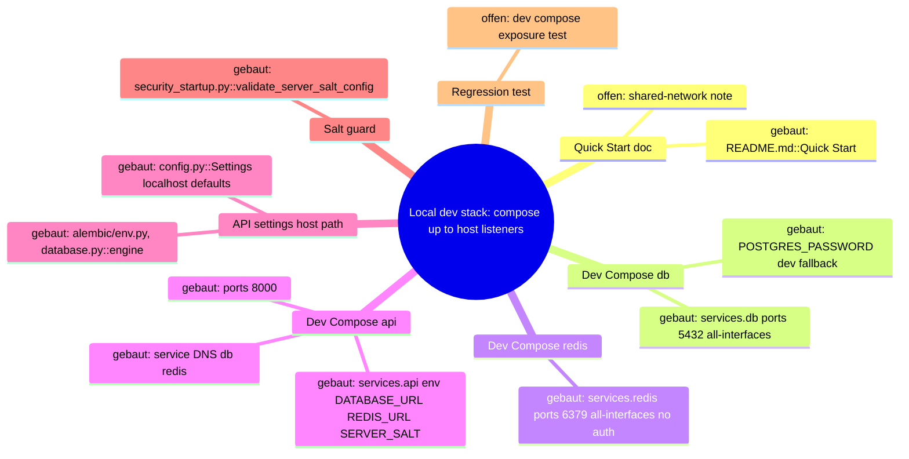
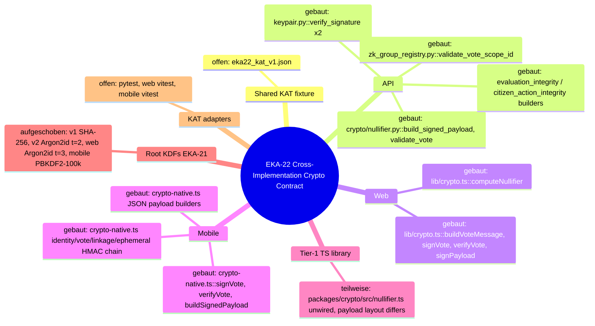

# Architecture Map — EKA-18 Local Developer Stack / Compose Exposure Boundary

Basis: `origin/main 2bfda8e40dbd66c1486936f3594d7b232eb7606d` · Task: T-481 · Mapping only, no fix.
Node: Local Developer Stack / Compose Exposure Boundary.

## 1. Grundidee

- Ekklesia.gr is a digital direct-democracy platform where Greek citizens vote on real parliamentary bills and municipal decisions (`README.md` "What is Ekklesia?").
- A developer brings the platform up locally by starting the datastores via Compose, then running migrations/seeds and the API/web on the host (`README.md::Quick Start` steps 2–5).
- The Compose stack `infra/docker/docker-compose.yml` defines `db` (PostgreSQL), `redis` and `api` on one default Docker network.
- Host-side tools (alembic, seeds, host uvicorn) reach the datastores through the published host ports using `apps/api/config.py::Settings` defaults (`localhost` DB/Redis).
- System boundary of this node: the host network listeners created by Compose `ports:` plus the credentials interpolated into `environment:`. Production compose (`infra/docker/docker-compose.prod.yml`) is a separate neighbour and not on this trace.
- Audit record: `docs/community-audits/EKA_PNYX_Full_Scope_Audit_2026-09-15.md::EKA-18` (Info, "accepted risk if developers do not run it on shared networks; note in README").

## 2. Spur (one trace, hops opened)

| # | From → To | Datum over the edge |
| --- | --- | --- |
| H1 | `README.md::Quick Start` step 2 → `infra/docker/docker-compose.yml` | `cd infra/docker && docker compose up -d` (project dir = `infra/docker`, no `.env` present there) |
| H2 | `docker-compose.yml::services.db.environment` → Compose interpolation | `POSTGRES_PASSWORD: ${DB_PASSWORD:-<dev literal>}`; unset shell var ⇒ public dev literal |
| H3 | `docker-compose.yml::services.db.ports` → host listener | short syntax `"5432:5432"`, no `host_ip` ⇒ bind on all host interfaces |
| H4 | `docker-compose.yml::services.redis.ports` → host listener | `"6379:6379"`, no `host_ip`; no `command`/`requirepass` ⇒ unauthenticated Redis on all interfaces |
| H5 | `docker-compose.yml::services.api.environment` → API container | `DATABASE_URL=…${DB_PASSWORD:-<dev literal>}@db/ekklesia`, `REDIS_URL=redis://redis:6379`, `SERVER_SALT=${SERVER_SALT:-<dev literal>}`, `ENV=development` |
| H6 | API container → `db`/`redis` via service DNS | internal Docker network `default`; does **not** use host ports |
| H7 | `docker-compose.yml::services.api.ports` → host listener | `"8000:8000"`, all interfaces; uvicorn `--host 0.0.0.0 --reload` |
| H8 | `README.md::Quick Start` steps 3–4 → `apps/api/config.py::Settings` | host `alembic upgrade head`, seeds, `uvicorn main:app` read `database_url` (`…@localhost/ekklesia`, same dev literal) and `redis_url` (`redis://localhost:6379`) |
| H9 | `apps/api/alembic/env.py` (l.25–27) / `apps/api/database.py::engine` → host port 5432 | `settings.database_url` ⇒ requires DB published at least on host loopback |
| H10 | `apps/api/security_startup.py::validate_server_salt_config` | `ENV=development` ⇒ weak `SERVER_SALT` only warns (non-production), fail-closed only in production |

Static reproducer result (run 2026-09-28, `DB_PASSWORD`/`SERVER_SALT` unset, no containers started):
`docker compose -f infra/docker/docker-compose.yml config --format json` ⇒
`db  ports=[host_ip=<absent>, 5432→5432]`, `redis ports=[host_ip=<absent>, 6379→6379]`, `api ports=[host_ip=<absent>, 8000→8000]`, all on network `default`; `POSTGRES_PASSWORD`, `DATABASE_URL`, `SERVER_SALT` resolve to dev-fallback literals; `REDIS_URL` carries no credentials.

## 3. Module

| Modul | Eine Aufgabe | Einstieg | Stand |
| --- | --- | --- | --- |
| Quick Start doc | tells developers how to start the local stack | `README.md::Quick Start` | gebaut (no shared-network warning — EKA-18 audit asked for one) |
| Dev Compose: db | local PostgreSQL with dev credential | `infra/docker/docker-compose.yml::services.db` | gebaut; exposure = Befund |
| Dev Compose: redis | local Redis cache/limits | `infra/docker/docker-compose.yml::services.redis` | gebaut; exposure = Befund |
| Dev Compose: api | containerised API with reload | `infra/docker/docker-compose.yml::services.api` | gebaut |
| Compose interpolation | resolves `${VAR:-default}` from shell/`.env` | Compose engine (`docker compose config`) | gebaut (external tool) |
| API settings | host-side default connection strings | `apps/api/config.py::Settings` | gebaut |
| DB access (host path) | migrations and ORM engine | `apps/api/alembic/env.py`, `apps/api/database.py::engine` | gebaut |
| Salt startup guard | fail closed on weak salt in production | `apps/api/security_startup.py::validate_server_salt_config` | gebaut (dev = warn only, by design) |
| Compose exposure regression test | pin loopback-only datastore binding | — | offen |
| Production compose | prod stack | `infra/docker/docker-compose.prod.yml` | aufgeschoben (neighbour, out of scope; not on trace) |

## 4. Verdrahtung

- README Quick Start → dev compose: `docker compose up -d` from `infra/docker` starts `db`, `redis`, `api`.
- Compose interpolation → db/api: unset `DB_PASSWORD` yields the public dev literal for both `POSTGRES_PASSWORD` and `DATABASE_URL`, so they stay consistent.
- db.ports → host: `5432` published on every host interface (no `host_ip`).
- redis.ports → host: `6379` published on every host interface, no auth.
- api → db/redis: service DNS `db` / `redis` on network `default`; independent of `ports:`.
- api.ports → host: `8000` on every interface (API surface, has its own auth/rate limits).
- Host tools → db/redis: `config.py::Settings` defaults hit `localhost:5432` / `localhost:6379`; this is the legitimate reason the datastore ports are published at all.
- Compose `ENV=development` → salt guard: weak salt only logs a warning.

## 5. Widerspruch und Lücken

**Symptom:** any host on the same LAN/Wi-Fi/VPN (or the internet, on a cloud VM without a filtering firewall) can reach `<dev-host>:5432` and `<dev-host>:6379`.

**Ursache (separated):**
1. **Host publishing on all interfaces** — H3/H4: `ports` short syntax without `host_ip`. This is the root cause of reachability; the other two only determine impact.
2. **Weak DB fallback** — H2: `${DB_PASSWORD:-<dev literal>}`; the literal is public in the repo, so reachability ⇒ full DB login.
3. **Unauthenticated Redis** — H4: no `requirepass`; reachability ⇒ read/write of rate-limit and application state used by `rate_limit.py`, `routers/{identity,newsletter,notify,payments,public_api,contact}.py` and `main.py`.

**Source → Sink:** `README.md::Quick Start` → `docker-compose.yml::services.{db,redis}.ports` (no `host_ip`) → Docker port publisher on `0.0.0.0`/`::` → network client authenticates with the repo-public literal (DB) or no auth (Redis) → read/write of local dev data.

**Angreifervoraussetzung:** network-adjacent to the developer host (same L2/L3 segment, shared Wi-Fi, VPN, or public IP on a cloud dev VM), developer followed Quick Start without exporting `DB_PASSWORD`. No local code execution needed. Impact limited to dev data (seeded bills, local test identities); real production data is only at risk if a developer imports prod dumps locally. On Linux, Docker-published ports bypass UFW-style host rules — firewall itself is out of scope.

**Sicherheitsinvariante:** dev datastores whose credentials are repo-public or absent are never reachable from a non-loopback host interface; the API container keeps reaching them over the internal Compose network, and host tools keep reaching them over loopback.

**Legitimer lokaler Kontrollpfad (must keep working):**
- H8/H9: host alembic, seeds and host uvicorn via `localhost:5432` / `localhost:6379` (`config.py::Settings` defaults).
- H6: `api` container → `db`/`redis` by service DNS — unaffected by `ports:` changes.
- Host GUI/CLI clients (psql, redis-cli) on the developer machine via loopback.

**Nicht automatisch betroffen:**
- API port 8000 (H7): public-by-purpose HTTP surface with its own auth; LAN access may be used for device testing. Not part of EKA-18; leave as is (could be a separate hardening note).
- Internal service-DNS flows (H6): no host listener involved.
- `SERVER_SALT` dev fallback (H5/H10): only affects nullifier derivation of local dev identities; guarded fail-closed in production by `security_startup.py`. Not part of the exposure fix.

**Lücken / Widerspruch:**
- Audit EKA-18 says "note in README"; `README.md::Quick Start` contains no such note.
- No regression test pins the dev compose port binding (module `offen`).
- `apps/api/config.py::Settings.database_url` duplicates the same dev literal as the compose fallback. Changing the compose fallback to a required var (`${DB_PASSWORD:?}`) would break H8/H9 unless `config.py`/`.env` also change ⇒ that opens a second hop and is **not** the narrowest fix.
- Redis `requirepass` would break every host-side `redis://localhost:6379` default (`config.py`, `main.py`, several routers) ⇒ multi-file change, not narrowest; Redis-auth for production is out of scope anyway.
- IPv6: `127.0.0.1:` binds IPv4 loopback only; host tools resolving `localhost` to `::1` first fall back to IPv4 (asyncpg/redis-py try all addresses). Verify on the fix PR.

## 6. Diagrammdateien

- `docs/architecture/map.puml` (mindmap + component diagram)
- `docs/architecture/main-path.puml` (sequence of the trace)
- PlantUML not installed on the mapping host ⇒ sources written, not rendered.



## 7. Nächster Schritt (engste Reparaturgrenze)

**Modul:** Dev Compose (db, redis). **Hop:** H3 + H4 (`services.{db,redis}.ports`).

**Fix contract (for a later, separately approved run):**
1. `infra/docker/docker-compose.yml`: `db.ports` → `"127.0.0.1:5432:5432"`, `redis.ports` → `"127.0.0.1:6379:6379"`. Nothing else in the file (keep fallbacks, keep `api` 8000, keep `version`).
2. New focused test `apps/api/tests/test_dev_compose_exposure.py` (static YAML parse; PyYAML comes transitively via `uvicorn[standard]` — use `pytest.importorskip("yaml")`):
   - negative: every `ports` entry of `db` and `redis` has host IP `127.0.0.1` (short or long syntax `host_ip`); fail on missing host IP, `0.0.0.0`, `::`.
   - positive control (host tools): `db` publishes target 5432 and `redis` target 6379 on loopback (published port still present ⇒ `config.py` localhost defaults still work).
   - positive control (internal network): `api.environment.DATABASE_URL` host is `db`, `REDIS_URL` host is `redis`, and `api.depends_on` contains both.
   - out-of-scope guard: `api` ports are not asserted.
3. `README.md::Quick Start`: one note — datastores bind to loopback only; dev credentials are public, never run this compose on shared/prod hosts; set `DB_PASSWORD` for anything non-local.

**Vorher-Reproducer (static, no containers):**
```bash
cd infra/docker && env -u DB_PASSWORD docker compose -f docker-compose.yml config --format json \
 | python3 -c 'import json,sys; s=json.load(sys.stdin)["services"]; [print(n,[(p.get("host_ip","<all>"),p["published"],p["target"]) for p in s[n].get("ports",[])]) for n in ("db","redis","api")]'
# before fix: db/redis/api show host_ip <all>
# after fix:  db/redis show 127.0.0.1; api unchanged; api env still targets db / redis
```

**Unberührt bleiben:** `infra/docker/docker-compose.prod.yml`, `infra/docker/app.yml`, `infra/hetzner/*`, mirror compose, `apps/api/config.py`, `apps/api/main.py`, routers, `security_startup.py`, `.env*`, workflows, packages/lockfiles. Neighbour files enter scope only if a hop above proves they define H3/H4 — none do.

---

# Architecture Map — EKA-22 Cross-Implementation Crypto Contract (KAT path)

Basis: `origin/main 4cc11930f4be82ba2d012def487fb34abca9da26` · Task: T-489 · Mapping only, no test or product code.
Node: Cross-Implementation Crypto Contract. Hop: shared deterministic fixture → workspace test adapter → existing API/Web/Mobile crypto symbols → expected bytes/hex/errors.
The EKA-18 map above stays unchanged; this section adds a second node.

## 1. Grundidee

- Citizens sign votes and personal reads client-side with Ed25519; the server only verifies signatures and never holds the private key (`CLAUDE.md` Sicherheitsprinzipien; `apps/api/keypair.py::verify_signature`).
- Three client/server stacks encode the same logical messages: API (Python/PyNaCl), Web (`apps/web/src/lib/crypto.ts`, `@noble/curves`), Mobile (`apps/mobile/src/lib/crypto-native.ts`, `@noble/*`); a Tier-1 library `packages/crypto/src` mirrors the mapped identity/vote/linkage/ephemeral HMAC chain.
- EKA-22 (Low, open): no cross-implementation known-answer vectors exist; every suite asserts only its own side (`docs/community-audits/EKA_PNYX_Crypto_Deep_Audit_2026-09-15.md` §EKA-22).
- EKA-21 (Medium, open, Gio-gated): the phone→root KDF deliberately diverges in three places (same audit §EKA-21; plan row E in `docs/planning/EKA_REMEDIATION_AND_REDESIGN_PLAN_2026-09-19.md:120`).
- Boundary of this node: deterministic pure functions (canonical encoders, HMAC derivations from a fixed root, Ed25519 sign/verify, validators). Storage, network, KDF choice and all product files are outside.

## 2. Spur (hops opened)

| # | From → To | Datum over the edge |
| --- | --- | --- |
| K1 | `apps/web/src/app/[locale]/bills/[id]/page.tsx:98` → `apps/web/src/lib/crypto.ts::signVote` (l.98) → `buildVoteMessage` (l.79–85) | UTF-8 `"{bill_id}:{VOTE.toUpperCase()}:{nullifier_hash}"`, Ed25519 sig hex(128) |
| K2 | `apps/mobile/src/screens/VoteScreen.tsx:363–367` → `crypto-native.ts::signVote` (l.362–371) / `verifyVote` (l.504–513) | same string **without** `toUpperCase()`; screen passes `"YES"/"NO"/…` keys (l.33) |
| K3 | `apps/api/routers/voting.py:658–660` → `keypair.py::verify_signature` | server rebuilds `f"{bill_id}:{vote.upper()}:{nullifier_hash}"`; also l.911 (correction). Import at l.44–46 inserts `packages/crypto` on `sys.path`, so `packages/crypto/keypair.py` shadows `apps/api/keypair.py` (docstring `apps/api/keypair.py:18`) |
| K4 | `packages/crypto/keypair.py::verify_signature` (l.50–74) / `apps/api/keypair.py::verify_signature` (l.15–36) | wrong type / non-hex / wrong length / bad sig ⇒ `False`; other exceptions ⇒ `SignatureVerificationError` |
| K5 | `apps/api/routers/voting.py:482–493` → `apps/api/crypto/nullifier.py::validate_vote` (l.131–197) → `build_signed_payload` (l.88–110) | Tier-1 canonical bytes: `bill_id_utf8 ‖ choice_utf8 ‖ pk_eph(32) ‖ vote_nullifier(32) ‖ linkage_tag(32) ‖ u64be(ts)`; error codes `VERSION_MISMATCH`, `INVALID_BILL_ID`, `INVALID_CHOICE`, `INVALID_HEX`, `INVALID_SIGNATURE_FORMAT`, `TIMESTAMP_EXPIRED`, `DUPLICATE_VOTE`, `INVALID_SIGNATURE`; `now_ms` injectable (l.135) |
| K6 | `crypto-native.ts::signVoteEphemeral` (l.557–586) → `buildSignedPayload` (l.538–552) | same layout as K5 (raw concat, u64be); `timestamp_ms = Date.now()` (l.571) |
| K7 | `packages/crypto/src/nullifier.ts::buildVotePayload` (l.307) → `buildSignedPayload` (l.272–295) | **different** layout: `0x01 ‖ u16be(len) ‖ bill_id ‖ choice_byte{YES:1,NO:2,ABSTAIN:3} ‖ pk_eph ‖ vote_nullifier ‖ linkage_tag ‖ u64be(ts)` |
| K8 | `crypto-native.ts::deriveIdentityCommitment/deriveVoteNullifier/deriveEphemeralKeypair/deriveLinkageTag` (l.118–149) ≡ `packages/crypto/src/nullifier.ts` l.176/218/252/237 with `types.ts::DOMAIN` (l.31–39) | `HMAC-SHA256(root, DOMAIN.X [+ ":" + bill_id])`; linkage = `HMAC(HMAC(root, LINKAGE_TAG), bill_id)`; ephemeral sk = seed. Polis derivation is excluded because `packages/crypto/src/polis.ts` adds a separate `POLIS_TICKET_KEY` hop. |
| K9 | `apps/api/crypto/nullifier.py::issue_receipt` (l.202–225) → `packages/crypto/src/nullifier.ts::verifyReceipt` (l.347–370) | `bill_id_utf8 ‖ vote_nullifier(32) ‖ u64be(ts)`; server ts = `time.time()` (not injectable) |
| K10 | `apps/api/routers/municipal.py:255–257`, `apps/api/routers/zk.py:760–761`, `crypto-native.ts::signZkOptInPayload` (l.496) | scope strings `"municipal:{ada}:{VOTE}:{nullifier}"`, `"zk_opt_in:{bill_id}:{commitment}:{nullifier}"` |
| K11 | `apps/api/services/zk_group_registry.py::validate_vote_scope_id` (l.19–28) | `^(bill|municipal|regional):[A-Za-z0-9._-]{1,110}$` after `strip()`, else `ValueError` |
| K12 | `apps/api/services/evaluation_integrity.py::build_evaluation_v2_payload` (l.35–48), `build_evaluation_read_payload` (l.58–69), `citizen_action_integrity.py::build_vote_status_read_payload` (l.29–39) ↔ `crypto-native.ts::buildEvaluationV2Payload` (l.388–408), `buildEvaluationReadPayload` (l.430–439), `buildVoteStatusReadPayload` (l.451–460) | `"<prefix>:" + JSON([..])`; Python `json.dumps(ensure_ascii=False, separators=(",",":"))` vs JS `JSON.stringify`; both sort score pairs and reject duplicate `question_id` |
| K13 | Root KDFs: `packages/crypto/nullifier.py::generate_nullifier_hash` (l.37–51), `generate_nullifier_hash_v2` (l.54–82) + `normalize_phone_number` (l.22–34); `packages/crypto/src/nullifier.ts::deriveNullifierRoot` (l.130–139) + `normalizePhone` (l.58–64); `crypto-native.ts::deriveNullifierRoot` (l.104–112) + `normalizePhone` (l.90–96); `apps/web/src/lib/crypto.ts::computeNullifier` (l.62–70) | inventory only, see §5 |
| K14 | Existing tests: `apps/api/tests/test_nullifier.py` (K5 validators), `packages/crypto/tests/test_crypto.py` (K4, v1 hash), `packages/crypto/src/crypto.test.ts` (`TEST_ROOT = 0xab×32`, l.51), `apps/web/src/lib/crypto-compat.test.ts` (RFC 8032 vector 1, web-only), `apps/mobile/src/lib/crypto-native-{evaluation,vote-status,zk}.test.ts` (`vi.mock("expo-secure-store")`) | each asserts one side; none reads a shared file |

Not opened (not on map): `packages/crypto/hlr.py`, `apps/api/crypto/polis.py`, `packages/crypto/src/polis.ts`, mobile POLIS screens, ZK/Semaphore proof code, compass AES/HKDF.

## 3. Module

| Modul | Eine Aufgabe | Einstieg | Stand |
| --- | --- | --- | --- |
| API signature verifier | verify Ed25519 over UTF-8/bytes, malformed ⇒ False | `packages/crypto/keypair.py::verify_signature` (runtime) + `apps/api/keypair.py::verify_signature` (mirror) | gebaut (two copies) |
| API legacy vote payload | rebuild `"{bill}:{VOTE}:{nullifier}"` | `apps/api/routers/voting.py:658` (inline f-string) | gebaut; no importable builder |
| API Tier-1 validator | canonical bytes + validation codes | `apps/api/crypto/nullifier.py::build_signed_payload`, `validate_vote` | gebaut |
| API receipt signer | server-signed receipt | `apps/api/crypto/nullifier.py::issue_receipt` | gebaut; ts not injectable |
| API scope validator | bill/municipal/regional scope id grammar | `services/zk_group_registry.py::validate_vote_scope_id` | gebaut |
| API JSON integrity payloads | evaluation v2/read, vote-status read | `services/evaluation_integrity.py`, `services/citizen_action_integrity.py` | gebaut |
| Python root KDF (server) | v1 SHA-256 / v2 Argon2id identity nullifier | `packages/crypto/nullifier.py` | gebaut; EKA-21 divergence |
| Web legacy signer | build/sign/verify legacy vote message | `apps/web/src/lib/crypto.ts::buildVoteMessage/signVote/verifyVote/signPayload` | gebaut |
| Web v1 nullifier helper | `SHA-256(phone:salt)` | `apps/web/src/lib/crypto.ts::computeNullifier` | gebaut; no caller opened |
| Tier-1 TS library | Argon2id root, HMAC chain, length-prefixed payload, receipt verify | `packages/crypto/src/nullifier.ts` | teilweise — no import from `apps/web` or `apps/mobile` found (grep); payload layout incompatible with K5 |
| Mobile crypto | PBKDF2 root, HMAC chain, legacy + Tier-1 + JSON payload signers | `apps/mobile/src/lib/crypto-native.ts` | gebaut |
| Shared KAT fixture | one secret-free vector file read by all suites | — | offen |
| Workspace KAT adapters | API/Web/Mobile tests reading the fixture | — | offen |

## 4. Verdrahtung

- Fixture → API adapter: pytest loads JSON, calls K4/K5/K11/K12 symbols; `validate_vote(now_ms=fixture.now_ms)` makes the timestamp path deterministic.
- Fixture → Web adapter: vitest loads the same JSON, calls `buildVoteMessage`, `signVote`, `verifyVote`, `signPayload`, `computeNullifier`.
- Fixture → Mobile adapter: vitest with `vi.mock("expo-secure-store")` (pattern of existing mobile tests) calls K2/K6/K8/K10/K12 builders and derivations from a fixed root.
- Fixture → Tier-1 lib adapter (optional): vitest in `packages/crypto` calls K7/K8/K9; K7 is expected to diverge.
- Web signVote → API verifier: legacy string equality after uppercase (K1 ↔ K3).
- Mobile signVote → API verifier: equality only when caller passes uppercase (K2 ↔ K3).
- Mobile buildSignedPayload → API validate_vote: identical Tier-1 bytes (K6 ↔ K5).
- Tier-1 lib buildSignedPayload → API validate_vote: bytes differ (K7 ≠ K5).
- API issue_receipt → Tier-1 lib verifyReceipt: same layout (K9).
- Mobile JSON builders → API JSON builders: same prefix and compact JSON (K12).

## 5. Widerspruch und Lücken — classified for the fixture

**A. Gemeinsam identische Outputs (strict byte/hex equality across implementations)**
1. Ed25519 deterministic signatures (RFC 8032): same 32-byte test seed + same message ⇒ same pk/sig hex in PyNaCl (`sign_payload`) and noble (web `signPayload`, mobile `ed25519.sign`). Use RFC 8032 public test vectors only.
2. Legacy vote message for uppercase choice: web `buildVoteMessage` = mobile `signVote` message = API `voting.py:658` string (K1/K2/K3).
3. Scope-prefixed strings: `municipal:{ada}:{VOTE}:{nullifier}` (API K10; no mobile builder in `crypto-native.ts`), `zk_opt_in:{bill}:{commitment}:{nullifier}` (API K10 ↔ mobile K10).
4. Tier-1 canonical bytes API `build_signed_payload` ↔ mobile `buildSignedPayload` (K5/K6), including u64 big-endian timestamp.
5. HMAC chain from a fixed test root: mobile K8 ≡ Tier-1 lib K8 for `identity_commitment`, `vote_nullifier(bill)`, `ephemeral pk(bill)` and `linkage_tag(bill)`. Polis keys are not cross-implementation-identical on this hop and remain implementation-specific. Python has **no production symbol** for this chain (`apps/api/crypto/nullifier.py:9` "Does NOT contain key derivation"); a Python stdlib `hmac` oracle in the test is a re-implementation, not an API binding.
6. JSON integrity payloads K12 (evaluation v2 with unsorted input, evaluation read incl. `null` ada, vote-status read), including a non-ASCII (Greek) `bill_id`/`ada` case to pin `ensure_ascii=False` ≡ `JSON.stringify`.
7. v1 nullifier `SHA-256("{phone}:{salt}")`: Python `generate_nullifier_hash` ≡ web `computeNullifier` **with a synthetic phone and a test-only salt** (Python reads `SERVER_SALT` at import, l.13 ⇒ adapter must monkeypatch the module attribute; never a real salt).
8. Receipt bytes layout K9 (API ↔ Tier-1 lib); API side only by signing a fixture-fixed ts in the test, because `issue_receipt` uses `time.time()`.
9. Bill/scope domain separation: `vote_nullifier(bill A) ≠ vote_nullifier(bill B)`, `linkage_tag` and `ephemeral pk` likewise, and `DOMAIN.*` strings pairwise distinct (types.ts l.31–39 vs crypto-native l.38–44 — mobile lacks `POLIS_NULLIFIER`/`POLIS_TICKET_KEY`, not used by it).

**B. Nur gemeinsam validierbar (same accept/reject verdict, not same bytes/error type)**
1. Tampered message / wrong key ⇒ reject everywhere: API `False`, web `false`, mobile `verifyVote` `false`.
2. Malformed hex / wrong length: API `False` (K4) and `INVALID_HEX` / `INVALID_SIGNATURE_FORMAT` (K5); web `verifyVote` catches ⇒ `false`; mobile `verifyVote` has **no try/catch** (l.504–513) ⇒ noble throws. Web/mobile `hexToBytes` silently map non-hex to `0` and truncate odd length (web l.32–38, mobile l.65–71) ⇒ only the verdict "not accepted" is shared; the adapter must accept `false | throw` for mobile.
3. Uppercase hex: API `_is_hex` accepts uppercase (`test_nullifier.py:106–108`); TS `bytesToHex` always emits lowercase ⇒ fixture stores lowercase only.
4. Lowercase choice: web uppercases, API uppercases, mobile signs raw ⇒ `"yes"` yields a mobile signature the API rejects. Record as expected-reject case, do not fix.
5. Duplicate `question_id`: Python `ValueError`, mobile `Error` ⇒ both throw. Score range −5…5 is checked by mobile only (l.398); Python builder not range-checking — server-side range check not opened.
6. Scope id grammar K11: only API validates; clients have no validator ⇒ API-only negative vectors (`"state:1"`, empty id, 111 chars, whitespace-padded accepted after strip).
7. `TIMESTAMP_EXPIRED` / `DUPLICATE_VOTE` / `VERSION_MISMATCH` / `INVALID_CHOICE`: API-only error codes; clients have no equivalent.

**C. Bekannte KDF-Divergenz — inventory only, must not be equalised without EKA-21 (Gio-gated)**

| Impl | Symbol | KDF + params | Salt | Normalisation |
| --- | --- | --- | --- | --- |
| Server v1 | `packages/crypto/nullifier.py::generate_nullifier_hash` | SHA-256, 1 pass | `":" + SERVER_SALT` (secret) | none (raw input) |
| Server v2 | `…::generate_nullifier_hash_v2` | Argon2id t=2, m=65536 KiB, p=1, 32 B, output `"v2:"+hex` | `SHA-256("ekklesia:identity-nullifier:v2" ‖ SERVER_SALT)` | strip `[\s().-]`; `00…`→`+…`; `30`+12→`+`; `69`+10→`+30`; otherwise passthrough (never throws) |
| Web Tier-1 lib | `packages/crypto/src/nullifier.ts::deriveNullifierRoot` | Argon2id (hash-wasm) t=3, m=65536, p=1, 32 B | `REGISTRATION_SALT` (public, types.ts l.26) | strip all non-digits; `30`+12 / `0030…` / 10 digits `6…` → `+30…`; else **throw** |
| Mobile | `crypto-native.ts::deriveNullifierRoot` | PBKDF2-SHA256 c=100000, 32 B | `REGISTRATION_SALT` | same as Tier-1 lib (message text differs) |
| Web legacy | `apps/web/src/lib/crypto.ts::computeNullifier` | SHA-256 | `":" + serverSalt` argument | none |

Contradictions: `ARGON2_PARAMS` is declared in `crypto-native.ts:31–36` but unused; `nullifier.ts:56` docstring accepts `06912…`-style 11-digit input but the code throws on it; `packages/crypto/src` is not wired into any app although `CLAUDE.md` describes web Tier-1; Tier-1 payload layouts K5/K6 vs K7 disagree while both files claim to "match exactly" (`nullifier.py:99`, `crypto-native.ts:536`).
Gaps: no importable Python builder for the legacy vote string (inline in routers); Python lacks the HMAC chain; `issue_receipt` and `signVoteEphemeral` read wall-clock time (adapter must use their pure sub-builders or fake timers).

## 6. Diagrammdateien

- `docs/architecture/map.puml` — EKA-22 mindmap + component diagram appended after the EKA-18 diagrams.
- `docs/architecture/main-path.puml` — EKA-22 sequence appended.
- No `plantuml` on `PATH`; `java -jar ~/.local/share/plantuml/plantuml.jar -checkonly` passed and `-tsvg` rendered all 6 diagrams to a temp dir (SVGs not committed).



## 7. Nächster Schritt — one test-only node

**Knoten:** Shared KAT fixture + workspace KAT adapters (module rows `offen`). **Hop:** fixture → adapter → existing symbols → expected bytes/hex/errors. No production file changes; a failing strict vector is reported, not fixed.

**Fixture schema** `packages/crypto/tests/vectors/eka22_kat_v1.json` (generated once by the Python adapter's `--regen` helper or by hand, then committed; never auto-regenerated in CI):
```json
{
  "schema": "ekklesia-kat", "version": 1, "source_commit": "<sha>",
  "keys": [{"id": "rfc8032-1", "seed_hex": "<RFC 8032 test 1 secret>", "pk_hex": "<…>"}],
  "roots": [{"id": "test-root-ab", "root_hex": "ab…ab"}],
  "cases": [
    {"id": "legacy-vote-yes", "class": "identical", "kind": "legacy_vote_message",
     "input": {"bill_id": "TEST-BILL-1", "vote": "YES", "nullifier_hash": "<64 lowercase hex, synthetic>"},
     "expect": {"message_utf8_hex": "…", "sig_hex": "…", "key": "rfc8032-1"}, "impls": ["api","web","mobile"]},
    {"id": "tier1-payload", "class": "identical", "kind": "tier1_signed_payload", "impls": ["api","mobile"],
     "expect_divergent": {"tier1_lib": "EKA-22 layout mismatch K7"}},
    {"id": "hmac-chain-bill-A", "class": "identical", "kind": "hmac_chain", "root": "test-root-ab", "impls": ["mobile","tier1_lib"]},
    {"id": "bad-hex-sig", "class": "validatable", "kind": "verify", "expect": {"accepted": false},
     "impl_error": {"api": "False", "api_tier1": "INVALID_SIGNATURE_FORMAT", "web": "false", "mobile": "false|throw"}},
    {"id": "scope-bad-prefix", "class": "validatable", "kind": "scope_id", "impls": ["api"], "expect": {"error": "ValueError"}}
  ],
  "kdf_inventory": {
    "class": "implementation_specific", "gate": "EKA-21",
    "entries": [{"impl": "mobile-pbkdf2-c100000", "input": "<SYNTHETIC_PHONE>", "normalized": "…", "root_hex": "…"}]
  }
}
```
Rules: `class ∈ {identical, validatable, implementation_specific}`; `kdf_inventory` entries are compared **only within their own `impl`** (regression pins), never across; no cross-impl equality key may exist for KDF roots; server-v2 entries use a fixture-only placeholder salt; only RFC 8032 public test keys, synthetic bill ids, synthetic all-lowercase hex nullifiers and a clearly synthetic phone placeholder — no real numbers, keys or `SERVER_SALT`. Argon2id vectors are slow (64 MiB); mark them `slow: true`.

**Reading the same file:**
- Python: `json.loads(Path(__file__).parents[N] / "packages/crypto/tests/vectors/eka22_kat_v1.json")`, `pytest.mark.parametrize` over `cases` filtered by `"api" in impls`.
- Web / Mobile / Tier-1 lib (vitest): `JSON.parse(readFileSync(new URL("<relative path>", import.meta.url)))` via `node:fs`, `it.each` filtered by impl; mobile keeps `vi.mock("expo-secure-store")`.

**Minimal test files (Folgebrief):**
- `packages/crypto/tests/vectors/eka22_kat_v1.json`
- `apps/api/tests/test_eka22_kat_vectors.py` (both `verify_signature` copies, `build_signed_payload`, `validate_vote` codes with injected `now_ms`, `validate_vote_scope_id`, K12 builders, v1 hash with monkeypatched salt)
- `apps/web/src/lib/crypto-kat.test.ts`
- `apps/mobile/src/lib/crypto-native-kat.test.ts`
- optional `packages/crypto/src/crypto-kat.test.ts` (Tier-1 lib; K7 as documented divergence)

**Unberührt bleiben:** every production file listed in §2/§3 (`keypair.py` ×2, `packages/crypto/nullifier.py`, `apps/api/crypto/nullifier.py`, routers, services, `apps/web/src/lib/crypto.ts`, `apps/mobile/src/lib/crypto-native.ts`, `packages/crypto/src/*.ts` non-test), `package.json`/lockfiles, vitest/pytest configs, CI workflows, DB, env/secrets. If a vitest config blocks reading outside its root, that is a stop-and-report, not a config change.
