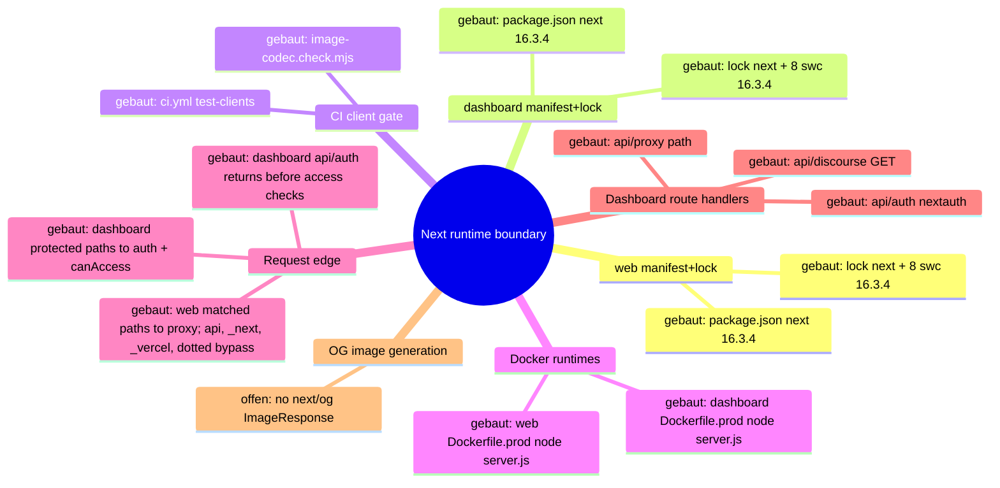

# Architecture Map — Next Runtime Dependency Boundary (T-485)

Scope: `apps/web` + `apps/dashboard` Next.js runtimes against
GHSA-vcvr-r3jv-pc5j (`next` >=16.2.0 <16.3.6, patched 16.3.6; RCE needs Node.js
`next/og` `ImageResponse` rendering attacker-controlled SVG content/attributes/styles).
Base: `origin/main` 49e449a3bc9af1000e9d111fba9b9da2e27d673c. Read-only run: no
package, lock, source or config change. Existing maps (`EKKLESIA_V2_MINIMA.md`,
`FEDERATION.md`) stay untouched.

## 1. Grundidee

- Ekklesia.gr is a digital direct-democracy platform for Greek citizens (`apps/web/src/app/[locale]/layout.tsx::metadata.openGraph.description`).
- Citizens use the public web runtime (`apps/web`, port 3000) for bills, VAA, results (`apps/web/src/app/[locale]/**/page.tsx`).
- Operators use the auth-gated admin dashboard (`apps/dashboard`, port 3001) (`apps/dashboard/src/proxy.ts::proxy`, `apps/dashboard/package.json::scripts.start`).
- Both are standalone Next builds served by `node server.js` in Docker (`apps/{web,dashboard}/next.config.*::output`, `apps/{web,dashboard}/Dockerfile.prod::CMD`).
- Boundary of this map: the `next` package version as it flows from manifest to running route handlers, plus the advisory's `next/og` sink.

## 2. Spur (opened hops)

1. `apps/web/package.json::dependencies.next` = `16.3.4` (exact) → `apps/web/package-lock.json::packages["node_modules/next"]` = 16.3.4, `engines.node >=20.9.0`.
2. `apps/dashboard/package.json::dependencies.next` = `16.3.4` (exact) → `apps/dashboard/package-lock.json::packages["node_modules/next"]` = 16.3.4.
3. Lock `node_modules/next` → 8 platform `node_modules/@next/swc-*` entries, each 16.3.4 (both locks); `sharp` 0.35.4 via `overrides`.
4. Lock → `.github/workflows/ci.yml::test-clients` (`npm ci` → `image-codec.check.mjs` → lint → typecheck → [web: vitest] → `npm run build`).
5. Lock → `apps/web/Dockerfile.prod` (`npm ci` with repo `.npmrc`, docs/ copied into `public/`, `npm run build`) → runner `node server.js` (context `../../`, `infra/docker/docker-compose.prod.yml::web`).
6. Lock → `apps/dashboard/Dockerfile.prod` (`npm ci --ignore-scripts`, `npm run build`) → runner `node server.js` (context `../../apps/dashboard`, `docker-compose.prod.yml::dashboard`).
7. `server.js` → the web proxy matcher excludes `/api`, `_next`, `_vercel`, and dotted paths; matched page requests enter `apps/web/src/proxy.ts::proxy` (redirects/rewrites + next-intl) → `apps/web/src/app/[locale]/*/page.tsx` (9 pages, no route handlers).
8. `server.js` → the dashboard matcher excludes `_next/static`, `_next/image`, and `favicon.ico`; matched protected pages and non-auth APIs enter `apps/dashboard/src/proxy.ts::proxy` (session gate, then role check) → `(dashboard)/*/page.tsx` (23), `api/discourse/route.ts::GET` (JSON), and `api/proxy/[...path]/route.ts` (JSON, SUPER_ADMIN). `/api/auth/*` is matched but returns before the user and `canAccess` checks to reach `api/auth/[...nextauth]/route.ts::{GET,POST}`.
9. Side-hop `request-controlled value → next/og ImageResponse SVG` — **offen / nicht verdrahtet** (evidence below).

### Sink evidence (all `git grep` on 49e449a, excluding lockfiles)

| Pattern | Scope | Hits |
| --- | --- | --- |
| `next/og`, `ImageResponse`, `new ImageResponse`, `@vercel/og` | whole repo | 0 |
| `satori`, `resvg`, `generateImageMetadata` | apps/web, apps/dashboard | 0 |
| `export const runtime` (Node vs Edge) | apps/web, apps/dashboard | 0 → all routes default Node.js runtime |
| `opengraph-image.*`, `twitter-image.*`, `icon.*`, `apple-icon.*` files | apps/web, apps/dashboard | 0 (only `public/manifest.json`) |
| `route.ts` handlers | both | 3, all dashboard, none returns images |
| `node_modules/@vercel/og`, `satori`, `@resvg/*` in locks | both locks | 0 (next's og bundle only inside `next/dist/compiled`) |

Image neighbours: `openGraph` in web layout is static text, no `images`; `next/image` in
`NavHeader.tsx`/`sso-verify/page.tsx` uses the image optimizer, not `next/og`; inline
`<svg>` literals in NavHeader/sso-verify/login are static JSX.

## 3. Module

| Modul | Eine Aufgabe | Einstieg | Stand |
| --- | --- | --- | --- |
| web manifest+lock | pin `next` for public web | `apps/web/package.json::dependencies.next` | gebaut (16.3.4, affected) |
| dashboard manifest+lock | pin `next` for admin dashboard | `apps/dashboard/package.json::dependencies.next` | gebaut (16.3.4, affected) |
| CI client gate | install + verify + build both runtimes | `.github/workflows/ci.yml::test-clients` | gebaut |
| image-codec check | assert optimizer + sharp ⊂ next's sharp range | `apps/{web,dashboard}/image-codec.check.mjs` | gebaut |
| web Docker runtime | build standalone, serve on 3000 | `apps/web/Dockerfile.prod::CMD` | gebaut |
| dashboard Docker runtime | build standalone, serve on 3001 | `apps/dashboard/Dockerfile.prod::CMD` | gebaut |
| web request edge | locale/static redirects | `apps/web/src/proxy.ts::proxy` | gebaut |
| dashboard request edge | auth + RBAC gate | `apps/dashboard/src/proxy.ts::proxy` | gebaut |
| dashboard route handlers | auth, discourse JSON, API proxy JSON | `apps/dashboard/src/app/api/**/route.ts` | gebaut |
| OG image generation | `next/og` `ImageResponse` | — | offen (no symbol) |

## 4. Verdrahtung

- `package.json::next` → lock `node_modules/next`: exact pin, lock matches 16.3.4 in both apps.
- lock `next` → `@next/swc-*`: 8 platform binaries pinned to the same 16.3.4; must move together.
- lock → CI `npm ci` / `npm run build`: CI builds both runtimes from their own lock.
- lock → `Dockerfile.prod` `npm ci`: prod image installs the same lock; web keeps install scripts per `.npmrc`, dashboard passes `--ignore-scripts`.
- `Dockerfile.prod` → `node server.js`: standalone server, Node 22.13.0-alpine.
- `server.js` → web `proxy.ts`: only matcher-selected requests enter it; `/api`, `_next`, `_vercel`, and dotted paths bypass the proxy.
- `server.js` → dashboard `proxy.ts`: matcher-selected requests enter it, but `/api/auth/*` returns before the protected user and `canAccess` checks; protected pages and the other API paths continue through those checks.
- proxy or matcher bypass → pages/route handlers: no handler or page imports `next/og`.

## 5. Widerspruch und Lücken

- (a) Versionally affected: both runtimes resolve `next` 16.3.4 ∈ [16.2.0, 16.3.6).
- (b) Exploit path not evidenced: 0 `next/og`/`ImageResponse` call sites, no metadata image files, no SVG-rendering handler. The vulnerable code ships in `next/dist/compiled` but is unreachable without an importer.
- (c) Hygiene upgrade still justified: all routes run Node.js runtime by default, so any future `ImageResponse` with request data would hit the vulnerable sink directly.
- Attacker preconditions (all missing today): a Node-runtime route/metadata file importing `next/og`; request-controlled input reaching SVG content, attributes or styles in the JSX tree; reachability without auth (web) or with an operator session (dashboard).
- Gap: install-script parity differs (web `npm ci` + `.npmrc`, dashboard `npm ci --ignore-scripts`); not changed here.
- Gap: `image-codec.check.mjs` asserts `sharp` 0.35.4 satisfies `next.optionalDependencies.sharp`; 16.3.6 range not verified in this run (no install).
- Not checked: npm registry metadata for 16.3.6, live/runtime state, builds.

## 6. Diagramme

- `docs/architecture/map.puml` (mindmap + component)
- `docs/architecture/main-path.puml` (sequence of the built path)

## 7. Nächster Schritt (single follow-fix node, T-486)

Modul: web + dashboard manifest+lock. Hop: `package.json::dependencies.next`
16.3.4 → 16.3.6 → lock `node_modules/next` + all 8 `@next/swc-*` to 16.3.6, in both apps.
Files: `apps/{web,dashboard}/package.json`, `apps/{web,dashboard}/package-lock.json` only.
Untouched: Dockerfiles, `next.config.*`, `proxy.ts`, all `src/**`, `.github/**`,
`@next/eslint-plugin-next` (#394), React, `overrides`.
Must stay green: CI `test-clients` Web + Dashboard (`image-codec.check.mjs`, lint,
typecheck, web vitest, `npm run build`), both `Dockerfile.prod` builds, and the
routes in hops 7–8 (web locale pages + proxy redirects; dashboard pages, `/login`,
`/api/auth/*`, `/api/discourse`, `/api/proxy/*`).

---

# Preserved Map Node — EKA-18 Local Developer Stack / Compose Exposure Boundary

Integrated from `origin/main` at T-486 refresh. The full evidence and acceptance
record remains in `.fleet/reports/T-481.md` and `.fleet/reports/T-482.md`.

## Module and hop

- Node: local developer stack / Compose exposure boundary.
- Hop H1: README Quick Start starts `infra/docker/docker-compose.yml`.
- Hop H2: host-side alembic, seeds, and uvicorn use the loopback defaults in
  `apps/api/config.py::Settings`.
- Hop H3: the API container uses the internal `db` and `redis` service names.
- Hop H4: only PostgreSQL and Redis host publications are narrowed to
  `127.0.0.1`; the API's port 8000 publication remains unchanged.

## Security invariant

Development datastores with repository-public or absent credentials are not
reachable through a non-loopback host interface, while host development tools
retain `localhost:5432` and `localhost:6379` access and containers retain their
service-DNS access. Production Compose, API auth, salt policy, and datastore
authentication are outside this node.

## Built state

- `infra/docker/docker-compose.yml` binds db and redis to IPv4 loopback.
- `apps/api/tests/test_dev_compose_exposure.py` pins loopback publication,
  published ports, internal service-DNS targets, and dependencies.
- README warns that the development credentials are public and the stack is not
  for shared or production hosts.

# Architecture Map — EKA-57 Knowledge-Base Refresh Lifecycle

Basis: `origin/main 4cc11930f4be82ba2d012def487fb34abca9da26` · Task: T-495 · Mapping only, no fix.
Node: API RAG knowledge lifecycle / canonical seed to deployed retrieval.

## 1. Grundidee

- The landing assistant answers from hardcoded canonical responses, the `knowledge_base` table and public bill data. This node covers only the lifecycle of the database-backed knowledge rows.
- Repository truth is currently split between a destructive SQL seed and a Python upsert seed. Neither is wired into CI or the manual deployment workflow.
- Runtime retrieval reads at most 20 rows, scores them, and gives at most five matching rows to the prompt. Duplicate or stale rows therefore change which facts are reachable.
- Legal, privacy and operator wording inside seed rows is content governance, not part of this technical lifecycle repair.

## 2. Spur (one trace, hops opened)

| # | From → To | Datum over the edge |
| --- | --- | --- |
| H1 | `scripts/seed_knowledge_base.sql` → `knowledge_base` | 17 manually maintained rows; unconditional DELETE + INSERT |
| H2 | `apps/api/scripts/seed_knowledge_base.py::ENTRIES/seed` → `knowledge_base` | 14 different rows; per-row natural-key upsert, no stale/duplicate deletion |
| H3 | Alembic `j301a2b3c4d5` → `knowledge_base` | schema only; no seed data or uniqueness constraint |
| H4 | `.github/workflows/deploy.yml` → API container | manual deployment rebuilds containers and health-checks; never runs a KB sync/check |
| H5 | `.github/workflows/ci.yml` → API tests | runs pytest, but no DB/seed drift invariant is present |
| H6 | private ignored training capture → `test_agent_training_regression.py` | test points into ignored `docs/agent-bridge`; missing file marks the whole module skipped |
| H7 | `knowledge_base` → `routers/agent.py::_build_context` | priority-ordered first 20 rows, then scored top five (or three priority fallbacks) enter prompt context |

## 3. Module

| Modul | Eine Aufgabe | Einstieg | Stand |
| --- | --- | --- | --- |
| SQL seed | legacy manual full replacement | `scripts/seed_knowledge_base.sql` | gebaut; divergent second authority |
| Python seed catalog | repository knowledge catalog | `apps/api/scripts/seed_knowledge_base.py::ENTRIES` | gebaut; selected authority by EKA-57 recommendation |
| Python synchronizer | writes catalog rows | `apps/api/scripts/seed_knowledge_base.py::seed` | partial; upserts only, permits stale/duplicate rows |
| Schema | persists RAG knowledge | Alembic `j301a2b3c4d5`, `models.KnowledgeBase` | gebaut |
| Deployment | manual production rollout | `.github/workflows/deploy.yml` | gebaut; no KB lifecycle step |
| CI | validates API changes | `.github/workflows/ci.yml` | gebaut; no exact-sync/drift contract |
| Training questions | stable assistant regression inputs | `test_agent_training_regression.py` | partial; private historical capture required, therefore skipped in CI |
| Runtime retrieval | selects KB rows for the prompt | `routers/agent.py::_build_context` | gebaut; row cap makes drift observable |

## 4. Verdrahtung

- The SQL and Python seeds are independent entry points into the same table; neither records provenance or a catalog version.
- The Python seed matches on `(category, title_en)` with `LIMIT 1`, updates one match and inserts missing rows. It cannot remove a legacy SQL-only row or a second duplicate.
- The deploy workflow is manually dispatched, pulls `main`, rebuilds changed services and checks health. It performs no KB sync or post-sync drift check.
- CI runs the API suite. The training test resolves a file under ignored `docs/agent-bridge`, so a clean checkout skips all four checks.
- Runtime loads only the first 20 priority-ordered rows before scoring. Drift above that boundary is silently invisible; duplicate topics compete for five context positions.

## 5. Widerspruch und Lücken

**Symptom:** repository state cannot determine deployed KB state. Running both seeds can leave about 27 rows; historical live evidence recorded eight; the Python catalog contains 14.

**Root causes:** two authorities (H1/H2), non-exact upsert semantics (H2), no lifecycle wiring (H4), and a skipped clean-checkout regression dataset (H6).

**Source → sink:** manual seed choice → mutable `knowledge_base` rows → capped retrieval H7 → assistant context and answer.

**Technical invariant:** one version-controlled catalog defines the complete managed table; sync is transactional, exact and idempotent; a check mode exits non-zero on missing, stale, duplicate or changed rows; the manual deploy runs sync then check; CI proves catalog uniqueness, sync/check behavior and always loads the question fixture.

**Legitimate control path:** a manually authorized deploy remains the only production trigger. The PR must not execute a deployment or touch a live database. A failed sync rolls back and makes the workflow fail; a successful sync is followed by an exact drift check.

**Content boundary:**

- Keep current Python `ENTRIES` text byte-for-byte unless a purely technical serialization change is required.
- Do not choose between “Vendetta Labs” and “V-Labs Development” or rewrite legal/privacy/security/donation claims.
- Do not publish historical captured answers, timestamps, endpoints or source responses from the private agent-bridge dataset. A tracked regression fixture may contain only test IDs, language, category and questions.
- Record wording conflicts as a Gio decision template outside the product diff.

## 6. Diagrammdateien

- `docs/architecture/map.puml` (mindmap + component trace)
- `docs/architecture/main-path.puml` (seed-to-answer sequence)
- PlantUML is not installed on the mapping host; source files are authoritative.

## 7. Nächster Schritt (engste Reparaturgrenze)

**Module:** Python seed catalog/synchronizer, manual deploy wiring, CI regression inputs. **Hops:** H1/H2/H4/H5/H6; runtime H7 is observed but unchanged.

1. Retire the executable SQL seed so `apps/api/scripts/seed_knowledge_base.py::ENTRIES` is the sole catalog without editing its wording.
2. Give the Python command explicit transactional `sync` and read-only `check` modes. Preserve IDs for matching natural keys where practical; remove stale and duplicate rows so DB equals the catalog; make reruns idempotent and fail closed.
3. Wire the manual deployment workflow to run sync and then check in the API container. Do not trigger the workflow in this task.
4. Add focused tests for unique catalog keys, exact reconciliation, duplicate/stale cleanup, rollback/error exit, idempotence, check-mode drift detection and deploy wiring.
5. Replace the ignored historical-response dependency with a tracked, sanitized question-only fixture; make the training regression tests mandatory in clean CI checkouts.
6. Produce a non-product Gio template listing content conflicts; do not resolve them in code.

Out of scope: editing seed wording, runtime retrieval/scoring/prompt behavior, schema/content migrations, live DB inspection or mutation, deployment, scheduler jobs, LLM calls and EKA-58…64.
