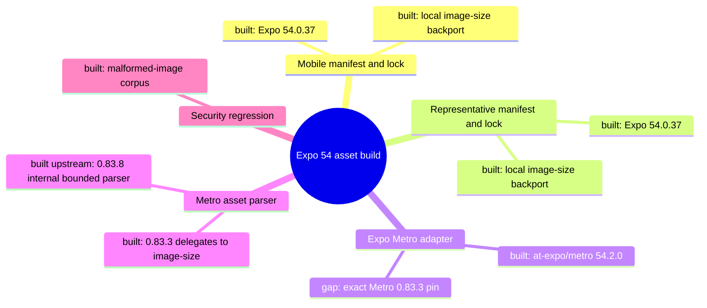

# Architecture Map — EKA-29 Metro 0.83.8 / image-size Exit

Basis: `origin/main 4cc11930f4be82ba2d012def487fb34abca9da26` · Task: T-506 · mapped before implementation, updated after proof.
Node: Mobile/Representative Build Toolchain / Expo-to-Metro asset-dimension hop.

## 1. Grundidee

- Ekklesia provides citizen and representative mobile clients built with Expo SDK 54 (`apps/mobile/package.json`, `apps/representative/package.json`).
- Expo's build toolchain reaches Metro through `@expo/metro`; the installed Expo 54 line pins `@expo/metro@54.2.0` and `metro@0.83.3` (`package-lock.json`).
- Metro reads image dimensions while bundling assets; 0.83.3 delegates that parsing to `image-size@^1.0.2` (`package-lock.json`).
- Both apps redirect that dependency to the audited local `image-size@1.2.2-pnyx.0` backport and run its focused regression test (`package.json`, `vendor/image-size/security-regression.test.mjs`).
- Four open Dependabot alerts remain because the package identity/version is still within the affected ranges (alerts 95–98).
- Metro 0.83.8 is an official 0.83.x security backport that vendors bounded image parsing and removes the `image-size` dependency (`react/metro` commit `809c36d897ef`).
- Boundary: dependency manifests/locks and existing build/security checks only; no application, native configuration, API, release, deployment or production change.

## 2. Spur

| # | From → To | Datum over the edge |
| --- | --- | --- |
| H1 | `apps/{mobile,representative}/package.json::dependencies.expo` → `package-lock.json::expo` | Expo range `~54.0.37` resolves 54.0.37 |
| H2 | `package-lock.json::@expo/metro@54.2.0` → `package-lock.json::metro` | exact Metro version `0.83.3` |
| H3 | `package-lock.json::metro@0.83.3` → root `image-size` override | `image-size@^1.0.2` is redirected to local `1.2.2-pnyx.0` |
| H4 | `package.json::test` → `vendor/image-size/security-regression.test.mjs` | focused malformed-image corpus runs against installed `image-size` |
| H5 | official `metro@0.83.8` → `metro/src/lib/imageSize` | Metro-owned parser replaces H3 and removes the external dependency |
| H6 | Expo bundle/build commands → installed Metro family | the app build consumes one coherent Metro patch line |

## 3. Module

| Modul | Eine Aufgabe | Einstieg | Stand |
| --- | --- | --- | --- |
| Mobile manifest/lock | pin the citizen app build graph | `apps/mobile/package.json` | gebaut; coherent Metro 0.83.8 family |
| Representative manifest/lock | pin the representative app build graph | `apps/representative/package.json` | gebaut; coherent Metro 0.83.8 family |
| Expo Metro adapter | select Metro for Expo SDK 54 | `node_modules/@expo/metro` lock entry | gebaut; exact 0.83.3 declaration overridden with tested 0.83.8 family |
| Metro asset parser | derive bundled image dimensions | `metro/src/Assets.js` | gebaut; internal bounded parser on 0.83.8 |
| Local image-size backport | former bounded parser | `vendor/image-size` | quarantäne; retained in repo but absent from both installed graphs |
| Security regression | reject malformed image loops | `vendor/image-size/metro-image-parser-regression.test.mjs` | gebaut; 26 parser/absence/validity checks |

## 4. Verdrahtung

- Expo 54 → `@expo/metro@54.2.0`: the application dependency graph installs Expo's Metro adapter.
- `@expo/metro` → Metro 0.83.3: the adapter uses an exact dependency, so a lock refresh alone cannot advance it.
- Metro 0.83.3 → local image-size backport: npm override preserves Metro's API while replacing the vulnerable registry artifact.
- Metro 0.83.8 → internal image parser: official patch removes `image-size`; all Metro family packages must stay on the same patch version.
- App scripts → security/build checks: existing test, typecheck, Expo dependency and native build paths prove the replacement graph.

## 5. Widerspruch und Lücken

- Official Metro 0.83.8 is semver-compatible within 0.83.x, but Expo 54 has not republished `@expo/metro` with the new exact pin; compatibility must be established by coherent overrides plus both app build/bundle suites.
- Overriding only `metro` is invalid because Metro packages exact-pin each other. The patch must move the full installed Metro family together or stop.
- Removing the local backport is safe only if `npm ls image-size` proves no remaining consumer in either workspace.
- The existing regression script targets the external package API. If that package disappears, equivalent coverage must exercise Metro's parser; silently deleting coverage is forbidden.
- TypeScript 7 remains blocked: latest `typescript-eslint@8.70.1` officially peers only with TypeScript `<6.1.0`.
- `PYSEC-2026-1325` remains blocked: all `ecdsa` versions are affected and upstream states no planned fix; `arweave-python-client@1.0.19` still requires `python-jose`, whose default dependency still requires `ecdsa`.

## 6. Diagrammdateien

- `docs/architecture/map.puml`
- `docs/architecture/main-path.puml`
- Rendered: `docs/architecture/map.svg`, `docs/architecture/map_001.svg`, `docs/architecture/main-path.svg`

## 7. Nächster Schritt

**Modul:** Mobile/Representative Build Toolchain. **Hop:** H2–H6.

**Ergebnis:** Both manifests and locks now force one coherent Metro 0.83.8 family; `image-size` is absent from both installed graphs. The 26-case Metro parser regression, both workspace suites/typechecks, Expo dependency checks, Android production exports, npm audits/signatures and the independent Security Diff Scan all passed.

**Offen:** Expo 54 still declares exact Metro 0.83.3, three unused `@expo/metro` shims point at files removed in 0.83.8, and a signed Gradle/AAB, iOS bundle, HMR and device runtime were not exercised. These are explicit compatibility limits, not hidden gates.

**Nächster Knoten:** retire stale backport documentation only after merge closes alerts 95–98. Application source, native configuration, vendor implementation, API, CI, deploy and production remain untouched.
