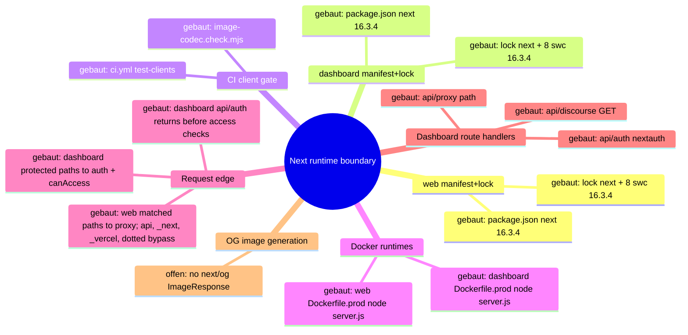
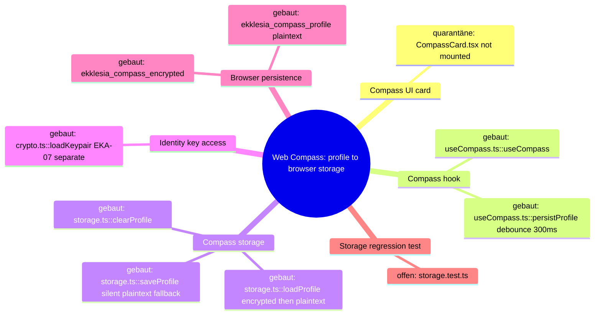
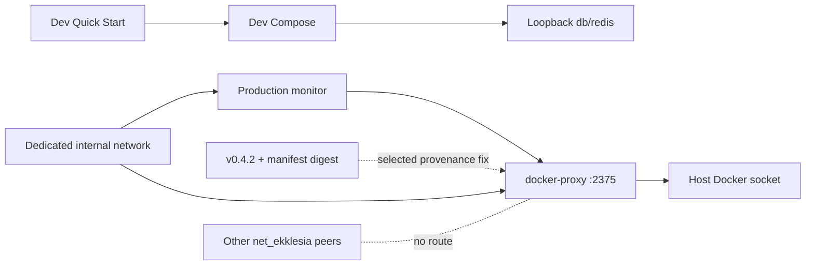

# Architecture Map — Next Runtime Dependency Boundary (T-485)

Scope: `apps/web` + `apps/dashboard` Next.js runtimes against
GHSA-vcvr-r3jv-pc5j (`next` >=16.2.0 <16.3.6, patched 16.3.6; RCE needs Node.js
`next/og` `ImageResponse` rendering attacker-controlled SVG content/attributes/styles).
Base: `origin/main` 49e449a3bc9af1000e9d111fba9b9da2e27d673c. Read-only run: no
package, lock, source or config change. Existing maps (`EKKLESIA_V2_MINIMA.md`,
`FEDERATION.md`) stay untouched.

## 1. Grundidee

- Ekklesia.gr is a digital direct-democracy platform for Greek citizens (`apps/web/src/app/[locale]/layout.tsx::metadata.openGraph.description`).
- Citizens use the public web runtime (`apps/web`, port 3000) for bills, VAA, results (`apps/web/src/app/[locale]/**/page.tsx`).
- Operators use the auth-gated admin dashboard (`apps/dashboard`, port 3001) (`apps/dashboard/src/proxy.ts::proxy`, `apps/dashboard/package.json::scripts.start`).
- Both are standalone Next builds served by `node server.js` in Docker (`apps/{web,dashboard}/next.config.*::output`, `apps/{web,dashboard}/Dockerfile.prod::CMD`).
- Boundary of this map: the `next` package version as it flows from manifest to running route handlers, plus the advisory's `next/og` sink.

## 2. Spur (opened hops)

1. `apps/web/package.json::dependencies.next` = `16.3.4` (exact) → `apps/web/package-lock.json::packages["node_modules/next"]` = 16.3.4, `engines.node >=20.9.0`.
2. `apps/dashboard/package.json::dependencies.next` = `16.3.4` (exact) → `apps/dashboard/package-lock.json::packages["node_modules/next"]` = 16.3.4.
3. Lock `node_modules/next` → 8 platform `node_modules/@next/swc-*` entries, each 16.3.4 (both locks); `sharp` 0.35.4 via `overrides`.
4. Lock → `.github/workflows/ci.yml::test-clients` (`npm ci` → `image-codec.check.mjs` → lint → typecheck → [web: vitest] → `npm run build`).
5. Lock → `apps/web/Dockerfile.prod` (`npm ci` with repo `.npmrc`, docs/ copied into `public/`, `npm run build`) → runner `node server.js` (context `../../`, `infra/docker/docker-compose.prod.yml::web`).
6. Lock → `apps/dashboard/Dockerfile.prod` (`npm ci --ignore-scripts`, `npm run build`) → runner `node server.js` (context `../../apps/dashboard`, `docker-compose.prod.yml::dashboard`).
7. `server.js` → the web proxy matcher excludes `/api`, `_next`, `_vercel`, and dotted paths; matched page requests enter `apps/web/src/proxy.ts::proxy` (redirects/rewrites + next-intl) → `apps/web/src/app/[locale]/*/page.tsx` (9 pages, no route handlers).
8. `server.js` → the dashboard matcher excludes `_next/static`, `_next/image`, and `favicon.ico`; matched protected pages and non-auth APIs enter `apps/dashboard/src/proxy.ts::proxy` (session gate, then role check) → `(dashboard)/*/page.tsx` (23), `api/discourse/route.ts::GET` (JSON), and `api/proxy/[...path]/route.ts` (JSON, SUPER_ADMIN). `/api/auth/*` is matched but returns before the user and `canAccess` checks to reach `api/auth/[...nextauth]/route.ts::{GET,POST}`.
9. Side-hop `request-controlled value → next/og ImageResponse SVG` — **offen / nicht verdrahtet** (evidence below).

### Sink evidence (all `git grep` on 49e449a, excluding lockfiles)

| Pattern | Scope | Hits |
| --- | --- | --- |
| `next/og`, `ImageResponse`, `new ImageResponse`, `@vercel/og` | whole repo | 0 |
| `satori`, `resvg`, `generateImageMetadata` | apps/web, apps/dashboard | 0 |
| `export const runtime` (Node vs Edge) | apps/web, apps/dashboard | 0 → all routes default Node.js runtime |
| `opengraph-image.*`, `twitter-image.*`, `icon.*`, `apple-icon.*` files | apps/web, apps/dashboard | 0 (only `public/manifest.json`) |
| `route.ts` handlers | both | 3, all dashboard, none returns images |
| `node_modules/@vercel/og`, `satori`, `@resvg/*` in locks | both locks | 0 (next's og bundle only inside `next/dist/compiled`) |

Image neighbours: `openGraph` in web layout is static text, no `images`; `next/image` in
`NavHeader.tsx`/`sso-verify/page.tsx` uses the image optimizer, not `next/og`; inline
`<svg>` literals in NavHeader/sso-verify/login are static JSX.

## 3. Module

| Modul | Eine Aufgabe | Einstieg | Stand |
| --- | --- | --- | --- |
| web manifest+lock | pin `next` for public web | `apps/web/package.json::dependencies.next` | gebaut (16.3.4, affected) |
| dashboard manifest+lock | pin `next` for admin dashboard | `apps/dashboard/package.json::dependencies.next` | gebaut (16.3.4, affected) |
| CI client gate | install + verify + build both runtimes | `.github/workflows/ci.yml::test-clients` | gebaut |
| image-codec check | assert optimizer + sharp ⊂ next's sharp range | `apps/{web,dashboard}/image-codec.check.mjs` | gebaut |
| web Docker runtime | build standalone, serve on 3000 | `apps/web/Dockerfile.prod::CMD` | gebaut |
| dashboard Docker runtime | build standalone, serve on 3001 | `apps/dashboard/Dockerfile.prod::CMD` | gebaut |
| web request edge | locale/static redirects | `apps/web/src/proxy.ts::proxy` | gebaut |
| dashboard request edge | auth + RBAC gate | `apps/dashboard/src/proxy.ts::proxy` | gebaut |
| dashboard route handlers | auth, discourse JSON, API proxy JSON | `apps/dashboard/src/app/api/**/route.ts` | gebaut |
| OG image generation | `next/og` `ImageResponse` | — | offen (no symbol) |

## 4. Verdrahtung

- `package.json::next` → lock `node_modules/next`: exact pin, lock matches 16.3.4 in both apps.
- lock `next` → `@next/swc-*`: 8 platform binaries pinned to the same 16.3.4; must move together.
- lock → CI `npm ci` / `npm run build`: CI builds both runtimes from their own lock.
- lock → `Dockerfile.prod` `npm ci`: prod image installs the same lock; web keeps install scripts per `.npmrc`, dashboard passes `--ignore-scripts`.
- `Dockerfile.prod` → `node server.js`: standalone server, Node 22.13.0-alpine.
- `server.js` → web `proxy.ts`: only matcher-selected requests enter it; `/api`, `_next`, `_vercel`, and dotted paths bypass the proxy.
- `server.js` → dashboard `proxy.ts`: matcher-selected requests enter it, but `/api/auth/*` returns before the protected user and `canAccess` checks; protected pages and the other API paths continue through those checks.
- proxy or matcher bypass → pages/route handlers: no handler or page imports `next/og`.

## 5. Widerspruch und Lücken

- (a) Versionally affected: both runtimes resolve `next` 16.3.4 ∈ [16.2.0, 16.3.6).
- (b) Exploit path not evidenced: 0 `next/og`/`ImageResponse` call sites, no metadata image files, no SVG-rendering handler. The vulnerable code ships in `next/dist/compiled` but is unreachable without an importer.
- (c) Hygiene upgrade still justified: all routes run Node.js runtime by default, so any future `ImageResponse` with request data would hit the vulnerable sink directly.
- Attacker preconditions (all missing today): a Node-runtime route/metadata file importing `next/og`; request-controlled input reaching SVG content, attributes or styles in the JSX tree; reachability without auth (web) or with an operator session (dashboard).
- Gap: install-script parity differs (web `npm ci` + `.npmrc`, dashboard `npm ci --ignore-scripts`); not changed here.
- Gap: `image-codec.check.mjs` asserts `sharp` 0.35.4 satisfies `next.optionalDependencies.sharp`; 16.3.6 range not verified in this run (no install).
- Not checked: npm registry metadata for 16.3.6, live/runtime state, builds.

## 6. Diagramme

- `docs/architecture/map.puml` (mindmap + component)
- `docs/architecture/main-path.puml` (sequence of the built path)

## 7. Nächster Schritt (single follow-fix node, T-486)

Modul: web + dashboard manifest+lock. Hop: `package.json::dependencies.next`
16.3.4 → 16.3.6 → lock `node_modules/next` + all 8 `@next/swc-*` to 16.3.6, in both apps.
Files: `apps/{web,dashboard}/package.json`, `apps/{web,dashboard}/package-lock.json` only.
Untouched: Dockerfiles, `next.config.*`, `proxy.ts`, all `src/**`, `.github/**`,
`@next/eslint-plugin-next` (#394), React, `overrides`.
Must stay green: CI `test-clients` Web + Dashboard (`image-codec.check.mjs`, lint,
typecheck, web vitest, `npm run build`), both `Dockerfile.prod` builds, and the
routes in hops 7–8 (web locale pages + proxy redirects; dashboard pages, `/login`,
`/api/auth/*`, `/api/discourse`, `/api/proxy/*`).

---

# Preserved Map Node — EKA-18 Local Developer Stack / Compose Exposure Boundary

Integrated from `origin/main` at T-486 refresh. The full evidence and acceptance
record remains in `.fleet/reports/T-481.md` and `.fleet/reports/T-482.md`.

## Module and hop

- Node: local developer stack / Compose exposure boundary.
- Hop H1: README Quick Start starts `infra/docker/docker-compose.yml`.
- Hop H2: host-side alembic, seeds, and uvicorn use the loopback defaults in
  `apps/api/config.py::Settings`.
- Hop H3: the API container uses the internal `db` and `redis` service names.
- Hop H4: only PostgreSQL and Redis host publications are narrowed to
  `127.0.0.1`; the API's port 8000 publication remains unchanged.

## Security invariant

Development datastores with repository-public or absent credentials are not
reachable through a non-loopback host interface, while host development tools
retain `localhost:5432` and `localhost:6379` access and containers retain their
service-DNS access. Production Compose, API auth, salt policy, and datastore
authentication are outside this node.

## Built state

- `infra/docker/docker-compose.yml` binds db and redis to IPv4 loopback.
- `apps/api/tests/test_dev_compose_exposure.py` pins loopback publication,
  published ports, internal service-DNS targets, and dependencies.
- README warns that the development credentials are public and the stack is not
  for shared or production hosts.

# Architecture Map — Sentry Capture Policy Boundary

Basis: `origin/main 4cc11930f4be82ba2d012def487fb34abca9da26` · Task: T-493 · Mapping only, no fix.
Node: API observability / Sentry event capture policy.

## 1. Grundidee

- Ekklesia.gr is a privacy-sensitive civic platform; the API handles request data and intermediate values that can include personal or security-relevant information.
- `apps/api/main.py::_sentry_init_options` is the single global policy boundary for Sentry error and transaction capture.
- FastAPI and Starlette integrations build Sentry events, `_before_send_filter` applies a second redaction layer, and the SDK transport sends the resulting envelope.
- This map opens only the event-construction policy hop. DSN, sampling, environment, provider configuration, deployment and stored Sentry events remain outside the boundary.

## 2. Spur (one trace, hops opened)

| # | From → To | Datum over the edge |
| --- | --- | --- |
| H1 | FastAPI/Starlette exception or transaction → Sentry integrations | exception, stack, request context and transaction metadata |
| H2 | `main.py::_sentry_init_options` → `sentry_sdk.init` | integrations, sampling, environment, PII and hook policy |
| H3 | Sentry SDK integration → event construction | stack frames; SDK default may attach frame-local variables |
| H4 | Sentry SDK integration → request extraction | request metadata; SDK default may attach a request body up to its configured size |
| H5 | constructed event → `main.py::_before_send_filter` | event/request/frame data; known sensitive keys and request fields are redacted recursively |
| H6 | `_before_send_filter` → Sentry transport | filtered event envelope sent to the configured DSN |

## 3. Module

| Modul | Eine Aufgabe | Einstieg | Stand |
| --- | --- | --- | --- |
| Sentry init policy | defines global capture controls | `apps/api/main.py::_sentry_init_options` | gebaut; frame-local and body policies are implicit SDK defaults |
| Web integrations | derive error/transaction/request events | `FastApiIntegration`, `StarletteIntegration` | gebaut (external SDK) |
| Event redaction | strips environment and redacts known sensitive values | `apps/api/main.py::_before_send_filter` | gebaut; defense layer, not a complete arbitrary-value denylist |
| SDK transport | serializes and sends envelopes | `sentry_sdk.init` / transport | gebaut (external SDK) |
| Policy regression tests | pin capture policy and transport result | `apps/api/tests/test_sentry_secret_scrubbing.py` | partial; filters and synthetic secrets covered, capture defaults not pinned |

## 4. Verdrahtung

- Application startup calls `_sentry_init_options(settings.sentry_dsn)` and passes the result to `sentry_sdk.init`.
- `FastApiIntegration` and `StarletteIntegration` collect exception, trace and request context before the application hook runs.
- `_before_send_filter` removes request environment, cookies and query strings; drops selected headers; and recursively redacts sensitive-key values in request data, extras and frame vars.
- Ordinary local-variable names and arbitrary body-field names are not guaranteed sensitive by that key-based filter.
- The filtered event proceeds to the SDK transport. Tests use an in-memory capture transport, so this boundary can be verified without network or Sentry access.

## 5. Widerspruch und Lücken

**Symptom:** global SDK defaults can collect arbitrary frame-local values and request bodies before `_before_send_filter` runs.

**Ursache:** `_sentry_init_options` deliberately sets `send_default_pii=False`, but does not explicitly set `include_local_variables` or `max_request_body_size`. The downstream redactor recognizes sensitive keys, not every value whose name appears harmless.

**Source → sink:** request/exception → FastAPI/Starlette integration → SDK event construction with implicit capture defaults → key-based `_before_send_filter` → transport.

**Sicherheitsinvariante:** Sentry events never contain frame-local variables or request bodies, independent of variable/key naming. Existing stack/exception metadata, URL and method metadata, sampling and redaction hooks remain available.

**Defense in depth:** `include_local_variables=False` prevents local values at event construction; `max_request_body_size="never"` prevents request-body collection. `_before_send_filter` remains in place for headers, query strings, cookies, extras and any event data supplied by other integrations.

**Lücken:**

- Current tests assert hook wiring and `send_default_pii=False`, but not the two capture-boundary settings.
- Existing transport tests use sensitive-looking names that the downstream redactor catches; they do not prove that arbitrary local/body values are excluded at source.
- No production/Sentry-event inspection is required or authorized for this change.

## 6. Diagrammdateien

- `docs/architecture/map.puml` (mindmap + component trace)
- `docs/architecture/main-path.puml` (event sequence)
- PlantUML rendering is optional for this mapping commit; source files are authoritative.

## 7. Nächster Schritt (engste Reparaturgrenze)

**Modul:** API observability / Sentry init policy. **Hop:** H2–H4.

1. Add `include_local_variables=False` and `max_request_body_size="never"` to `apps/api/main.py::_sentry_init_options`.
2. Extend `apps/api/tests/test_sentry_secret_scrubbing.py` with configuration invariants and SDK-transport checks showing arbitrary frame-local and request-body-only sentinel values are absent.
3. Preserve exception/stack and non-body request metadata where the SDK exposes it deterministically.
4. Leave `_before_send_filter`, DSN, integrations, sample rate, environment, deployment and provider settings unchanged.

Out of scope: production deployment, live Sentry inspection, data cleanup, legal/content wording and unrelated observability refactors.

# Architecture Map — EKA-08 Web Compass Privacy Storage

Basis: `main 4cc11930f4be82ba2d012def487fb34abca9da26` · Task: T-487 · Mapping only, no fix.
Node: Web Compass Privacy Storage. The EKA-18 node above stays unchanged.

## 1. Grundidee

- Liquid Compass: a personal political profile computed 100% client-side, AES-256-GCM encrypted with an HKDF key from the Ed25519 private key, never sent to the server (`CLAUDE.md` "Liquid Compass"; `apps/web/src/lib/compass/storage.ts` header).
- The same header states the contract gap: "Fallback auf unverschlüsselt wenn kein Key vorhanden" (`storage.ts` l.4).
- Audit: `docs/community-audits/EKA_PNYX_Full_Scope_Audit_2026-09-15.md::EKA-08` (Medium, privacy, Open; "certain for unverified users").
- Web product scope today: compass is app-only (`apps/web/src/app/[locale]/bills/[id]/page.tsx` l.11 "CompassCard removed — compass is mobile-app only"; `README.md` l.68 lists Compass under Mobile App).
- Boundary of this node: `CompassCard` → `useCompass` → `storage.ts` → browser `localStorage`. Mobile compass, API, key storage (EKA-07) and KDF are neighbours, not on this trace.

## 2. Spur (hops opened)

| # | From → To | Datum over the edge |
| --- | --- | --- |
| C1 | `apps/web/src/components/CompassCard.tsx::CompassCard` → `lib/compass/index.ts` → `useCompass.ts::useCompass` | hook call, no args |
| C2 | `useCompass.ts::getPrivateKey` → `apps/web/src/lib/crypto.ts::loadKeypair` | `privateKeyHex \| null` from `localStorage["ekklesia_private_key"]` (EKA-07, out of scope) |
| C3 | `useCompass.ts::useCompass` (init effect) → `storage.ts::loadProfile(privateKeyHex)` | key or `null` |
| C4 | `storage.ts::loadProfile` → `localStorage["ekklesia_compass_encrypted"]` | only if key present; decrypt error swallowed (`catch {}`) → falls through to C5 |
| C5 | `storage.ts::loadProfile` → `localStorage["ekklesia_compass_profile"]` | legacy/fallback **plaintext JSON**, read when C4 cannot return a usable encrypted profile (no key, missing ciphertext or decrypt failure) |
| C6 | `useCompass.ts::{setModel,seedFromVAA,recordBillVote}` → `useCompass.ts::persistProfile` | updated `CompassProfile` (VAA answers, bill votes, model) |
| C7 | `persistProfile` (300 ms debounce) → `storage.ts::saveProfile(p, getPrivateKey())` | promise not awaited, no error handler |
| C8a | `saveProfile` key present, crypto ok → `setItem(encrypted)` + `removeItem(plaintext)` | base64(iv‖ct) |
| C8b | `saveProfile` key `null` **or** HKDF/AES throws → `setItem("ekklesia_compass_profile", json)` | **silent plaintext write**, no signal to caller/UI |
| C9 | `useCompass.ts::reset` → `storage.ts::clearProfile` | removes both keys; pending `saveTimeout` is not cancelled |

Caller census at 4cc1193 (`grep useCompass|CompassCard|@/lib/compass` in `apps/web/src`): only `CompassCard.tsx` imports `useCompass`; **nothing mounts `CompassCard`** (removed from bill detail in `23a627f`, 2026-04-26). `/[locale]/vaa` and `/[locale]/compass`, which called `useCompass` (`seedFromVAA`, `clearProfile`), were deleted in `ef79845` (2026-04-26). Built from `99ae8ea` (2026-04-09).

## 3. Module

| Modul | Eine Aufgabe | Einstieg | Stand |
| --- | --- | --- | --- |
| Compass UI card | show model/points summary | `components/CompassCard.tsx::CompassCard` | quarantäne (built, not mounted anywhere; "compass is mobile-app only") |
| Compass hook | load/persist profile, derive result | `lib/compass/useCompass.ts::useCompass` | gebaut (no runtime caller) |
| Compass storage | encrypt/decrypt + persist profile | `lib/compass/storage.ts::{loadProfile,saveProfile,clearProfile}` | gebaut; plaintext fallback = Befund EKA-08 |
| Identity key access | provide private key hex | `lib/crypto.ts::loadKeypair` | gebaut; EKA-07 (gesperrt, separate) |
| Compass engine | pure profile math | `lib/compass/engine.ts` | gebaut (neighbour, not changed) |
| Browser persistence | `localStorage` keys `ekklesia_compass_profile` / `ekklesia_compass_encrypted` | Web Storage API | gebaut (external) |
| Storage regression test | pin "no plaintext at rest" | — | offen (only `useCompass.test.ts::deriveCompassResult` exists) |
| Device key for keyless users | audit fix proposal | — | aufgeschoben (new storage/KDF surface; out of scope, needs Sol/Kimi crypto review) |

## 4. Verdrahtung

- CompassCard → useCompass: hook call; card is dead UI in current web.
- useCompass → crypto.loadKeypair: key read synchronously from `localStorage` at every load/save.
- useCompass → storage.loadProfile: key or `null`; result becomes React state.
- loadProfile → encrypted key: decrypt only with key; any failure is swallowed.
- loadProfile → plaintext key: consulted only after the encrypted path is unavailable or fails; accepts legacy and newly written plaintext.
- mutators → persistProfile → saveProfile: fire-and-forget after 300 ms.
- saveProfile → encrypted key: happy path, also deletes the plaintext key (only migration path).
- saveProfile → plaintext key: taken when key missing or crypto throws; silent.
- reset → clearProfile: removes both keys, but a queued save can re-create one.

## 5. Widerspruch und Lücken

**Source:** user political data (VAA answers, bill votes, model) via `seedFromVAA` / `recordBillVote` / `setModel` (C6).
**Sink:** `storage.ts::saveProfile` l.117 `localStorage.setItem(STORAGE_KEY, json)` (C8b); read-back sink `loadProfile` l.86–93 (C5).
**Preconditions:** (a) user without keypair (unverified) — deterministic plaintext; (b) keyed user whose HKDF/AES throws (malformed/odd-length key hex, WebCrypto unavailable e.g. non-secure context) — plaintext despite key; (c) reader = any script on origin (XSS, extension), shared-device user, or disk/profile forensics. With a key present, encryption does not stop XSS either (key in same storage, EKA-07) — that part is EKA-07, not this node.
**Security invariant:** a compass profile is never written to browser storage in plaintext; existing plaintext is migrated to ciphertext or removed, never re-created; failure to encrypt is visible to the caller, not silently downgraded.
**Legacy profiles:** web users of `/vaa`, `/compass`, bill card between 2026-04-09 and 2026-04-26 without a key hold plaintext `ekklesia_compass_profile`. Only migration path is C8a (keyed save). Current web never mounts the hook ⇒ those entries are neither migrated nor cleared.
**Error semantics:** all failures silent — decrypt error → empty/plaintext profile; encrypt error → plaintext; `setItem` quota error → unhandled rejection (C7 not awaited).
**Legitimate behaviour to keep:** keyed encrypt/decrypt round-trip; `clearProfile` removes both keys; loading a keyed profile; migrating a legacy plaintext profile on first keyed save.

**Widerspruch / Lücken:**
- `CLAUDE.md` lists `/[locale]/vaa` and `/[locale]/compass` web routes and "Compass-Daten … AES-256-GCM"; code: routes deleted (`ef79845`) and storage has plaintext fallback.
- Audit rates likelihood "certain for unverified users"; at 4cc1193 no web route mounts the flow ⇒ new writes are unreachable, but the sink is exported via `lib/compass/index.ts` and residual legacy plaintext is not handled.
- C9 race: `reset` does not cancel `saveTimeout` ⇒ a pending save can rewrite a cleared profile (neighbour hop, separate).
- C4→C5: decrypt failure with a present key falls back to an attacker-writable plaintext key (integrity, low).
- No storage test; `vitest.config.mts` defaults to node; jsdom precedent: `app/[locale]/sso-verify/page.test.tsx` (`// @vitest-environment jsdom`).

## 6. Diagrammdateien

- `docs/architecture/map.puml` (EKA-08 mindmap + component diagram appended after EKA-18 diagrams)
- `docs/architecture/main-path.puml` (EKA-08 sequence appended)
- PlantUML not installed ⇒ sources written, not rendered.

## 7. Nächster Schritt (engste Reparaturgrenze)

**Modul:** Compass storage. **Hop:** C8b (+ C5 legacy read) in `storage.ts::{saveProfile,loadProfile}`.

**Fix contract (later, separately approved):**
1. `apps/web/src/lib/compass/storage.ts` only: `saveProfile` never calls `setItem(STORAGE_KEY, …)`; without key or on crypto error it persists nothing and reports failure (return value or rejection, decided by Sol); `loadProfile` may still read legacy plaintext in memory so C8a can migrate it; no new key, KDF, storage abstraction, retry or flag.
2. New `apps/web/src/lib/compass/storage.test.ts` (`// @vitest-environment jsdom`, synthetic hex key): negative — keyless save and forced crypto failure leave no `ekklesia_compass_profile`; positive — keyed round-trip; legacy plaintext + keyed save ⇒ ciphertext present, plaintext removed; `clearProfile` removes both.
3. Open decision for Sol/Gio (not narrowest, not decided here): purge keyless legacy plaintext vs keep for migration; delete dead web compass (`CompassCard`, `useCompass`) instead; C9 reset race.

**Unberührt bleiben:** `lib/crypto.ts` (EKA-07), HKDF salt/info and `deriveAesKey` (KDF), `engine.ts`, `types.ts`, `dimension-map.ts`, `useCompass.ts`, `CompassCard.tsx`, `index.ts`, mobile, API, packages/locks, configs.

## 8. Ist-Nachführung T-488

- C8b ist geschlossen: `saveProfile` entfernt den Legacy-Key, schreibt ausschließlich `ekklesia_compass_encrypted` und lehnt ohne Key sowie bei Crypto-/Storage-Fehlern mit `CompassStorageError` ab; es gibt keinen Plaintext-`setItem` mehr.
- C5 ist ein einmaliger Legacy-Take: vorhandener Klartext wird vor weiterer Verarbeitung persistent entfernt. Ohne Ciphertext wird er mit Key sofort verschlüsselt migriert oder ohne Key nur in-memory zurückgegeben; korrupter Klartext wird verworfen. Vorhandener, aber nicht authentisierbarer Ciphertext fällt nie auf Legacy zurück.
- `storage.test.ts` belegt 11/11 Fälle einschließlich Keyless/Crypto/Storage fail-closed, AES-GCM-Roundtrip, Ciphertext-Priorität, Authfehler, Legacy-Migration/-Purge und `clearProfile`. C9, EKA-07 und KDF bleiben unverändert offen bzw. getrennt.
# Architecture Map — Container Trust Boundaries (EKA-18 + EKA-13)

Basis: `origin/main 4cc11930f4be82ba2d012def487fb34abca9da26` · Tasks: T-502/T-503 · Option 1 selected by Gio.

This map preserves the accepted EKA-18 local-development boundary and adds the independently reviewed EKA-13 production-container boundary from T-483. The two nodes are adjacent but have separate change contracts.

## 1. Grundidee

- The local Compose stack publishes PostgreSQL and Redis for host-side migrations/tools. EKA-18 is source-fixed on current main: those two datastore ports bind to IPv4 loopback; the API's intentional port 8000 stays externally bindable for device testing.
- The production Compose stack gives `monitor` controlled Docker access through `docker-proxy`. That proxy mounts the host Docker socket, exposes the Docker API on the shared application network and therefore sits on a host-root-equivalent trust boundary.
- EKA-13 is source-open: `docker-proxy` uses mutable `:latest`; `CONTAINERS=1` and `POST=1` expose a broader Docker API namespace than the monitor's intended restart call.
- Gio selected the full first repair boundary: isolate `monitor` and `docker-proxy` on a dedicated internal network, remove the proxy from `net_ekklesia`, pin v0.4.2 by manifest digest, set `POST=0`, and keep production Tier-2 restart disabled. This deliberately prefers containment over Docker-based automatic restart.

## 2. Hop-Liste

### Node A — EKA-18 Local Developer Stack (built)

| Hop | From → To | Current invariant |
| --- | --- | --- |
| A1 | `README.md::Quick Start` → `infra/docker/docker-compose.yml` | developer starts `db`, `redis`, `api` |
| A2 | Compose interpolation → db/api | public local credential fallbacks remain development-only |
| A3 | `services.db.ports` → host | `127.0.0.1:5432:5432`; no non-loopback listener |
| A4 | `services.redis.ports` → host | `127.0.0.1:6379:6379`; no non-loopback listener |
| A5 | API → db/redis | service DNS on the internal Compose network; unaffected by host binding |
| A6 | host settings/alembic → db/redis | localhost access remains valid |
| A7 | `services.api.ports` → host | port 8000 remains intentionally all-interface and is outside EKA-18 |
| A8 | `test_dev_compose_exposure.py` | pins A3/A4 and positive internal/host control paths |

### Node B — EKA-13 Production Container Trust Boundary (selected fix)

| Hop | From → To | Current invariant / gap |
| --- | --- | --- |
| B1 | `docker-compose.prod.yml::monitor.build` → `apps/monitor/Dockerfile` | `python:3.11-slim`, no digest and no explicit `USER`; monitor receives secrets but no host mount |
| B2 | monitor → `DOCKER_HOST=tcp://docker-proxy:2375` | `attempt_tier2` uses Docker SDK `containers.get/restart`; gated by `AUTO_RECOVERY_T2` and a client-side allowlist |
| B3 | `services.docker-proxy.image` → GHCR | `ghcr.io/tecnativa/docker-socket-proxy:latest`; mutable provenance, no release tag/digest |
| B4 | docker-proxy environment → Docker API policy | `CONTAINERS=1`, `POST=1`, no auth in Compose; policy is broader than restart-only |
| B5 | docker-proxy → host Docker daemon | `/var/run/docker.sock:/var/run/docker.sock:ro`; read-only mount does not make Docker API calls read-only |
| B6 | application network → docker-proxy | every compromised container on `net_ekklesia` can address port 2375 |
| B7 | `services.ollama.image` → Docker registry | separate mutable `ollama/ollama:latest`, profile-gated; not part of the first fix |
| B8 | dashboard/monitor Dockerfiles → runtime user | tag-pinned base images without digest; no explicit `USER`; separate hardening scope |
| B9 | `services.monitor.networks` → dedicated internal network | selected: monitor remains on `net_ekklesia` for DB/Redis/API and alone joins the proxy network |
| B10 | production Tier-2 setting → proxy method policy | selected: `AUTO_RECOVERY_T2=false` and `POST=0`; monitor escalates instead of restarting containers |

## 3. Module

| Module | One responsibility | Status |
| --- | --- | --- |
| Quick Start + dev Compose | reproducible local stack | built |
| Dev db/redis bindings | host tool access without LAN exposure | built by #393 |
| Dev compose regression | preserve loopback and service-DNS paths | built |
| Production monitor | health checks; Tier-2 restart source remains but production Compose fixes it disabled | selected security behavior |
| Production docker-proxy | filtered Docker API bridge | built, high-privilege boundary |
| docker-proxy provenance | v0.4.2 plus immutable manifest digest | selected fix |
| docker-proxy reachability | dedicated internal network shared only with monitor | selected fix |
| docker-proxy capability policy | `CONTAINERS=0`, `POST=0`; no Docker API namespace enabled while Tier 2 is disabled | selected least-privilege boundary |
| Ollama provenance | immutable optional AI image | open, separate task |
| Dashboard/monitor non-root | explicit runtime users | open, separate task |

## 4. Verdrahtung

- `monitor.py::attempt_tier2` is the existing writer. It selects a service from `T2_ALLOWED_SERVICES` and invokes `restart()` through the Docker SDK; the selected production contract fixes `AUTO_RECOVERY_T2=false`, so alerts proceed to Tier 3 instead.
- The allowlist exists only in the client. The proxy itself is reachable without authentication from the shared production application network.
- Mounting the socket `:ro` controls the filesystem entry, not Docker API method semantics. With `POST=1`, allowed namespaces can mutate the host daemon.
- A released tag plus manifest-list digest makes the proxy bytes reproducible across supported platforms. `POST=0` removes Docker API writes; the private network removes every non-monitor application peer from the proxy trust boundary.
- Node A never reaches Node B: dev host-port bindings and production Docker-socket authority are different Compose files and trust boundaries.

## 5. Findings and limits

**EKA-18 current state:** source-closed. DB/Redis listen only on IPv4 loopback in the dev Compose file; host and container control paths are pinned by tests. Deployment/live listener state is not inferred.

**EKA-13 pre-fix source-to-sink:** mutable GHCR `:latest` → unaudited future proxy bytes → unauthenticated port 2375 on shared network → host Docker socket → container lifecycle/filesystem/log access permitted by the exposed namespace. Compromise of any network peer can cross this boundary.

**Validated upstream scope drift (security stop):** official Tecnativa `haproxy.cfg` at both `v0.4.2` and `v0.5.0` allows the full `^/containers` prefix whenever `CONTAINERS=1`. That includes Docker GET routes such as container archive/export/log/top; `POST=0` would not close those reads, while Pnyx additionally sets `POST=1`. Tecnativa's own `v0.4.2` README says the proxy network should contain only the proxy and its consumer. Pnyx instead attaches the proxy to shared `net_ekklesia`. A tag+digest pin fixes supply-chain mutability but does not fix this host-boundary exposure.

**Selected-fix invariant:** production Compose names official v0.4.2 plus exact manifest digest; `docker-proxy` belongs only to a new `internal: true` network; `monitor` is the only other member and retains `net_ekklesia` for normal dependencies; `CONTAINERS=0`; upstream defaults `EVENTS=1`, `PING=1`, and `VERSION=1` are explicitly disabled; `POST=0`; production Tier-2 restart is fixed disabled. No other service gains Docker API reachability.

**Selected capability result:** because production Tier 2 is fixed disabled, the monitor currently needs no Docker API namespace. `CONTAINERS=0`, explicit `EVENTS=0`/`PING=0`/`VERSION=0`, and `POST=0` deny container inspect/archive/export/log/top, the upstream default GET surfaces and all Docker writes. Proxy auth, monitor/container root users, Ollama `:latest`, deployed image identity and actual runtime topology remain separate. v0.5.0 is excluded because of its open `/version` compatibility regression.

## 6. Next source boundary

Gio authorized Option 1 for T-503. The implementation boundary is:

1. `infra/docker/docker-compose.prod.yml`: pin `docker-proxy` to official v0.4.2 plus manifest digest, set `CONTAINERS=0`, `EVENTS=0`, `PING=0`, `VERSION=0`, and `POST=0`, fix `AUTO_RECOVERY_T2=false`, attach the proxy only to a new dedicated `internal: true` network and attach only `monitor` as its peer.
2. One focused static/normalized-Compose regression test that proves image provenance, network membership, the absence of the proxy from `net_ekklesia`, disabled Docker API namespaces and disabled production restart.
3. Architecture/report updates only; no Dockerfile, application recovery logic, package, workflow, deployment or live-system change.

Local validation may render `docker compose config` with synthetic non-secret values and may run a disposable proxy/monitor-network smoke. Production topology evidence remains read-only and belongs in the rollout decision record, not in this source PR.

## 7. Diagram files

- `docs/architecture/map.puml` → `map.svg`, `map_001.svg`
- `docs/architecture/main-path.puml` → `main-path.svg`, `main-path_001.svg`

