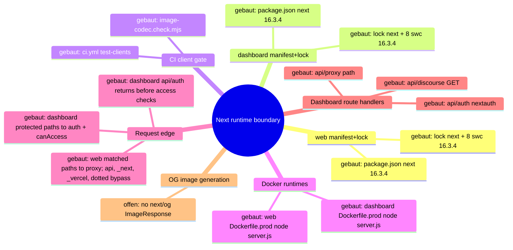

# Architecture Map — Next Runtime Dependency Boundary (T-485)

Scope: `apps/web` + `apps/dashboard` Next.js runtimes against
GHSA-vcvr-r3jv-pc5j (`next` >=16.2.0 <16.3.6, patched 16.3.6; RCE needs Node.js
`next/og` `ImageResponse` rendering attacker-controlled SVG content/attributes/styles).
Base: `origin/main` 49e449a3bc9af1000e9d111fba9b9da2e27d673c. Read-only run: no
package, lock, source or config change. Existing maps (`EKKLESIA_V2_MINIMA.md`,
`FEDERATION.md`) stay untouched.

## 1. Grundidee

- Ekklesia.gr is a digital direct-democracy platform for Greek citizens (`apps/web/src/app/[locale]/layout.tsx::metadata.openGraph.description`).
- Citizens use the public web runtime (`apps/web`, port 3000) for bills, VAA, results (`apps/web/src/app/[locale]/**/page.tsx`).
- Operators use the auth-gated admin dashboard (`apps/dashboard`, port 3001) (`apps/dashboard/src/proxy.ts::proxy`, `apps/dashboard/package.json::scripts.start`).
- Both are standalone Next builds served by `node server.js` in Docker (`apps/{web,dashboard}/next.config.*::output`, `apps/{web,dashboard}/Dockerfile.prod::CMD`).
- Boundary of this map: the `next` package version as it flows from manifest to running route handlers, plus the advisory's `next/og` sink.

## 2. Spur (opened hops)

1. `apps/web/package.json::dependencies.next` = `16.3.4` (exact) → `apps/web/package-lock.json::packages["node_modules/next"]` = 16.3.4, `engines.node >=20.9.0`.
2. `apps/dashboard/package.json::dependencies.next` = `16.3.4` (exact) → `apps/dashboard/package-lock.json::packages["node_modules/next"]` = 16.3.4.
3. Lock `node_modules/next` → 8 platform `node_modules/@next/swc-*` entries, each 16.3.4 (both locks); `sharp` 0.35.4 via `overrides`.
4. Lock → `.github/workflows/ci.yml::test-clients` (`npm ci` → `image-codec.check.mjs` → lint → typecheck → [web: vitest] → `npm run build`).
5. Lock → `apps/web/Dockerfile.prod` (`npm ci` with repo `.npmrc`, docs/ copied into `public/`, `npm run build`) → runner `node server.js` (context `../../`, `infra/docker/docker-compose.prod.yml::web`).
6. Lock → `apps/dashboard/Dockerfile.prod` (`npm ci --ignore-scripts`, `npm run build`) → runner `node server.js` (context `../../apps/dashboard`, `docker-compose.prod.yml::dashboard`).
7. `server.js` → the web proxy matcher excludes `/api`, `_next`, `_vercel`, and dotted paths; matched page requests enter `apps/web/src/proxy.ts::proxy` (redirects/rewrites + next-intl) → `apps/web/src/app/[locale]/*/page.tsx` (9 pages, no route handlers).
8. `server.js` → the dashboard matcher excludes `_next/static`, `_next/image`, and `favicon.ico`; matched protected pages and non-auth APIs enter `apps/dashboard/src/proxy.ts::proxy` (session gate, then role check) → `(dashboard)/*/page.tsx` (23), `api/discourse/route.ts::GET` (JSON), and `api/proxy/[...path]/route.ts` (JSON, SUPER_ADMIN). `/api/auth/*` is matched but returns before the user and `canAccess` checks to reach `api/auth/[...nextauth]/route.ts::{GET,POST}`.
9. Side-hop `request-controlled value → next/og ImageResponse SVG` — **offen / nicht verdrahtet** (evidence below).

### Sink evidence (all `git grep` on 49e449a, excluding lockfiles)

| Pattern | Scope | Hits |
| --- | --- | --- |
| `next/og`, `ImageResponse`, `new ImageResponse`, `@vercel/og` | whole repo | 0 |
| `satori`, `resvg`, `generateImageMetadata` | apps/web, apps/dashboard | 0 |
| `export const runtime` (Node vs Edge) | apps/web, apps/dashboard | 0 → all routes default Node.js runtime |
| `opengraph-image.*`, `twitter-image.*`, `icon.*`, `apple-icon.*` files | apps/web, apps/dashboard | 0 (only `public/manifest.json`) |
| `route.ts` handlers | both | 3, all dashboard, none returns images |
| `node_modules/@vercel/og`, `satori`, `@resvg/*` in locks | both locks | 0 (next's og bundle only inside `next/dist/compiled`) |

Image neighbours: `openGraph` in web layout is static text, no `images`; `next/image` in
`NavHeader.tsx`/`sso-verify/page.tsx` uses the image optimizer, not `next/og`; inline
`<svg>` literals in NavHeader/sso-verify/login are static JSX.

## 3. Module

| Modul | Eine Aufgabe | Einstieg | Stand |
| --- | --- | --- | --- |
| web manifest+lock | pin `next` for public web | `apps/web/package.json::dependencies.next` | gebaut (16.3.4, affected) |
| dashboard manifest+lock | pin `next` for admin dashboard | `apps/dashboard/package.json::dependencies.next` | gebaut (16.3.4, affected) |
| CI client gate | install + verify + build both runtimes | `.github/workflows/ci.yml::test-clients` | gebaut |
| image-codec check | assert optimizer + sharp ⊂ next's sharp range | `apps/{web,dashboard}/image-codec.check.mjs` | gebaut |
| web Docker runtime | build standalone, serve on 3000 | `apps/web/Dockerfile.prod::CMD` | gebaut |
| dashboard Docker runtime | build standalone, serve on 3001 | `apps/dashboard/Dockerfile.prod::CMD` | gebaut |
| web request edge | locale/static redirects | `apps/web/src/proxy.ts::proxy` | gebaut |
| dashboard request edge | auth + RBAC gate | `apps/dashboard/src/proxy.ts::proxy` | gebaut |
| dashboard route handlers | auth, discourse JSON, API proxy JSON | `apps/dashboard/src/app/api/**/route.ts` | gebaut |
| OG image generation | `next/og` `ImageResponse` | — | offen (no symbol) |

## 4. Verdrahtung

- `package.json::next` → lock `node_modules/next`: exact pin, lock matches 16.3.4 in both apps.
- lock `next` → `@next/swc-*`: 8 platform binaries pinned to the same 16.3.4; must move together.
- lock → CI `npm ci` / `npm run build`: CI builds both runtimes from their own lock.
- lock → `Dockerfile.prod` `npm ci`: prod image installs the same lock; web keeps install scripts per `.npmrc`, dashboard passes `--ignore-scripts`.
- `Dockerfile.prod` → `node server.js`: standalone server, Node 22.13.0-alpine.
- `server.js` → web `proxy.ts`: only matcher-selected requests enter it; `/api`, `_next`, `_vercel`, and dotted paths bypass the proxy.
- `server.js` → dashboard `proxy.ts`: matcher-selected requests enter it, but `/api/auth/*` returns before the protected user and `canAccess` checks; protected pages and the other API paths continue through those checks.
- proxy or matcher bypass → pages/route handlers: no handler or page imports `next/og`.

## 5. Widerspruch und Lücken

- (a) Versionally affected: both runtimes resolve `next` 16.3.4 ∈ [16.2.0, 16.3.6).
- (b) Exploit path not evidenced: 0 `next/og`/`ImageResponse` call sites, no metadata image files, no SVG-rendering handler. The vulnerable code ships in `next/dist/compiled` but is unreachable without an importer.
- (c) Hygiene upgrade still justified: all routes run Node.js runtime by default, so any future `ImageResponse` with request data would hit the vulnerable sink directly.
- Attacker preconditions (all missing today): a Node-runtime route/metadata file importing `next/og`; request-controlled input reaching SVG content, attributes or styles in the JSX tree; reachability without auth (web) or with an operator session (dashboard).
- Gap: install-script parity differs (web `npm ci` + `.npmrc`, dashboard `npm ci --ignore-scripts`); not changed here.
- Gap: `image-codec.check.mjs` asserts `sharp` 0.35.4 satisfies `next.optionalDependencies.sharp`; 16.3.6 range not verified in this run (no install).
- Not checked: npm registry metadata for 16.3.6, live/runtime state, builds.

## 6. Diagramme

- `docs/architecture/map.puml` (mindmap + component)
- `docs/architecture/main-path.puml` (sequence of the built path)



## 7. Nächster Schritt (single follow-fix node, T-486)

Modul: web + dashboard manifest+lock. Hop: `package.json::dependencies.next`
16.3.4 → 16.3.6 → lock `node_modules/next` + all 8 `@next/swc-*` to 16.3.6, in both apps.
Files: `apps/{web,dashboard}/package.json`, `apps/{web,dashboard}/package-lock.json` only.
Untouched: Dockerfiles, `next.config.*`, `proxy.ts`, all `src/**`, `.github/**`,
`@next/eslint-plugin-next` (#394), React, `overrides`.
Must stay green: CI `test-clients` Web + Dashboard (`image-codec.check.mjs`, lint,
typecheck, web vitest, `npm run build`), both `Dockerfile.prod` builds, and the
routes in hops 7–8 (web locale pages + proxy redirects; dashboard pages, `/login`,
`/api/auth/*`, `/api/discourse`, `/api/proxy/*`).

---

# Preserved Map Node — EKA-18 Local Developer Stack / Compose Exposure Boundary

Integrated from `origin/main` at T-486 refresh. The full evidence and acceptance
record remains in `.fleet/reports/T-481.md` and `.fleet/reports/T-482.md`.

## Module and hop

- Node: local developer stack / Compose exposure boundary.
- Hop H1: README Quick Start starts `infra/docker/docker-compose.yml`.
- Hop H2: host-side alembic, seeds, and uvicorn use the loopback defaults in
  `apps/api/config.py::Settings`.
- Hop H3: the API container uses the internal `db` and `redis` service names.
- Hop H4: only PostgreSQL and Redis host publications are narrowed to
  `127.0.0.1`; the API's port 8000 publication remains unchanged.

## Security invariant

Development datastores with repository-public or absent credentials are not
reachable through a non-loopback host interface, while host development tools
retain `localhost:5432` and `localhost:6379` access and containers retain their
service-DNS access. Production Compose, API auth, salt policy, and datastore
authentication are outside this node.

## Built state

- `infra/docker/docker-compose.yml` binds db and redis to IPv4 loopback.
- `apps/api/tests/test_dev_compose_exposure.py` pins loopback publication,
  published ports, internal service-DNS targets, and dependencies.
- README warns that the development credentials are public and the stack is not
  for shared or production hosts.

# Architecture Map — EKA-64 MOD-WEB Static Crawler Anchor Delivery

Basis: `main 4cc11930f4be82ba2d012def487fb34abca9da26` · Task: T-504 · Mapping only, no fix.
Node: MOD-WEB static crawler anchor delivery; hop `/ai.txt|/llms-full.txt` → proxy matcher exclusion for dotted paths → Next static-file lookup / standalone public bundle → HTTP status and content type.
The EKA-18 map above stays unchanged; EKA-64 is appended as separate diagrams in the same files.

## 1. Grundidee

- `ekklesia.gr` is served by the Next.js standalone container `ekklesia-web` behind Traefik (`infra/docker/docker-compose.prod.yml::services.web`, Host rule only, no path rewriting).
- The static GitHub-Pages content under `docs/` is copied into `public/` at image build, including the AI anchor `llms.txt` (`apps/web/Dockerfile.prod`, `COPY docs/robots.txt docs/sitemap.xml docs/llms.txt ./public/`).
- The proxy (`apps/web/src/proxy.ts`) only handles non-dotted paths; `config.matcher` excludes every path containing a dot.
- The audit (`docs/community-audits/EKA_PNYX_AI_Readiness_Audit_2026-09-15.md` l.140–153, EKA-64) observed `/ai.txt` and `/llms-full.txt` answering `307 → landing` and attributed it to the proxy. Historical live evidence only.

## 2. Spur (one trace, hops opened)

| # | From → To | Datum over the edge |
| --- | --- | --- |
| A1 | crawler → Next server | `GET /ai.txt`, `/llms-full.txt` (missing) and `/llms.txt` (existing) |
| A2 | `apps/web/next.config.mjs::nextConfig.redirects` | only source `/download/ekklesia-latest.apk` ⇒ no match; `headers()` adds policy headers only |
| A3 | `apps/web/src/proxy.ts::config.matcher` `/((?!api\|_next\|_vercel\|.*\\..*).*)` | dotted path ⇒ `proxy()` and `intlMiddleware` are **not** invoked |
| A4 | Next static-file lookup in `/app/public` (runner `COPY --from=builder /app/public ./public`) | `/llms.txt` hit ⇒ `200`, `text/plain; charset=UTF-8` |
| A5 | static miss → App Router `src/app/[locale]/page.tsx` | single dotted segment matches dynamic `[locale]` with `locale="ai.txt"`; build lists `ƒ /[locale]` (dynamic, no `generateStaticParams`, no `dynamicParams=false`); `[locale]/layout.tsx::LocaleLayout` does not validate the locale |
| A6 | `[locale]/page.tsx::HomePage` → response | T-504 base: `redirect("https://ekklesia.gr")` ⇒ `307`. **T-505:** `hasLocale(routing.locales, locale)` fails ⇒ `notFound()` ⇒ `404`; `el`/`en` keep `redirect("https://ekklesia.gr")` ⇒ `307` |

Local build evidence (2026-09-28, no production request): Dockerfile.prod-equivalent staging in `/tmp` (apps/web + the same `docs/` COPY list into `public/`), `npm ci --ignore-scripts`, `next build` (Next 16.3.4, Turbopack, exit 0), standalone packaging as in the runner stage, `node server.js` on `127.0.0.1:3504`, `curl --max-redirs 0`:

| Path | Status | Location | Content-Type |
| --- | --- | --- | --- |
| `/llms.txt` | 200 | — | `text/plain; charset=UTF-8` (5470 B) |
| `/robots.txt` | 200 | — | `text/plain; charset=UTF-8` |
| `/ai.txt` | 307 | `https://ekklesia.gr` | `text/html; charset=utf-8` |
| `/llms-full.txt` | 307 | `https://ekklesia.gr` | `text/html; charset=utf-8` |
| `/xyz.txt` | 307 | `https://ekklesia.gr` | `text/html; charset=utf-8` |
| `/el` | 307 | `https://ekklesia.gr` | `text/html; charset=utf-8` (intended) |
| `/definitely-missing` | 307 | `/el/definitely-missing` | (proxy/next-intl locale prefix, different hop) |
| `/x/ai.txt`, `/el/ai.txt`, `/.well-known/llms.txt` | 404 | — | `text/html; charset=utf-8` |

The absolute `location: https://ekklesia.gr` without a locale prefix identifies A6 as the source; a proxy/next-intl redirect would have produced `/el/…` (see `/definitely-missing`).

## 3. Module

| Modul | Eine Aufgabe | Einstieg | Stand |
| --- | --- | --- | --- |
| Next config | build-time redirects/headers | `apps/web/next.config.mjs::nextConfig` | gebaut (not on the failure path) |
| Proxy | locale/static redirects for non-dotted paths | `apps/web/src/proxy.ts::proxy`, `config.matcher` | gebaut (skipped for dotted paths — audit attribution wrong) |
| Public bundle | ship `docs/` static files incl. `llms.txt` | `apps/web/Dockerfile.prod` COPY list | gebaut; `ai.txt`/`llms-full.txt` offen (do not exist in `docs/`) |
| Locale page | `/el`, `/en` → landing | `apps/web/src/app/[locale]/page.tsx::HomePage` | gebaut; T-505 invalid-locale `notFound()` guard (EKA-64 fixed at A5→A6) |
| Locale layout | i18n shell | `apps/web/src/app/[locale]/layout.tsx::LocaleLayout` | gebaut; no `hasLocale`/`notFound()` guard |
| Regression test | pin routing behaviour | `apps/web/src/proxy.test.ts`, `apps/web/src/app/[locale]/page.test.ts` | gebaut (T-350 redirects; T-505 invalid locale ⇒ `notFound`, `el`/`en` ⇒ redirect) |
| Traefik edge | Host routing, HTTP→HTTPS | `infra/docker/docker-compose.prod.yml` labels, `infra/hetzner/traefik/traefik.yml` | gebaut (no path logic; neighbour) |

## 4. Verdrahtung

- A1→A2: request passes `next.config.mjs` redirects without a match.
- A2→A3: proxy matcher excludes the dotted path, so `proxy()` never runs.
- A3→A4: static lookup serves `public/llms.txt` with 200 text/plain.
- A3→A5: static miss for `ai.txt`/`llms-full.txt` falls through to the dynamic `[locale]` route.
- A5→A6: `HomePage` rejects locales outside `routing.locales` with `notFound()` (404, T-505); only `el`/`en` reach `redirect("https://ekklesia.gr")` (307).

## 5. Widerspruch und Lücken

- **Widerspruch:** audit says "the Next proxy rewrites unknown paths". Source + local build show the proxy is skipped (A3); the 307 comes from `[locale]/page.tsx::HomePage` (A6).
- Symptom reproduced at base `4cc1193`; **T-505 closes it in source** at A5→A6 (local standalone build: `/ai.txt`, `/llms-full.txt`, `/xyz.txt` ⇒ 404; `/llms.txt`, `/robots.txt` ⇒ 200 text/plain; `/el`, `/en` ⇒ 307 `https://ekklesia.gr`; `/` ⇒ 200). Not deployed; live unverified.
- At base `4cc1193`, scope was wider than the two anchors: every single-segment dotted miss (`/xyz.txt`, `/foo.json`, …) got the same 307. T-505 makes this whole page-level class return 404.
- No `not-found.tsx` at app root or `[locale]`; a 404 would use Next's default page (status is the signal).
- Brief mentions EKA-13 map nodes; none exist in `docs/architecture/` at base `4cc1193`. Nothing to preserve beyond EKA-18.
- Not verified: production Traefik/CDN layers and live behaviour (no production requests by brief).

## 6. Diagrammdateien

- `docs/architecture/map.puml` — diagrams 3 (EKA-64 mindmap) and 4 (EKA-64 components)
- `docs/architecture/main-path.puml` — diagram 2 (EKA-64 sequence: `/llms.txt` hit vs `/ai.txt` miss vs two-segment 404)
- Rendered 2026-09-28 with `java -jar ~/.local/share/plantuml/plantuml.jar -tsvg -o /tmp/t504-render …` (exit 0, 6 SVGs, no syntax errors; SVGs not committed).

```mermaid
mindmap
  root((MOD-WEB: crawler anchor request to HTTP status))
    Next config
      gebaut: next.config.mjs::redirects only legacy APK
    Proxy
      gebaut: proxy.ts::config.matcher excludes dotted paths
    Public bundle
      gebaut: Dockerfile.prod COPY llms.txt robots.txt sitemap.xml
      offen: ai.txt llms-full.txt
    Locale page
      gebaut: [locale]/page.tsx::HomePage redirect ekklesia.gr
      gebaut: [locale]/page.tsx::HomePage hasLocale notFound guard (T-505)
    Regression test
      gebaut: proxy.test.ts
      gebaut: [locale]/page.test.ts invalid locale 404 (T-505)
```

## 7. Nächster Schritt (engste Reparaturgrenze)

**Modul:** Locale page. **Hop:** A5→A6 (`apps/web/src/app/[locale]/page.tsx::HomePage`). **Status: implemented in T-505** (page guard + colocated `page.test.ts`; layout-wide guard not chosen).

**Implemented repair contract (T-505):**
1. In `HomePage`, read `params.locale`; if it is not in `routing.locales` (`hasLocale` from `next-intl`), call `notFound()`; otherwise keep `redirect("https://ekklesia.gr")` unchanged.
   The broader alternative—moving the guard to `[locale]/layout.tsx::LocaleLayout` so it also covers `/<dotted>/bills`—remains a separate decision and was not selected.
2. Focused vitest next to the page: `locale="ai.txt"`/`"llms-full.txt"` ⇒ `notFound` called, `redirect` not called; `el`/`en` ⇒ redirect to `https://ekklesia.gr` unchanged.
3. Standalone probe as in §2: `/ai.txt`, `/llms-full.txt` ⇒ 404; `/llms.txt`, `/robots.txt` ⇒ 200 text/plain; `/el`, `/en` ⇒ 307 unchanged; `/` ⇒ 200.

**Unberührt bleiben:** `apps/web/src/proxy.ts`, `apps/web/next.config.mjs`, `apps/web/Dockerfile.prod`, `docs/llms.txt`, `docs/robots.txt`, `docs/sitemap.xml`, public assets, Traefik, packages/lockfiles, workflows. Creating real `ai.txt`/`llms-full.txt` is a separate content decision (out of scope).
