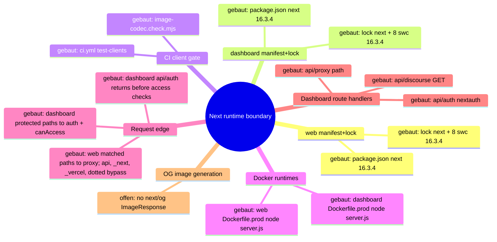
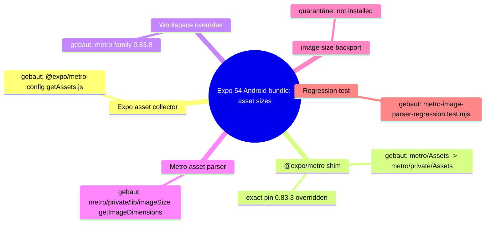

# Architecture Map — Next Runtime Dependency Boundary (T-485)

Scope: `apps/web` + `apps/dashboard` Next.js runtimes against
GHSA-vcvr-r3jv-pc5j (`next` >=16.2.0 <16.3.6, patched 16.3.6; RCE needs Node.js
`next/og` `ImageResponse` rendering attacker-controlled SVG content/attributes/styles).
Base: `origin/main` 49e449a3bc9af1000e9d111fba9b9da2e27d673c. Read-only run: no
package, lock, source or config change. Existing maps (`EKKLESIA_V2_MINIMA.md`,
`FEDERATION.md`) stay untouched.

## 1. Grundidee

- Ekklesia.gr is a digital direct-democracy platform for Greek citizens (`apps/web/src/app/[locale]/layout.tsx::metadata.openGraph.description`).
- Citizens use the public web runtime (`apps/web`, port 3000) for bills, VAA, results (`apps/web/src/app/[locale]/**/page.tsx`).
- Operators use the auth-gated admin dashboard (`apps/dashboard`, port 3001) (`apps/dashboard/src/proxy.ts::proxy`, `apps/dashboard/package.json::scripts.start`).
- Both are standalone Next builds served by `node server.js` in Docker (`apps/{web,dashboard}/next.config.*::output`, `apps/{web,dashboard}/Dockerfile.prod::CMD`).
- Boundary of this map: the `next` package version as it flows from manifest to running route handlers, plus the advisory's `next/og` sink.

## 2. Spur (opened hops)

1. `apps/web/package.json::dependencies.next` = `16.3.4` (exact) → `apps/web/package-lock.json::packages["node_modules/next"]` = 16.3.4, `engines.node >=20.9.0`.
2. `apps/dashboard/package.json::dependencies.next` = `16.3.4` (exact) → `apps/dashboard/package-lock.json::packages["node_modules/next"]` = 16.3.4.
3. Lock `node_modules/next` → 8 platform `node_modules/@next/swc-*` entries, each 16.3.4 (both locks); `sharp` 0.35.4 via `overrides`.
4. Lock → `.github/workflows/ci.yml::test-clients` (`npm ci` → `image-codec.check.mjs` → lint → typecheck → [web: vitest] → `npm run build`).
5. Lock → `apps/web/Dockerfile.prod` (`npm ci` with repo `.npmrc`, docs/ copied into `public/`, `npm run build`) → runner `node server.js` (context `../../`, `infra/docker/docker-compose.prod.yml::web`).
6. Lock → `apps/dashboard/Dockerfile.prod` (`npm ci --ignore-scripts`, `npm run build`) → runner `node server.js` (context `../../apps/dashboard`, `docker-compose.prod.yml::dashboard`).
7. `server.js` → the web proxy matcher excludes `/api`, `_next`, `_vercel`, and dotted paths; matched page requests enter `apps/web/src/proxy.ts::proxy` (redirects/rewrites + next-intl) → `apps/web/src/app/[locale]/*/page.tsx` (9 pages, no route handlers).
8. `server.js` → the dashboard matcher excludes `_next/static`, `_next/image`, and `favicon.ico`; matched protected pages and non-auth APIs enter `apps/dashboard/src/proxy.ts::proxy` (session gate, then role check) → `(dashboard)/*/page.tsx` (23), `api/discourse/route.ts::GET` (JSON), and `api/proxy/[...path]/route.ts` (JSON, SUPER_ADMIN). `/api/auth/*` is matched but returns before the user and `canAccess` checks to reach `api/auth/[...nextauth]/route.ts::{GET,POST}`.
9. Side-hop `request-controlled value → next/og ImageResponse SVG` — **offen / nicht verdrahtet** (evidence below).

### Sink evidence (all `git grep` on 49e449a, excluding lockfiles)

| Pattern | Scope | Hits |
| --- | --- | --- |
| `next/og`, `ImageResponse`, `new ImageResponse`, `@vercel/og` | whole repo | 0 |
| `satori`, `resvg`, `generateImageMetadata` | apps/web, apps/dashboard | 0 |
| `export const runtime` (Node vs Edge) | apps/web, apps/dashboard | 0 → all routes default Node.js runtime |
| `opengraph-image.*`, `twitter-image.*`, `icon.*`, `apple-icon.*` files | apps/web, apps/dashboard | 0 (only `public/manifest.json`) |
| `route.ts` handlers | both | 3, all dashboard, none returns images |
| `node_modules/@vercel/og`, `satori`, `@resvg/*` in locks | both locks | 0 (next's og bundle only inside `next/dist/compiled`) |

Image neighbours: `openGraph` in web layout is static text, no `images`; `next/image` in
`NavHeader.tsx`/`sso-verify/page.tsx` uses the image optimizer, not `next/og`; inline
`<svg>` literals in NavHeader/sso-verify/login are static JSX.

## 3. Module

| Modul | Eine Aufgabe | Einstieg | Stand |
| --- | --- | --- | --- |
| web manifest+lock | pin `next` for public web | `apps/web/package.json::dependencies.next` | gebaut (16.3.4, affected) |
| dashboard manifest+lock | pin `next` for admin dashboard | `apps/dashboard/package.json::dependencies.next` | gebaut (16.3.4, affected) |
| CI client gate | install + verify + build both runtimes | `.github/workflows/ci.yml::test-clients` | gebaut |
| image-codec check | assert optimizer + sharp ⊂ next's sharp range | `apps/{web,dashboard}/image-codec.check.mjs` | gebaut |
| web Docker runtime | build standalone, serve on 3000 | `apps/web/Dockerfile.prod::CMD` | gebaut |
| dashboard Docker runtime | build standalone, serve on 3001 | `apps/dashboard/Dockerfile.prod::CMD` | gebaut |
| web request edge | locale/static redirects | `apps/web/src/proxy.ts::proxy` | gebaut |
| dashboard request edge | auth + RBAC gate | `apps/dashboard/src/proxy.ts::proxy` | gebaut |
| dashboard route handlers | auth, discourse JSON, API proxy JSON | `apps/dashboard/src/app/api/**/route.ts` | gebaut |
| OG image generation | `next/og` `ImageResponse` | — | offen (no symbol) |

## 4. Verdrahtung

- `package.json::next` → lock `node_modules/next`: exact pin, lock matches 16.3.4 in both apps.
- lock `next` → `@next/swc-*`: 8 platform binaries pinned to the same 16.3.4; must move together.
- lock → CI `npm ci` / `npm run build`: CI builds both runtimes from their own lock.
- lock → `Dockerfile.prod` `npm ci`: prod image installs the same lock; web keeps install scripts per `.npmrc`, dashboard passes `--ignore-scripts`.
- `Dockerfile.prod` → `node server.js`: standalone server, Node 22.13.0-alpine.
- `server.js` → web `proxy.ts`: only matcher-selected requests enter it; `/api`, `_next`, `_vercel`, and dotted paths bypass the proxy.
- `server.js` → dashboard `proxy.ts`: matcher-selected requests enter it, but `/api/auth/*` returns before the protected user and `canAccess` checks; protected pages and the other API paths continue through those checks.
- proxy or matcher bypass → pages/route handlers: no handler or page imports `next/og`.

## 5. Widerspruch und Lücken

- (a) Versionally affected: both runtimes resolve `next` 16.3.4 ∈ [16.2.0, 16.3.6).
- (b) Exploit path not evidenced: 0 `next/og`/`ImageResponse` call sites, no metadata image files, no SVG-rendering handler. The vulnerable code ships in `next/dist/compiled` but is unreachable without an importer.
- (c) Hygiene upgrade still justified: all routes run Node.js runtime by default, so any future `ImageResponse` with request data would hit the vulnerable sink directly.
- Attacker preconditions (all missing today): a Node-runtime route/metadata file importing `next/og`; request-controlled input reaching SVG content, attributes or styles in the JSX tree; reachability without auth (web) or with an operator session (dashboard).
- Gap: install-script parity differs (web `npm ci` + `.npmrc`, dashboard `npm ci --ignore-scripts`); not changed here.
- Gap: `image-codec.check.mjs` asserts `sharp` 0.35.4 satisfies `next.optionalDependencies.sharp`; 16.3.6 range not verified in this run (no install).
- Not checked: npm registry metadata for 16.3.6, live/runtime state, builds.

## 6. Diagramme

- `docs/architecture/map.puml` (mindmap + component)
- `docs/architecture/main-path.puml` (sequence of the built path)

## 7. Nächster Schritt (single follow-fix node, T-486)

Modul: web + dashboard manifest+lock. Hop: `package.json::dependencies.next`
16.3.4 → 16.3.6 → lock `node_modules/next` + all 8 `@next/swc-*` to 16.3.6, in both apps.
Files: `apps/{web,dashboard}/package.json`, `apps/{web,dashboard}/package-lock.json` only.
Untouched: Dockerfiles, `next.config.*`, `proxy.ts`, all `src/**`, `.github/**`,
`@next/eslint-plugin-next` (#394), React, `overrides`.
Must stay green: CI `test-clients` Web + Dashboard (`image-codec.check.mjs`, lint,
typecheck, web vitest, `npm run build`), both `Dockerfile.prod` builds, and the
routes in hops 7–8 (web locale pages + proxy redirects; dashboard pages, `/login`,
`/api/auth/*`, `/api/discourse`, `/api/proxy/*`).

---

# Preserved Map Node — EKA-18 Local Developer Stack / Compose Exposure Boundary

Integrated from `origin/main` at T-486 refresh. The full evidence and acceptance
record remains in `.fleet/reports/T-481.md` and `.fleet/reports/T-482.md`.

## Module and hop

- Node: local developer stack / Compose exposure boundary.
- Hop H1: README Quick Start starts `infra/docker/docker-compose.yml`.
- Hop H2: host-side alembic, seeds, and uvicorn use the loopback defaults in
  `apps/api/config.py::Settings`.
- Hop H3: the API container uses the internal `db` and `redis` service names.
- Hop H4: only PostgreSQL and Redis host publications are narrowed to
  `127.0.0.1`; the API's port 8000 publication remains unchanged.

## Security invariant

Development datastores with repository-public or absent credentials are not
reachable through a non-loopback host interface, while host development tools
retain `localhost:5432` and `localhost:6379` access and containers retain their
service-DNS access. Production Compose, API auth, salt policy, and datastore
authentication are outside this node.

## Built state

- `infra/docker/docker-compose.yml` binds db and redis to IPv4 loopback.
- `apps/api/tests/test_dev_compose_exposure.py` pins loopback publication,
  published ports, internal service-DNS targets, and dependencies.
- README warns that the development credentials are public and the stack is not
  for shared or production hosts.

# Architecture Map — T-506 Mobile/Representative Build Toolchain (Metro asset parser)

Basis: `agent/codex/T-506-base 4cc11930` · Task: T-506 · Node: Mobile/Representative Build Toolchain, hops T506-H1…H6.

## 1. Grundidee

- Mobile (`apps/mobile`) and Representative (`apps/representative`) are Expo SDK 54 apps (`package.json::dependencies.expo ~54.0.37`) bundled by Metro for Android releases.
- Metro reads the width/height of every bundled image asset at build time; that parser consumes untrusted-by-construction bytes from `node_modules` and app `assets/`.
- Until 0.83.3 Metro delegated this to `image-size@^1.0.2`; the repo pinned a reviewed local backport (`vendor/image-size/PATCHES.md`) against GHSA-5p2g-fcmc-qvqq / GHSA-w3rx-r6r6-pgpr.
- Metro 0.83.8 (react/metro `809c36d897ef`, "vendor image dimension parsing") replaces `image-size` with `metro/src/lib/imageSize.js` and drops the dependency.
- Boundary: npm dependency graph of the two workspaces and the Metro asset-size hop. No app source, native config, CI or API.

## 2. Spur

| # | From → To | Datum over the edge |
| --- | --- | --- |
| T506-H1 | `npx expo export --platform android` → `@expo/metro-config/build/transform-worker/getAssets.js` | asset module path |
| T506-H2 | `@expo/metro-config` → `@expo/metro@54.2.0` (shim package: `module.exports = require("metro/private/…")`) | `@expo/metro` pins **exactly** `metro*@0.83.3`; no 54.x release pins 0.83.8 |
| T506-H3 | workspace `package.json::overrides` → installed Metro family | `metro` (`"."`) + 13 `metro-*` packages forced to `0.83.8`; `ob1` follows transitively |
| T506-H4 | `metro/private/Assets::getAssetData` → `getAssetSize(type, content, filePath)` → `metro/private/lib/imageSize::getImageDimensions` | raw asset bytes; only `png jpg jpeg bmp gif webp psd svg tiff ktx` are decoded, others (`heic jxl icns`) return `null` |
| T506-H5 | `npm test` → `vendor/image-size/metro-image-parser-regression.test.mjs` | advisory payloads + offset-abuse payloads against the installed parser, 1 s worker timeout |
| T506-H6 | build gates → `expo install --check`, `tsc --noEmit`, `expo export --platform android`, `npm audit` | release-equivalent bundle |

## 3. Module

| Modul | Eine Aufgabe | Einstieg | Stand |
| --- | --- | --- | --- |
| Expo asset collector | collect asset metadata during bundling | `@expo/metro-config/build/transform-worker/getAssets.js` | gebaut |
| `@expo/metro` shim | re-export Metro private modules at a stable path | `@expo/metro/metro/Assets.js` | gebaut; 3 shims (`metro/node-haste/Package`, `metro-resolver/utils/toPosixPath`, `metro-file-map/lib/dependencyExtractor`) point to files absent in 0.83.8 — no installed consumer (see §5) |
| Workspace overrides | force a coherent Metro family | `apps/{mobile,representative}/package.json::overrides` | gebaut |
| Metro asset parser | image dimensions, fail closed | `metro/private/lib/imageSize::getImageDimensions` | gebaut (0.83.8) |
| image-size backport | former parser | `vendor/image-size/image-size-1.2.2-pnyx.0.tgz` | quarantäne — no longer installed in either workspace; files kept, retirement docs follow-up |
| Parser regression test | pin malformed-input behaviour | `vendor/image-size/metro-image-parser-regression.test.mjs` | gebaut |

## 4. Verdrahtung

- `expo export` → `getAssets.js` calls `@expo/metro/metro/Assets::getAssetData` per asset.
- `@expo/metro` shim → `metro/private/Assets`; resolves to whatever `metro` npm installed at root.
- Overrides → every `metro*` lock entry is `0.83.8`; `@react-native/community-cli-plugin` (`^0.83.1`) and `react-native` (`metro-runtime`, `metro-source-map` `^0.83.1`) dedupe onto the same copies.
- `Assets::getAssetSize` → `lib/imageSize::getImageDimensions`: typed parser, then all fallback parsers, each wrapped in `try/catch`; no result or non-positive/non-finite size ⇒ `Invalid <type> image asset: <path>`.
- Regression test → runs from each workspace against its installed Metro.

## 5. Widerspruch und Lücken

- `@expo/metro@54.2.0` declares exact `0.83.3`; the override contradicts that declaration. Compatibility evidence: all 37 `@expo/metro/*` subpaths referenced by installed code resolve and load on 0.83.8; the 3 dangling shims have no importer.
- HEIF/JXL/ICNS are no longer parsed at all by Metro (not in `isAssetTypeAnImage`); advisory payloads under any image type fail closed.
- `SECURITY.md`, `vendor/image-size/PATCHES.md`, `docs/TODO.md` still describe the backport as active — docs follow-up, not in this diff.
- A future `expo` 54 patch may bump `@expo/metro`; the overrides must then be re-checked, not blindly kept.

## 6. Diagrammdateien

- This section only (Mermaid below); `map.puml` / `main-path.puml` stay on the EKA-18 node.

## 7. Nächster Schritt

- Modul: image-size backport docs. Hop: none on the build path. Files: `SECURITY.md`, `vendor/image-size/PATCHES.md`, `docs/TODO.md` (separate task, after merge closes Dependabot #78–#81).
- Unberührt: app source, `android/`, `app.config.js`, `eas.json`, CI workflows, `vendor/image-size/dist`, `vendor/image-size/security-regression.test.mjs`.
