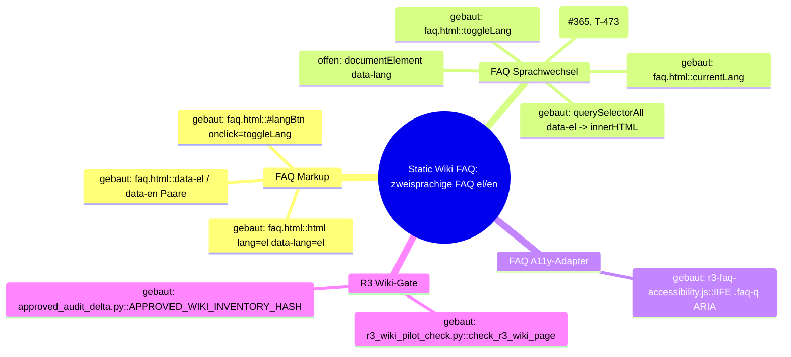
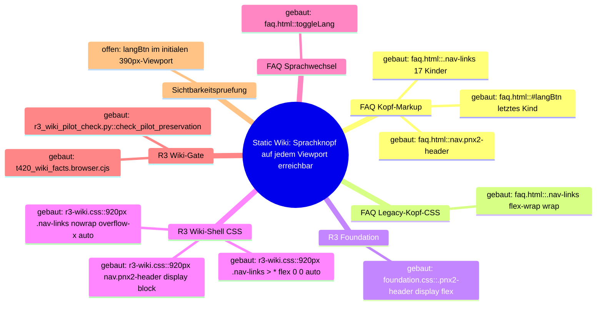

# Architecture Map — Pnyx Static Wiki / FAQ-Lokalisierung

Scope: T-472, Vorbereitung fuer [GH#365](https://github.com/NeaBouli/pnyx/issues/365).
Basis: `origin/main` `fd3b4dc5ebbc1cd80ee3db3f9945cbf27963a932`.
Kartiert ist genau ein Hop: der statische Sprachwechsel auf `docs/wiki/faq.html`.
Andere Wiki-Seiten, Web-App, API, Mobile und Dashboard sind nicht kartiert.

Diagramme: [`map.puml`](map.puml) (Mindmap + Komponenten),
[`main-path.puml`](main-path.puml) (Sequenz).

## 1. Grundidee

- Ekklesia.gr ist eine Plattform fuer digitale direkte Demokratie griechischer Buerger — `README.md` (Titel), `CLAUDE.md` (Produkt).
- Neben den Apps liefert das Repo eine statische Oberflaeche: `docs/` enthaelt Landing Page und Wiki (14 Seiten) — `README.md` (Baum, `docs/ -> Landing page + Wiki`), `wiki/Architecture.md` (Baum `docs/`).
- Das Wiki ist oeffentlich unter `https://ekklesia.gr/wiki/` erreichbar — `README.md` (Link-Zeile, Tabelle "Wiki").
- Die FAQ-Seite ist zweisprachig (el/en); Griechisch ist Default im Markup — `docs/wiki/faq.html` Z. 2 `<html lang="el" data-lang="el">`.
- Der Wechsel ist rein clientseitig: kein Server, kein Persistieren, kein Reload — `docs/wiki/faq.html` Z. 542–550.
- Grenze: Die R3-Migration darf Inline-Skripte und zweisprachige Paare der FAQ nicht veraendern; nur das lokale A11y-Skript ist als Delta erlaubt — `scripts/redesign/r3_wiki_pilot_check.py` Z. 366–380, `docs/planning/r3/R3_REPORT.md` Z. 42–43.

## 2. Spur (Hop-Liste)

Nutzerverb: "FAQ auf Englisch lesen" — Klick auf den Sprachknopf.

| # | Von | Nach | Datum ueber die Kante |
| --- | --- | --- | --- |
| H1 | `docs/wiki/faq.html::#langBtn` (Z. 188, `onclick="toggleLang()"`) | `docs/wiki/faq.html::toggleLang` (Z. 543) | Klick-Event, keine Argumente |
| H2 | `docs/wiki/faq.html::toggleLang` | `docs/wiki/faq.html::currentLang` (Z. 542, Modulvariable) | `"el"` ↔ `"en"` |
| H3 | `docs/wiki/faq.html::toggleLang` | `docs/wiki/faq.html::#langBtn.textContent` (Z. 545) | Label `"EN"` / `"ΕΛ"` |
| H4 | `docs/wiki/faq.html::toggleLang` | `document.querySelectorAll("[data-el]")` (Z. 546) | NodeList aller zweisprachigen Elemente (139 `data-el`, 139 `data-en`) |
| H5 | `querySelectorAll("[data-el]").forEach` | `el.innerHTML` (Z. 547–548) | `el.getAttribute("data-" + currentLang)` |
| L1 | `docs/wiki/faq.html::toggleLang` | `document.documentElement.lang` | **gebaut durch T-473**; folgt `currentLang` als `"el"` ↔ `"en"` |
| L2 | `docs/wiki/faq.html::toggleLang` | `document.documentElement.dataset.lang` | **offen — keine Kante im Code**; `data-lang` bleibt `"el"` (Z. 2) |

Nachbar (geoeffnet, nicht auf der Spur): `docs/assets/redesign-v2/r3-faq-accessibility.js`
wird per `<script defer>` geladen (`faq.html` Z. 950). Es setzt `role`, `tabindex`,
`aria-expanded`, `aria-controls` auf die 57 `.faq-q` (Z. 4–33) und liest oder
schreibt keine Sprache. Weil `.faq-q` selbst `[data-el]` traegt (z. B. `faq.html` Z. 203)
und H5 nur `innerHTML` ersetzt, bleiben diese ARIA-Attribute beim Wechsel erhalten.

## 3. Module

| Modul | Eine Aufgabe | Einstieg | Stand |
| --- | --- | --- | --- |
| FAQ Markup (`docs/wiki/faq.html`, statisches HTML) | Traegt Default-Sprache und zweisprachige Paare `data-el`/`data-en` | `faq.html::<html lang="el" data-lang="el">`, `#langBtn` | gebaut |
| FAQ Sprachwechsel (`docs/wiki/faq.html`, Inline-`<script>` Z. 541–555) | Schaltet sichtbare Kopie und Dokumentsprache zwischen el/en um | `faq.html::toggleLang` | gebaut — Kopie, Knopflabel und `html[lang]` wechseln; `data-lang` bleibt ohne belegte Laufzeitwirkung statisch |
| FAQ A11y-Adapter (`docs/assets/redesign-v2/r3-faq-accessibility.js`) | Tastatur- und ARIA-Semantik fuer FAQ-Akkordeon | IIFE, `.faq-q` forEach | gebaut (Nachbar, sprachneutral) |
| R3 Wiki-Gate (`scripts/redesign/r3_wiki_pilot_check.py` + `approved_audit_delta.py`) | Friert FAQ-Inline-Skripte und bilinguale Paare gegen R0-Baseline bzw. freigegebenen Inventar-Hash ein | `r3_wiki_pilot_check.py::check_r3_wiki_page`, `approved_audit_delta.py::APPROVED_WIKI_INVENTORY_HASH["docs/wiki/faq.html"]` | gebaut (Leitplanke, nicht Laufzeit) |

## 4. Verdrahtung

- `#langBtn` → `toggleLang`: das Inline-`onclick` ruft `toggleLang()` ohne Argumente.
- `toggleLang` → `currentLang`: die globale Variable wird zwischen `"el"` und `"en"` umgeschaltet; Startwert ist hart `"el"`, nicht aus `<html lang>` gelesen.
- `toggleLang` → `#langBtn.textContent`: der Knopf zeigt die jeweils andere Sprache (`"EN"` bzw. `"ΕΛ"`).
- `toggleLang` → `querySelectorAll("[data-el]")`: jedes Element mit Paar erhaelt `innerHTML = data-<currentLang>`; fehlt der Wert, bleibt das Element unveraendert.
- `faq.html` → `r3-faq-accessibility.js`: das deferte Skript ergaenzt ARIA auf `.faq-q`; es ist nicht mit `toggleLang` verdrahtet.
- `r3_wiki_pilot_check.py` → `faq.html`: das Gate vergleicht Inline-Skripte und bilinguale Paare mit der Baseline, ausser der Inventar-Hash matcht `APPROVED_WIKI_INVENTORY_HASH`.

## 5. Widerspruch und Luecken

- **L1 (#365, durch T-473 geschlossen):** `toggleLang` setzt `document.documentElement.lang = currentLang`; EN und EL synchronisieren sichtbare Kopie und Dokumentsprache.
- **Luecke L2 (beobachtet, nicht Teil von #365):** `data-lang` auf `<html>` bleibt ebenfalls `"el"`. Weder `faq.html` (einziges Vorkommen Z. 2) noch `docs/assets/` lesen `data-lang`; die Inkonsistenz hat heute keine belegte Laufzeitwirkung und bleibt ausserhalb des Folgefixes.
- **Widerspruch:** `docs/planning/r3/R3_REPORT.md` Z. 134–138 meldet fuer alle 14 Wiki-Seiten "no … language-toggle failure". Issue #365 ist live reproduziert. Beide Aussagen bleiben stehen; die R3-Browserpruefung hat laut Report nur die Kopie, nicht `document.documentElement.lang` belegt.
- **Leitplanke fuer den Fix:** Jede Aenderung am FAQ-Inline-Skript aendert den Inventar-Hash. `approved_audit_delta.py::APPROVED_WIKI_INVENTORY_HASH["docs/wiki/faq.html"]` muss im selben Diff nachgefuehrt werden, sonst schlaegt `r3_wiki_pilot_check.py --all` mit `scripts.inline changed` fehl.
- **Nicht kartiert:** Zustand nach Reload (kein Persistieren, daher Rueckfall auf `el` — konsistent mit `lang="el"`), JSON-LD `FAQPage` (bleibt griechisch), Sprachschalter anderer Wiki-Seiten.

## 6. Diagrammdateien

- `docs/architecture/MAP.md` (diese Datei, Mermaid-Mindmap unten)
- `docs/architecture/map.puml` (PlantUML-Mindmap + Komponentendiagramm)
- `docs/architecture/main-path.puml` (PlantUML-Sequenz der Spur)

## 7. Gebauter Schritt (#365, T-473)

- **Modul:** FAQ Sprachwechsel.
- **Hop:** `faq.html::toggleLang → document.documentElement.lang` (L1).
- **Aenderung:** `toggleLang` setzt direkt nach dem Umschalten von `currentLang` `document.documentElement.lang = currentLang;`. Kein `data-lang`-Umbau, Wrapper, zweiter Listener, Persistieren oder neues Flag.
- **Dateien, die sich aendern duerfen:** `docs/wiki/faq.html` (nur Inline-`toggleLang`), `scripts/redesign/approved_audit_delta.py` (nur Hash-Eintrag `docs/wiki/faq.html` + Kommentarzeile), ein Regressionstest unter `scripts/redesign/` (Pattern `test_*.py` bzw. `*.browser.cjs`), der nach Toggle `document.documentElement.lang === "en"` und nach zweitem Toggle `"el"` belegt.
- **Unberuehrt:** `docs/assets/redesign-v2/r3-faq-accessibility.js`, alle `data-el`/`data-en`-Paare und FAQ-Inhalte, alle anderen `docs/wiki/*.html`, `scripts/redesign/r0_inventory.py`, `r3_wiki_pilot_check.py`, `apps/**`.

---

# Architecture Map — Pnyx Static Wiki / Responsive FAQ Navigation (T-474)

Scope: T-474, reine Kartierung, kein Fix.
Basis: `agent/claude/T-473` `c4329f694c2b5752299daf85108f2d90e4f9dea3` (enthaelt `origin/main` `2bfda8e`).
Kartiert ist genau ein Nutzerweg: **FAQ-Sprachknopf auf schmalem Viewport finden und bedienen.**
Hop: `docs/wiki/faq.html::nav.pnx2-header/.nav-links/#langBtn → docs/assets/redesign-v2/r3-wiki.css::@media (max-width: 920px) .pnx2-header .nav-links → initialer 390px-Viewport`.
Der Sprachwechsel selbst (`toggleLang`) ist oben (T-472) kartiert und hier nur Endpunkt.

Diagramme: [`map.puml`](map.puml) (`faq-nav-mindmap`, `faq-nav-components`),
[`main-path.puml`](main-path.puml) (`faq-nav-main-path`).

## T-474 / 1. Grundidee

- Das statische Wiki unter `docs/wiki/` ist zweisprachig; der einzige Sprachschalter jeder Seite ist `#langBtn` im Kopf — `docs/wiki/faq.html` Z. 188.
- Die R3-Migration legt eine gemeinsame Wiki-Shell ueber das unveraenderte Legacy-Markup, ohne Inhalt oder Verhalten zu aendern — `docs/assets/redesign-v2/r3-wiki.css` Z. 1–7, `docs/planning/r3/R3_REPORT.md` Z. 89–96.
- Die Shell verspricht, dass der Kopf auf schmalen Breiten nicht abschneidet — `docs/assets/redesign-v2/foundation.css` Z. 366–367 (Kommentar "stack header nav under the brand on narrow widths instead of clipping").
- Ergebnis fuer den Nutzer: auf jedem Viewport den Sprachknopf sehen und antippen.
- Grenze: statisches HTML/CSS, kein Build, kein Server-Zustand; Aenderung an Wiki-HTML ist durch `scripts/redesign/r3_wiki_pilot_check.py` eingefroren.

## T-474 / 2. Spur (Hop-Liste)

Nutzerverb: "auf dem Handy (390px) die FAQ auf Englisch umschalten" — Sprachknopf finden, dann tippen.

| # | Von | Nach | Datum ueber die Kante |
| --- | --- | --- | --- |
| N1 | `faq.html::<nav class="pnx2-header">` (Z. 169) | `faq.html::.nav-logo` (Z. 170), `faq.html::div.nav-links` (Z. 171) | zwei Flex-Kinder des Kopfs |
| N2 | `faq.html::div.nav-links` (Z. 171–189) | 17 Kinder: 4 Links, 1 Trenner-`span` (Z. 176), 11 Links, `#langBtn` (Z. 188) | DOM-Reihenfolge; `#langBtn` ist Kind-Index 16 von 17 (letztes) |
| N3 | `faq.html::<style>` (Z. 38–161) | `nav`, `.nav-links`, `.lang-btn` Basisregeln (Z. 65–73, 79, 89–96, 160) | `.nav-links { flex-wrap: wrap }` (Spezifitaet 0,1,0), inline `@media (max-width: 640px)` nur Schriftgroesse/Padding der Links |
| N4 | `faq.html` Z. 163–165 | `tokens.css` → `foundation.css` → `r3-wiki.css` | spaeter geladen = gewinnt bei gleicher Spezifitaet; `r3-wiki.css` ist die letzte Quelle |
| N5 | `foundation.css::.pnx2-header` (Z. 91–100) | `nav.pnx2-header` | `display: flex`; die 640px-Regeln (Z. 368–394) zielen auf `.pnx2-header-inner`/`.pnx2-nav`, die das Wiki-Markup nicht hat |
| N6 | `r3-wiki.css::@media (max-width: 920px) nav.pnx2-header` (Z. 238–242) | `nav.pnx2-header` | `display: block; padding-inline: 0` → `.nav-links` bekommt eine eigene volle Zeile unter dem Logo |
| N7 | `r3-wiki.css::@media (max-width: 920px) .pnx2-header .nav-links` (Z. 248–256) | `div.nav-links` | `width: 100%; flex-wrap: nowrap; justify-content: flex-start; overflow-x: auto` (Spezifitaet 0,2,0 schlaegt inline 0,1,0) → horizontaler Scrollcontainer |
| N8 | `r3-wiki.css::@media (max-width: 920px) .pnx2-header .nav-links > *` (Z. 258–260) | alle 17 Kinder inkl. `#langBtn` | `flex: 0 0 auto` → keine Schrumpfung; `.lang-btn` zusaetzlich 44px Zielgroesse (Z. 49–61) |
| N9 | `div.nav-links` (Scrollcontainer, `scrollLeft = 0`) | initialer 390px-Viewport | `clientWidth 390`, `scrollWidth 1520`; sichtbar sind 5 von 17 Kindern; `#langBtn` liegt bei x=1460–1504 |
| N10 | `#langBtn` | `faq.html::toggleLang` (Z. 542–550, T-472/T-473) | erst nach horizontalem Scroll oder Fokus erreichbar |

Messbeleg (lokal ausgeliefertes `docs/`, Chromium headless via Playwright, alle Fremd-Requests abgebrochen, kein Live-System):

| Seite / Viewport / Variante | `.nav-links` overflow-x / wrap | client / scrollWidth | `#langBtn` x–right | im Scroller sichtbar | `elementFromPoint` Mitte | Doc-Overflow |
| --- | --- | --- | --- | --- | --- | --- |
| faq 390x844, gebaut | auto / nowrap | 390 / 1520 | 1460–1504 | nein (5/17 Kinder) | `null` | 0 |
| faq 390x844, `r3-wiki.css` deaktiviert | visible / wrap | 342 / 342 | 202–245 | ja (17/17) | `langBtn` | 0 |
| faq 1440x900, gebaut | visible / wrap | 1392 / 1392 | 1373–1416 | ja | `langBtn` | 0 |
| index 390x844, gebaut | auto / nowrap | 390 / 1520 | 1460–1504 | nein | `null` | 0 |
| security 390x844, gebaut | auto / nowrap | 390 / 1520 | 1460–1504 | nein | `null` | 0 |

Zusatz: `#langBtn.focus()` bei 390px setzt `.nav-links.scrollLeft` auf 1130 und bringt den Knopf nach x=330 — Tastatur erreicht ihn, Touch ohne Wischgeste nicht.

## T-474 / 3. Module

| Modul | Eine Aufgabe | Einstieg | Stand |
| --- | --- | --- | --- |
| FAQ Kopf-Markup (`docs/wiki/faq.html`, `<nav>`) | Stellt Logo, 16 Nav-Eintraege und `#langBtn` in fester DOM-Reihenfolge bereit | `faq.html::nav.pnx2-header > .nav-links > #langBtn` | gebaut |
| FAQ Legacy-Kopf-CSS (`docs/wiki/faq.html`, Inline-`<style>`) | Basislayout: wrap-faehiger Flex-Kopf | `faq.html::.nav-links { flex-wrap: wrap }` | gebaut — auf ≤920px durch R3-Shell ueberschrieben |
| R3 Foundation (`docs/assets/redesign-v2/foundation.css`) | Sticky-Kopf, Tokens fuer Zielgroesse/Abstaende | `foundation.css::.pnx2-header` | gebaut (Nachbar; schmale Regeln treffen Wiki-Markup nicht) |
| R3 Wiki-Shell CSS (`docs/assets/redesign-v2/r3-wiki.css`) | Gemeinsame responsive Kopfregeln fuer alle R3-Wiki-Seiten | `r3-wiki.css::@media (max-width: 920px) .pnx2-header .nav-links` | gebaut — erzeugt den Scrollcontainer, in dem `#langBtn` initial ausserhalb liegt |
| FAQ Sprachwechsel (`faq.html::toggleLang`) | Endpunkt der Spur, schaltet el/en | `faq.html::toggleLang` | gebaut (T-473, Z. 545 setzt `documentElement.lang`) |
| R3 Wiki-Gate (`scripts/redesign/r3_wiki_pilot_check.py`) | Friert Wiki-HTML und Media-Query-Menge ein | `r3_wiki_pilot_check.py::check_pilot_preservation` (Z. 240–247 erwartet `@media (max-width: 920px)`) | gebaut (Leitplanke; prueft keine Sichtbarkeit von `#langBtn`) |
| Wiki-Browser-Gate (`scripts/redesign/t420_wiki_facts.browser.cjs`) | Browserpruefung Wiki bei 1440/390px | `t420_wiki_facts.browser.cjs` (Z. 30 Viewports) | gebaut (prueft Doc-Overflow und Nav-Duplikate, nicht Sichtbarkeit des Sprachknopfs) |
| Sichtbarkeitspruefung Sprachknopf auf schmalem Viewport | Belegt `#langBtn` im initialen Viewport | — | offen — kein Symbol in `scripts/redesign/` |

## T-474 / 4. Verdrahtung

- `nav.pnx2-header` → `.nav-links`: `.nav-links` ist zweites Kind des Kopfs; bei ≤920px wird der Kopf `display: block`, also bekommt `.nav-links` die volle Zeilenbreite unter dem Logo.
- `.nav-links` → `#langBtn`: `#langBtn` ist letztes (17.) Kind; die Hauptachse laeuft links→rechts, also liegt es am Ende der Reihe.
- Inline-`<style>` → `r3-wiki.css`: beide setzen `.nav-links`; `r3-wiki.css` wird spaeter geladen und hat hoehere Spezifitaet (0,2,0 gegen 0,1,0), daher gilt `flex-wrap: nowrap` statt `wrap`.
- `r3-wiki.css` 920px-Block → `.nav-links`: `overflow-x: auto` macht `.nav-links` zum Scrollcontainer; `flex: 0 0 auto` der Kinder verhindert Schrumpfen, daher waechst `scrollWidth` auf 1520px.
- Scrollcontainer → Viewport: `scrollLeft` startet bei 0 und `justify-content: flex-start`, also zeigt der initiale Viewport nur die ersten fuenf Kinder; der Ueberhang bleibt im Container, Doc-Overflow bleibt 0.
- `#langBtn` → `toggleLang`: das `onclick` feuert erst, wenn der Knopf nach Scroll oder Fokus unter dem Finger liegt.
- `r3_wiki_pilot_check.py` / `t420_wiki_facts.browser.cjs` → Wiki-Seiten: beide pruefen Struktur bzw. Doc-Overflow; keiner prueft, ob `#langBtn` bei 390px initial sichtbar ist.

## T-474 / 5. Widerspruch und Luecken

- **Ursache ist shared, nicht FAQ-lokal (belegt):** Mit deaktiviertem `r3-wiki.css` wrapt `.nav-links` und `#langBtn` liegt bei x=202 sichtbar. `index.html` und `security.html` zeigen bei 390px dieselben Werte (1460–1504, `scrollWidth 1520`). 14 von 15 Seiten, die `r3-wiki.css` laden, haben dieselbe 17-Kind-Nav mit `#langBtn` als letztem Kind; `zk-voting.html` hat 5 Kinder und keinen `#langBtn`. Die Wirkung trifft also alle 14 zweisprachigen R3-Wiki-Seiten.
- **Widerspruch Shell-Versprechen:** `foundation.css` Z. 366–367 sagt "stack header nav … instead of clipping"; `r3-wiki.css` Z. 248–256 macht fuer das Wiki genau einen horizontal abgeschnittenen Scroller. Beide Zeilen bleiben stehen.
- **Widerspruch Landing-Policy:** `scripts/redesign/test_t384_responsive_nav.py` Z. 141–157 verbietet `overflow-x: auto` auf `.nav-links` als alleinigen Zugang ("use hamburger menu instead") — aber nur fuer `r5-landing-fidelity.css`. `r3-wiki.css` nutzt genau dieses Muster. Die Landing-Regel gilt nicht fuer das Wiki; ein Hamburger ist fuer T-474 ausdruecklich ausgeschlossen.
- **Widerspruch Abnahme:** `docs/planning/r3/R3_REPORT.md` Z. 135–138 meldet bei 360x800 keinen Language-Toggle-Fehler; Playwright-`click()` scrollt Ziele automatisch in Sicht und verdeckt damit die initiale Unsichtbarkeit.
- **Luecke G1:** Kein Gate prueft `#langBtn` im initialen schmalen Viewport (Modul "Sichtbarkeitspruefung", `offen`).
- **Luecke der T-472-Karte:** Abschnitt T-472 fuehrt L1 (`documentElement.lang`) noch als `offen`; seit T-473 ist die Kante gebaut (`faq.html` Z. 545). Nicht Teil von T-474, hier nur vermerkt.
- **Nicht kartiert:** WebKit/iOS-Scrollleistenanzeige, andere Breakpoints zwischen 391 und 920px, Sticky-Verhalten des Kopfs beim Seitenscroll.

## T-474 / 6. Diagrammdateien

- `docs/architecture/MAP.md` (dieser Abschnitt, Mermaid-Mindmap unten)
- `docs/architecture/map.puml` (`faq-nav-mindmap`, `faq-nav-components`)
- `docs/architecture/main-path.puml` (`faq-nav-main-path`)

## T-474 / 7. Naechster Schritt (Fixknoten)

- **Modul:** R3 Wiki-Shell CSS.
- **Hop:** `r3-wiki.css::@media (max-width: 920px) .pnx2-header .nav-links > * → .lang-btn` im Scrollcontainer (N8/N9).
- **Aenderung (Vorschlag, Entscheidung bei Sol):** eine Regel im bestehenden 920px-Block, die `.pnx2-header .lang-btn` an die Inline-End-Kante des Scrollers heftet (`position: sticky; right: 0` mit Hintergrund), sodass der Knopf bei `scrollLeft = 0` sichtbar ist, ohne DOM-Reihenfolge, Fokusreihenfolge oder Markup zu aendern. Kein Hamburger, kein zweiter Knopf, kein Wrapper, kein JS, kein `order`-Umstellen, kein Aufheben des Scrollers fuer alle Links.
- **Wirkung:** shared — die Regel wirkt identisch auf alle 14 zweisprachigen R3-Wiki-Seiten; das ist gewollt, weil die Ursache dort liegt. Kein weiterer Umbau der Wiki-Seiten.
- **Dateien, die sich aendern duerfen:** `docs/assets/redesign-v2/r3-wiki.css` (nur der `@media (max-width: 920px)`-Block Z. 237–261), ein Regressionstest unter `scripts/redesign/` (`test_*.py` fuer die CSS-Regel und/oder `*.browser.cjs`, der bei 390x844 ohne Klick/Scroll `#langBtn` innerhalb von `.nav-links`-Rect und `elementFromPoint === #langBtn` belegt, bei 1440x900 unveraendert).
- **Unberuehrt:** `docs/wiki/*.html` (inkl. `faq.html` Markup, Inline-CSS, `toggleLang`), `docs/assets/redesign-v2/foundation.css`, `tokens.css`, `r3-faq-accessibility.js`, `r5-landing-fidelity.css`, `scripts/redesign/r3_wiki_pilot_check.py`, `approved_audit_delta.py`, `r0_inventory.py`, `test_t384_responsive_nav.py`, `apps/**`.
- **Machbarkeitsbeleg (nur im Browser injiziert, keine Datei geaendert):** `@media (max-width:920px){.pnx2-header .lang-btn{position:sticky;right:0}}` per `addStyleTag` → Chromium und WebKit bei 390x844: `#langBtn` x=331–374, `elementFromPoint` = `langBtn`, Doc-Overflow 0; bei 1440x900 unveraendert x=1373–1416. Hintergrund/Abdeckung der letzten Links und Scrollbar-Darstellung sind im Fix-Lauf per Screenshot zu pruefen.
