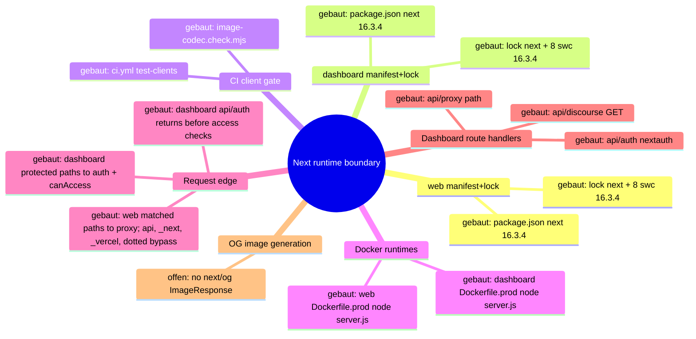
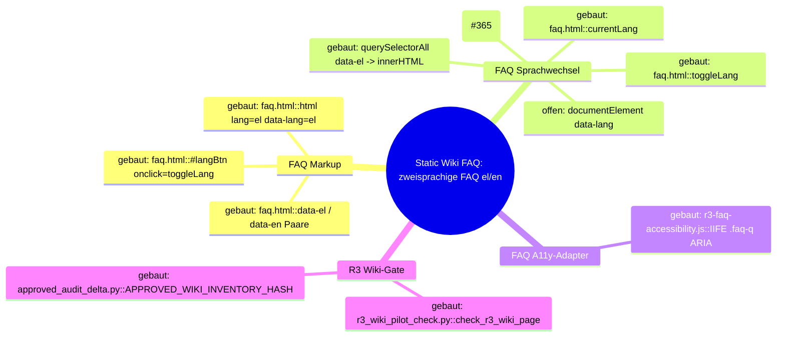

# Architecture Map — Next Runtime Dependency Boundary (T-485)

Scope: `apps/web` + `apps/dashboard` Next.js runtimes against
GHSA-vcvr-r3jv-pc5j (`next` >=16.2.0 <16.3.6, patched 16.3.6; RCE needs Node.js
`next/og` `ImageResponse` rendering attacker-controlled SVG content/attributes/styles).
Base: `origin/main` 49e449a3bc9af1000e9d111fba9b9da2e27d673c. Read-only run: no
package, lock, source or config change. Existing maps (`EKKLESIA_V2_MINIMA.md`,
`FEDERATION.md`) stay untouched.

## 1. Grundidee

- Ekklesia.gr is a digital direct-democracy platform for Greek citizens (`apps/web/src/app/[locale]/layout.tsx::metadata.openGraph.description`).
- Citizens use the public web runtime (`apps/web`, port 3000) for bills, VAA, results (`apps/web/src/app/[locale]/**/page.tsx`).
- Operators use the auth-gated admin dashboard (`apps/dashboard`, port 3001) (`apps/dashboard/src/proxy.ts::proxy`, `apps/dashboard/package.json::scripts.start`).
- Both are standalone Next builds served by `node server.js` in Docker (`apps/{web,dashboard}/next.config.*::output`, `apps/{web,dashboard}/Dockerfile.prod::CMD`).
- Boundary of this map: the `next` package version as it flows from manifest to running route handlers, plus the advisory's `next/og` sink.

## 2. Spur (opened hops)

1. `apps/web/package.json::dependencies.next` = `16.3.4` (exact) → `apps/web/package-lock.json::packages["node_modules/next"]` = 16.3.4, `engines.node >=20.9.0`.
2. `apps/dashboard/package.json::dependencies.next` = `16.3.4` (exact) → `apps/dashboard/package-lock.json::packages["node_modules/next"]` = 16.3.4.
3. Lock `node_modules/next` → 8 platform `node_modules/@next/swc-*` entries, each 16.3.4 (both locks); `sharp` 0.35.4 via `overrides`.
4. Lock → `.github/workflows/ci.yml::test-clients` (`npm ci` → `image-codec.check.mjs` → lint → typecheck → [web: vitest] → `npm run build`).
5. Lock → `apps/web/Dockerfile.prod` (`npm ci` with repo `.npmrc`, docs/ copied into `public/`, `npm run build`) → runner `node server.js` (context `../../`, `infra/docker/docker-compose.prod.yml::web`).
6. Lock → `apps/dashboard/Dockerfile.prod` (`npm ci --ignore-scripts`, `npm run build`) → runner `node server.js` (context `../../apps/dashboard`, `docker-compose.prod.yml::dashboard`).
7. `server.js` → the web proxy matcher excludes `/api`, `_next`, `_vercel`, and dotted paths; matched page requests enter `apps/web/src/proxy.ts::proxy` (redirects/rewrites + next-intl) → `apps/web/src/app/[locale]/*/page.tsx` (9 pages, no route handlers).
8. `server.js` → the dashboard matcher excludes `_next/static`, `_next/image`, and `favicon.ico`; matched protected pages and non-auth APIs enter `apps/dashboard/src/proxy.ts::proxy` (session gate, then role check) → `(dashboard)/*/page.tsx` (23), `api/discourse/route.ts::GET` (JSON), and `api/proxy/[...path]/route.ts` (JSON, SUPER_ADMIN). `/api/auth/*` is matched but returns before the user and `canAccess` checks to reach `api/auth/[...nextauth]/route.ts::{GET,POST}`.
9. Side-hop `request-controlled value → next/og ImageResponse SVG` — **offen / nicht verdrahtet** (evidence below).

### Sink evidence (all `git grep` on 49e449a, excluding lockfiles)

| Pattern | Scope | Hits |
| --- | --- | --- |
| `next/og`, `ImageResponse`, `new ImageResponse`, `@vercel/og` | whole repo | 0 |
| `satori`, `resvg`, `generateImageMetadata` | apps/web, apps/dashboard | 0 |
| `export const runtime` (Node vs Edge) | apps/web, apps/dashboard | 0 → all routes default Node.js runtime |
| `opengraph-image.*`, `twitter-image.*`, `icon.*`, `apple-icon.*` files | apps/web, apps/dashboard | 0 (only `public/manifest.json`) |
| `route.ts` handlers | both | 3, all dashboard, none returns images |
| `node_modules/@vercel/og`, `satori`, `@resvg/*` in locks | both locks | 0 (next's og bundle only inside `next/dist/compiled`) |

Image neighbours: `openGraph` in web layout is static text, no `images`; `next/image` in
`NavHeader.tsx`/`sso-verify/page.tsx` uses the image optimizer, not `next/og`; inline
`<svg>` literals in NavHeader/sso-verify/login are static JSX.

## 3. Module

| Modul | Eine Aufgabe | Einstieg | Stand |
| --- | --- | --- | --- |
| web manifest+lock | pin `next` for public web | `apps/web/package.json::dependencies.next` | gebaut (16.3.4, affected) |
| dashboard manifest+lock | pin `next` for admin dashboard | `apps/dashboard/package.json::dependencies.next` | gebaut (16.3.4, affected) |
| CI client gate | install + verify + build both runtimes | `.github/workflows/ci.yml::test-clients` | gebaut |
| image-codec check | assert optimizer + sharp ⊂ next's sharp range | `apps/{web,dashboard}/image-codec.check.mjs` | gebaut |
| web Docker runtime | build standalone, serve on 3000 | `apps/web/Dockerfile.prod::CMD` | gebaut |
| dashboard Docker runtime | build standalone, serve on 3001 | `apps/dashboard/Dockerfile.prod::CMD` | gebaut |
| web request edge | locale/static redirects | `apps/web/src/proxy.ts::proxy` | gebaut |
| dashboard request edge | auth + RBAC gate | `apps/dashboard/src/proxy.ts::proxy` | gebaut |
| dashboard route handlers | auth, discourse JSON, API proxy JSON | `apps/dashboard/src/app/api/**/route.ts` | gebaut |
| OG image generation | `next/og` `ImageResponse` | — | offen (no symbol) |

## 4. Verdrahtung

- `package.json::next` → lock `node_modules/next`: exact pin, lock matches 16.3.4 in both apps.
- lock `next` → `@next/swc-*`: 8 platform binaries pinned to the same 16.3.4; must move together.
- lock → CI `npm ci` / `npm run build`: CI builds both runtimes from their own lock.
- lock → `Dockerfile.prod` `npm ci`: prod image installs the same lock; web keeps install scripts per `.npmrc`, dashboard passes `--ignore-scripts`.
- `Dockerfile.prod` → `node server.js`: standalone server, Node 22.13.0-alpine.
- `server.js` → web `proxy.ts`: only matcher-selected requests enter it; `/api`, `_next`, `_vercel`, and dotted paths bypass the proxy.
- `server.js` → dashboard `proxy.ts`: matcher-selected requests enter it, but `/api/auth/*` returns before the protected user and `canAccess` checks; protected pages and the other API paths continue through those checks.
- proxy or matcher bypass → pages/route handlers: no handler or page imports `next/og`.

## 5. Widerspruch und Lücken

- (a) Versionally affected: both runtimes resolve `next` 16.3.4 ∈ [16.2.0, 16.3.6).
- (b) Exploit path not evidenced: 0 `next/og`/`ImageResponse` call sites, no metadata image files, no SVG-rendering handler. The vulnerable code ships in `next/dist/compiled` but is unreachable without an importer.
- (c) Hygiene upgrade still justified: all routes run Node.js runtime by default, so any future `ImageResponse` with request data would hit the vulnerable sink directly.
- Attacker preconditions (all missing today): a Node-runtime route/metadata file importing `next/og`; request-controlled input reaching SVG content, attributes or styles in the JSX tree; reachability without auth (web) or with an operator session (dashboard).
- Gap: install-script parity differs (web `npm ci` + `.npmrc`, dashboard `npm ci --ignore-scripts`); not changed here.
- Gap: `image-codec.check.mjs` asserts `sharp` 0.35.4 satisfies `next.optionalDependencies.sharp`; 16.3.6 range not verified in this run (no install).
- Not checked: npm registry metadata for 16.3.6, live/runtime state, builds.

## 6. Diagramme

- `docs/architecture/map.puml` (mindmap + component)
- `docs/architecture/main-path.puml` (sequence of the built path)

## 7. Nächster Schritt (single follow-fix node, T-486)

Modul: web + dashboard manifest+lock. Hop: `package.json::dependencies.next`
16.3.4 → 16.3.6 → lock `node_modules/next` + all 8 `@next/swc-*` to 16.3.6, in both apps.
Files: `apps/{web,dashboard}/package.json`, `apps/{web,dashboard}/package-lock.json` only.
Untouched: Dockerfiles, `next.config.*`, `proxy.ts`, all `src/**`, `.github/**`,
`@next/eslint-plugin-next` (#394), React, `overrides`.
Must stay green: CI `test-clients` Web + Dashboard (`image-codec.check.mjs`, lint,
typecheck, web vitest, `npm run build`), both `Dockerfile.prod` builds, and the
routes in hops 7–8 (web locale pages + proxy redirects; dashboard pages, `/login`,
`/api/auth/*`, `/api/discourse`, `/api/proxy/*`).

---

# Preserved Map Node — EKA-18 Local Developer Stack / Compose Exposure Boundary

Integrated from `origin/main` at T-486 refresh. The full evidence and acceptance
record remains in `.fleet/reports/T-481.md` and `.fleet/reports/T-482.md`.

## Module and hop

- Node: local developer stack / Compose exposure boundary.
- Hop H1: README Quick Start starts `infra/docker/docker-compose.yml`.
- Hop H2: host-side alembic, seeds, and uvicorn use the loopback defaults in
  `apps/api/config.py::Settings`.
- Hop H3: the API container uses the internal `db` and `redis` service names.
- Hop H4: only PostgreSQL and Redis host publications are narrowed to
  `127.0.0.1`; the API's port 8000 publication remains unchanged.

## Security invariant

Development datastores with repository-public or absent credentials are not
reachable through a non-loopback host interface, while host development tools
retain `localhost:5432` and `localhost:6379` access and containers retain their
service-DNS access. Production Compose, API auth, salt policy, and datastore
authentication are outside this node.

## Built state

- `infra/docker/docker-compose.yml` binds db and redis to IPv4 loopback.
- `apps/api/tests/test_dev_compose_exposure.py` pins loopback publication,
  published ports, internal service-DNS targets, and dependencies.
- README warns that the development credentials are public and the stack is not
  for shared or production hosts.

# Architecture Map — Sentry Capture Policy Boundary

Basis: `origin/main 4cc11930f4be82ba2d012def487fb34abca9da26` · Task: T-493 · Mapping only, no fix.
Node: API observability / Sentry event capture policy.

## 1. Grundidee

- Ekklesia.gr is a privacy-sensitive civic platform; the API handles request data and intermediate values that can include personal or security-relevant information.
- `apps/api/main.py::_sentry_init_options` is the single global policy boundary for Sentry error and transaction capture.
- FastAPI and Starlette integrations build Sentry events, `_before_send_filter` applies a second redaction layer, and the SDK transport sends the resulting envelope.
- This map opens only the event-construction policy hop. DSN, sampling, environment, provider configuration, deployment and stored Sentry events remain outside the boundary.

## 2. Spur (one trace, hops opened)

| # | From → To | Datum over the edge |
| --- | --- | --- |
| H1 | FastAPI/Starlette exception or transaction → Sentry integrations | exception, stack, request context and transaction metadata |
| H2 | `main.py::_sentry_init_options` → `sentry_sdk.init` | integrations, sampling, environment, PII and hook policy |
| H3 | Sentry SDK integration → event construction | stack frames; SDK default may attach frame-local variables |
| H4 | Sentry SDK integration → request extraction | request metadata; SDK default may attach a request body up to its configured size |
| H5 | constructed event → `main.py::_before_send_filter` | event/request/frame data; known sensitive keys and request fields are redacted recursively |
| H6 | `_before_send_filter` → Sentry transport | filtered event envelope sent to the configured DSN |

## 3. Module

| Modul | Eine Aufgabe | Einstieg | Stand |
| --- | --- | --- | --- |
| Sentry init policy | defines global capture controls | `apps/api/main.py::_sentry_init_options` | gebaut; frame-local and body policies are implicit SDK defaults |
| Web integrations | derive error/transaction/request events | `FastApiIntegration`, `StarletteIntegration` | gebaut (external SDK) |
| Event redaction | strips environment and redacts known sensitive values | `apps/api/main.py::_before_send_filter` | gebaut; defense layer, not a complete arbitrary-value denylist |
| SDK transport | serializes and sends envelopes | `sentry_sdk.init` / transport | gebaut (external SDK) |
| Policy regression tests | pin capture policy and transport result | `apps/api/tests/test_sentry_secret_scrubbing.py` | partial; filters and synthetic secrets covered, capture defaults not pinned |

## 4. Verdrahtung

- Application startup calls `_sentry_init_options(settings.sentry_dsn)` and passes the result to `sentry_sdk.init`.
- `FastApiIntegration` and `StarletteIntegration` collect exception, trace and request context before the application hook runs.
- `_before_send_filter` removes request environment, cookies and query strings; drops selected headers; and recursively redacts sensitive-key values in request data, extras and frame vars.
- Ordinary local-variable names and arbitrary body-field names are not guaranteed sensitive by that key-based filter.
- The filtered event proceeds to the SDK transport. Tests use an in-memory capture transport, so this boundary can be verified without network or Sentry access.

## 5. Widerspruch und Lücken

**Symptom:** global SDK defaults can collect arbitrary frame-local values and request bodies before `_before_send_filter` runs.

**Ursache:** `_sentry_init_options` deliberately sets `send_default_pii=False`, but does not explicitly set `include_local_variables` or `max_request_body_size`. The downstream redactor recognizes sensitive keys, not every value whose name appears harmless.

**Source → sink:** request/exception → FastAPI/Starlette integration → SDK event construction with implicit capture defaults → key-based `_before_send_filter` → transport.

**Sicherheitsinvariante:** Sentry events never contain frame-local variables or request bodies, independent of variable/key naming. Existing stack/exception metadata, URL and method metadata, sampling and redaction hooks remain available.

**Defense in depth:** `include_local_variables=False` prevents local values at event construction; `max_request_body_size="never"` prevents request-body collection. `_before_send_filter` remains in place for headers, query strings, cookies, extras and any event data supplied by other integrations.

**Lücken:**

- Current tests assert hook wiring and `send_default_pii=False`, but not the two capture-boundary settings.
- Existing transport tests use sensitive-looking names that the downstream redactor catches; they do not prove that arbitrary local/body values are excluded at source.
- No production/Sentry-event inspection is required or authorized for this change.

## 6. Diagrammdateien

- `docs/architecture/map.puml` (mindmap + component trace)
- `docs/architecture/main-path.puml` (event sequence)
- PlantUML rendering is optional for this mapping commit; source files are authoritative.

## 7. Nächster Schritt (engste Reparaturgrenze)

**Modul:** API observability / Sentry init policy. **Hop:** H2–H4.

1. Add `include_local_variables=False` and `max_request_body_size="never"` to `apps/api/main.py::_sentry_init_options`.
2. Extend `apps/api/tests/test_sentry_secret_scrubbing.py` with configuration invariants and SDK-transport checks showing arbitrary frame-local and request-body-only sentinel values are absent.
3. Preserve exception/stack and non-body request metadata where the SDK exposes it deterministically.
4. Leave `_before_send_filter`, DSN, integrations, sample rate, environment, deployment and provider settings unchanged.

Out of scope: production deployment, live Sentry inspection, data cleanup, legal/content wording and unrelated observability refactors.

# Architecture Map — Pnyx Static Wiki / FAQ-Lokalisierung

Scope: T-472, Vorbereitung fuer [GH#365](https://github.com/NeaBouli/pnyx/issues/365).
Basis: `origin/main` `fd3b4dc5ebbc1cd80ee3db3f9945cbf27963a932`.
Kartiert ist genau ein Hop: der statische Sprachwechsel auf `docs/wiki/faq.html`.
Andere Wiki-Seiten, Web-App, API, Mobile und Dashboard sind nicht kartiert.

Diagramme: [`map.puml`](map.puml) (Mindmap + Komponenten),
[`main-path.puml`](main-path.puml) (Sequenz).

## 1. Grundidee

- Ekklesia.gr ist eine Plattform fuer digitale direkte Demokratie griechischer Buerger — `README.md` (Titel), `CLAUDE.md` (Produkt).
- Neben den Apps liefert das Repo eine statische Oberflaeche: `docs/` enthaelt Landing Page und Wiki (14 Seiten) — `README.md` (Baum, `docs/ -> Landing page + Wiki`), `wiki/Architecture.md` (Baum `docs/`).
- Das Wiki ist oeffentlich unter `https://ekklesia.gr/wiki/` erreichbar — `README.md` (Link-Zeile, Tabelle "Wiki").
- Die FAQ-Seite ist zweisprachig (el/en); Griechisch ist Default im Markup — `docs/wiki/faq.html` Z. 2 `<html lang="el" data-lang="el">`.
- Der Wechsel ist rein clientseitig: kein Server, kein Persistieren, kein Reload — `docs/wiki/faq.html` Z. 542–550.
- Grenze: Die R3-Migration darf Inline-Skripte und zweisprachige Paare der FAQ nicht veraendern; nur das lokale A11y-Skript ist als Delta erlaubt — `scripts/redesign/r3_wiki_pilot_check.py` Z. 366–380, `docs/planning/r3/R3_REPORT.md` Z. 42–43.

## 2. Spur (Hop-Liste)

Nutzerverb: "FAQ auf Englisch lesen" — Klick auf den Sprachknopf.

| # | Von | Nach | Datum ueber die Kante |
| --- | --- | --- | --- |
| H1 | `docs/wiki/faq.html::#langBtn` (Z. 188, `onclick="toggleLang()"`) | `docs/wiki/faq.html::toggleLang` (Z. 543) | Klick-Event, keine Argumente |
| H2 | `docs/wiki/faq.html::toggleLang` | `docs/wiki/faq.html::currentLang` (Z. 542, Modulvariable) | `"el"` ↔ `"en"` |
| H3 | `docs/wiki/faq.html::toggleLang` | `docs/wiki/faq.html::#langBtn.textContent` (Z. 545) | Label `"EN"` / `"ΕΛ"` |
| H4 | `docs/wiki/faq.html::toggleLang` | `document.querySelectorAll("[data-el]")` (Z. 546) | NodeList aller zweisprachigen Elemente (139 `data-el`, 139 `data-en`) |
| H5 | `querySelectorAll("[data-el]").forEach` | `el.innerHTML` (Z. 547–548) | `el.getAttribute("data-" + currentLang)` |
| L1 | `docs/wiki/faq.html::toggleLang` | `document.documentElement.lang` | **offen — keine Kante im Code**; bleibt `"el"` (Z. 2) |
| L2 | `docs/wiki/faq.html::toggleLang` | `document.documentElement.dataset.lang` | **offen — keine Kante im Code**; `data-lang` bleibt `"el"` (Z. 2) |

Nachbar (geoeffnet, nicht auf der Spur): `docs/assets/redesign-v2/r3-faq-accessibility.js`
wird per `<script defer>` geladen (`faq.html` Z. 950). Es setzt `role`, `tabindex`,
`aria-expanded`, `aria-controls` auf die 57 `.faq-q` (Z. 4–33) und liest oder
schreibt keine Sprache. Weil `.faq-q` selbst `[data-el]` traegt (z. B. `faq.html` Z. 203)
und H5 nur `innerHTML` ersetzt, bleiben diese ARIA-Attribute beim Wechsel erhalten.

## 3. Module

| Modul | Eine Aufgabe | Einstieg | Stand |
| --- | --- | --- | --- |
| FAQ Markup (`docs/wiki/faq.html`, statisches HTML) | Traegt Default-Sprache und zweisprachige Paare `data-el`/`data-en` | `faq.html::<html lang="el" data-lang="el">`, `#langBtn` | gebaut |
| FAQ Sprachwechsel (`docs/wiki/faq.html`, Inline-`<script>` Z. 541–555) | Schaltet sichtbare Kopie zwischen el/en um | `faq.html::toggleLang` | teilweise — Kopie und Knopflabel wechseln, Dokumentsprache (`lang`, `data-lang`) nicht (#365) |
| FAQ A11y-Adapter (`docs/assets/redesign-v2/r3-faq-accessibility.js`) | Tastatur- und ARIA-Semantik fuer FAQ-Akkordeon | IIFE, `.faq-q` forEach | gebaut (Nachbar, sprachneutral) |
| R3 Wiki-Gate (`scripts/redesign/r3_wiki_pilot_check.py` + `approved_audit_delta.py`) | Friert FAQ-Inline-Skripte und bilinguale Paare gegen R0-Baseline bzw. freigegebenen Inventar-Hash ein | `r3_wiki_pilot_check.py::check_r3_wiki_page`, `approved_audit_delta.py::APPROVED_WIKI_INVENTORY_HASH["docs/wiki/faq.html"]` | gebaut (Leitplanke, nicht Laufzeit) |

## 4. Verdrahtung

- `#langBtn` → `toggleLang`: das Inline-`onclick` ruft `toggleLang()` ohne Argumente.
- `toggleLang` → `currentLang`: die globale Variable wird zwischen `"el"` und `"en"` umgeschaltet; Startwert ist hart `"el"`, nicht aus `<html lang>` gelesen.
- `toggleLang` → `#langBtn.textContent`: der Knopf zeigt die jeweils andere Sprache (`"EN"` bzw. `"ΕΛ"`).
- `toggleLang` → `querySelectorAll("[data-el]")`: jedes Element mit Paar erhaelt `innerHTML = data-<currentLang>`; fehlt der Wert, bleibt das Element unveraendert.
- `faq.html` → `r3-faq-accessibility.js`: das deferte Skript ergaenzt ARIA auf `.faq-q`; es ist nicht mit `toggleLang` verdrahtet.
- `r3_wiki_pilot_check.py` → `faq.html`: das Gate vergleicht Inline-Skripte und bilinguale Paare mit der Baseline, ausser der Inventar-Hash matcht `APPROVED_WIKI_INVENTORY_HASH`.

## 5. Widerspruch und Luecken

- **Luecke L1 (#365, belegt):** `toggleLang` setzt `document.documentElement.lang` nicht. Nach Klick auf EN ist die Kopie englisch, `<html lang>` bleibt `"el"` (`faq.html` Z. 2, Z. 543–550). Screenreader und Silbentrennung behandeln englischen Text als Griechisch (WCAG 3.1.1).
- **Luecke L2 (beobachtet, nicht Teil von #365):** `data-lang` auf `<html>` bleibt ebenfalls `"el"`. Weder `faq.html` (einziges Vorkommen Z. 2) noch `docs/assets/` lesen `data-lang`; die Inkonsistenz hat heute keine belegte Laufzeitwirkung und bleibt ausserhalb des Folgefixes.
- **Widerspruch:** `docs/planning/r3/R3_REPORT.md` Z. 134–138 meldet fuer alle 14 Wiki-Seiten "no … language-toggle failure". Issue #365 ist live reproduziert. Beide Aussagen bleiben stehen; die R3-Browserpruefung hat laut Report nur die Kopie, nicht `document.documentElement.lang` belegt.
- **Leitplanke fuer den Fix:** Jede Aenderung am FAQ-Inline-Skript aendert den Inventar-Hash. `approved_audit_delta.py::APPROVED_WIKI_INVENTORY_HASH["docs/wiki/faq.html"]` muss im selben Diff nachgefuehrt werden, sonst schlaegt `r3_wiki_pilot_check.py --all` mit `scripts.inline changed` fehl.
- **Nicht kartiert:** Zustand nach Reload (kein Persistieren, daher Rueckfall auf `el` — konsistent mit `lang="el"`), JSON-LD `FAQPage` (bleibt griechisch), Sprachschalter anderer Wiki-Seiten.

## 6. Diagrammdateien

- `docs/architecture/MAP.md` (diese Datei, Mermaid-Mindmap unten)
- `docs/architecture/map.puml` (PlantUML-Mindmap + Komponentendiagramm)
- `docs/architecture/main-path.puml` (PlantUML-Sequenz der Spur)

## 7. Naechster Schritt (#365)

- **Modul:** FAQ Sprachwechsel.
- **Hop:** `faq.html::toggleLang → document.documentElement.lang` (L1).
- **Aenderung:** in `toggleLang` direkt nach dem Umschalten von `currentLang` `document.documentElement.lang = currentLang;` setzen. Kein `data-lang`-Umbau ohne eigenen belegten Bedarf, kein Wrapper, kein zweiter Listener im A11y-Adapter, kein Persistieren, kein neues Flag.
- **Dateien, die sich aendern duerfen:** `docs/wiki/faq.html` (nur Inline-`toggleLang`), `scripts/redesign/approved_audit_delta.py` (nur Hash-Eintrag `docs/wiki/faq.html` + Kommentarzeile), ein Regressionstest unter `scripts/redesign/` (Pattern `test_*.py` bzw. `*.browser.cjs`), der nach Toggle `document.documentElement.lang === "en"` und nach zweitem Toggle `"el"` belegt.
- **Unberuehrt:** `docs/assets/redesign-v2/r3-faq-accessibility.js`, alle `data-el`/`data-en`-Paare und FAQ-Inhalte, alle anderen `docs/wiki/*.html`, `scripts/redesign/r0_inventory.py`, `r3_wiki_pilot_check.py`, `apps/**`.
