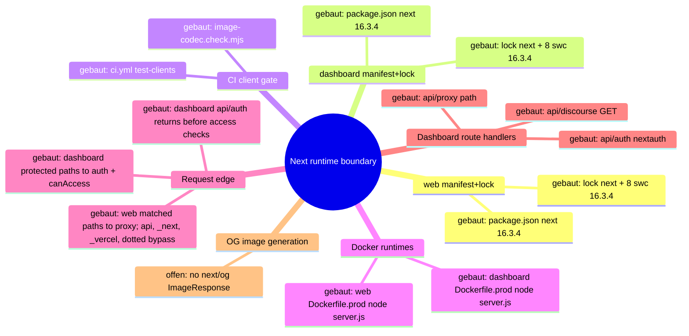
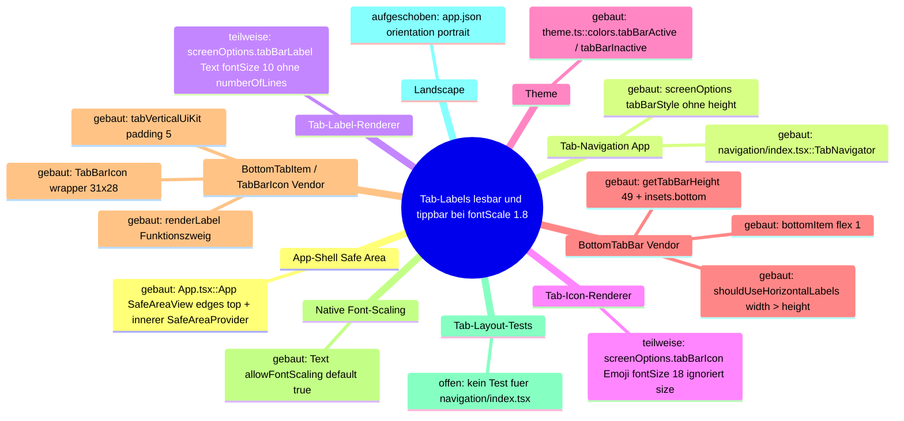

# Architecture Map — Next Runtime Dependency Boundary (T-485)

Scope: `apps/web` + `apps/dashboard` Next.js runtimes against
GHSA-vcvr-r3jv-pc5j (`next` >=16.2.0 <16.3.6, patched 16.3.6; RCE needs Node.js
`next/og` `ImageResponse` rendering attacker-controlled SVG content/attributes/styles).
Base: `origin/main` 49e449a3bc9af1000e9d111fba9b9da2e27d673c. Read-only run: no
package, lock, source or config change. Existing maps (`EKKLESIA_V2_MINIMA.md`,
`FEDERATION.md`) stay untouched.

## 1. Grundidee

- Ekklesia.gr is a digital direct-democracy platform for Greek citizens (`apps/web/src/app/[locale]/layout.tsx::metadata.openGraph.description`).
- Citizens use the public web runtime (`apps/web`, port 3000) for bills, VAA, results (`apps/web/src/app/[locale]/**/page.tsx`).
- Operators use the auth-gated admin dashboard (`apps/dashboard`, port 3001) (`apps/dashboard/src/proxy.ts::proxy`, `apps/dashboard/package.json::scripts.start`).
- Both are standalone Next builds served by `node server.js` in Docker (`apps/{web,dashboard}/next.config.*::output`, `apps/{web,dashboard}/Dockerfile.prod::CMD`).
- Boundary of this map: the `next` package version as it flows from manifest to running route handlers, plus the advisory's `next/og` sink.

## 2. Spur (opened hops)

1. `apps/web/package.json::dependencies.next` = `16.3.4` (exact) → `apps/web/package-lock.json::packages["node_modules/next"]` = 16.3.4, `engines.node >=20.9.0`.
2. `apps/dashboard/package.json::dependencies.next` = `16.3.4` (exact) → `apps/dashboard/package-lock.json::packages["node_modules/next"]` = 16.3.4.
3. Lock `node_modules/next` → 8 platform `node_modules/@next/swc-*` entries, each 16.3.4 (both locks); `sharp` 0.35.4 via `overrides`.
4. Lock → `.github/workflows/ci.yml::test-clients` (`npm ci` → `image-codec.check.mjs` → lint → typecheck → [web: vitest] → `npm run build`).
5. Lock → `apps/web/Dockerfile.prod` (`npm ci` with repo `.npmrc`, docs/ copied into `public/`, `npm run build`) → runner `node server.js` (context `../../`, `infra/docker/docker-compose.prod.yml::web`).
6. Lock → `apps/dashboard/Dockerfile.prod` (`npm ci --ignore-scripts`, `npm run build`) → runner `node server.js` (context `../../apps/dashboard`, `docker-compose.prod.yml::dashboard`).
7. `server.js` → the web proxy matcher excludes `/api`, `_next`, `_vercel`, and dotted paths; matched page requests enter `apps/web/src/proxy.ts::proxy` (redirects/rewrites + next-intl) → `apps/web/src/app/[locale]/*/page.tsx` (9 pages, no route handlers).
8. `server.js` → the dashboard matcher excludes `_next/static`, `_next/image`, and `favicon.ico`; matched protected pages and non-auth APIs enter `apps/dashboard/src/proxy.ts::proxy` (session gate, then role check) → `(dashboard)/*/page.tsx` (23), `api/discourse/route.ts::GET` (JSON), and `api/proxy/[...path]/route.ts` (JSON, SUPER_ADMIN). `/api/auth/*` is matched but returns before the user and `canAccess` checks to reach `api/auth/[...nextauth]/route.ts::{GET,POST}`.
9. Side-hop `request-controlled value → next/og ImageResponse SVG` — **offen / nicht verdrahtet** (evidence below).

### Sink evidence (all `git grep` on 49e449a, excluding lockfiles)

| Pattern | Scope | Hits |
| --- | --- | --- |
| `next/og`, `ImageResponse`, `new ImageResponse`, `@vercel/og` | whole repo | 0 |
| `satori`, `resvg`, `generateImageMetadata` | apps/web, apps/dashboard | 0 |
| `export const runtime` (Node vs Edge) | apps/web, apps/dashboard | 0 → all routes default Node.js runtime |
| `opengraph-image.*`, `twitter-image.*`, `icon.*`, `apple-icon.*` files | apps/web, apps/dashboard | 0 (only `public/manifest.json`) |
| `route.ts` handlers | both | 3, all dashboard, none returns images |
| `node_modules/@vercel/og`, `satori`, `@resvg/*` in locks | both locks | 0 (next's og bundle only inside `next/dist/compiled`) |

Image neighbours: `openGraph` in web layout is static text, no `images`; `next/image` in
`NavHeader.tsx`/`sso-verify/page.tsx` uses the image optimizer, not `next/og`; inline
`<svg>` literals in NavHeader/sso-verify/login are static JSX.

## 3. Module

| Modul | Eine Aufgabe | Einstieg | Stand |
| --- | --- | --- | --- |
| web manifest+lock | pin `next` for public web | `apps/web/package.json::dependencies.next` | gebaut (16.3.4, affected) |
| dashboard manifest+lock | pin `next` for admin dashboard | `apps/dashboard/package.json::dependencies.next` | gebaut (16.3.4, affected) |
| CI client gate | install + verify + build both runtimes | `.github/workflows/ci.yml::test-clients` | gebaut |
| image-codec check | assert optimizer + sharp ⊂ next's sharp range | `apps/{web,dashboard}/image-codec.check.mjs` | gebaut |
| web Docker runtime | build standalone, serve on 3000 | `apps/web/Dockerfile.prod::CMD` | gebaut |
| dashboard Docker runtime | build standalone, serve on 3001 | `apps/dashboard/Dockerfile.prod::CMD` | gebaut |
| web request edge | locale/static redirects | `apps/web/src/proxy.ts::proxy` | gebaut |
| dashboard request edge | auth + RBAC gate | `apps/dashboard/src/proxy.ts::proxy` | gebaut |
| dashboard route handlers | auth, discourse JSON, API proxy JSON | `apps/dashboard/src/app/api/**/route.ts` | gebaut |
| OG image generation | `next/og` `ImageResponse` | — | offen (no symbol) |

## 4. Verdrahtung

- `package.json::next` → lock `node_modules/next`: exact pin, lock matches 16.3.4 in both apps.
- lock `next` → `@next/swc-*`: 8 platform binaries pinned to the same 16.3.4; must move together.
- lock → CI `npm ci` / `npm run build`: CI builds both runtimes from their own lock.
- lock → `Dockerfile.prod` `npm ci`: prod image installs the same lock; web keeps install scripts per `.npmrc`, dashboard passes `--ignore-scripts`.
- `Dockerfile.prod` → `node server.js`: standalone server, Node 22.13.0-alpine.
- `server.js` → web `proxy.ts`: only matcher-selected requests enter it; `/api`, `_next`, `_vercel`, and dotted paths bypass the proxy.
- `server.js` → dashboard `proxy.ts`: matcher-selected requests enter it, but `/api/auth/*` returns before the protected user and `canAccess` checks; protected pages and the other API paths continue through those checks.
- proxy or matcher bypass → pages/route handlers: no handler or page imports `next/og`.

## 5. Widerspruch und Lücken

- (a) Versionally affected: both runtimes resolve `next` 16.3.4 ∈ [16.2.0, 16.3.6).
- (b) Exploit path not evidenced: 0 `next/og`/`ImageResponse` call sites, no metadata image files, no SVG-rendering handler. The vulnerable code ships in `next/dist/compiled` but is unreachable without an importer.
- (c) Hygiene upgrade still justified: all routes run Node.js runtime by default, so any future `ImageResponse` with request data would hit the vulnerable sink directly.
- Attacker preconditions (all missing today): a Node-runtime route/metadata file importing `next/og`; request-controlled input reaching SVG content, attributes or styles in the JSX tree; reachability without auth (web) or with an operator session (dashboard).
- Gap: install-script parity differs (web `npm ci` + `.npmrc`, dashboard `npm ci --ignore-scripts`); not changed here.
- Gap: `image-codec.check.mjs` asserts `sharp` 0.35.4 satisfies `next.optionalDependencies.sharp`; 16.3.6 range not verified in this run (no install).
- Not checked: npm registry metadata for 16.3.6, live/runtime state, builds.

## 6. Diagramme

- `docs/architecture/map.puml` (mindmap + component)
- `docs/architecture/main-path.puml` (sequence of the built path)



## 7. Nächster Schritt (single follow-fix node, T-486)

Modul: web + dashboard manifest+lock. Hop: `package.json::dependencies.next`
16.3.4 → 16.3.6 → lock `node_modules/next` + all 8 `@next/swc-*` to 16.3.6, in both apps.
Files: `apps/{web,dashboard}/package.json`, `apps/{web,dashboard}/package-lock.json` only.
Untouched: Dockerfiles, `next.config.*`, `proxy.ts`, all `src/**`, `.github/**`,
`@next/eslint-plugin-next` (#394), React, `overrides`.
Must stay green: CI `test-clients` Web + Dashboard (`image-codec.check.mjs`, lint,
typecheck, web vitest, `npm run build`), both `Dockerfile.prod` builds, and the
routes in hops 7–8 (web locale pages + proxy redirects; dashboard pages, `/login`,
`/api/auth/*`, `/api/discourse`, `/api/proxy/*`).

---

# Preserved Map Node — EKA-18 Local Developer Stack / Compose Exposure Boundary

Integrated from `origin/main` at T-486 refresh. The full evidence and acceptance
record remains in `.fleet/reports/T-481.md` and `.fleet/reports/T-482.md`.

## Module and hop

- Node: local developer stack / Compose exposure boundary.
- Hop H1: README Quick Start starts `infra/docker/docker-compose.yml`.
- Hop H2: host-side alembic, seeds, and uvicorn use the loopback defaults in
  `apps/api/config.py::Settings`.
- Hop H3: the API container uses the internal `db` and `redis` service names.
- Hop H4: only PostgreSQL and Redis host publications are narrowed to
  `127.0.0.1`; the API's port 8000 publication remains unchanged.

## Security invariant

Development datastores with repository-public or absent credentials are not
reachable through a non-loopback host interface, while host development tools
retain `localhost:5432` and `localhost:6379` access and containers retain their
service-DNS access. Production Compose, API auth, salt policy, and datastore
authentication are outside this node.

## Built state

- `infra/docker/docker-compose.yml` binds db and redis to IPv4 loopback.
- `apps/api/tests/test_dev_compose_exposure.py` pins loopback publication,
  published ports, internal service-DNS targets, and dependencies.
- README warns that the development credentials are public and the stack is not
  for shared or production hosts.

# Architecture Map — Mobile Bottom-Tab Label Layout (GH-298)

Scope: T-477, Vorbereitung fuer [GH#298](https://github.com/NeaBouli/pnyx/issues/298).
Basis: `origin/main` `2bfda8e40dbd66c1486936f3594d7b232eb7606d` (Branch `agent/claude/T-477`).
Kartiert ist genau ein Hop-Strang: Tab-Route → Label/Icon → React-Navigation-BottomTabBar →
Safe Area → Textmessung → Touch-Target, auf Android bei `fontScale` 1.0 / 1.3 / 1.8.
Andere Mobile-Screens, Stack-Navigation, Identity, Voting, Web und API sind nicht kartiert.

Hinweis zur Dateibasis: Auf `2bfda8e` existierten die drei Artefakte noch nicht; sie liegen
bisher nur auf den unmerged Branches `agent/claude/T-472`/`T-474` (FAQ-Karte). Diese Datei
wurde auf der Basis neu angelegt; beim Zusammenfuehren ist sie additiv neben die FAQ-Karte
zu stellen, nicht zu ersetzen.

Bibliotheksquellen gelesen aus den Registry-Tarballs der im Lockfile gepinnten Versionen
(`apps/mobile/package-lock.json`): `@react-navigation/bottom-tabs@7.18.17`,
`@react-navigation/elements@2.9.39`, `react-native-safe-area-context@5.6.2`.
Keine Installation im Repo, kein Lockfile-Diff.

Diagramme: [`map.puml`](map.puml) (Mindmap + Komponenten),
[`main-path.puml`](main-path.puml) (Sequenz).

## 1. Grundidee

- Ekklesia.gr ist eine Plattform fuer digitale direkte Demokratie; die Android-App ist ein Client davon — `CLAUDE.md` (Produkt, Stack `apps/mobile`).
- Die Hauptnavigation der App sind fuenf Bottom-Tabs: Home, Bills, Trending, MP, Tickets — `apps/mobile/src/navigation/index.tsx::TabParams` Z. 48–54, `TabNavigator` Z. 83–87.
- Jeder Tab zeigt ein Emoji-Icon und ein eigenes griechisch/englisches Kurzlabel — `index.tsx::TAB_ICONS` Z. 59–61, `screenOptions.tabBarLabel` Z. 73–77.
- Layout, Hoehe, Safe-Area-Padding und Touch-Flaeche der Leiste besitzt React Navigation (`BottomTabBar`, `BottomTabItem`), nicht die App — `bottom-tabs/src/views/BottomTabBar.tsx::getTabBarHeight`, `BottomTabItem.tsx::styles`.
- Barrierefreiheit: Systemschrift muss skalieren duerfen; Abschalten ist nicht akzeptiert — GH#298 "Acceptance", Punkt 1.
- Grenze: Kein Eingriff in Routen, Identity, Voting, Auth oder Dependencies — GH#298 "Acceptance", letzter Punkt; Brief T-477 `constraints`.

## 2. Spur (Hop-Liste)

Nutzerverb: "einen Haupt-Tab bei Android-Systemschrift 180 % erkennen und antippen".

| # | Von | Nach | Datum ueber die Kante |
| --- | --- | --- | --- |
| H1 | `apps/mobile/App.tsx::App` (Z. 29–37) | `react-native-safe-area-context::SafeAreaProvider` (aeussere) → `SafeAreaView edges={["top"]}` → innere `SafeAreaProvider` | Fensterframe; nur Top-Inset wird aussen verbraucht, innerer Provider misst Insets relativ zum bereits sicheren Rahmen (Kommentar Z. 32, Test `src/lib/app-safe-area.test.ts`) |
| H2 | `App.tsx` | `src/navigation/index.tsx::Navigation` → `Stack.Screen name="Tabs"` (Z. 128) → `TabNavigator` | keine Props |
| H3 | `index.tsx::TabNavigator` `screenOptions({ route })` (Z. 66–81) | `bottom-tabs::BottomTabView` (descriptors) | je Route: `tabBarStyle {backgroundColor, borderTopColor}` (kein `height`), `tabBarActive/InactiveTintColor`, `tabBarLabel` = Funktion, `tabBarIcon` = Funktion; **nicht gesetzt**: `tabBarAllowFontScaling`, `tabBarItemStyle`, `tabBarLabelStyle`, `tabBarIconStyle`, `tabBarLabelPosition`, `tabBarVariant` (→ Default `'uikit'`) |
| H4 | `BottomTabView.tsx::renderTabBar` (Z. 231–246) | `SafeAreaInsetsContext.Consumer` → `BottomTabBar` | `insets {top,right,bottom,left}` aus dem **inneren** Provider aus H1 |
| H5 | `BottomTabBar.tsx::getTabBarHeight` (Z. 122–151) | Animated.View-Stil (Z. 376–381) | `height = 49 (TABBAR_HEIGHT_UIKIT) + insets.bottom`; `paddingBottom = insets.bottom`; `paddingHorizontal = max(insets.left, insets.right)`. Eine numerische `tabBarStyle.height` ersetzt den Wert **ohne** Inset-Addition (Z. 136–141), das `paddingBottom` bleibt. `fontScale` geht nicht ein |
| H6 | `BottomTabBar.tsx::shouldUseHorizontalLabels` (Z. 51–89) / `isCompact` (Z. 91–120) | `BottomTabItem horizontal/compact` | Android, Breite < 768: `horizontal = width > height` (Landscape/Multi-Window → Label neben Icon); `compact` nur iOS → auf Android immer `false` |
| H7 | `BottomTabBar.tsx` `styles.bottomContent {flexDirection:'row'}` + `styles.bottomItem {flex:1}` (Z. 509–523) | `BottomTabItem` | Fuenf gleich breite Spalten: `(frameWidth − 2·max(insets.left,right)) / 5` |
| H8 | `BottomTabItem.tsx` `button({... style: [styles.tab, tabVerticalUiKit]})` (Z. 346–383) | `@react-navigation/elements::PlatformPressable` | Touch-Target = gesamte Spalte × Barhoehe (49 dp ohne Inset); `padding: 5`, `justifyContent:'flex-start'`, `flexDirection:'column'`; `role:'tab'`, `aria-selected: focused`, `accessibilityLargeContentTitle` (nur iOS wirksam) |
| H9 | `BottomTabItem.tsx::renderIcon` (Z. 289–312) | `TabBarIcon.tsx` (Z. 44–110) | Wrapper fest `31 × 28` (`ICON_SIZE_WIDE × ICON_SIZE_TALL`), Icon zweimal absolut uebereinander (aktiv/inaktiv per Opacity); `renderIcon({focused, size: 25, color})` |
| H10 | `TabBarIcon` `renderIcon(...)` | `index.tsx::tabBarIcon` (Z. 78–80) | App ignoriert `size`, `color`, `focused`; rendert `<Text style={{fontSize: 18}}>`-Emoji, `allowFontScaling` Default `true` → Glyphe waechst mit `fontScale`, Wrapper nicht |
| H11 | `BottomTabItem.tsx::renderLabel` (Z. 242–287) | `index.tsx::tabBarLabel` (Z. 73–77) | Weil `label` eine Funktion ist, laeuft der Zweig `typeof label !== 'string'` (Z. 252–259): `{focused, color, position, children}`. `allowFontScaling`, `styles.labelBeneath`, `labelStyle` der Bibliothek werden **nicht** angewandt. App ignoriert `position` und `focused` |
| H12 | `index.tsx::tabBarLabel` | `react-native::Text` → Yoga/Android `TextView`-Messung | `fontSize: 10`, `fontWeight: "700"`, kein `numberOfLines`, kein `maxFontSizeMultiplier`, kein `adjustsFontSizeToFit`; Texte "εκκλησία", "Ψ/φορία", "Trending", "Κόμματα", "POLIS"; `color` = `tabBarActiveTintColor` / `tabBarInactiveTintColor` |
| H13 | Android `Configuration.fontScale` | Yoga-Messung von H10/H12 | effektive Schriftgroesse: Label 10 → 13 → 18 sp; Emoji 18 → 23.4 → 32.4 sp (bei 1.0/1.3/1.8). Die Barhoehe aus H5 bleibt 49 dp |
| H14 | `apps/mobile/app.json` `expo.orientation: "portrait"`, `android.edgeToEdgeEnabled: false` | Android-Fenster (CNG-Prebuild, `android/` nicht versioniert ausser `app/build.gradle`) | Portrait-Sperre, Fenster endet laut Config ueber der Systemnavigationsleiste → `insets.bottom` ist erwartbar 0; tatsaechlicher Wert unter Expo SDK 54 / RN 0.81 **nicht am Geraet belegt** |

## 3. Module

| Modul | Eine Aufgabe | Einstieg | Stand |
| --- | --- | --- | --- |
| App-Shell Safe Area | Top-Inset verbrauchen, Navigation einen relativen Rahmen geben | `apps/mobile/App.tsx::App` | `gebaut` |
| Tab-Navigation (App) | Fuenf Routen, Farben, Label- und Icon-Renderer deklarieren | `apps/mobile/src/navigation/index.tsx::TabNavigator` | `gebaut` |
| Tab-Label-Renderer (App) | Kurzlabel je Route als `Text` rendern | `index.tsx::screenOptions.tabBarLabel` | `teilweise` — rendert, reagiert aber weder auf `fontScale` noch auf `position` noch auf verfuegbare Breite (GH#298) |
| Tab-Icon-Renderer (App) | Emoji je Route als `Text` rendern | `index.tsx::screenOptions.tabBarIcon`, `TAB_ICONS` | `teilweise` — ignoriert `size`/`color`/`focused`; Glyphe skaliert ueber den festen 28-dp-Wrapper hinaus |
| Theme | Tab-Farben liefern | `apps/mobile/src/theme.ts::colors.tabBarActive/tabBarInactive/tabBarBg` | `gebaut` |
| BottomTabBar (React Navigation, Vendor) | Barhoehe, Inset-Padding, Spaltenaufteilung, Label-Position | `@react-navigation/bottom-tabs/src/views/BottomTabBar.tsx::BottomTabBar`, `getTabBarHeight` | `gebaut` (Vendor, nicht aendern) |
| BottomTabItem / TabBarIcon (Vendor) | Pressable je Tab, Icon-Wrapper, Label-Slot | `BottomTabItem.tsx::BottomTabItem`, `TabBarIcon.tsx::TabBarIcon` | `gebaut` (Vendor, nicht aendern) |
| SafeAreaProviderCompat (Vendor) | Insets/Frame fuer BottomTabView bereitstellen | `@react-navigation/elements/src/SafeAreaProviderCompat.tsx` | `gebaut` (Vendor; bei vorhandenem Provider nur `View`-Durchreiche, Z. 37–53) |
| Native Font-Scaling | `fontScale` auf `Text` anwenden | `react-native::Text` (`allowFontScaling` Default `true`) | `gebaut` (Plattform) |
| Tab-Layout-Tests | Tab-Optionen gegen Regression pruefen | — | `offen` — kein Test unter `apps/mobile/src/**` referenziert `navigation/index.tsx` |
| Landscape-Layout | Querformat der Tab-Leiste | `app.json::expo.orientation` | `aufgeschoben` — App ist auf `portrait` gesperrt; nur Multi-Window/Freeform kann `width > height` erzeugen |

## 4. Verdrahtung

- `App` → `SafeAreaView(edges top)` → innerer `SafeAreaProvider`: der Bottom-Inset wird nicht aussen verbraucht, sondern von der Tab-Leiste selbst ueber `insets.bottom` getragen.
- `Navigation` → `TabNavigator`: der Stack mountet die Tab-Leiste als Screen `Tabs`.
- `TabNavigator.screenOptions` → `BottomTabView`: die App liefert nur Farben und zwei Render-Funktionen, keine Masse.
- `BottomTabView.renderTabBar` → `BottomTabBar`: Insets aus dem inneren Provider fliessen als Prop.
- `getTabBarHeight` → `BottomTabBar`-Stil: feste 49 dp plus Bottom-Inset, unabhaengig von der Schriftgroesse.
- `shouldUseHorizontalLabels` → `BottomTabItem.horizontal`: auf Android nur bei `width > height` oder Tablet-Breite.
- `bottomItem {flex:1}` → `BottomTabItem`: fuenf gleiche Spalten, keine inhaltsabhaengige Breite.
- `BottomTabItem.button` → `PlatformPressable`: das Touch-Target ist die Spalte, nicht der Text.
- `renderIcon` → `TabBarIcon` → `tabBarIcon`: fester 31×28-Wrapper, App-Emoji misst frei.
- `renderLabel` → `tabBarLabel`: Funktionszweig umgeht Bibliotheksstil und `tabBarAllowFontScaling`.
- `tabBarLabel` → `Text`: Messung durch Yoga mit `fontScale`, ohne Zeilen- oder Groessenobergrenze.

## 5. Widerspruch und Luecken

### Symptom (GH#298, Samsung S10 / Android 12, fontScale 1.8)

- Labels werden unten vertikal abgeschnitten.
- Einige Labels ueberschreiten die Spaltenbreite.
- Bei 1.0 passt alles.

### Ursache (je Hop)

1. **Vertikal — H5 × H9/H10 × H12/H13.** Das vertikale Budget pro Item ist fest:
   49 dp − 2·5 dp Padding = 39 dp. Der Icon-Wrapper belegt davon 28 dp, fuer das Label bleiben
   ~11 dp. Die Label-Zeile braucht bei 1.0 (10 sp) etwa 12–14 dp inkl. Android-`includeFontPadding`.
   Das passt also knapp, weil der untere Padding-Streifen und die fehlende Clip-Grenze
   (`overflow` Default sichtbar) auffangen. Bei 1.3 sind es ~15–18 dp, bei 1.8 ~21–25 dp pro Zeile.
   Die Leiste liegt am unteren Fensterrand; was unter `height` hinausragt, liegt ausserhalb des
   Fensters bzw. unter der Systemleiste und wird dort abgeschnitten. Die dp-Zahlen sind aus den
   Stilkonstanten abgeleitet, nicht gemessen. Die exakte Zeilenhoehe liefert erst die
   Emulator-Messung (T-477 hat keine Geraete-/Emulatorlaeufe).
2. **Emoji — H10 × H9.** Das Emoji waechst von 18 auf 32.4 sp. Der Wrapper bleibt bei 28 dp und
   ist absolut zentriert. Die Glyphe laeuft oben und unten ueber den Wrapper und ueberlagert den
   Label-Bereich. Das verschaerft (1) und liegt nicht an einem Bibliotheksdefekt: Die App ignoriert
   den von der Bibliothek gelieferten `size` (25).
3. **Horizontal / Mehrzeiligkeit — H7 × H12.** Spaltenbreite ist `frameWidth/5`. Bei 360 dp
   (S10-Klasse) sind das 72 dp minus 10 dp Padding = 62 dp Inhalt. Bei 320 dp bleiben 54 dp.
   Bei 18 sp bold braucht "εκκλησία" bzw. "Trending" grob 75–90 dp (Schaetzung, nicht gemessen).
   Ohne `numberOfLines` bricht Android um oder zerschneidet ein einzelnes Wort. Jede zusaetzliche
   Zeile vergroessert (1). Horizontal und vertikal sind **eine** Kopplung, nicht zwei Bugs.
4. **Kein Bibliotheksfehler als Ursache.** React Navigation verhaelt sich wie dokumentiert: fixe
   UIKit-Hoehe, `flex:1`-Spalten. Die App hat Funktion-Label und Funktion-Icon gewaehlt und damit
   die Bibliotheks-Label-Stile (H11) verlassen, ohne selbst Mass-Grenzen zu setzen. Die Ursache sitzt
   in `index.tsx::screenOptions` (Hops H10–H12), nicht im Vendor-Code und nicht in `App.tsx`.

### Besitzgrenze

- **App (`src/navigation/index.tsx::TabNavigator.screenOptions`)** besitzt: Label-/Icon-Inhalt,
  deren `Text`-Props (`numberOfLines`, `maxFontSizeMultiplier`, `adjustsFontSizeToFit`,
  `allowFontScaling`), Nutzung von `size`/`color`/`position`/`focused`, sowie die offiziellen
  Optionen `tabBarStyle`, `tabBarItemStyle`, `tabBarLabelStyle`, `tabBarIconStyle`,
  `tabBarLabelPosition`.
- **React Navigation (Vendor)** besitzt: `getTabBarHeight`, Inset-Padding, Spaltenaufteilung,
  Pressable/Touch-Target, `role`/`aria-selected`. Nicht patchen, nicht forken, kein `tabBar`-Custom-Renderer.
- **Safe Area (`App.tsx` + innerer Provider)** besitzt: Top-Inset aussen, Bottom-Inset an die
  Tab-Leiste. Ein Fix darf keinen eigenen Bottom-Inset addieren, solange er `height` nicht selbst setzt.
- **Plattform** besitzt: `fontScale`, Emoji-Font-Metrik, Gesture-/Three-Button-Navigation.

### Bewertung der Pflichtaspekte

| Aspekt | Befund | Folgerung fuer einen Fix |
| --- | --- | --- |
| Font-Scaling statt Abschaltung | Label skaliert heute unbegrenzt; `allowFontScaling={false}` auf dem Label waere Abschaltung und verletzt GH#298 | Label muss skalieren. Zulaessig zur Diskussion: Obergrenze per `maxFontSizeMultiplier` (Label waechst bis zur Grenze mit). Die Grenze ist eine A11y-Entscheidung fuer Sol/Gio, nicht fuer den Worker. |
| Vertikale Bar-/Item-Hoehe | 49 dp fix, `fontScale`-blind (H5) | Entweder das Label-Budget in 39 dp halten (Label-Grenze + kleineres Icon) oder `tabBarStyle.height` setzen. Letzteres muss `insets.bottom` selbst einrechnen (H5, Z. 136–141 addieren keinen Inset). Das dupliziert Bibliothekslogik und ist nur mit Messbeleg zulaessig. |
| Horizontale Fuenf-Spalten-Breite | 62 dp @360, 54 dp @320 (H7) | Die Breite ist nicht verhandelbar ohne Routen-/Designaenderung. Das Label muss in die Spalte passen: einzeilig und kuerzer/kleiner. Keine sechste/scrollende Leiste. |
| Ein-/Mehrzeiligkeit | kein `numberOfLines` → Umbruch → mehr Hoehe | Einzeilig (`numberOfLines={1}`) koppelt Horizontal von Vertikal ab. Ob abgeschnitten (`…`) oder per `adjustsFontSizeToFit` verkleinert wird, ist am Geraet mit Screenshots zu entscheiden. |
| Emoji-Metrik | 18 sp skaliert auf 32.4 sp im 28-dp-Wrapper (H9/H10) | Das Icon ist Grafik, kein Lesetext. `size` der Bibliothek verwenden und Icon-Skalierung begrenzen/abschalten ist vertretbar und keine Label-Abschaltung. Die Emoji-Hoehe variiert je Font (Samsung vs. Noto), deshalb Geraetebeleg. |
| Gesture-/Three-Button-Inset | `edgeToEdgeEnabled:false`, innerer Provider → `insets.bottom` erwartbar 0; Leiste endet ueber der Systemleiste | Ein Fix darf `insets.bottom` nicht doppelt addieren und den Inner-Provider in `App.tsx` nicht aendern. Beide Navigationsmodi am Emulator pruefen, weil RN 0.81/SDK 54 Edge-to-Edge-Verhalten nicht lokal belegt ist. |
| Active-State | Icon ist aktiv/inaktiv identisch (ignoriert `color`/`focused`, H10); Aktivzustand ist **nur** die Label-Farbe (#2563eb vs #94a3b8) plus `aria-selected` | Das Label darf nie ausgeblendet (`tabBarShowLabel:false`) oder unsichtbar abgeschnitten werden, sonst verschwindet die sichtbare Aktivanzeige. |
| Touch-Target | Spalte × 49 dp = 72×49 dp @360, 64×49 dp @320 → ≥ 48 dp | Bleibt durch Vendor erhalten, solange `height` nicht unter 48 dp faellt und kein `tabBarButton` ersetzt wird. |
| Landscape | App ist `portrait` gesperrt (H14); Android-Split-Screen/Freeform kann trotzdem `width > height` liefern → `horizontal` Label-Zweig (H6), `position: 'beside-icon'` wird von der App ignoriert | Landscape-Abnahme = Multi-Window/Freeform am Emulator, nicht Rotation. |

### Widerspruch

- GH#298 fordert "narrow portrait plus landscape layouts". `apps/mobile/app.json` setzt
  `"orientation": "portrait"`. Echtes Querformat existiert nur ueber Android-Multi-Window/Freeform.
  Beide Aussagen bleiben stehen; die Abnahme muss sagen, welcher Fall geprueft wurde.
- Kommentar in `BottomTabItem.tsx` Z. 184–187: Font-Scaling im Tab-Label wird bewusst nur auf
  iOS ≥ 13 abgeschaltet (Large Content Viewer). Android hat diesen Ersatz nicht. Deshalb ist
  "wie die Bibliothek abschalten" auf Android keine zulaessige Vorlage.

### Luecken

- Keine gemessenen Zeilenhoehen/Breiten bei 1.0/1.3/1.8. Alle dp-Zahlen oben sind aus
  Stilkonstanten abgeleitet. Die Messung verlangt Emulator/Geraet, das ist ausserhalb T-477.
- Tatsaechliches `insets.bottom` unter Expo SDK 54 bei Gesture- vs. Three-Button-Navigation ist nicht belegt.
- Kein Test deckt `navigation/index.tsx` ab.
- Historische Kandidaten (`tab-layout.ts` + Tests in `pnyx-close-release-gates-20260906`) wurden erst
  nach dieser Karte gesichtet und sind **nicht** uebernommen; Bewertung siehe `.fleet/reports/T-477.md`.

## 6. Diagrammdateien

- `docs/architecture/map.puml` — Mindmap `gh298-tab-label-mindmap` + Komponenten `gh298-tab-label-components`
- `docs/architecture/main-path.puml` — Sequenz `gh298-tab-label-main-path`



Rendern (kein `plantuml` im `PATH`, lokales JAR):

```bash
java -jar ~/.local/share/plantuml/plantuml.jar -tsvg -o /tmp/t477-svg docs/architecture/map.puml docs/architecture/main-path.puml
```

## 7. Naechster Schritt

**Modul:** Tab-Navigation (App), Knoten "Tab-Label-/Icon-Renderer".
**Hop:** H10–H12 — `index.tsx::TabNavigator.screenOptions.tabBarLabel/tabBarIcon` → `react-native::Text`-Messung.
Der Fix wird in der App-Konfiguration getragen, nicht in React Navigation.

Ein spaeterer enger Fix darf aendern:

- `apps/mobile/src/navigation/index.tsx` — nur `TabNavigator.screenOptions` (Z. 66–81) und
  `TAB_ICONS` (Z. 59–61). Erlaubte Mittel sind die bestehenden Optionen und Props:
  - `Text`-Props am Label: `numberOfLines`, `maxFontSizeMultiplier`, ggf. `adjustsFontSizeToFit`/`minimumFontScale`
  - Icon: den gelieferten `size` verwenden, Icon-Skalierung begrenzen
  - bei Messbeleg `tabBarStyle.height`/`tabBarItemStyle` inklusive `insets.bottom`
  - Nutzung von `position` fuer den Multi-Window-Zweig
  Routen, Titel, Stack, Linking und `Navigation` bleiben unveraendert.

Fokussierte Tests duerfen anlegen/aendern:

- genau eine neue Testdatei `apps/mobile/src/navigation/tab-bar-options.test.ts`, nach dem Muster
  von `src/lib/app-safe-area.test.ts` (transpilieren, `react-native`/Navigator stubben, gerenderte
  Optionen pruefen). Zu pruefen:
  - Label bleibt skalierbar (`allowFontScaling !== false`)
  - Label einzeilig
  - Icon nutzt `size`
  - fuenf Routen und Aktivfarbe unveraendert
  - kein `tabBarShowLabel:false`
  Yoga-Messung ist in Vitest nicht moeglich; der Test beweist die Konfiguration, nicht das Nicht-Clipping.

Unberuehrt bleiben:

- `apps/mobile/App.tsx` und `src/lib/app-safe-area.test.ts`
- `src/theme.ts`
- alle `src/screens/**`
- `app.json`/`app.config.js` (keine Orientierungs- oder Edge-to-Edge-Aenderung)
- `package.json`/`package-lock.json`
- `node_modules/@react-navigation/**`: kein `patch-package`, kein eigener `tabBar`-Renderer
- Identity/Voting/Auth

Keine neue Layout-Abstraktion: Ein `tab-layout.ts`-Modul haette genau einen Verbraucher
(`TabNavigator`) und ist nach Karte nicht zulaessig, solange kein zweiter echter Verbraucher existiert.

Abnahme (vor jedem Release, nicht in T-477):

- `npm test` und `npm run typecheck` in `apps/mobile`, plus der neue Fokustest.
- Android-Emulator oder Geraet, jeweils `adb shell settings put system font_scale` 1.0 / 1.3 / 1.8
  (Originalwert danach wiederherstellen):
  - Portrait 360 dp und 320 dp breit (schmal)
  - Split-Screen/Freeform mit `width > height` als Landscape-Ersatz
  - Gesture- **und** Three-Button-Navigation
- Pro Kombination Screenshot. Pruefen: alle fuenf Labels vollstaendig lesbar oder bewusst mit
  `…` gekuerzt, kein Ueberlappen mit Systemleiste/Emoji, Aktivtab farblich erkennbar,
  jede Spalte ≥ 48 dp hoch und antippbar (Tap wechselt Tab).
- Native Build (`expo run:android` / EAS preview) vor Screenshot-Abnahme; keine Store-Aktion.
